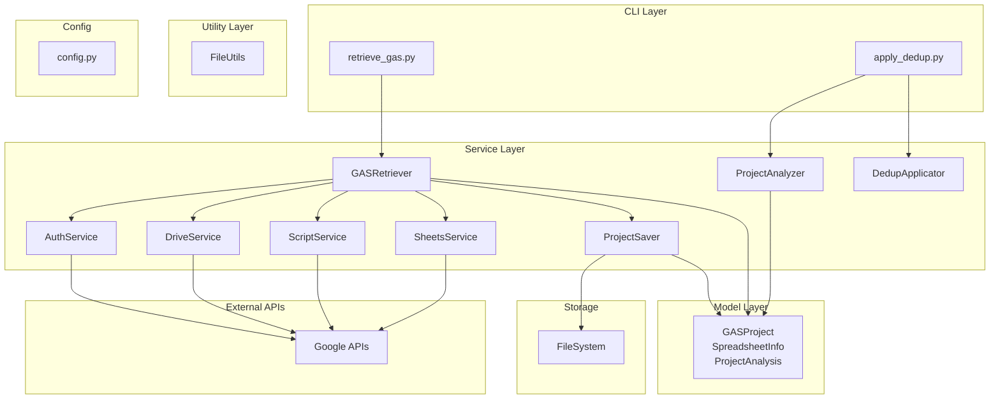
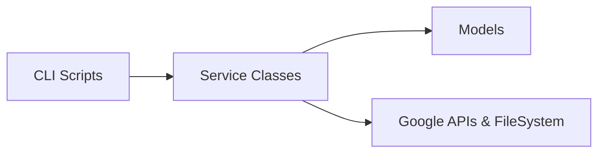
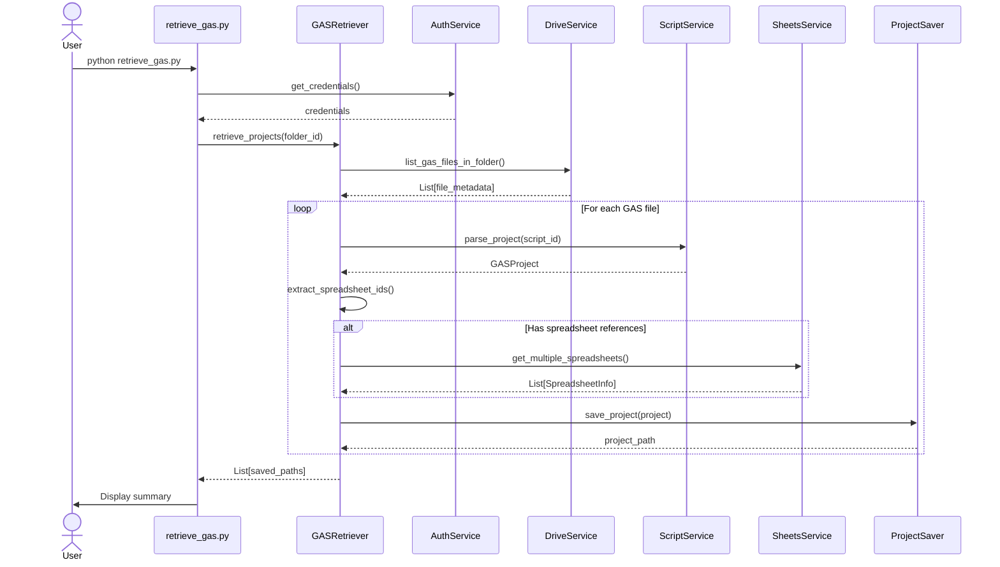
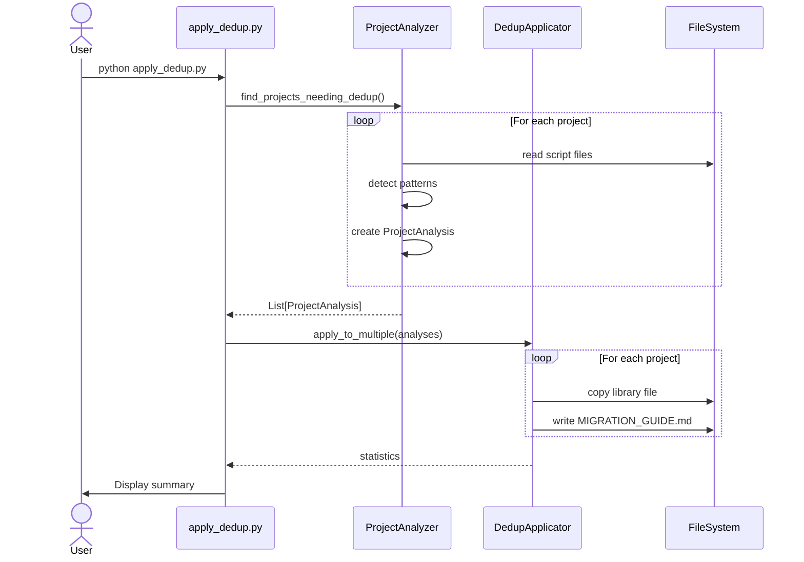
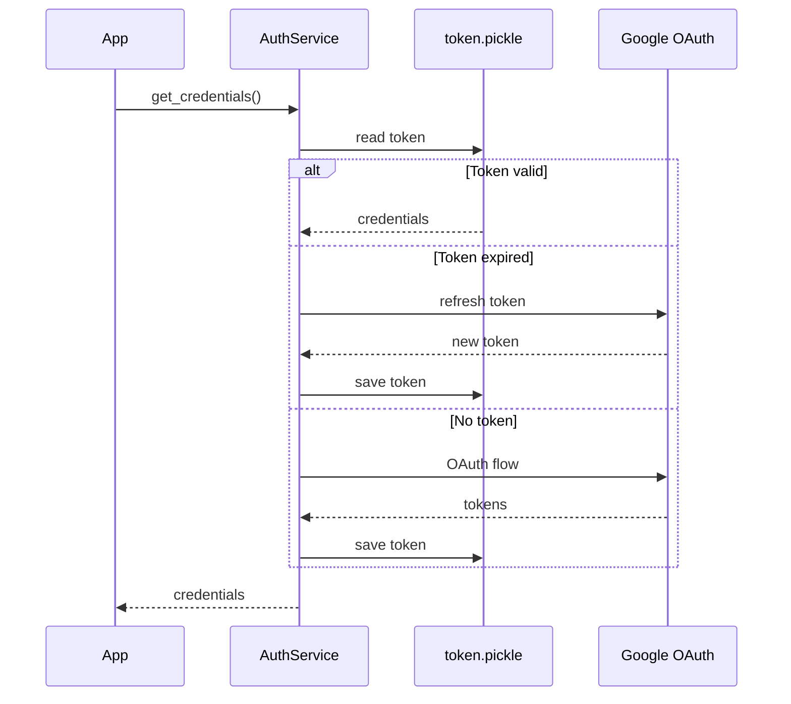
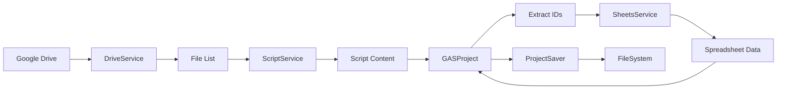
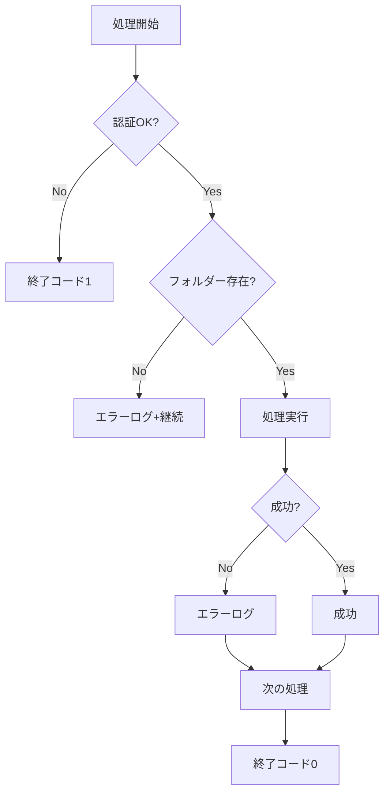

# GAS Retriever - アーキテクチャドキュメント

## 目次

1. [システム概要](#システム概要)
2. [アーキテクチャ図](#アーキテクチャ図)
3. [モジュール詳細](#モジュール詳細)
4. [シーケンス図](#シーケンス図)
5. [データフロー](#データフロー)

## システム概要

### 目的

Google DriveからGoogle Apps Script (GAS) プロジェクトを取得し、構造化されたフォーマットで保存するシステム。Gemini APIを使用するプロジェクトに対しては、Webhook重複実行防止機能を自動適用します。

### 主要機能

1. **GAS取得機能** (`retrieve_gas.py`)
   - Google DriveからGASプロジェクトを検索・取得
   - スプレッドシート参照の自動検出
   - 構造化された形式で保存

2. **重複防止適用機能** (`apply_dedup.py`)
   - Gemini API使用プロジェクトの分析
   - 重複防止ライブラリの自動適用
   - 移行ガイドの生成

## アーキテクチャ図

### システム全体構成

### レイヤー構成

## シーケンス図

### GAS取得プロセス

### 重複防止適用プロセス

### 認証フロー

## データフロー

### GAS取得

### エラーハンドリング

---

**作成日**: 2025-10-16  
**バージョン**: 2.0
