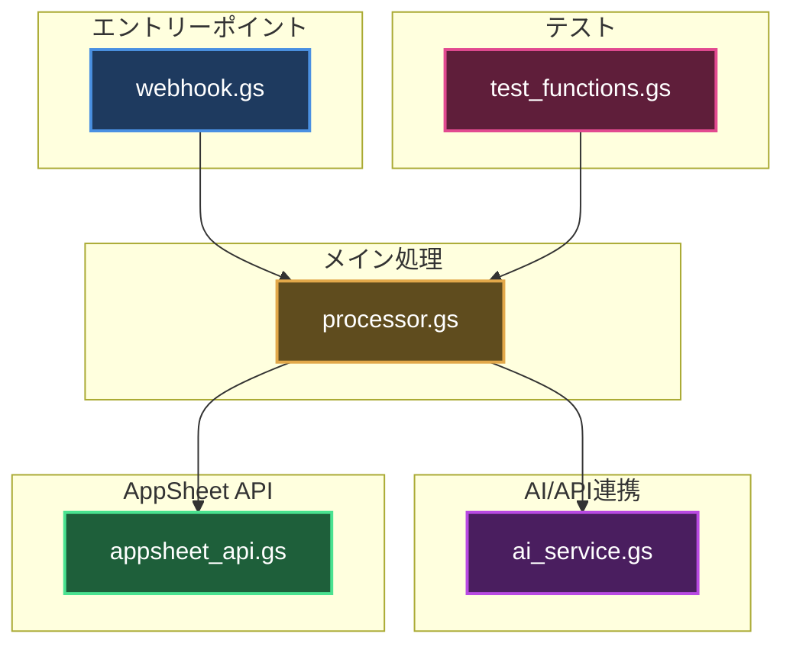
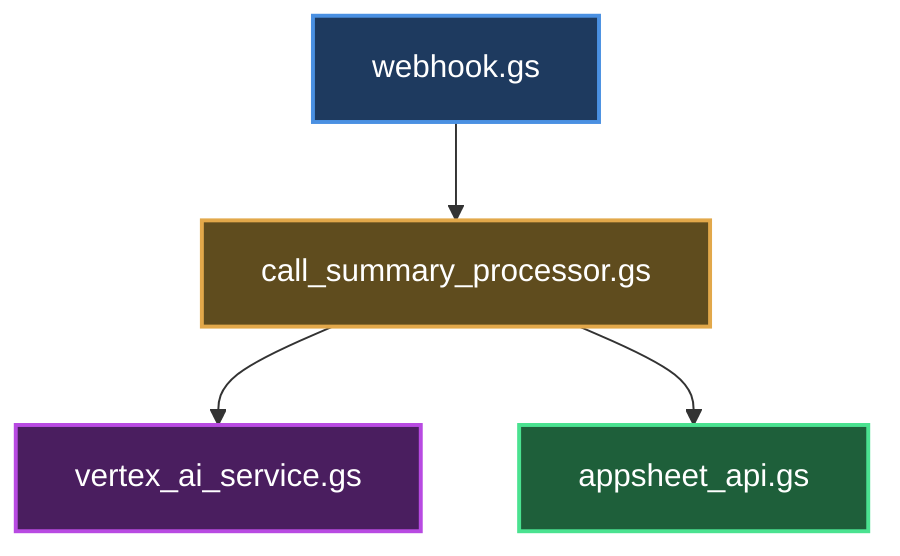
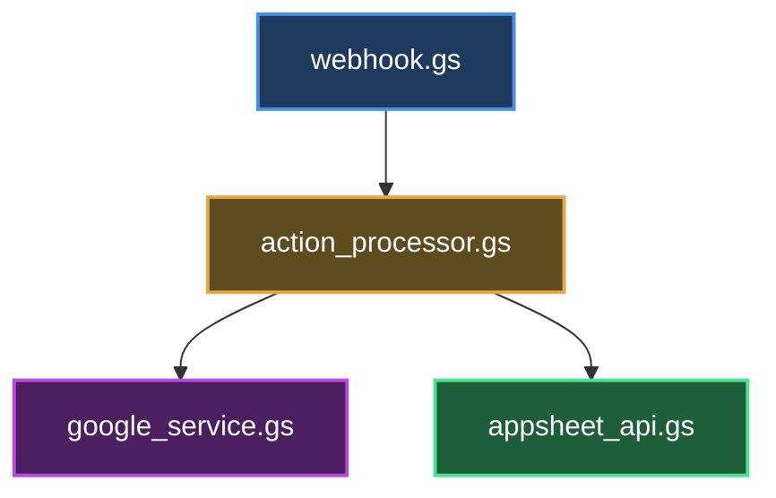
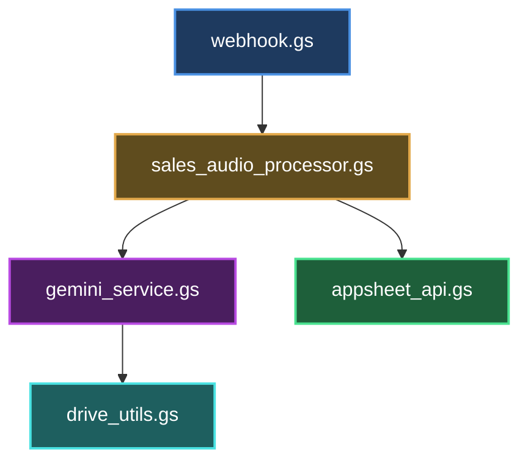

# アーキテクチャ図配色ガイドライン

## 概要

このドキュメントは、GASプロジェクトのアーキテクチャ図（Mermaid図）で使用する配色の標準を定義します。
ダークモード・ライトモード両方で視認性が高い配色を採用しています。

## 配色基準

### ダークモード対応配色（推奨）

すべてのプロジェクトで以下の配色を使用してください:

| 役割 | カテゴリ | 背景色 | ボーダー色 | テキスト色 |
|------|---------|--------|----------|-----------|
| **エントリーポイント** | Webhook受信 | `#1e3a5f` | `#4a90e2` | `#ffffff` |
| **メイン処理** | ビジネスロジック | `#5f4c1e` | `#e2a84a` | `#ffffff` |
| **AI/API連携** | 外部AI・Google API | `#4a1e5f` | `#b84ae2` | `#ffffff` |
| **Drive操作** | ファイル操作 | `#1e5f5f` | `#4ae2e2` | `#ffffff` |
| **AppSheet API** | データ更新 | `#1e5f3a` | `#4ae290` | `#ffffff` |
| **ユーティリティ** | 補助機能 | `#5f5f1e` | `#e2e24a` | `#ffffff` |
| **テスト** | テスト関数 | `#5f1e3a` | `#e24a90` | `#ffffff` |
| **外部リソース** | データベース・ストレージ | `#2d4a4a` | `#6dd6d6` | `#ffffff` |

### Mermaid記法



### スタイル指定テンプレート

各ノードに以下の形式でスタイルを適用してください:

```
style [ノード名] fill:[背景色],stroke:[ボーダー色],stroke-width:2px,color:#ffffff
```

**例:**
```
style A fill:#1e3a5f,stroke:#4a90e2,stroke-width:2px,color:#ffffff
style B fill:#5f4c1e,stroke:#e2a84a,stroke-width:2px,color:#ffffff
```

## プロジェクト別配色例

### 通話_要約生成プロジェクト



### イベント・タスク作成プロジェクト



### 営業_音声記録プロジェクト



## 配色の選定理由

### ダークモード対応

- **背景色**: 暗めのトーン（明度20-30%）でダークモード時の視認性を確保
- **ボーダー色**: 明るめのトーン（明度50-70%）で境界を明確化
- **テキスト色**: 白（`#ffffff`）で最大のコントラストを確保

### 色相の選択

- **青系（#1e3a5f/#4a90e2）**: エントリーポイント - 入口を示す安定感
- **オレンジ系（#5f4c1e/#e2a84a）**: メイン処理 - 中核的な処理を強調
- **紫系（#4a1e5f/#b84ae2）**: AI/API - 高度な機能を示す
- **シアン系（#1e5f5f/#4ae2e2）**: Drive操作 - ストレージ関連
- **緑系（#1e5f3a/#4ae290）**: AppSheet API - データ更新の成功イメージ
- **黄系（#5f5f1e/#e2e24a）**: ユーティリティ - 補助的な機能
- **ピンク系（#5f1e3a/#e24a90）**: テスト - デバッグ・検証機能
- **暗シアン系（#2d4a4a/#6dd6d6）**: 外部リソース - データベース等

## 適用ガイドライン

### 1. 新規プロジェクト作成時

- アーキテクチャ図を作成する際は、このガイドラインに従って配色を適用
- `SCRIPT_ARCHITECTURE.md`にMermaid図を記載する際に、styleディレクティブを追加

### 2. 既存プロジェクトの更新時

- アーキテクチャ図を更新する場合は、この配色に統一
- 段階的な移行も可（緊急性は低い）

### 3. カスタマイズが必要な場合

- 基本配色を維持しつつ、プロジェクト固有の要件に応じて微調整可
- 色相は変更せず、明度のみ調整することを推奨

## バージョン履歴

### v1.0 (2025-10-17)
- 初版作成
- ダークモード対応配色の標準化
- 8つのカテゴリ別配色定義

## 参考リンク

- [Mermaid公式ドキュメント - スタイリング](https://mermaid.js.org/config/theming.html)
- [アクセシビリティ配色ガイドライン](https://www.w3.org/WAI/WCAG21/Understanding/contrast-minimum.html)

---

**適用プロジェクト一覧:**
- ✅ Appsheet_営業_音声記録（v3以降）
- ✅ Appsheet_通話_イベント・タスク作成（v2.2以降）
- ⏳ Appsheet_通話_要約生成（要更新）
- ⏳ その他プロジェクト（順次適用予定）
