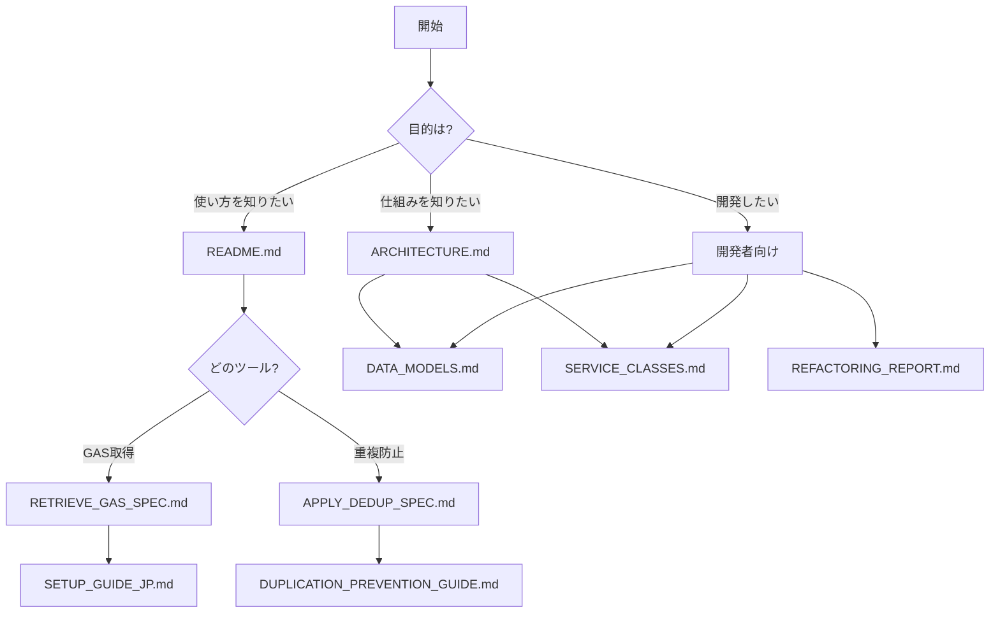

# ドキュメント目次

## 📚 包括的ドキュメント

GAS Retriever v2.0 の完全なドキュメントセットへようこそ。

### 🎯 クイックスタート

新規ユーザーは以下の順序で読むことをお勧めします：

1. [README.md](../README_NEW.md) - プロジェクト概要とクイックスタート
2. [ARCHITECTURE.md](ARCHITECTURE.md) - システムアーキテクチャ全体像
3. [RETRIEVE_GAS_SPEC.md](RETRIEVE_GAS_SPEC.md) または [APPLY_DEDUP_SPEC.md](APPLY_DEDUP_SPEC.md) - 使用するツールの詳細仕様

### 📖 ドキュメント一覧

#### システム設計

| ドキュメント | 説明 | 対象読者 |
|-------------|------|---------|
| [ARCHITECTURE.md](ARCHITECTURE.md) | システム全体のアーキテクチャ、レイヤー構成、シーケンス図 | 開発者、アーキテクト |
| [DATA_MODELS.md](DATA_MODELS.md) | データモデル仕様、クラス図、ER図 | 開発者 |
| [SERVICE_CLASSES.md](SERVICE_CLASSES.md) | サービスクラスの詳細仕様、メソッドAPI | 開発者 |

#### ツール仕様書

| ドキュメント | 説明 | 対象読者 |
|-------------|------|---------|
| [RETRIEVE_GAS_SPEC.md](RETRIEVE_GAS_SPEC.md) | GAS取得ツールの完全仕様 | ユーザー、開発者 |
| [APPLY_DEDUP_SPEC.md](APPLY_DEDUP_SPEC.md) | 重複防止適用ツールの完全仕様 | ユーザー、開発者 |

#### ガイド・レポート

| ドキュメント | 説明 | 対象読者 |
|-------------|------|---------|
| [DUPLICATION_PREVENTION_GUIDE.md](../DUPLICATION_PREVENTION_GUIDE.md) | 重複防止ライブラリ使用ガイド | 開発者 |
| [IMPLEMENTATION_REPORT.md](../IMPLEMENTATION_REPORT.md) | 重複防止実装レポート | 管理者、開発者 |
| [REFACTORING_REPORT.md](../REFACTORING_REPORT.md) | コードリファクタリングレポート | 開発者 |
| [SETUP_GUIDE_JP.md](../SETUP_GUIDE_JP.md) | セットアップガイド（日本語） | ユーザー |

### 🗺️ ドキュメントマップ



### 📊 ドキュメント詳細

#### ARCHITECTURE.md

**内容**:
- システム全体構成図
- レイヤー構成
- モジュール詳細
- シーケンス図（GAS取得、重複防止適用、認証）
- データフロー図
- エラーハンドリングフロー

**ページ数**: 約15ページ相当

**図表**: 10以上のMermaid図

#### DATA_MODELS.md

**内容**:
- GASFile クラス
- SpreadsheetInfo クラス
- GASProject クラス
- ProjectAnalysis クラス
- MigrationGuide クラス
- データ関係図（ER図）

**ページ数**: 約12ページ相当

**図表**: 5つのクラス図、1つのER図

#### SERVICE_CLASSES.md

**内容**:
- AuthService
- DriveService
- ScriptService
- SheetsService
- GASRetriever
- ProjectSaver
- ProjectAnalyzer
- DedupApplicator

**ページ数**: 約18ページ相当

**図表**: 8つのクラス図、複数のフロー図

#### RETRIEVE_GAS_SPEC.md

**内容**:
- 機能仕様
- コマンドライン引数
- 処理フロー
- 入出力仕様
- エラーハンドリング
- パフォーマンス仕様
- セキュリティ
- トラブルシューティング

**ページ数**: 約10ページ相当

#### APPLY_DEDUP_SPEC.md

**内容**:
- 機能仕様
- 分析ロジック
- 適用条件
- 処理フロー
- 入出力仕様
- ベストプラクティス

**ページ数**: 約12ページ相当

### 🔍 検索ガイド

#### よくある質問と対応ドキュメント

| 質問 | ドキュメント | セクション |
|-----|-------------|-----------|
| 認証の仕組みは? | ARCHITECTURE.md | 認証フロー詳細 |
| どうやって使うの? | RETRIEVE_GAS_SPEC.md | 使用例 |
| エラーが出た | RETRIEVE_GAS_SPEC.md | トラブルシューティング |
| データ構造は? | DATA_MODELS.md | 全セクション |
| カスタマイズしたい | SERVICE_CLASSES.md | 該当サービス |
| 重複防止の実装方法 | DUPLICATION_PREVENTION_GUIDE.md | 実装パターン |
| コードの歴史を知りたい | REFACTORING_REPORT.md | ビフォーアフター |

### 📝 表記規則

#### コードブロック

- Python: ` ```python `
- Bash: ` ```bash `
- JSON: ` ```json `
- Markdown: ` ```markdown `

#### 図表

- フローチャート: Mermaid `flowchart`
- シーケンス図: Mermaid `sequenceDiagram`
- クラス図: Mermaid `classDiagram`
- 状態遷移図: Mermaid `stateDiagram-v2`
- ER図: Mermaid `erDiagram`

#### 強調表示

- **重要**: 太字
- `コード`: インラインコード
- > 引用: ブロッククォート

### 🔄 ドキュメント更新履歴

| 日付 | バージョン | 変更内容 |
|-----|-----------|---------|
| 2025-10-16 | 2.0 | リファクタリング後の全ドキュメント作成 |
| 2025-10-16 | 1.0 | 初版（モノリシック版） |

### 🤝 コントリビューション

ドキュメントの改善提案は Issues でお願いします。

---

**最終更新**: 2025-10-16  
**バージョン**: 2.0
