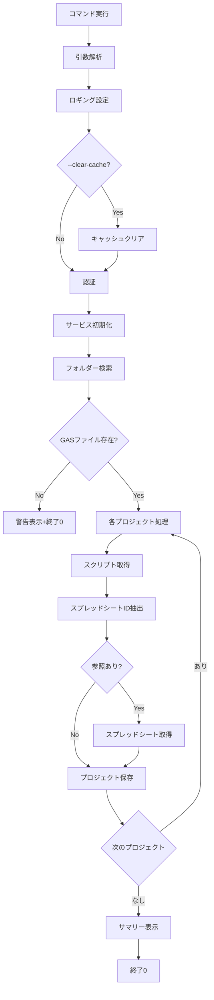

# retrieve_gas.py - 仕様書

## 概要

Google DriveからGoogle Apps Script (GAS) プロジェクトを検索・取得し、構造化されたフォーマットで保存するCLIツール。

## 機能仕様

### 主要機能

1. **GASプロジェクト検索**
   - 指定したGoogle DriveフォルダーからGASプロジェクトを検索
   - 名前フィルタリング（部分一致、大文字小文字区別なし）
   - 再帰的なサブフォルダー検索

2. **プロジェクトデータ取得**
   - Apps Script APIからプロジェクト全体のコンテンツを取得
   - スクリプトファイル（.gs, .html, .json）
   - マニフェスト（appsscript.json）
   - プロジェクトメタデータ

3. **スプレッドシート参照検出**
   - ソースコードから正規表現でスプレッドシートIDを抽出
   - Sheets APIからメタデータを取得

4. **構造化保存**
   - プロジェクトごとにディレクトリ作成
   - スクリプト、スプレッドシート、メタデータを整理して保存
   - README.md自動生成

## コマンドライン引数

### 構文

```bash
python retrieve_gas.py [OPTIONS]
```

### オプション

| オプション | 型 | デフォルト | 説明 |
|-----------|-----|-----------|------|
| `--folder-id` | string | config.FOLDER_ID | Google DriveフォルダーID |
| `--filter` | string | "appsheet" | プロジェクト名フィルタ |
| `--no-recursive` | flag | False | サブフォルダーを検索しない |
| `--output-dir` | path | "gas_projects" | 出力ディレクトリ |
| `--verbose`, `-v` | flag | False | 詳細ログを表示 |
| `--clear-cache` | flag | False | 認証キャッシュをクリア |
| `--help`, `-h` | flag | - | ヘルプを表示 |

### 使用例

```bash
# 基本的な使用
python retrieve_gas.py

# フォルダーIDを指定
python retrieve_gas.py --folder-id 1ABC...XYZ

# フィルタを指定して詳細ログ
python retrieve_gas.py --filter "Appsheet" --verbose

# 認証キャッシュをクリアして実行
python retrieve_gas.py --clear-cache

# 非再帰モードで特定ディレクトリに保存
python retrieve_gas.py --no-recursive --output-dir my_projects
```

## 処理フロー



## 入出力仕様

### 入力

1. **必須ファイル**
   - `credentials.json`: OAuth 2.0認証情報
   
2. **オプションファイル**
   - `token.pickle`: 認証トークンキャッシュ（自動生成）

3. **コマンドライン引数**
   - 上記オプション参照

### 出力

#### ディレクトリ構造

```
gas_projects/
└── [プロジェクト名]/
    ├── README.md
    ├── project_metadata.json
    ├── appsscript.json
    ├── scripts/
    │   ├── Code.gs
    │   ├── Utils.gs
    │   └── Page.html
    └── spreadsheets/
        └── [スプレッドシート名]_metadata.json
```

#### ファイル形式

1. **README.md**
   ```markdown
   # プロジェクト名
   
   **Project ID:** script_id
   **Created:** ISO 8601形式
   **Modified:** ISO 8601形式
   **Owners:** 所有者名
   
   ## Referenced Spreadsheets
   - スプレッドシート名 (ID: xxx)
   ```

2. **project_metadata.json**
   ```json
   {
     "project_id": "string",
     "project_name": "string",
     "created_time": "ISO 8601",
     "modified_time": "ISO 8601",
     "owners": [],
     "file_count": 0,
     "spreadsheet_count": 0
   }
   ```

3. **appsscript.json**
   - Apps Scriptマニフェストそのまま

4. **スクリプトファイル**
   - ソースコードそのまま（.gs, .html, .json）

5. **スプレッドシートメタデータ**
   ```json
   {
     "spreadsheetId": "string",
     "title": "string",
     "url": "string",
     "sheets": [],
     "properties": {}
   }
   ```

### 終了コード

| コード | 意味 | 説明 |
|-------|------|------|
| 0 | 成功 | 正常終了 |
| 1 | エラー | 致命的なエラー発生 |
| 130 | 中断 | ユーザーによる中断（Ctrl+C） |

## エラーハンドリング

### エラー種類と対応

| エラー | 発生条件 | 処理 | 終了コード |
|--------|---------|------|-----------|
| 認証エラー | credentials.json不在 | エラーメッセージ表示 | 1 |
| フォルダーアクセスエラー | 権限不足 | 警告ログ、処理継続 | 0 |
| APIエラー | API呼び出し失敗 | エラーログ、次へ | 0 |
| ファイルI/Oエラー | 保存失敗 | エラーログ、次へ | 0 |
| ネットワークエラー | 接続失敗 | エラーログ、リトライなし | 1 |

### ログレベル

| レベル | 用途 | 例 |
|--------|------|-----|
| DEBUG | デバッグ情報 | `Fetching script content for ID` |
| INFO | 進行状況 | `Processing: ProjectName` |
| WARNING | 警告 | `No GAS files found` |
| ERROR | エラー | `Error getting script content` |

## パフォーマンス仕様

### 処理時間

- **認証**: 初回約5-10秒、2回目以降0.1秒
- **プロジェクト検索**: フォルダーサイズに依存（100件で約5秒）
- **プロジェクト取得**: 1件あたり2-5秒
- **スプレッドシート取得**: 1件あたり0.5-2秒

### APIレート制限

Google APIのクォータに準拠:
- Drive API: 12,000リクエスト/分
- Script API: 300リクエスト/分
- Sheets API: 500リクエスト/100秒

**推奨**: 大量プロジェクト（100件以上）の場合、--verboseで進行確認

## セキュリティ

### 認証情報の扱い

- `credentials.json`: OAuth 2.0クライアントID（公開しない）
- `token.pickle`: アクセストークン（自動生成、公開しない）
- `.gitignore`に追加済み

### 権限スコープ

```python
SCOPES = [
    'https://www.googleapis.com/auth/drive.readonly',      # 読み取り専用
    'https://www.googleapis.com/auth/script.projects.readonly',
    'https://www.googleapis.com/auth/spreadsheets.readonly'
]
```

**重要**: すべて読み取り専用権限。変更・削除は不可。

## 依存関係

### Pythonバージョン

- Python 3.7以上

### 必須パッケージ

```
google-api-python-client>=2.100.0
google-auth-httplib2>=0.1.1
google-auth-oauthlib>=1.1.0
```

### 内部モジュール

- `src.config`
- `src.services.AuthService`
- `src.services.GASRetriever`

## 制限事項

1. **共有ドライブ対応**: 完全対応済み
2. **最大ファイル数**: 特に制限なし（APIクォータ内）
3. **ファイル名長**: 200文字まで（自動切り詰め）
4. **文字エンコーディング**: UTF-8のみ
5. **並列処理**: 未対応（順次処理）

## トラブルシューティング

### Q: 「credentials.json not found」エラー

**A**: Google Cloud ConsoleからOAuth認証情報をダウンロードし、`credentials.json`として保存

### Q: 「Folder not found」エラー

**A**: 
- フォルダーIDが正しいか確認
- 共有ドライブの場合、アクセス権を確認
- 認証アカウントでアクセス可能か確認

### Q: 認証画面が表示されない

**A**:
```bash
python retrieve_gas.py --clear-cache
```

### Q: スプレッドシートが取得されない

**A**: 
- スプレッドシートIDの正規表現パターンを確認
- アクセス権限を確認
- ログで詳細確認: `--verbose`

## 将来の拡張予定

- [ ] 並列処理による高速化
- [ ] 差分更新機能
- [ ] プログレスバー表示
- [ ] エクスポート形式選択（JSON, CSV等）
- [ ] ドライラン（--dry-run）モード

---

**バージョン**: 2.0  
**最終更新**: 2025-10-16
