# サービスクラス仕様書

## 目次

1. [AuthService](#authservice)
2. [DriveService](#driveservice)
3. [ScriptService](#scriptservice)
4. [SheetsService](#sheetsservice)
5. [GASRetriever](#gasretriever)
6. [ProjectSaver](#projectsaver)
7. [ProjectAnalyzer](#projectanalyzer)
8. [DedupApplicator](#dedupapplicator)

---

## AuthService

### 概要

Google API認証を管理するサービスクラス。OAuth 2.0フローの実行、トークンのキャッシュ管理、自動更新を担当。

### クラス図

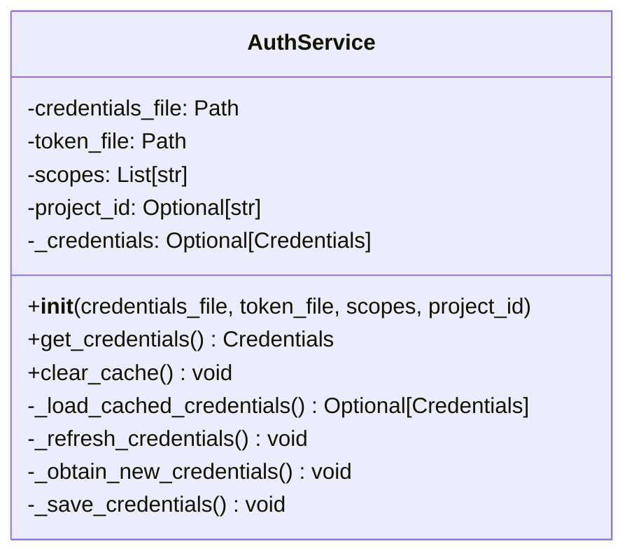

### メソッド仕様

#### `__init__(credentials_file, token_file, scopes, project_id=None)`

**パラメータ**:
- `credentials_file` (Path): credentials.jsonのパス
- `token_file` (Path): token.pickleのパス
- `scopes` (List[str]): 必要な権限スコープ
- `project_id` (Optional[str]): Google CloudプロジェクトID

**処理**: インスタンス変数の初期化

#### `get_credentials() -> Credentials`

**戻り値**: 有効な認証情報

**例外**:
- `FileNotFoundError`: credentials.jsonが見つからない
- `Exception`: 認証フロー失敗

**フロー**:

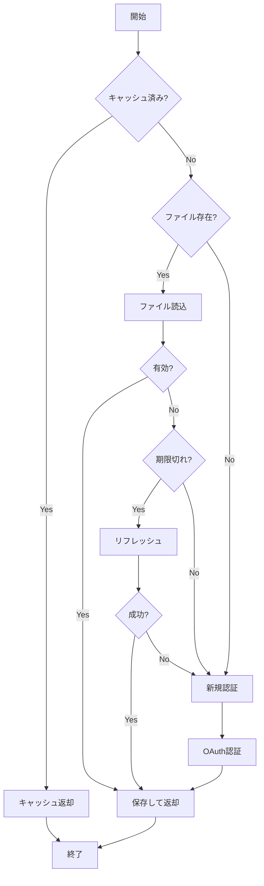

**使用例**:
```python
auth = AuthService(
    credentials_file=Path('credentials.json'),
    token_file=Path('token.pickle'),
    scopes=SCOPES,
    project_id='my-project'
)
creds = auth.get_credentials()
```

#### `clear_cache() -> None`

**処理**: token.pickleを削除し、_credentialsをNoneに設定

**使用例**:
```python
auth.clear_cache()  # 次回get_credentials()で再認証
```

---

## DriveService

### 概要

Google Drive API操作を提供。フォルダー検索、ファイル一覧取得、メタデータ取得を担当。

### クラス図

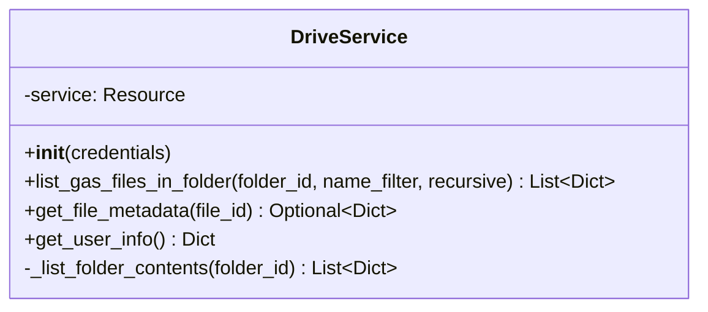

### メソッド仕様

#### `list_gas_files_in_folder(folder_id, name_filter=None, recursive=True)`

**パラメータ**:
- `folder_id` (str): フォルダーID
- `name_filter` (Optional[str]): 名前フィルタ（大文字小文字区別なし）
- `recursive` (bool): 再帰検索フラグ

**戻り値**: List[Dict[str, Any]] - GASファイルメタデータのリスト

**アルゴリズム**:

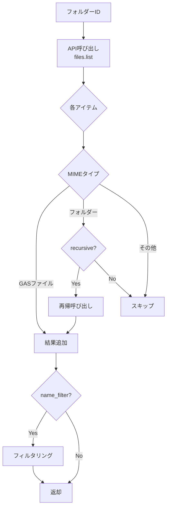

**使用例**:
```python
drive = DriveService(credentials)
files = drive.list_gas_files_in_folder(
    folder_id='abc123',
    name_filter='Appsheet',
    recursive=True
)
```

#### `get_file_metadata(file_id) -> Optional[Dict]`

**パラメータ**: `file_id` (str)

**戻り値**: ファイルメタデータまたはNone

**取得フィールド**:
- id, name, mimeType
- owners, createdTime, modifiedTime
- shared

---

## ScriptService

### 概要

Google Apps Script API操作。プロジェクトコンテンツの取得とパースを担当。

### クラス図

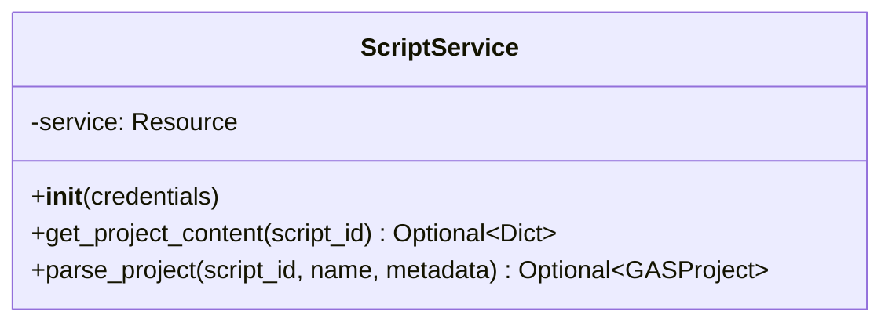

### メソッド仕様

#### `get_project_content(script_id) -> Optional[Dict]`

**パラメータ**: `script_id` (str) - Apps Script プロジェクトID

**戻り値**: プロジェクトコンテンツまたはNone

**レスポンス構造**:
```json
{
  "files": [
    {
      "name": "Code",
      "type": "SERVER_JS",
      "source": "function doPost(e) {...}"
    }
  ],
  "manifest": {...}
}
```

#### `parse_project(script_id, project_name, metadata) -> Optional[GASProject]`

**パラメータ**:
- `script_id` (str): プロジェクトID
- `project_name` (str): プロジェクト名
- `metadata` (Dict): Driveメタデータ

**戻り値**: GASProjectインスタンスまたはNone

**処理**:
1. `get_project_content()`でコンテンツ取得
2. GASProjectインスタンス作成
3. タイムスタンプのパース
4. ファイルの追加
5. マニフェストの設定

---

## SheetsService

### 概要

Google Sheets API操作。スプレッドシートメタデータの取得を担当。

### クラス図

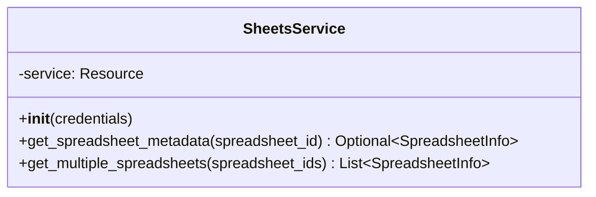

### メソッド仕様

#### `get_spreadsheet_metadata(spreadsheet_id) -> Optional[SpreadsheetInfo]`

**パラメータ**: `spreadsheet_id` (str)

**戻り値**: SpreadsheetInfoインスタンスまたはNone

**取得データ**:
- spreadsheetId, title, url
- sheets (シート一覧)
- properties (プロパティ)

#### `get_multiple_spreadsheets(spreadsheet_ids) -> List[SpreadsheetInfo]`

**パラメータ**: `spreadsheet_ids` (List[str])

**戻り値**: SpreadsheetInfoのリスト

**処理**: 各IDに対して`get_spreadsheet_metadata()`を呼び出し、成功したもののみ返却

---

## GASRetriever

### 概要

GAS取得プロセス全体を統括するメインサービス。

### クラス図

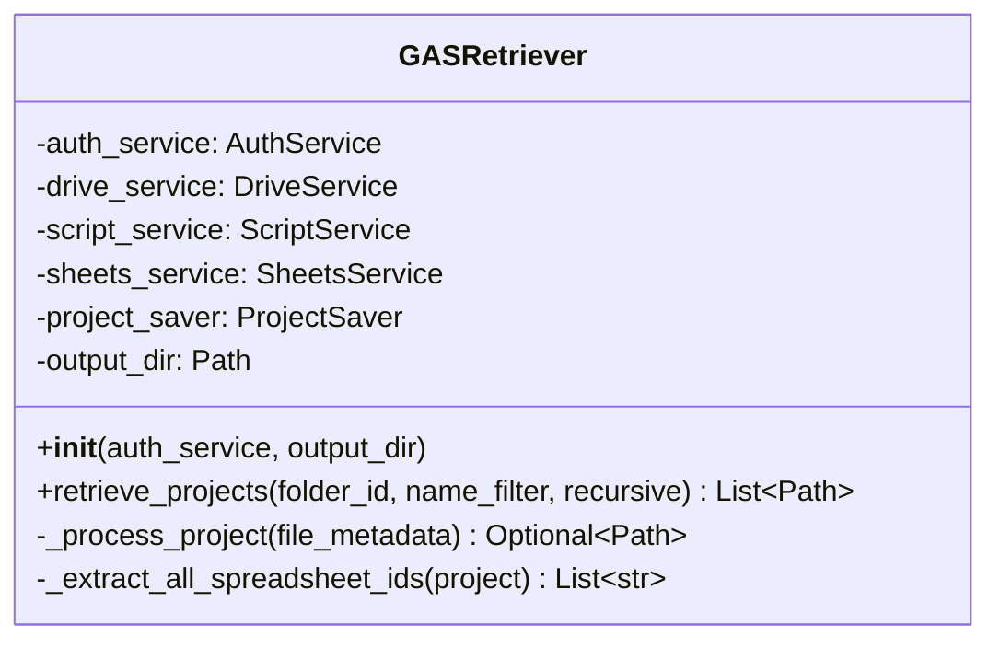

### メソッド仕様

#### `retrieve_projects(folder_id, name_filter=None, recursive=True) -> List[Path]`

**パラメータ**:
- `folder_id` (str): 検索フォルダーID
- `name_filter` (Optional[str]): 名前フィルタ
- `recursive` (bool): 再帰検索

**戻り値**: 保存されたプロジェクトパスのリスト

**処理フロー**:

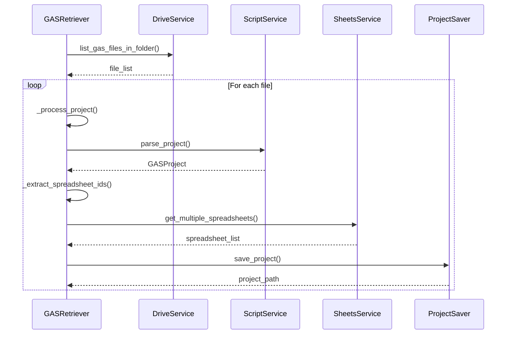

---

## ProjectSaver

### 概要

GASProjectをファイルシステムに保存。構造化されたディレクトリ作成とファイル生成を担当。

### クラス図

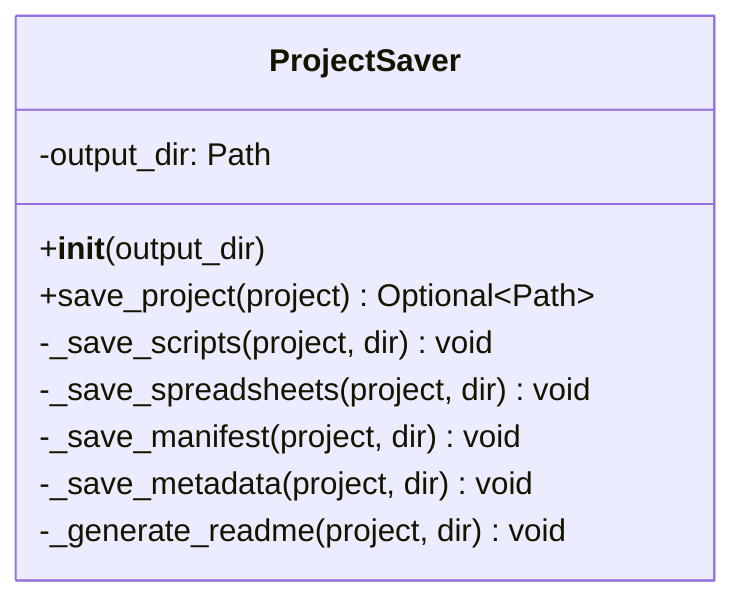

### メソッド仕様

#### `save_project(project: GASProject) -> Optional[Path]`

**パラメータ**: `project` (GASProject)

**戻り値**: プロジェクトディレクトリパスまたはNone

**生成ファイル**:
```
project_dir/
├── scripts/
│   └── *.gs, *.html, *.json
├── spreadsheets/
│   └── *_metadata.json
├── README.md
├── project_metadata.json
└── appsscript.json
```

**処理順序**:
1. ディレクトリ作成
2. スクリプト保存
3. スプレッドシート保存
4. マニフェスト保存
5. メタデータ保存
6. README生成

---

## ProjectAnalyzer

### 概要

GASプロジェクトを分析し、重複防止が必要かを判定。

### クラス図

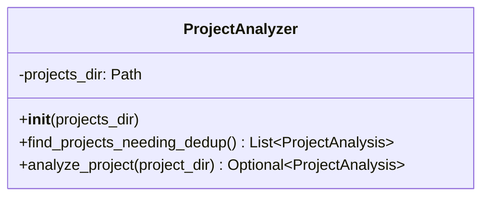

### メソッド仕様

#### `find_projects_needing_dedup() -> List[ProjectAnalysis]`

**戻り値**: 重複防止が必要なプロジェクトの分析結果リスト

**判定条件**:
```python
needs_dedup = (
    analysis.has_gemini_api and
    analysis.has_webhook and
    not analysis.has_duplication_prevention
)
```

#### `analyze_project(project_dir: Path) -> Optional[ProjectAnalysis]`

**パラメータ**: `project_dir` (Path)

**戻り値**: ProjectAnalysisインスタンス

**分析項目**:
1. Gemini API使用の検出
2. Webhook関数の検出
3. 既存重複防止の検出
4. レコードIDフィールドの推定

---

## DedupApplicator

### 概要

重複防止ライブラリをプロジェクトに適用。

### クラス図

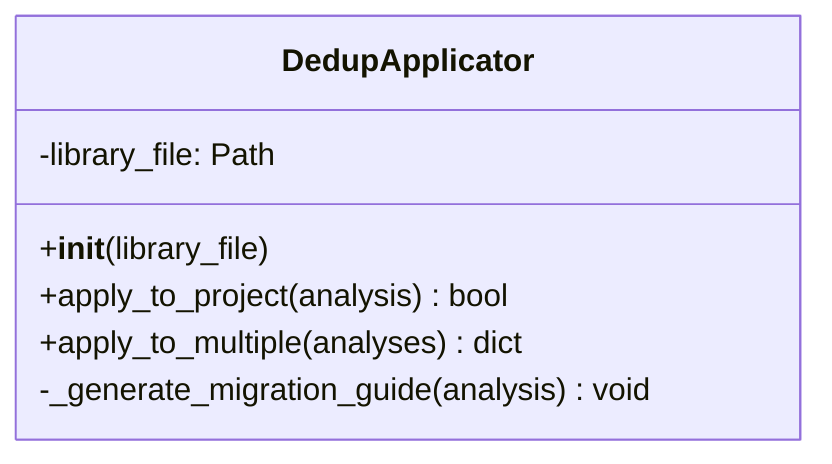

### メソッド仕様

#### `apply_to_project(analysis: ProjectAnalysis) -> bool`

**パラメータ**: `analysis` (ProjectAnalysis)

**戻り値**: 成功時True、スキップ/失敗時False

**処理**:
1. ライブラリファイルの存在確認
2. コピー先の存在確認
3. ファイルコピー
4. 移行ガイド生成

#### `apply_to_multiple(analyses: List[ProjectAnalysis]) -> dict`

**パラメータ**: `analyses` (List[ProjectAnalysis])

**戻り値**: 統計辞書
```python
{
    'applied': int,    # 適用成功数
    'skipped': int,    # スキップ数
    'failed': int      # 失敗数
}
```

---

**バージョン**: 2.0  
**最終更新**: 2025-10-16
