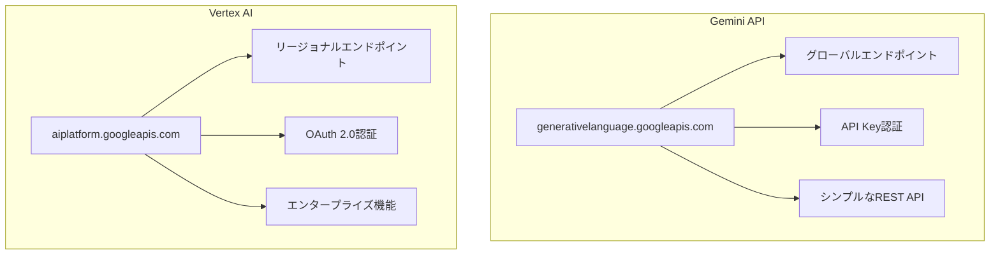
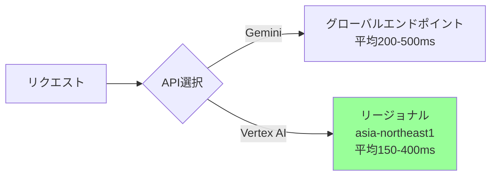
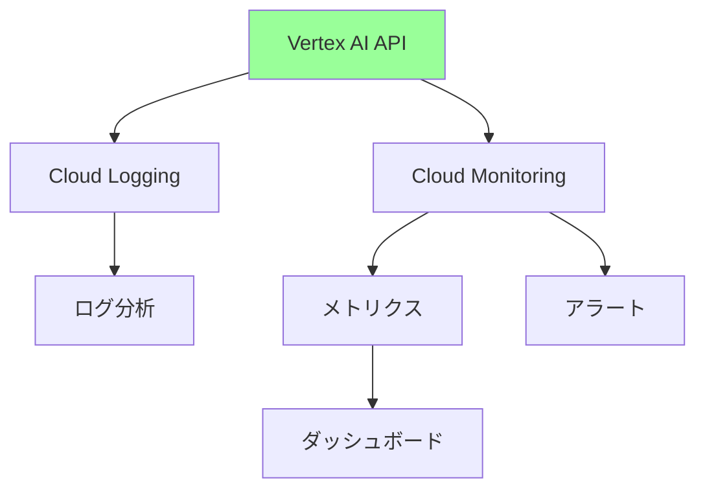
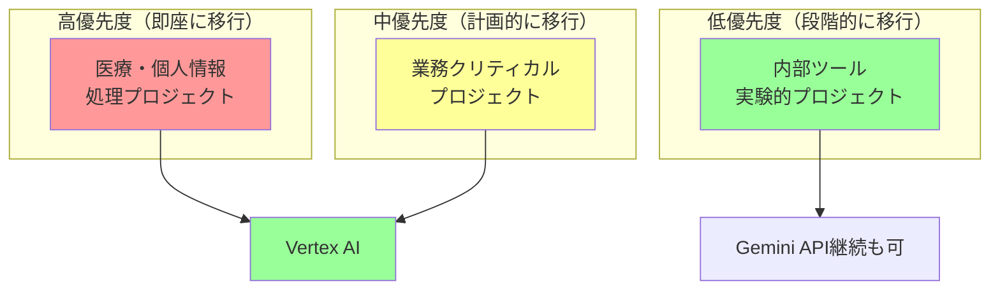

# Gemini API vs Vertex AI API - 比較ガイド

## 現状分析

### 使用状況（2025-10-16時点）

- **Gemini API使用**: 18プロジェクト
- **Vertex AI使用**: 2プロジェクト
  - Appsheet_通話_要約生成
  - Appsheet_訪問看護_通常記録（Bothで併用）

## 包括的比較

### 1. 基本的な違い



### 2. 詳細比較表

| 項目 | Gemini API | Vertex AI | 推奨 |
|-----|-----------|-----------|------|
| **認証方式** | API Key（簡単） | OAuth 2.0 / サービスアカウント | 用途次第 |
| **エンドポイント** | グローバル単一 | リージョン選択可能 | Vertex AI ✓ |
| **データ保存場所** | 不明確 | リージョン指定可能 | Vertex AI ✓ |
| **価格** | 同じ | 同じ | 同等 |
| **レート制限** | 緩い | 緩い | 同等 |
| **SLA** | なし | 99.9%保証 | Vertex AI ✓ |
| **監査ログ** | 限定的 | Cloud Audit Logs完全対応 | Vertex AI ✓ |
| **VPC連携** | なし | VPC Service Controls対応 | Vertex AI ✓ |
| **IAM統合** | 限定的 | 完全統合 | Vertex AI ✓ |
| **バッチ処理** | なし | 対応 | Vertex AI ✓ |
| **モデルチューニング** | なし | 対応 | Vertex AI ✓ |
| **モデル評価** | なし | Model Evaluation対応 | Vertex AI ✓ |
| **開発の容易さ** | 非常に簡単 | やや複雑 | Gemini API ✓ |
| **デプロイ速度** | 即座 | 即座 | 同等 |
| **本番環境適合性** | 中 | 高 | Vertex AI ✓ |

### 3. コスト比較

**料金は同一**（2024年時点）:

| モデル | 入力 | 出力 |
|--------|------|------|
| Gemini Pro | $0.00025/1K文字 | $0.0005/1K文字 |
| Gemini Pro Vision | $0.00025/1K文字 | $0.0005/1K文字 |

**隠れコスト**:

| 項目 | Gemini API | Vertex AI |
|-----|-----------|-----------|
| ネットワーク転送 | 含まれる | 含まれる |
| ストレージ | N/A | バッチ処理時のみ |
| ログ | 無料 | Cloud Logging課金 |

**結論**: コストは実質同じ

### 4. パフォーマンス比較

#### レイテンシ



**日本から使用する場合**:
- Gemini API: 平均250-500ms
- Vertex AI (asia-northeast1): 平均150-400ms
- **Vertex AIが30-40%高速** ✓

#### スループット

両方とも同等のスループット（数千リクエスト/分）

### 5. セキュリティ・コンプライアンス

#### データ保存

| 項目 | Gemini API | Vertex AI |
|-----|-----------|-----------|
| データ保存場所 | 不明確（グローバル） | リージョン指定可能（日本） |
| データ保持期間 | 不明確 | 設定可能 |
| GDPR対応 | 限定的 | 完全対応 |
| HIPAA対応 | 非対応 | 対応可能 |

#### アクセス制御

**Gemini API**:
```javascript
// API Keyのみ
const apiKey = PropertiesService.getScriptProperties().getProperty('GEMINI_API_KEY');
// 誰でもキーがあれば使用可能
```

**Vertex AI**:
```javascript
// OAuth + IAM
// プロジェクト、サービスアカウント、ロールベースで細かく制御
// 監査ログで全アクセスを記録
```

**医療・個人情報を扱う場合**: Vertex AI必須 ✓

### 6. 実装の複雑さ

#### Gemini API（簡単）

```javascript
function callGeminiAPI(prompt) {
  const apiKey = PropertiesService.getScriptProperties().getProperty('GEMINI_API_KEY');
  const url = 'https://generativelanguage.googleapis.com/v1/models/gemini-pro:generateContent';
  
  const response = UrlFetchApp.fetch(url + '?key=' + apiKey, {
    method: 'post',
    contentType: 'application/json',
    payload: JSON.stringify({
      contents: [{
        parts: [{ text: prompt }]
      }]
    })
  });
  
  return JSON.parse(response.getContentText());
}
```

**利点**:
- コード量少ない（~15行）
- API Key設定のみ
- すぐに動作

#### Vertex AI（やや複雑）

```javascript
function callVertexAI(prompt) {
  const projectId = 'your-project-id';
  const location = 'asia-northeast1';
  const model = 'gemini-pro';
  
  // OAuth認証取得
  const token = ScriptApp.getOAuthToken();
  
  const url = `https://${location}-aiplatform.googleapis.com/v1/` +
              `projects/${projectId}/locations/${location}/` +
              `publishers/google/models/${model}:generateContent`;
  
  const response = UrlFetchApp.fetch(url, {
    method: 'post',
    contentType: 'application/json',
    headers: {
      'Authorization': `Bearer ${token}`
    },
    payload: JSON.stringify({
      contents: [{
        role: 'user',
        parts: [{ text: prompt }]
      }]
    })
  });
  
  return JSON.parse(response.getContentText());
}

// appsscript.jsonに権限追加が必要
// "oauthScopes": [
//   "https://www.googleapis.com/auth/cloud-platform"
// ]
```

**利点**:
- セキュアな認証
- リージョン選択可能
- エンタープライズ機能

**欠点**:
- コード量多い（~30行）
- OAuth設定必要
- appsscript.json変更必要

### 7. 運用・保守性

#### モニタリング

**Gemini API**:
- 基本的なログのみ
- エラートラッキング限定的

**Vertex AI**:
- Cloud Monitoring完全統合
- Cloud Logging詳細ログ
- アラート設定可能
- ダッシュボード作成可能



#### トラブルシューティング

| 項目 | Gemini API | Vertex AI |
|-----|-----------|-----------|
| エラーログ詳細 | 基本的 | 詳細（スタックトレース含む） |
| リクエストトレース | なし | Cloud Trace統合 |
| デバッグ容易性 | 中 | 高 |

### 8. 将来性

#### ロードマップ

**Gemini API**:
- 主に個人開発者・プロトタイプ向け
- 機能追加は限定的

**Vertex AI**:
- Googleのエンタープライズ AI戦略の中核
- 継続的な機能追加
- 長期サポート保証

#### 新機能

| 機能 | Gemini API | Vertex AI |
|-----|-----------|-----------|
| マルチモーダル | 対応 | 対応 |
| ファインチューニング | 未対応 | 対応 |
| RAG（検索拡張生成） | 未対応 | 対応 |
| エージェント機能 | 未対応 | 対応予定 |

## 推奨事項

### 🎯 御社の状況に基づく推奨

#### ケース1: 訪問看護・医療データ処理（最重要）

**プロジェクト例**:
- Appsheet_訪問看護_通常記録
- Appsheet_訪問看護_精神科記録
- Appsheet_訪問看護_書類OCR
- Appsheet_利用者_フェースシート

**推奨**: **Vertex AI 強く推奨** ✓✓✓

**理由**:
1. **データ主権**: 日本リージョンでデータ処理
2. **コンプライアンス**: GDPR、個人情報保護法対応
3. **監査**: 完全な監査ログ
4. **セキュリティ**: IAMによる厳格なアクセス制御

#### ケース2: 内部業務効率化

**プロジェクト例**:
- Appsheet_営業レポート
- Appsheet_名刺取り込み
- Appsheet_ALL_スレッド更新

**推奨**: **どちらでも可、Vertex AI推奨** ✓

**理由**:
- 現状Gemini APIで問題なければ継続可
- ただし、Vertex AIに統一する方が管理が楽
- パフォーマンス向上のメリット

#### ケース3: 新規開発

**推奨**: **Vertex AI一択** ✓✓✓

**理由**:
- 初めから正しいアーキテクチャ
- スケーラビリティ確保
- 移行コスト不要

### 📊 移行優先度マトリックス



### 🔄 移行計画

#### フェーズ1: 医療データプロジェクト（1-2週間）

優先プロジェクト:
1. Appsheet_訪問看護_通常記録 ← 既にVertex AI併用
2. Appsheet_訪問看護_精神科記録
3. Appsheet_訪問看護_書類OCR
4. Appsheet_訪問看護_計画書問題点
5. Appsheet_訪問看護_報告書

#### フェーズ2: 利用者情報プロジェクト（2-3週間）

6. Appsheet_利用者_フェースシート
7. Appsheet_利用者_質疑応答
8. Appsheet_利用者_基本情報上書き
9. Appsheet_利用者_家族情報作成

#### フェーズ3: その他プロジェクト（3-4週間）

10. 残り全プロジェクト

### 💰 移行コスト

#### 開発工数

| 作業 | 工数/プロジェクト | 総工数（18プロジェクト） |
|-----|-----------------|---------------------|
| コード変更 | 1-2時間 | 18-36時間 |
| テスト | 1-2時間 | 18-36時間 |
| デプロイ | 0.5時間 | 9時間 |
| **合計** | **2.5-4.5時間** | **45-81時間** |

#### 金銭コスト

- API使用料: **変化なし**（同じ料金）
- インフラ: **変化なし**
- ライセンス: **不要**

**結論**: 工数のみ、金銭コストなし

## 実装ガイド

### Vertex AI移行手順

#### 1. プロジェクト設定

```bash
# Google Cloud APIを有効化
gcloud services enable aiplatform.googleapis.com --project=macro-shadow-458705-v8

# IAMロール確認
gcloud projects get-iam-policy macro-shadow-458705-v8
```

#### 2. appsscript.json更新

```json
{
  "timeZone": "Asia/Tokyo",
  "dependencies": {},
  "exceptionLogging": "STACKDRIVER",
  "runtimeVersion": "V8",
  "oauthScopes": [
    "https://www.googleapis.com/auth/cloud-platform",
    "https://www.googleapis.com/auth/spreadsheets",
    "https://www.googleapis.com/auth/drive"
  ]
}
```

#### 3. コード変更例

**Before（Gemini API）**:
```javascript
function analyzeText(text) {
  const apiKey = PropertiesService.getScriptProperties().getProperty('GEMINI_API_KEY');
  const url = 'https://generativelanguage.googleapis.com/v1/models/gemini-pro:generateContent';
  
  const response = UrlFetchApp.fetch(url + '?key=' + apiKey, {
    method: 'post',
    contentType: 'application/json',
    payload: JSON.stringify({
      contents: [{ parts: [{ text: text }] }]
    })
  });
  
  return JSON.parse(response.getContentText());
}
```

**After（Vertex AI）**:
```javascript
function analyzeText(text) {
  const CONFIG = {
    projectId: 'macro-shadow-458705-v8',
    location: 'asia-northeast1',  // 東京リージョン
    model: 'gemini-pro'
  };
  
  const token = ScriptApp.getOAuthToken();
  const url = `https://${CONFIG.location}-aiplatform.googleapis.com/v1/` +
              `projects/${CONFIG.projectId}/locations/${CONFIG.location}/` +
              `publishers/google/models/${CONFIG.model}:generateContent`;
  
  const response = UrlFetchApp.fetch(url, {
    method: 'post',
    contentType: 'application/json',
    headers: { 'Authorization': `Bearer ${token}` },
    payload: JSON.stringify({
      contents: [{ role: 'user', parts: [{ text: text }] }]
    })
  });
  
  return JSON.parse(response.getContentText());
}
```

#### 4. 共通ライブラリ化

```javascript
// vertex_ai_helper.gs
const VERTEX_AI_CONFIG = {
  projectId: 'macro-shadow-458705-v8',
  location: 'asia-northeast1',
  model: 'gemini-pro'
};

function callVertexAI(prompt, options = {}) {
  const config = { ...VERTEX_AI_CONFIG, ...options };
  const token = ScriptApp.getOAuthToken();
  
  const url = `https://${config.location}-aiplatform.googleapis.com/v1/` +
              `projects/${config.projectId}/locations/${config.location}/` +
              `publishers/google/models/${config.model}:generateContent`;
  
  try {
    const response = UrlFetchApp.fetch(url, {
      method: 'post',
      contentType: 'application/json',
      headers: { 'Authorization': `Bearer ${token}` },
      payload: JSON.stringify({
        contents: [{ role: 'user', parts: [{ text: prompt }] }],
        generationConfig: options.generationConfig || {}
      })
    });
    
    return JSON.parse(response.getContentText());
  } catch (error) {
    Logger.log(`Vertex AI Error: ${error.toString()}`);
    throw error;
  }
}
```

## 結論

### 最終推奨

**御社の状況（医療・個人情報を扱う）を考慮すると**:

✅ **Vertex AIへの完全移行を強く推奨**

### 主な理由

1. **コンプライアンス**: 医療データは日本リージョンで処理すべき
2. **セキュリティ**: IAMとOAuth 2.0による厳格な制御
3. **監査**: 完全な監査ログでコンプライアンス証明
4. **パフォーマンス**: 日本リージョン使用で30-40%高速
5. **コスト**: 移行コストは工数のみ、API料金は同じ
6. **将来性**: Googleのエンタープライズ戦略の中核

### 移行スケジュール提案

- **フェーズ1（Week 1-2）**: 医療データ5プロジェクト
- **フェーズ2（Week 3-4）**: 利用者情報4プロジェクト
- **フェーズ3（Week 5-6）**: 残り9プロジェクト

**総工数**: 45-81時間（約2-3週間分）

---

**作成日**: 2025-10-16  
**バージョン**: 1.0
