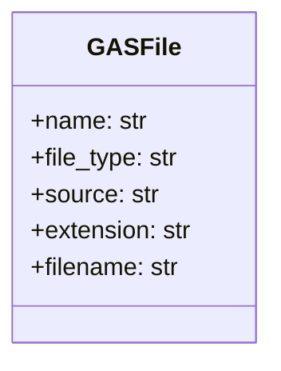
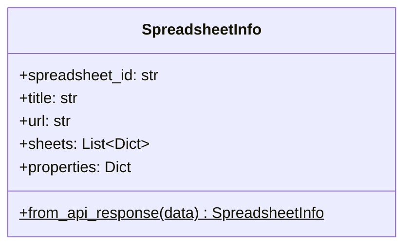
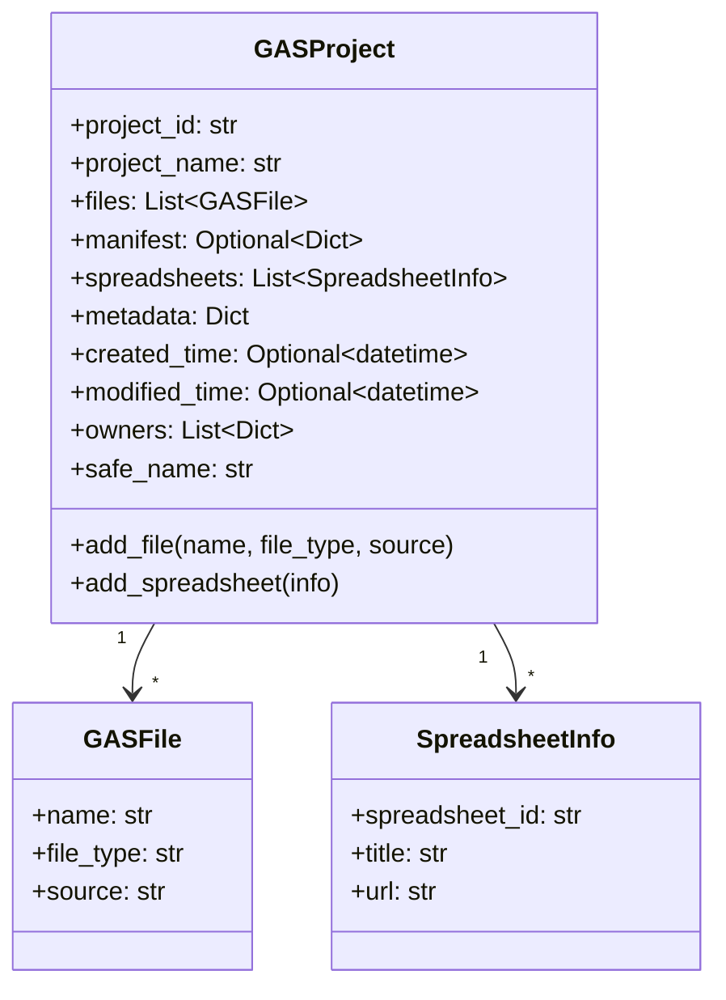
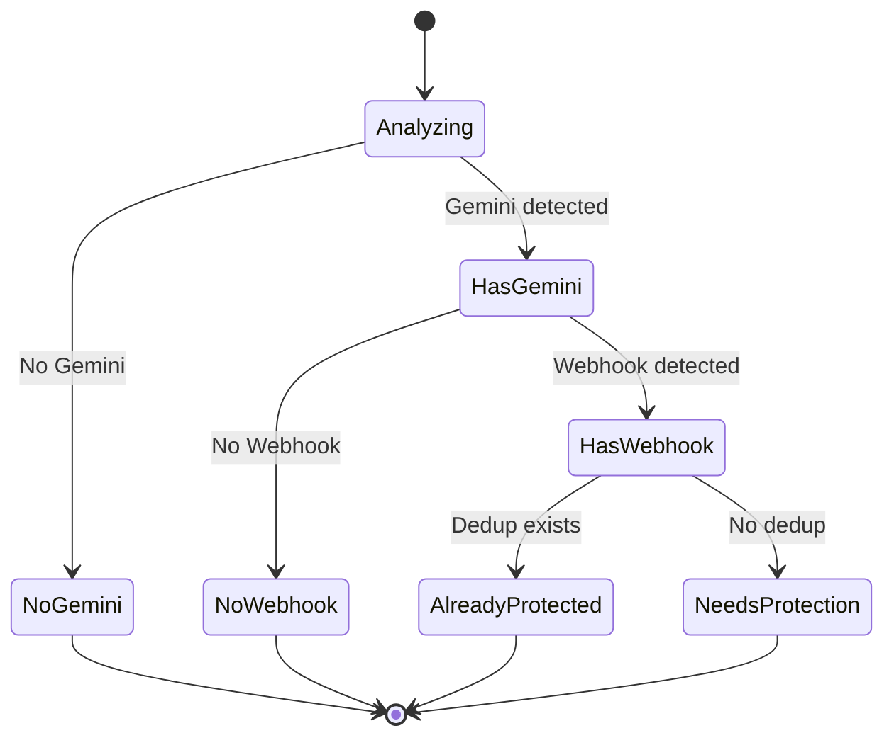
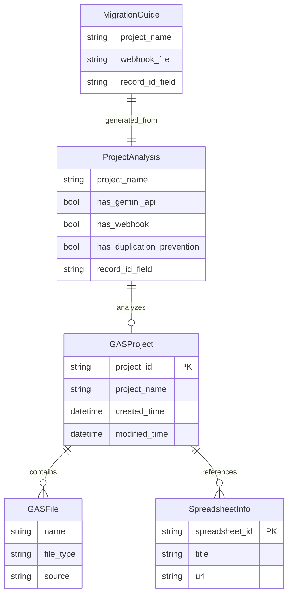

# データモデル仕様書

## 目次

1. [GASFile](#gasfile)
2. [SpreadsheetInfo](#spreadsheetinfo)
3. [GASProject](#gasproject)
4. [ProjectAnalysis](#projectanalysis)
5. [MigrationGuide](#migrationguide)

---

## GASFile

### 概要

Google Apps Scriptの個別ファイルを表すデータクラス。

### クラス定義

```python
@dataclass
class GASFile:
    name: str
    file_type: str
    source: str
```

### フィールド

| フィールド | 型 | 説明 | 例 |
|-----------|-----|------|-----|
| `name` | str | ファイル名（拡張子なし） | "Code", "Utils" |
| `file_type` | str | ファイルタイプ | "SERVER_JS", "HTML", "JSON" |
| `source` | str | ソースコード | "function doPost(e) {...}" |

### プロパティ

#### `extension` -> str

**説明**: ファイルタイプに基づく拡張子を返す

**ロジック**:
```python
GAS_FILE_EXTENSIONS = {
    'SERVER_JS': '.gs',
    'HTML': '.html',
    'JSON': '.json'
}
return GAS_FILE_EXTENSIONS.get(self.file_type, '.txt')
```

**例**:
```python
file = GASFile(name="Code", file_type="SERVER_JS", source="...")
print(file.extension)  # ".gs"
```

#### `filename` -> str

**説明**: 拡張子付きのファイル名を返す

**例**:
```python
file = GASFile(name="Code", file_type="SERVER_JS", source="...")
print(file.filename)  # "Code.gs"
```

### クラス図



---

## SpreadsheetInfo

### 概要

スプレッドシートのメタデータを表すデータクラス。

### クラス定義

```python
@dataclass
class SpreadsheetInfo:
    spreadsheet_id: str
    title: str
    url: str
    sheets: List[Dict[str, Any]] = field(default_factory=list)
    properties: Dict[str, Any] = field(default_factory=dict)
```

### フィールド

| フィールド | 型 | 説明 |
|-----------|-----|------|
| `spreadsheet_id` | str | スプレッドシートID |
| `title` | str | スプレッドシート名 |
| `url` | str | スプレッドシートURL |
| `sheets` | List[Dict] | シート情報のリスト |
| `properties` | Dict | スプレッドシートプロパティ |

### クラスメソッド

#### `from_api_response(data: Dict) -> SpreadsheetInfo`

**説明**: Sheets API レスポンスからインスタンスを生成

**パラメータ**: `data` (Dict) - API レスポンスJSON

**戻り値**: SpreadsheetInfo インスタンス

**使用例**:
```python
api_response = sheets_service.spreadsheets().get(
    spreadsheetId=sheet_id
).execute()

info = SpreadsheetInfo.from_api_response(api_response)
```

### クラス図



---

## GASProject

### 概要

Google Apps Script プロジェクト全体を表すデータクラス。

### クラス定義

```python
@dataclass
class GASProject:
    project_id: str
    project_name: str
    files: List[GASFile] = field(default_factory=list)
    manifest: Optional[Dict[str, Any]] = None
    spreadsheets: List[SpreadsheetInfo] = field(default_factory=list)
    metadata: Dict[str, Any] = field(default_factory=dict)
    created_time: Optional[datetime] = None
    modified_time: Optional[datetime] = None
    owners: List[Dict[str, str]] = field(default_factory=list)
```

### フィールド

| フィールド | 型 | 説明 |
|-----------|-----|------|
| `project_id` | str | Apps Script プロジェクトID |
| `project_name` | str | プロジェクト名 |
| `files` | List[GASFile] | スクリプトファイルリスト |
| `manifest` | Optional[Dict] | appsscript.json |
| `spreadsheets` | List[SpreadsheetInfo] | 参照スプレッドシート |
| `metadata` | Dict | Driveメタデータ |
| `created_time` | Optional[datetime] | 作成日時 |
| `modified_time` | Optional[datetime] | 更新日時 |
| `owners` | List[Dict] | 所有者情報 |

### プロパティ

#### `safe_name` -> str

**説明**: ファイルシステムで安全なプロジェクト名

**処理**:
1. 不正な文字を `_` に置換
2. 前後の空白とドットを削除
3. 200文字に切り詰め

**例**:
```python
project = GASProject(
    project_id="abc123",
    project_name="My Project: Test<>?*"
)
print(project.safe_name)  # "My Project_ Test_____"
```

### メソッド

#### `add_file(name: str, file_type: str, source: str) -> None`

**説明**: スクリプトファイルを追加

**使用例**:
```python
project.add_file(
    name="Code",
    file_type="SERVER_JS",
    source="function doPost(e) {...}"
)
```

#### `add_spreadsheet(spreadsheet_info: SpreadsheetInfo) -> None`

**説明**: スプレッドシート参照を追加

### クラス図



---

## ProjectAnalysis

### 概要

プロジェクト分析結果を表すデータクラス。

### クラス定義

```python
@dataclass
class ProjectAnalysis:
    project_name: str
    project_path: Path
    has_gemini_api: bool = False
    has_webhook: bool = False
    has_duplication_prevention: bool = False
    webhook_file: Optional[Path] = None
    estimated_record_id_field: Optional[str] = None
    gemini_files: List[Path] = field(default_factory=list)
    webhook_files: List[Path] = field(default_factory=list)
```

### フィールド

| フィールド | 型 | 説明 |
|-----------|-----|------|
| `project_name` | str | プロジェクト名 |
| `project_path` | Path | プロジェクトパス |
| `has_gemini_api` | bool | Gemini API使用フラグ |
| `has_webhook` | bool | Webhookフラグ |
| `has_duplication_prevention` | bool | 重複防止実装フラグ |
| `webhook_file` | Optional[Path] | Webhookファイルパス |
| `estimated_record_id_field` | Optional[str] | 推定レコードIDフィールド |
| `gemini_files` | List[Path] | Gemini使用ファイルリスト |
| `webhook_files` | List[Path] | Webhookファイルリスト |

### プロパティ

#### `needs_duplication_prevention` -> bool

**説明**: 重複防止が必要かを判定

**ロジック**:
```python
return (
    self.has_gemini_api and 
    self.has_webhook and 
    not self.has_duplication_prevention
)
```

**真理値表**:

| Gemini | Webhook | Dedup | needs_dedup |
|--------|---------|-------|-------------|
| True   | True    | False | **True**    |
| True   | True    | True  | False       |
| True   | False   | False | False       |
| False  | True    | False | False       |

### 状態遷移図



---

## MigrationGuide

### 概要

プロジェクト移行ガイド情報を表すデータクラス。

### クラス定義

```python
@dataclass
class MigrationGuide:
    project_name: str
    webhook_file: str
    record_id_field: Optional[str]
    has_existing_prevention: bool
```

### フィールド

| フィールド | 型 | 説明 |
|-----------|-----|------|
| `project_name` | str | プロジェクト名 |
| `webhook_file` | str | Webhookファイル名 |
| `record_id_field` | Optional[str] | レコードIDフィールド |
| `has_existing_prevention` | bool | 既存実装フラグ |

### メソッド

#### `to_markdown() -> str`

**説明**: Markdown形式の移行ガイドを生成

**戻り値**: Markdownテキスト

**テンプレート**:
```markdown
# {project_name} - 重複防止実装ガイド

## 自動検出情報
- Webhook ファイル: {webhook_file}
- 推定レコードIDフィールド: {record_id_field or '不明'}

## 実装手順

### 1. ライブラリの追加
✅ 完了

### 2. doPost関数の修正
[コード例]

### 3. テスト方法
[手順]
```

**使用例**:
```python
guide = MigrationGuide(
    project_name="Appsheet_通話_要約生成",
    webhook_file="core_webhook.gs",
    record_id_field="callId",
    has_existing_prevention=False
)

markdown = guide.to_markdown()
# MIGRATION_GUIDE.mdに保存
```

---

## データ関係図



---

**バージョン**: 2.0  
**最終更新**: 2025-10-16
