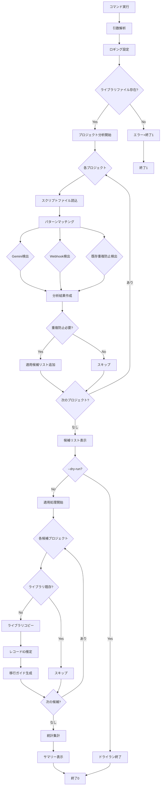
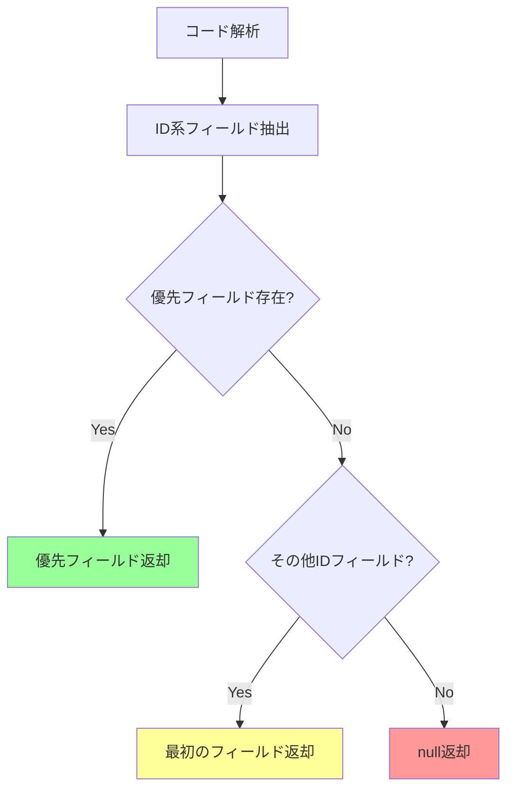

# apply_dedup.py - 仕様書

## 概要

GASプロジェクトを分析し、Gemini APIとWebhookを使用しているプロジェクトに重複実行防止ライブラリを自動適用するCLIツール。

## 機能仕様

### 主要機能

1. **プロジェクト分析**
   - スクリプトファイルのパターンマッチング
   - Gemini API使用の検出
   - Webhook関数（doPost/doGet）の検出
   - 既存の重複防止実装の検出

2. **重複防止ライブラリ適用**
   - `DuplicationPrevention.gs`のコピー
   - `utils_duplicationPrevention.gs`として保存

3. **移行ガイド生成**
   - プロジェクト別のMIGRATION_GUIDE.md作成
   - レコードIDフィールドの推定
   - 実装例コードの提供

4. **統計レポート**
   - 適用成功/スキップ/失敗の集計
   - 詳細サマリー表示

## コマンドライン引数

### 構文

```bash
python apply_dedup.py [OPTIONS]
```

### オプション

| オプション | 型 | デフォルト | 説明 |
|-----------|-----|-----------|------|
| `--projects-dir` | path | "gas_projects" | プロジェクトディレクトリ |
| `--library-file` | path | "DuplicationPrevention.gs" | ライブラリファイル |
| `--verbose`, `-v` | flag | False | 詳細ログを表示 |
| `--dry-run` | flag | False | 変更せずに確認のみ |
| `--help`, `-h` | flag | - | ヘルプを表示 |

### 使用例

```bash
# 基本的な使用
python apply_dedup.py

# ドライラン（変更なし）
python apply_dedup.py --dry-run

# 詳細ログ表示
python apply_dedup.py --verbose

# カスタムディレクトリ指定
python apply_dedup.py --projects-dir custom_projects --library-file lib.gs
```

## 処理フロー



## 分析ロジック

### パターン検出

#### 1. Gemini API検出

**正規表現パターン**:
```python
GEMINI_API_PATTERNS = [
    r'gemini',
    r'generativelanguage\.googleapis\.com',
    r'generateContent'
]
```

**検出方法**: 大文字小文字を区別せず、いずれかのパターンにマッチ

#### 2. Webhook検出

**正規表現パターン**:
```python
WEBHOOK_PATTERNS = [
    r'function\s+doPost\s*\(',
    r'function\s+doGet\s*\('
]
```

**検出方法**: 大文字小文字を区別、完全一致

#### 3. 既存重複防止検出

**正規表現パターン**:
```python
DEDUP_PATTERNS = [
    r'executeWebhookWithDuplicationPrevention',
    r'checkDuplicateRequest',
    r'markAsProcessingWithLock'
]
```

**検出方法**: いずれかの関数が存在すれば実装済みと判定

### レコードIDフィールド推定



**優先フィールド**: `callId`, `recordId`, `recordNoteId`, `documentId`

**抽出パターン**:
```python
patterns = [
    r'params\.(\w*[Ii]d)',
    r'data\.(\w*[Ii]d)',
]
```

## 入出力仕様

### 入力

1. **必須ファイル**
   - `DuplicationPrevention.gs`: 重複防止ライブラリ本体

2. **必須ディレクトリ**
   - `gas_projects/`: GASプロジェクト群

3. **プロジェクト構造**
   ```
   gas_projects/
   └── [プロジェクト名]/
       └── scripts/
           ├── *.gs
           ├── *.html
           └── *.json
   ```

### 出力

#### 追加ファイル

各プロジェクトに以下を追加:

1. **scripts/utils_duplicationPrevention.gs**
   - 重複防止ライブラリのコピー
   - 13KB程度

2. **MIGRATION_GUIDE.md**
   ```markdown
   # プロジェクト名 - 重複防止実装ガイド
   
   ## 自動検出情報
   - Webhook ファイル: xxx.gs
   - 推定レコードIDフィールド: callId
   
   ## 実装手順
   ...
   ```

#### 標準出力

```
==================================================
Duplication Prevention Applicator v2.0
==================================================

Analyzing projects...
Found 17 project(s) needing duplication prevention:
  ✅ Appsheet_通話_要約生成
      Record ID: callId
  ✅ Appsheet_営業_音声記録
      Record ID: recordId
  ...

Applying duplication prevention...
[1/17] Appsheet_通話_要約生成
  ✅ Added library: utils_duplicationPrevention.gs
  📄 Generated migration guide
  🔍 Estimated record ID field: callId

==================================================
✅ Applied: 17
⏭️  Skipped: 0 (already exists)
❌ Failed: 0
==================================================

Next steps:
  1. Review each project's MIGRATION_GUIDE.md
  2. Update doPost functions as recommended
  3. Test in Apps Script Editor
  4. Deploy to production
```

### 終了コード

| コード | 意味 | 説明 |
|-------|------|------|
| 0 | 成功 | 正常終了 |
| 1 | エラー | ライブラリファイル不在等 |
| 130 | 中断 | ユーザーによる中断 |

## 適用条件

### 適用対象

プロジェクトが以下の条件を**すべて**満たす場合:

```python
needs_duplication_prevention = (
    has_gemini_api and 
    has_webhook and 
    not has_duplication_prevention
)
```

| 条件 | 説明 |
|-----|------|
| `has_gemini_api` | Gemini API使用コードが存在 |
| `has_webhook` | doPostまたはdoGet関数が存在 |
| `not has_duplication_prevention` | 既存の重複防止未実装 |

### スキップ条件

- ライブラリファイルが既に存在する場合
- 既に重複防止が実装されている場合
- Gemini APIまたはWebhookのいずれかが未検出の場合

## エラーハンドリング

### エラー種類と対応

| エラー | 発生条件 | 処理 | 終了コード |
|--------|---------|------|-----------|
| ライブラリ不在 | DuplicationPrevention.gs不在 | エラー表示 | 1 |
| プロジェクトディレクトリ不在 | gas_projects/不在 | 警告、空リスト返却 | 0 |
| ファイルコピー失敗 | 権限不足等 | エラーログ、次へ | 0 |
| ガイド生成失敗 | I/Oエラー | 警告ログ、継続 | 0 |

## パフォーマンス仕様

### 処理時間

- **分析フェーズ**: プロジェクト数×スクリプトファイル数×0.1秒
  - 例: 30プロジェクト、各5ファイル = 約15秒
- **適用フェーズ**: 適用数×0.5秒
  - 例: 17プロジェクト = 約8.5秒

### メモリ使用量

- 通常: 50-100MB
- 大規模（100プロジェクト以上）: 200MB程度

## セキュリティ

### ファイル操作

- 読み取り: すべてのプロジェクト
- 書き込み: utils_duplicationPrevention.gs、MIGRATION_GUIDE.md のみ
- 既存ファイルの変更: **なし**

### 権限

- FileSystem: 読み取り+書き込み
- ネットワーク: **不要**（ローカル処理のみ）

## 依存関係

### 内部モジュール

- `src.config`
- `src.services.ProjectAnalyzer`
- `src.services.DedupApplicator`
- `src.models.ProjectAnalysis`
- `src.models.MigrationGuide`

## 制限事項

1. **並列処理**: 未対応（順次処理）
2. **ロールバック**: 未対応（手動で削除）
3. **バージョン管理**: 未対応（上書き警告のみ）
4. **カスタマイズ**: ライブラリファイルの内容変更のみ可能

## トラブルシューティング

### Q: 「Library file not found」エラー

**A**: `DuplicationPrevention.gs`が存在することを確認

```bash
ls -l DuplicationPrevention.gs
```

### Q: 既に適用済みと表示される

**A**: `scripts/utils_duplicationPrevention.gs`を削除して再実行

```bash
rm gas_projects/*/scripts/utils_duplicationPrevention.gs
python apply_dedup.py
```

### Q: レコードIDフィールドが「不明」

**A**: 手動で`MIGRATION_GUIDE.md`を確認し、正しいフィールド名に修正

### Q: ドライランで結果確認したい

**A**:
```bash
python apply_dedup.py --dry-run --verbose
```

## ベストプラクティス

1. **事前確認**: まずドライランで確認
   ```bash
   python apply_dedup.py --dry-run
   ```

2. **バックアップ**: 重要なプロジェクトはバックアップ
   ```bash
   cp -r gas_projects gas_projects_backup
   ```

3. **段階的適用**: テストプロジェクトで動作確認後、本番適用

4. **移行ガイド確認**: 自動推定が正しいか必ず確認

## 将来の拡張予定

- [ ] ロールバック機能
- [ ] カスタムパターン設定
- [ ] バッチ処理モード
- [ ] 適用履歴管理

---

**バージョン**: 2.0  
**最終更新**: 2025-10-16
