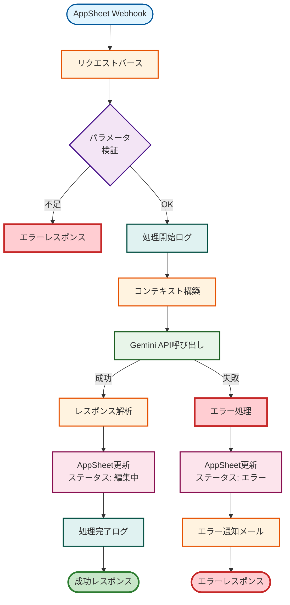
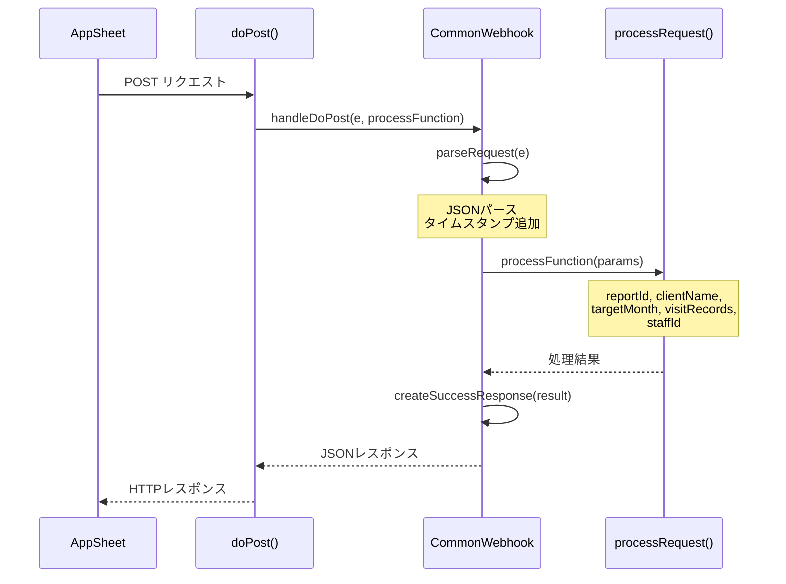
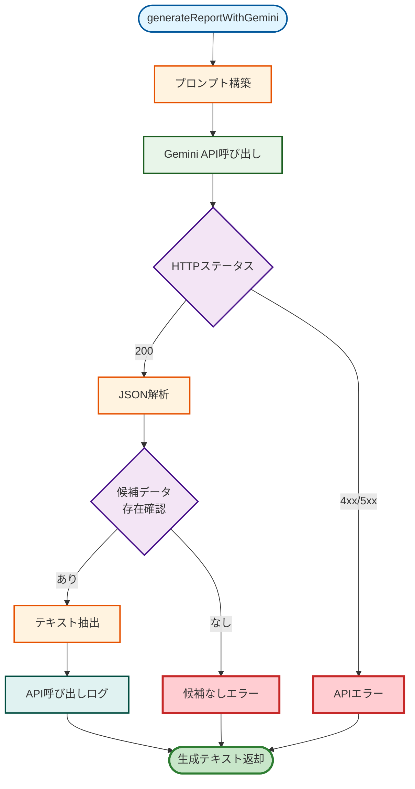
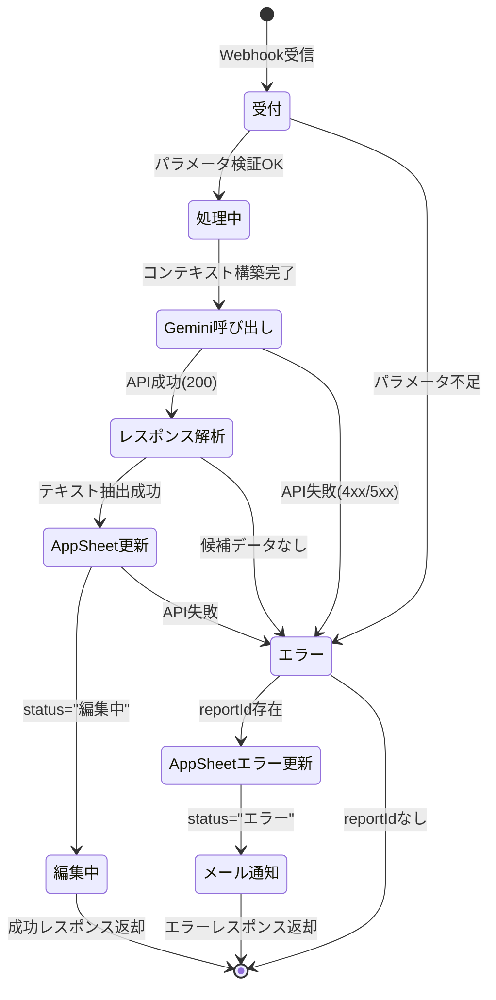
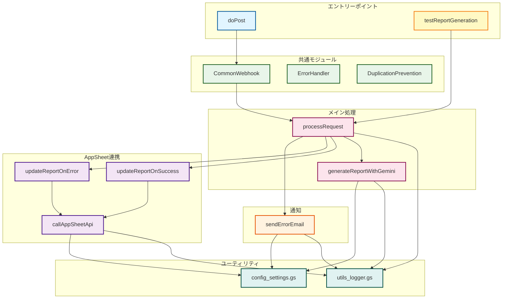

# Appsheet_訪問看護_報告書 - 処理フロー図

本ドキュメントでは、医療機関向け報告書生成システムの処理フローを図解します。

## 1. メイン処理フロー

## 2. Webhook受信処理

## 3. Gemini API呼び出しフロー

## 4. 状態遷移図

## 5. コンポーネント構成図

---

**最終更新**: 2025-10-18  
**バージョン**: v2.0.0
