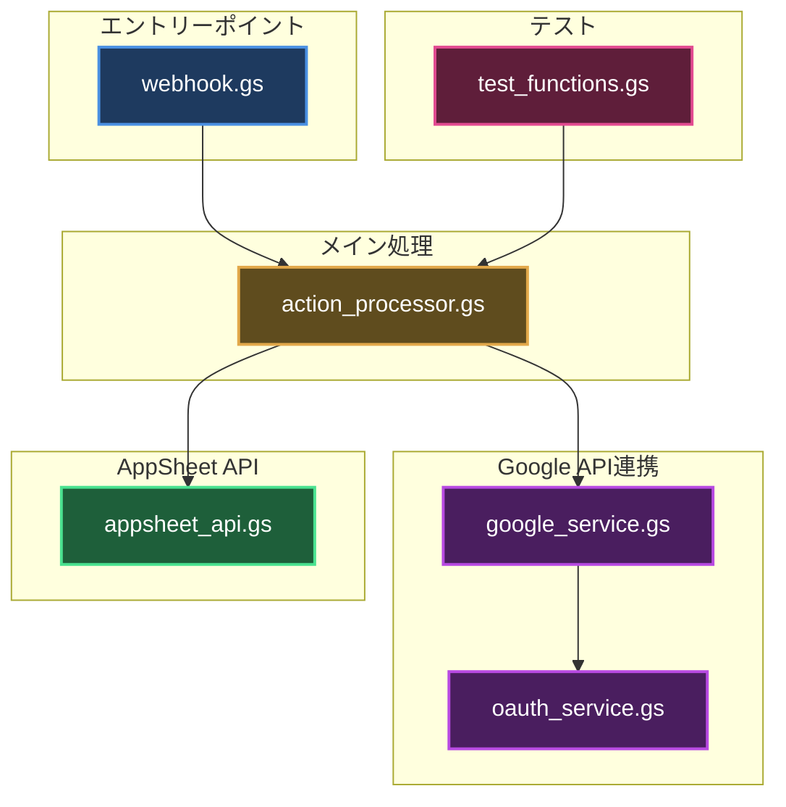
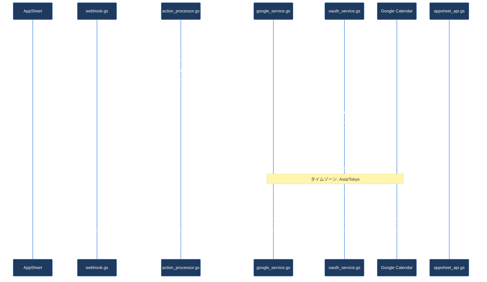
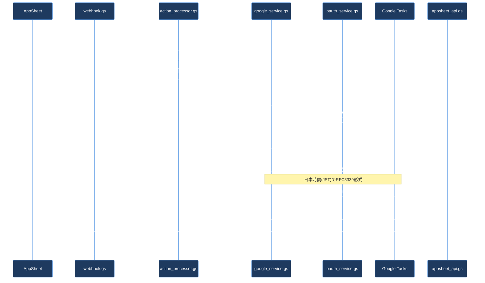
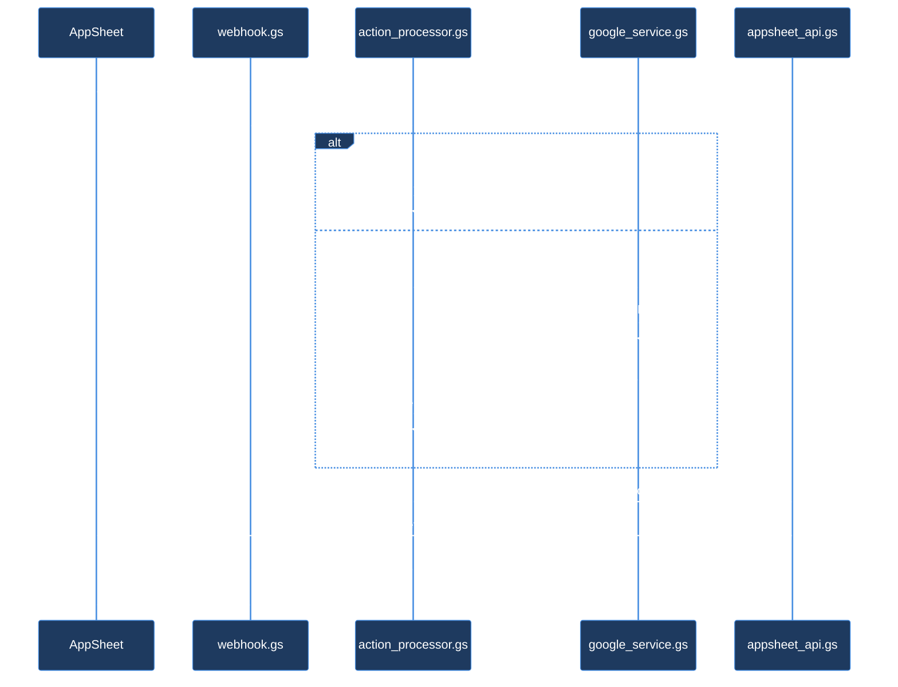
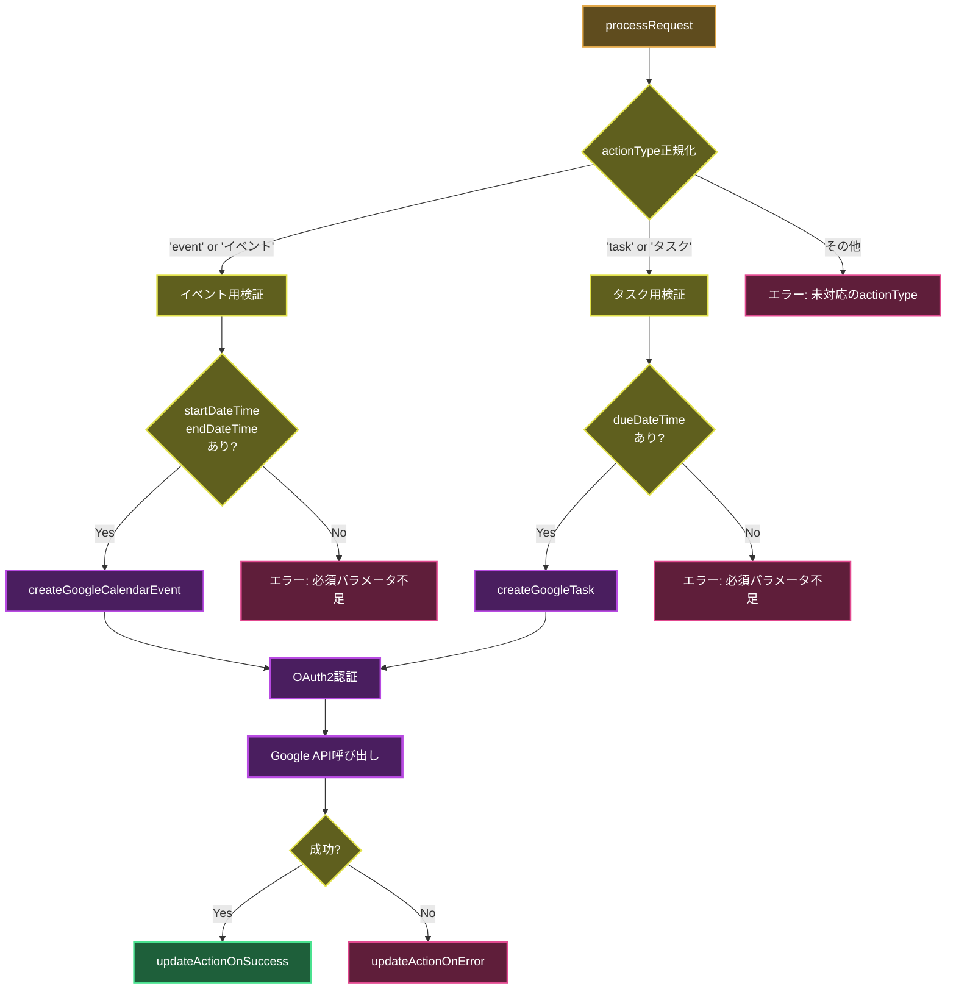

# スクリプトアーキテクチャ - Appsheet_通話_イベント・タスク作成

## 概要

このドキュメントは、Appsheet_通話_イベント・タスク作成プロジェクトのスクリプト構成、処理フロー、アーキテクチャについて説明します。

## アーキテクチャ図

> **配色について**: このプロジェクトのMermaid図配色は [アーキテクチャ図配色ガイドライン](../../../docs/ARCHITECTURE_DIAGRAM_COLOR_GUIDE.md) に準拠しています。



## ファイル別役割

### 1. エントリーポイント

#### `webhook.gs`
- **役割**: Webhookリクエスト受信とパラメータ抽出
- **主な関数**:
  - `doPost(e)` - POSTリクエストエントリーポイント
  - `processRequestDirect(...)` - 直接実行用ラッパー（9引数）
- **責務**: パラメータ正規化、processRequest呼び出し

### 2. メイン処理

#### `action_processor.gs`
- **役割**: アクション処理のメインロジックと分岐
- **主な関数**:
  - `processRequest(...)` - メイン処理関数（actionType判定、成功/エラーハンドリング）
- **処理分岐**:
  - `actionType='event'/'イベント'` → `createGoogleCalendarEvent()`
  - `actionType='task'/'タスク'` → `createGoogleTask()`
- **責務**: パラメータ検証、actionType正規化、結果処理、AppSheet更新呼び出し

### 3. Google API連携

#### `google_service.gs`
- **役割**: GoogleカレンダーとGoogleタスクのAPI呼び出し
- **主な関数**:
  - `createGoogleCalendarEvent(params)` - カレンダーイベント作成
  - `createGoogleTask(params)` - タスク作成
- **機能**:
  - 日本時間(JST)対応（Asia/Tokyo）
  - Calendar API v3使用
  - Tasks API v1使用
- **依存関係**: oauth_service.gs

#### `oauth_service.gs`
- **役割**: OAuth2認証サービス（サービスアカウント委任）
- **主な関数**:
  - `createOAuth2ServiceForUser(...)` - ユーザー代理OAuth2サービス作成
  - `getAccessToken(service)` - アクセストークン取得
  - `authCallback(request)` - OAuth2コールバック
- **認証方式**: サービスアカウントによるドメイン全体の委任

### 4. AppSheet API

#### `appsheet_api.gs`
- **役割**: AppSheet Call_Actionsテーブル更新
- **主な関数**:
  - `updateActionOnSuccess(...)` - 成功時更新（ステータス: 反映済み）
  - `updateActionOnError(...)` - エラー時更新（ステータス: エラー）
  - `callAppSheetApi(payload)` - AppSheet API呼び出し
- **設定**: APP_ID, ACCESS_KEY, ACTIONS_TABLE_NAME

### 5. テスト

#### `test_functions.gs`
- **役割**: イベント/タスク作成のテスト関数
- **主な関数**:
  - `testProcessRequestEvent()` - イベント作成テスト（英語パラメータ）
  - `testProcessRequestTask()` - タスク作成テスト（日本語パラメータ）
- **使用方法**: GASエディタから直接実行

## 処理フロー

### 1. イベント作成フロー



### 2. タスク作成フロー



### 3. エラー処理フロー



## データフロー

### actionType判定処理



## パラメータマッピング

### イベント作成パラメータ

| AppSheet | webhook.gs | action_processor.gs | google_service.gs |
|----------|-----------|-------------------|------------------|
| `action_id` | `actionId` | `actionId` | - |
| `action_type` | `actionType` | `normalizedActionType` | - |
| `title` | `title` | `title` | `params.title` → `summary` |
| `details` | `details` | `details` | `params.details` → `description` |
| `start_datetime` | `startDateTime` | `startDateTime` | `params.startDateTime` → `start.dateTime` |
| `end_datetime` | `endDateTime` | `endDateTime` | `params.endDateTime` → `end.dateTime` |
| `assignee_email` | `assigneeEmail` | `assigneeEmail` | `params.assigneeEmail` → OAuth2 subject |
| `row_url` | `rowUrl` | `rowUrl` | `params.rowUrl` → `description` |

### タスク作成パラメータ

| AppSheet | webhook.gs | action_processor.gs | google_service.gs |
|----------|-----------|-------------------|------------------|
| `action_id` | `actionId` | `actionId` | - |
| `action_type` | `actionType` | `normalizedActionType` | - |
| `title` | `title` | `title` | `params.title` → `title` |
| `details` | `details` | `details` | `params.details` → `notes` |
| `due_datetime` | `dueDateTime` | `dueDateTime` | `params.dueDateTime` → `due` |
| `assignee_email` | `assigneeEmail` | `assigneeEmail` | `params.assigneeEmail` → OAuth2 subject |

## 命名規則

### ファイル名

- **エントリーポイント**: `webhook.gs`
- **プロセッサ**: `{機能名}_processor.gs` (例: action_processor.gs)
- **サービス**: `{機能名}_service.gs` (例: google_service.gs, oauth_service.gs)
- **API**: `{サービス名}_api.gs` (例: appsheet_api.gs)
- **テスト**: `test_functions.gs`

### 関数名

- **公開関数**: キャメルケース (例: `processRequest`, `createGoogleCalendarEvent`)
- **テスト関数**: `test` プレフィックス (例: `testProcessRequestEvent`)
- **ヘルパー関数**: キャメルケース (例: `updateActionOnSuccess`)

## 設定

### スクリプトプロパティ

- `SERVICE_ACCOUNT_JSON`: サービスアカウントのJSONキー（OAuth2認証用）

### 定数

#### appsheet_api.gs

```javascript
const APP_ID = '4762f34f-3dbc-4fca-9f84-5b6e809c3f5f';
const ACCESS_KEY = 'V2-I1zMZ-90iua-47BBk-RBjO1-N0mUo-kY25j-VsI4H-eRvwT';
const ACTIONS_TABLE_NAME = 'Call_Actions';
```

#### oauth_service.gs

```javascript
const DEFAULT_SERVICE_ACCOUNT_JSON_KEY = 'SERVICE_ACCOUNT_JSON';
const DEFAULT_OAUTH_CALLBACK_FUNCTION = 'authCallback';
```

## OAuth2スコープ

### イベント作成

```javascript
['https://www.googleapis.com/auth/calendar']
```

### タスク作成

```javascript
['https://www.googleapis.com/auth/tasks']
```

## デプロイ

### バックアップ除外

`.claspignore` により以下のファイルはGASにプッシュされません:

```
**/_backup/**
*_backup.gs
*_OLD.gs
*_v[0-9]*.gs
```

### デプロイコマンド

```bash
# プロジェクトディレクトリに移動
cd gas_projects/Appsheet_通話_イベント・タスク作成

# プッシュ
clasp push

# デプロイ
clasp deploy --description "v2: 説明"
```

## トラブルシューティング

### OAuth2エラー

**症状**: `OAuth2アクセストークン取得失敗`

**対策**:
1. `SERVICE_ACCOUNT_JSON` スクリプトプロパティが設定されているか確認
2. サービスアカウントにドメイン全体の委任が有効か確認
3. 必要なスコープ（Calendar/Tasks）が付与されているか確認

### パラメータエラー

**症状**: `必須パラメータ不足`

**対策**:
- イベント作成: `actionId`, `actionType`, `title`, `assigneeEmail`, `startDateTime`, `endDateTime` が必須
- タスク作成: `actionId`, `actionType`, `title`, `assigneeEmail`, `dueDateTime` が必須
- `actionType` は `'event'`/`'イベント'` または `'task'`/`'タスク'` のみ対応

### 日時エラー

**症状**: イベント/タスクが正しい時刻に作成されない

**対策**:
- 日時は日本時間(JST)で `YYYY-MM-DDTHH:mm:ss+09:00` 形式で指定
- タイムゾーンは `Asia/Tokyo` に自動設定される

## 変更履歴

### v2 (2025-10-17)
- ✨ スクリプト役割別分割実施
- ✅ 新ファイル: webhook.gs, action_processor.gs, google_service.gs, oauth_service.gs, appsheet_api.gs, test_functions.gs
- 📦 旧ファイルアーカイブ: コード.gs → _backup/コード_OLD.gs

### v1.1 (2025-10-17)
- 日本語パラメータ対応（'イベント'/'タスク'）
- 日本時間(JST)処理の明確化

### v1.0 (2025-10-17)
- 初回リリース（イベント作成・タスク作成統合）

## 参考ドキュメント

- [README.md](./README.md) - プロジェクト概要
- [Google Calendar API v3](https://developers.google.com/calendar/api/v3/reference)
- [Google Tasks API v1](https://developers.google.com/tasks/reference/rest)
