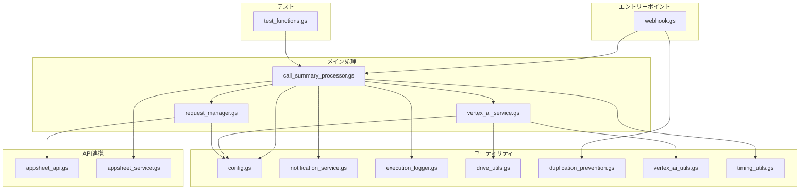

# スクリプトアーキテクチャ

## 概要

このドキュメントは、Appsheet_通話_要約生成プロジェクトのスクリプト構成と役割分担について説明します。

## アーキテクチャ図



## ファイル別役割

### 1. エントリーポイント

#### `webhook.gs`
- **役割**: Webhookリクエストの受信とエラーハンドリング
- **主な関数**:
  - `doPost(e)` - POSTリクエストエントリーポイント
  - `processCallSummaryWithErrorHandling(params)` - エラーハンドリングラッパー
- **依存関係**: duplication_prevention.gs, execution_logger.gs

### 2. メイン処理

#### `call_summary_processor.gs`
- **役割**: 通話要約処理のメインロジック
- **主な関数**:
  - `processCallSummary(params)` - メイン処理関数（処理モード判定、AI解析、AppSheet更新）
  - `processCallSummaryDirect(...)` - 直接実行用ラッパー（12引数）
- **処理モード**:
  1. `summary_only` - 通常要約モード（依頼情報なし）
  2. `create_request` - 新規依頼作成モード（callType='新規依頼'）
  3. `update_request` - 既存依頼更新モード（requestId指定）
- **依存関係**: vertex_ai_service.gs, request_manager.gs, appsheet_service.gs

#### `vertex_ai_service.gs`
- **役割**: Vertex AI音声解析サービス
- **主な関数**:
  - `analyzeAudioWithVertexAI()` - 音声解析メイン関数
  - `generateUnifiedPrompt()` - 統合プロンプト生成
  - `callVertexAIAPIWithInlineData()` - Vertex AI API呼び出し
  - `extractAndValidateJSON()` - JSON抽出・検証
- **機能**:
  - base64 inlineData方式（20MB制限）
  - 依頼情報抽出の統合プロンプト
  - JSON構造検証・修復
- **依存関係**: drive_utils.gs, vertex_ai_utils.gs

#### `request_manager.gs`
- **役割**: 依頼管理（作成・更新・ID生成）
- **主な関数**:
  - `createNewRequestDirect()` - 新規依頼作成
  - `updateExistingRequestDirect()` - 既存依頼更新
  - `updateCallLogWithRequestId()` - Call_Logs更新
  - `generateRequestId()` - 依頼ID生成（CLRQ-YYYYMMDDHHmm形式）
- **依存関係**: appsheet_api.gs

### 3. API連携

#### `appsheet_api.gs`
- **役割**: AppSheet API呼び出し（依頼用）
- **主な関数**:
  - `callAppSheetApiForRequest()` - 依頼テーブルAPI呼び出し
- **機能**: エラーハンドリング、レスポンス検証

#### `appsheet_service.gs`
- **役割**: AppSheet API連携（通話ログ・アクション）
- **主な関数**:
  - `updateCallLog()` - Call_Logsテーブル更新
  - `addCallActions()` - Call_Actionsテーブル追加
  - `recordError()` - エラー記録

### 4. ユーティリティ

#### `config.gs`
- **役割**: 設定管理
- **主な関数**:
  - `getConfig()` - 設定取得
  - `setupScriptProperties()` - スクリプトプロパティ設定
  - `validateConfig()` - 設定検証

#### `notification_service.gs`
- **役割**: 通知サービス
- **主な関数**:
  - `sendSuccessNotification()` - 成功通知
  - `sendErrorNotification()` - エラー通知

#### `execution_logger.gs`
- **役割**: 実行ログ記録
- **主な関数**:
  - `logStart()` - 処理開始ログ
  - `logSuccess()` - 処理成功ログ
  - `logFailure()` - 処理失敗ログ
  - `logSkip()` - 処理スキップログ

#### `drive_utils.gs`
- **役割**: Google Drive操作
- **主な関数**:
  - `getFileIdFromPath()` - パスからファイルID取得
  - `searchFileByPath()` - ファイル検索

#### `duplication_prevention.gs`
- **役割**: 重複防止機能
- **主な関数**:
  - `executeWebhookWithDuplicationPrevention()` - 重複チェック付き実行

#### `vertex_ai_utils.gs`
- **役割**: Vertex AI汎用ヘルパー
- **主な関数**:
  - `generateTextWithVertex()` - テキスト生成
  - `generateJSONWithVertex()` - JSON生成

#### `timing_utils.gs`
- **役割**: 実行時間計測
- **主な関数**:
  - `ExecutionTimer` - タイマークラス

### 5. テスト

#### `test_functions.gs`
- **役割**: 各処理モードのテスト関数
- **主な関数**:
  - `testProcessRequest()` - 通常要約モードテスト
  - `testProcessRequestCreate()` - 新規依頼作成モードテスト
  - `testProcessRequestUpdate()` - 既存依頼更新モードテスト
- **使用方法**: GASエディタから直接実行

## 処理フロー

### 1. Webhook受信 → 要約生成

```
webhook.gs: doPost()
  ↓
duplication_prevention.gs: executeWebhookWithDuplicationPrevention()
  ↓
webhook.gs: processCallSummaryWithErrorHandling()
  ↓
call_summary_processor.gs: processCallSummary()
  ├─ 処理モード判定
  ├─ vertex_ai_service.gs: analyzeAudioWithVertexAI()
  ├─ appsheet_service.gs: updateCallLog()
  └─ appsheet_service.gs: addCallActions()
```

### 2. 新規依頼作成（callType='新規依頼'）

```
call_summary_processor.gs: processCallSummary()
  ↓ (processingMode='create_request')
  ↓
vertex_ai_service.gs: analyzeAudioWithVertexAI()
  ↓ (request_details抽出)
  ↓
request_manager.gs: createNewRequestDirect()
  ↓
appsheet_api.gs: callAppSheetApiForRequest()
  ↓
request_manager.gs: updateCallLogWithRequestId()
```

### 3. 既存依頼更新（requestId指定）

```
call_summary_processor.gs: processCallSummary()
  ↓ (processingMode='update_request')
  ↓
vertex_ai_service.gs: analyzeAudioWithVertexAI()
  ↓ (request_details抽出 + 既存情報マージ)
  ↓
request_manager.gs: updateExistingRequestDirect()
  ↓
appsheet_api.gs: callAppSheetApiForRequest()
```

## 命名規則

### ファイル名

- **サービス**: `{機能名}_service.gs` (例: vertex_ai_service.gs)
- **マネージャー**: `{機能名}_manager.gs` (例: request_manager.gs)
- **ユーティリティ**: `{機能名}_utils.gs` (例: drive_utils.gs)
- **API**: `{サービス名}_api.gs` (例: appsheet_api.gs)
- **単一機能**: `{機能名}.gs` (例: webhook.gs, config.gs)

### 関数名

- **公開関数**: キャメルケース (例: `processCallSummary`)
- **内部関数**: キャメルケース (例: `generateRequestId`)
- **テスト関数**: `test` プレフィックス (例: `testProcessRequest`)

## デプロイ

### バックアップ除外

`.claspignore` により以下のファイルはGASにプッシュされません:

- `scripts/_backup/**` - バックアップフォルダ全体
- `scripts/*_backup.gs` - バックアップファイル
- `scripts/*_v[0-9]*.gs` - バージョン番号付きファイル
- `scripts/*_OLD.gs` - 旧ファイル

### デプロイコマンド

```bash
# 統合デプロイスクリプト使用（推奨）
python deploy_unified.py "Appsheet_通話_要約生成" "v108: 説明"

# 手動デプロイ
cd gas_projects/Appsheet_通話_要約生成
clasp push
clasp deploy --description "v108: 説明"
```

## 変更履歴

### v107 (2025-10-17)
- ✨ スクリプト役割別分割実施
- ✅ 新ファイル: webhook.gs, call_summary_processor.gs, request_manager.gs, appsheet_api.gs, test_functions.gs
- 🔄 ファイル名変更: core_* → *_service.gs, utils_* → *_utils.gs
- 📦 旧ファイルアーカイブ: core_webhook_v3.gs, core_request_creation.gs → _backup/

### v100-v106
- 処理モード分岐機能追加
- バックアップファイル整理

### v95
- API統合最適化（2回→1回）
- base64 inlineData導入

## 参考ドキュメント

- [PROCESSING_MODE_GUIDE_v100.md](./PROCESSING_MODE_GUIDE_v100.md) - 処理モード詳細
- [OPTIMIZATION_GUIDE_v95.md](./OPTIMIZATION_GUIDE_v95.md) - API最適化詳細
- [README.md](./README.md) - プロジェクト概要
