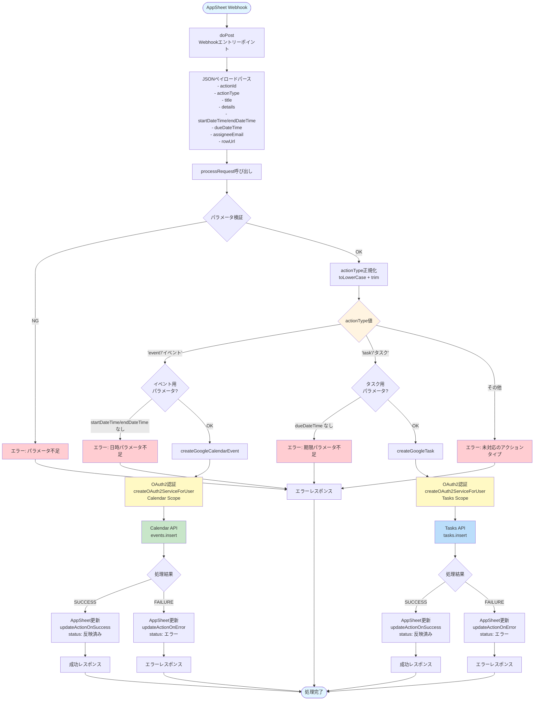
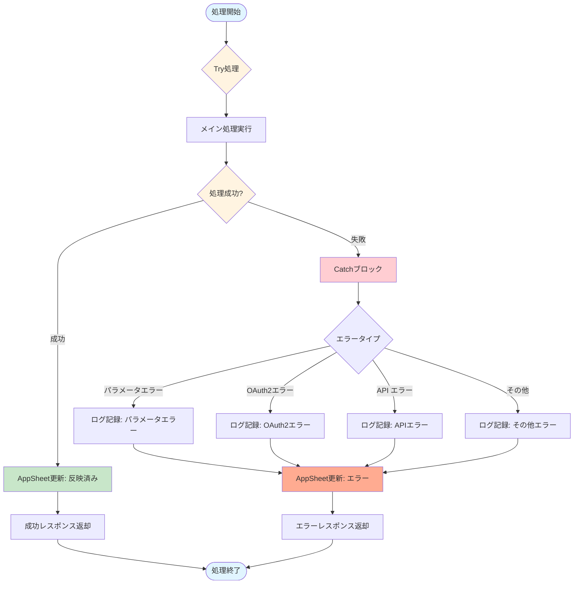
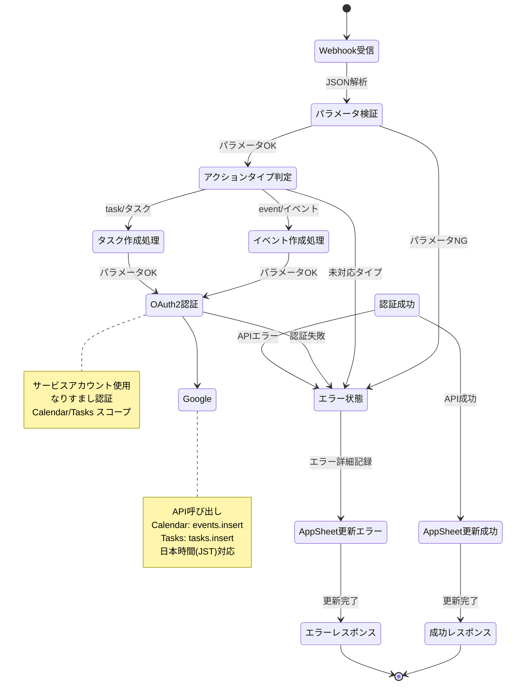
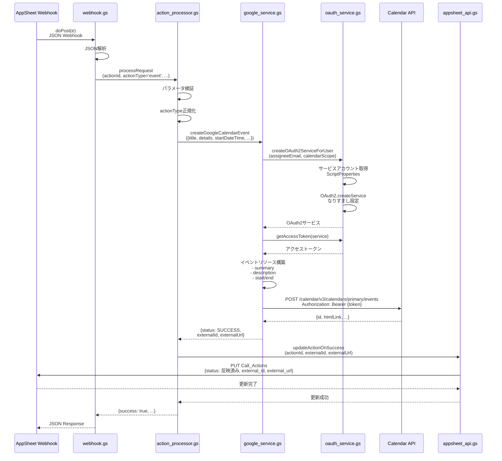

# Appsheet_通話_イベント・タスク作成 - 処理フロー図

## 概要フロー



## 詳細フロー1: イベント作成処理

```mermaid
graph TB
    Start([createGoogleCalendarEvent呼び出し]) --> ExtractParams[パラメータ抽出<br/>- title<br/>- details<br/>- startDateTime<br/>- endDateTime<br/>- assigneeEmail<br/>- rowUrl]

    ExtractParams --> TryCatch{Try-Catch}

    TryCatch --> SetScope[スコープ設定<br/>https://www.googleapis.com/auth/calendar]

    SetScope --> CreateService[createOAuth2ServiceForUser<br/>servicePrefix: CalendarImpersonation]

    CreateService --> GetToken[getAccessToken<br/>OAuth2トークン取得]

    GetToken --> CheckToken{トークン<br/>取得成功?}
    CheckToken -->|失敗| CatchError[Catchブロック]
    CheckToken -->|成功| CleanURL[rowURL整形<br/>HTMLタグ除去]

    CleanURL --> BuildDesc[description構築<br/>details + AppSheet URL]

    BuildDesc --> ParseDates[日時パース<br/>new Date(startDateTime)<br/>new Date(endDateTime)]

    ParseDates --> BuildResource[イベントリソース構築<br/>- summary: title<br/>- description<br/>- start: {dateTime, timeZone}<br/>- end: {dateTime, timeZone}]

    BuildResource --> SetAPIURL[Calendar APIエンドポイント<br/>/calendar/v3/calendars/primary/events]

    SetAPIURL --> CallAPI[UrlFetchApp.fetch<br/>POST リクエスト<br/>Authorization: Bearer {token}]

    CallAPI --> CheckStatus{HTTPステータス<br/>200?}

    CheckStatus -->|NG| CatchError
    CheckStatus -->|OK| ParseResponse[レスポンスJSON解析<br/>- id<br/>- htmlLink]

    ParseResponse --> SetResult[result設定<br/>- status: SUCCESS<br/>- externalId: id<br/>- externalUrl: htmlLink]

    SetResult --> Log1[ログ記録: イベント作成成功]

    Log1 --> ReturnSuccess[結果返却<br/>{status: SUCCESS, ...}]

    CatchError --> SetError[result設定<br/>- status: FAILURE<br/>- errorMessage: e.message]

    SetError --> Log2[ログ記録: イベント作成エラー]

    Log2 --> ReturnError[結果返却<br/>{status: FAILURE, ...}]

    ReturnSuccess --> End([処理完了])
    ReturnError --> End

    style Start fill:#e1f5ff
    style TryCatch fill:#fff4e1
    style CreateService fill:#fff9c4
    style CallAPI fill:#c8e6c9
    style End fill:#e1f5ff
    style CatchError fill:#ffcdd2
```

## 詳細フロー2: タスク作成処理

```mermaid
graph TB
    Start([createGoogleTask呼び出し]) --> ExtractParams[パラメータ抽出<br/>- title<br/>- details<br/>- dueDateTime<br/>- assigneeEmail]

    ExtractParams --> TryCatch{Try-Catch}

    TryCatch --> SetScope[スコープ設定<br/>https://www.googleapis.com/auth/tasks]

    SetScope --> CreateService[createOAuth2ServiceForUser<br/>servicePrefix: TasksImpersonation]

    CreateService --> GetToken[getAccessToken<br/>OAuth2トークン取得]

    GetToken --> CheckToken{トークン<br/>取得成功?}
    CheckToken -->|失敗| CatchError[Catchブロック]
    CheckToken -->|成功| ParseDate[日時パース<br/>new Date(dueDateTime)<br/>toISOString]

    ParseDate --> BuildResource[タスクリソース構築<br/>- title<br/>- notes: details<br/>- due: RFC3339形式]

    BuildResource --> SetAPIURL[Tasks APIエンドポイント<br/>/tasks/v1/lists/@default/tasks]

    SetAPIURL --> CallAPI[UrlFetchApp.fetch<br/>POST リクエスト<br/>Authorization: Bearer {token}]

    CallAPI --> CheckStatus{HTTPステータス<br/>200?}

    CheckStatus -->|NG| CatchError
    CheckStatus -->|OK| ParseResponse[レスポンスJSON解析<br/>- id<br/>- selfLink]

    ParseResponse --> SetResult[result設定<br/>- status: SUCCESS<br/>- externalId: id<br/>- externalUrl: selfLink]

    SetResult --> Log1[ログ記録: タスク作成成功]

    Log1 --> ReturnSuccess[結果返却<br/>{status: SUCCESS, ...}]

    CatchError --> SetError[result設定<br/>- status: FAILURE<br/>- errorMessage: e.message]

    SetError --> Log2[ログ記録: タスク作成エラー]

    Log2 --> ReturnError[結果返却<br/>{status: FAILURE, ...}]

    ReturnSuccess --> End([処理完了])
    ReturnError --> End

    style Start fill:#e1f5ff
    style TryCatch fill:#fff4e1
    style CreateService fill:#fff9c4
    style CallAPI fill:#bbdefb
    style End fill:#e1f5ff
    style CatchError fill:#ffcdd2
```

## OAuth2認証フロー

```mermaid
graph TB
    Start([createOAuth2ServiceForUser]) --> GetProperty[ScriptProperties取得<br/>SERVICE_ACCOUNT_JSON]

    GetProperty --> CheckProperty{プロパティ<br/>存在?}
    CheckProperty -->|なし| ErrorProperty[エラー: プロパティ未設定]
    CheckProperty -->|あり| ParseJSON[JSONパース<br/>serviceAccountInfo]

    ParseJSON --> CreateService[OAuth2.createService作成<br/>{servicePrefix}:{userEmail}]

    CreateService --> SetTokenURL[setTokenUrl<br/>https://oauth2.googleapis.com/token]
    SetTokenURL --> SetPrivateKey[setPrivateKey<br/>serviceAccountInfo.private_key]
    SetPrivateKey --> SetIssuer[setIssuer<br/>serviceAccountInfo.client_email]
    SetIssuer --> SetClientId[setClientId<br/>serviceAccountInfo.client_id]
    SetClientId --> SetSubject[setSubject<br/>userEmail なりすまし]

    SetSubject --> SetScope[setScope<br/>scopes.join(' ')]
    SetScope --> SetPropertyStore[setPropertyStore]
    SetPropertyStore --> SetCache[setCache]
    SetCache --> SetLock[setLock]

    SetLock --> ReturnService[OAuth2サービス返却]

    ReturnService --> GetAccess[getAccessToken呼び出し]

    GetAccess --> HasAccess{hasAccess?}
    HasAccess -->|なし| LogRefresh[ログ: トークンリフレッシュ]
    HasAccess -->|あり| GetToken

    LogRefresh --> GetToken[service.getAccessToken]

    GetToken --> CheckToken{トークン<br/>存在?}
    CheckToken -->|なし| ErrorToken[エラー: トークン取得失敗]
    CheckToken -->|あり| ReturnToken[トークン返却]

    ErrorProperty --> End([処理終了])
    ErrorToken --> End
    ReturnToken --> End

    style Start fill:#e1f5ff
    style CheckProperty fill:#fff4e1
    style SetSubject fill:#fff9c4
    style GetToken fill:#c8e6c9
    style End fill:#e1f5ff
    style ErrorProperty fill:#ffcdd2
    style ErrorToken fill:#ffcdd2
```

## AppSheet更新フロー

```mermaid
graph TB
    Start([処理完了]) --> CheckResult{処理結果}

    CheckResult -->|成功| UpdateSuccess[updateActionOnSuccess呼び出し]
    CheckResult -->|失敗| UpdateError[updateActionOnError呼び出し]

    UpdateSuccess --> BuildPayloadSuccess[Editペイロード構築<br/>- action_id<br/>- external_id<br/>- external_url<br/>- status: 反映済み]

    UpdateError --> BuildPayloadError[Editペイロード構築<br/>- action_id<br/>- status: エラー<br/>- error_details]

    BuildPayloadSuccess --> CallAPI1[callAppSheetApi]
    BuildPayloadError --> CallAPI2[callAppSheetApi]

    CallAPI1 --> SetURL1[AppSheet APIエンドポイント<br/>/api/v2/apps/{appId}/tables/Call_Actions/Action]
    CallAPI2 --> SetURL2[AppSheet APIエンドポイント<br/>/api/v2/apps/{appId}/tables/Call_Actions/Action]

    SetURL1 --> Fetch1[UrlFetchApp.fetch<br/>POST リクエスト<br/>ApplicationAccessKey: {key}]
    SetURL2 --> Fetch2[UrlFetchApp.fetch<br/>POST リクエスト<br/>ApplicationAccessKey: {key}]

    Fetch1 --> CheckStatus1{HTTPステータス<br/>400未満?}
    Fetch2 --> CheckStatus2{HTTPステータス<br/>400未満?}

    CheckStatus1 -->|OK| Log1[ログ記録: AppSheet更新成功]
    CheckStatus1 -->|NG| Error1[エラー: AppSheet APIエラー]

    CheckStatus2 -->|OK| Log2[ログ記録: AppSheet更新成功]
    CheckStatus2 -->|NG| Error2[エラー: AppSheet APIエラー]

    Log1 --> End([処理完了])
    Log2 --> End
    Error1 --> End
    Error2 --> End

    style Start fill:#e1f5ff
    style CheckResult fill:#fff4e1
    style Fetch1 fill:#c8e6c9
    style Fetch2 fill:#ffab91
    style End fill:#e1f5ff
    style Error1 fill:#ffcdd2
    style Error2 fill:#ffcdd2
```

## データフロー図

```mermaid
graph LR
    Input[AppSheet Webhook<br/>Call_Actions] --> Params[パラメータ<br/>- actionId<br/>- actionType<br/>- title<br/>- details<br/>- startDateTime<br/>- endDateTime<br/>- dueDateTime<br/>- assigneeEmail]

    Params --> Process[processRequest]

    Process --> Branch{actionType<br/>分岐}

    Branch -->|event| Event[createGoogleCalendarEvent]
    Branch -->|task| Task[createGoogleTask]

    Event --> OAuth1[OAuth2認証<br/>Calendar Scope]
    Task --> OAuth2[OAuth2認証<br/>Tasks Scope]

    OAuth1 --> ScriptProps1[ScriptProperties<br/>SERVICE_ACCOUNT_JSON]
    OAuth2 --> ScriptProps2[ScriptProperties<br/>SERVICE_ACCOUNT_JSON]

    ScriptProps1 --> Token1[アクセストークン]
    ScriptProps2 --> Token2[アクセストークン]

    Token1 --> CalendarAPI[Calendar API<br/>events.insert]
    Token2 --> TasksAPI[Tasks API<br/>tasks.insert]

    CalendarAPI --> Response1[レスポンス<br/>- id<br/>- htmlLink]
    TasksAPI --> Response2[レスポンス<br/>- id<br/>- selfLink]

    Response1 --> Result[結果<br/>{status, externalId, externalUrl}]
    Response2 --> Result

    Result --> AppSheet[AppSheet API<br/>Call_Actions更新]

    AppSheet --> DB[AppSheetデータベース<br/>Call_Actions]

    style Input fill:#e1f5ff
    style Branch fill:#fff4e1
    style OAuth1 fill:#fff9c4
    style OAuth2 fill:#fff9c4
    style CalendarAPI fill:#c8e6c9
    style TasksAPI fill:#bbdefb
    style DB fill:#fff3e0
```

## エラーハンドリングフロー



## 状態遷移図



## シーケンス図: イベント作成処理


