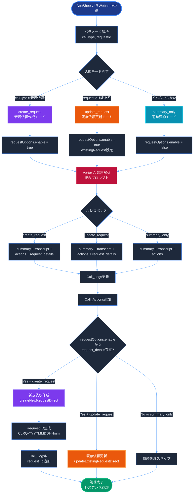

# 処理モード分岐ガイド (v100)

## 概要

v100では、`callType`と`requestId`パラメータによる条件分岐機能が追加されました。これにより、AppSheetから明示的に処理モードを指定できるようになりました。

## 3つの処理モード

| モード | 条件 | 動作 | 依頼情報抽出 | 依頼作成/更新 |
|--------|------|------|--------------|---------------|
| **create_request** | `callType='新規依頼'` | 新規依頼作成 | ✅ | ✅ 新規作成 |
| **update_request** | `requestId`指定あり | 既存依頼更新 | ✅ | ✅ 更新 |
| **summary_only** | どちらでもない | 要約のみ | ❌ | ❌ |

---

## 処理フロー全体図



---

## シーケンス図: 新規依頼作成モード

```mermaid
%%{init: {'theme':'dark', 'themeVariables': {'primaryColor':'#1e3a8a','actorBkg':'#1e293b','actorBorder':'#3b82f6','actorTextColor':'#f1f5f9','actorLineColor':'#60a5fa','signalColor':'#e2e8f0','signalTextColor':'#f1f5f9','labelBoxBkgColor':'#1e3a8a','labelBoxBorderColor':'#3b82f6','labelTextColor':'#f1f5f9','loopTextColor':'#f1f5f9','noteBkgColor':'#1e3a8a','noteBorderColor':'#3b82f6','noteTextColor':'#f1f5f9','activationBkgColor':'#7c3aed','activationBorderColor':'#a78bfa','sequenceNumberColor':'#fff'}}}%%
sequenceDiagram
    autonumber
    participant AS as AppSheet
    participant WH as Webhook<br/>(core_webhook_v3.gs)
    participant VA as Vertex AI<br/>(core_vertexai.gs)
    participant CL as Call_Logs<br/>(AppSheet)
    participant CA as Call_Actions<br/>(AppSheet)
    participant RQ as Call_Requests<br/>(AppSheet)
    
    rect rgb(30, 58, 138)
    Note over AS,WH: 新規依頼作成モード (callType='新規依頼')
    end
    
    AS->>+WH: POST /exec<br/>{callType: '新規依頼', ...}
    
    WH->>WH: パラメータ解析<br/>callType='新規依頼' 検出
    WH->>WH: processingMode = 'create_request'
    WH->>WH: requestOptions.enable = true
    
    rect rgb(30, 41, 59)
    Note over WH,VA: 統合プロンプトによる音声解析
    WH->>+VA: analyzeAudioWithVertexAI<br/>(includeRequestDetails=true)
    VA->>VA: 音声ファイル取得<br/>base64エンコード (20MB制限)
    VA->>VA: 統合プロンプト生成<br/>(要約+文字起こし+アクション+依頼情報)
    VA->>VA: Vertex AI API呼び出し<br/>gemini-2.5-flash (us-central1)
    VA-->>-WH: {summary, transcript,<br/>actions, request_details}
    end
    
    rect rgb(30, 41, 59)
    Note over WH,CA: AppSheet更新
    WH->>+CL: PUT /tables/Call_Logs/Action<br/>{transcript, summary, file_id, file_url}
    CL-->>-WH: OK
    
    WH->>+CA: POST /tables/Call_Actions/Action<br/>[{action1}, {action2}, ...]
    CA-->>-WH: OK
    end
    
    rect rgb(124, 58, 237)
    Note over WH,RQ: 新規依頼作成
    WH->>WH: generateRequestId()<br/>CLRQ-202510171030
    WH->>+RQ: POST /tables/Call_Requests/Action<br/>{request_id, request_reason,<br/>client_info, next_action, ...}
    RQ-->>-WH: OK (依頼作成完了)
    
    WH->>+CL: PUT /tables/Call_Logs/Action<br/>{request_ids: 'CLRQ-202510171030'}
    CL-->>-WH: OK
    end
    
    WH-->>-AS: {success: true,<br/>processing_mode: 'create_request',<br/>request_created: {<br/>  request_id: 'CLRQ-202510171030',<br/>  is_new: true,<br/>  mode: 'create'<br/>}}
```



---

## シーケンス図: 既存依頼更新モード

```mermaid
%%{init: {'theme':'dark', 'themeVariables': {'primaryColor':'#1e3a8a','actorBkg':'#1e293b','actorBorder':'#3b82f6','actorTextColor':'#f1f5f9','actorLineColor':'#60a5fa','signalColor':'#e2e8f0','signalTextColor':'#f1f5f9','labelBoxBkgColor':'#ea580c','labelBoxBorderColor':'#fb923c','labelTextColor':'#f1f5f9','loopTextColor':'#f1f5f9','noteBkgColor':'#ea580c','noteBorderColor':'#fb923c','noteTextColor':'#f1f5f9','activationBkgColor':'#ea580c','activationBorderColor':'#fb923c','sequenceNumberColor':'#fff'}}}%%
sequenceDiagram
    autonumber
    participant AS as AppSheet
    participant WH as Webhook<br/>(core_webhook_v3.gs)
    participant VA as Vertex AI<br/>(core_vertexai.gs)
    participant CL as Call_Logs<br/>(AppSheet)
    participant CA as Call_Actions<br/>(AppSheet)
    participant RQ as Call_Requests<br/>(AppSheet)
    
    rect rgb(234, 88, 12)
    Note over AS,WH: 既存依頼更新モード (requestId指定)
    end
    
    AS->>+WH: POST /exec<br/>{requestId: 'CLRQ-202510151200', ...}
    
    WH->>WH: パラメータ解析<br/>requestId='CLRQ-202510151200' 検出
    WH->>WH: processingMode = 'update_request'
    WH->>WH: requestOptions.enable = true<br/>existingRequest設定
    
    rect rgb(30, 41, 59)
    Note over WH,VA: 統合プロンプトによる音声解析
    WH->>+VA: analyzeAudioWithVertexAI<br/>(includeRequestDetails=true,<br/>existingRequest設定)
    VA->>VA: 音声ファイル取得<br/>base64エンコード (20MB制限)
    VA->>VA: 統合プロンプト生成<br/>(既存依頼情報を含む)
    VA->>VA: Vertex AI API呼び出し<br/>gemini-2.5-flash (us-central1)
    VA-->>-WH: {summary, transcript,<br/>actions, request_details}
    end
    
    rect rgb(30, 41, 59)
    Note over WH,CA: AppSheet更新
    WH->>+CL: PUT /tables/Call_Logs/Action<br/>{transcript, summary, file_id, file_url}
    CL-->>-WH: OK
    
    WH->>+CA: POST /tables/Call_Actions/Action<br/>[{action1}, {action2}, ...]
    CA-->>-WH: OK
    end
    
    rect rgb(234, 88, 12)
    Note over WH,RQ: 既存依頼更新
    WH->>+RQ: PUT /tables/Call_Requests/Action<br/>{request_id: 'CLRQ-202510151200',<br/>request_reason: '更新内容',<br/>client_info: '更新内容', ...}
    RQ-->>-WH: OK (依頼更新完了)
    end
    
    WH-->>-AS: {success: true,<br/>processing_mode: 'update_request',<br/>request_created: {<br/>  request_id: 'CLRQ-202510151200',<br/>  is_new: false,<br/>  mode: 'update'<br/>}}
```



---

## シーケンス図: 通常要約モード

```mermaid
%%{init: {'theme':'dark', 'themeVariables': {'primaryColor':'#1e3a8a','actorBkg':'#1e293b','actorBorder':'#3b82f6','actorTextColor':'#f1f5f9','actorLineColor':'#60a5fa','signalColor':'#e2e8f0','signalTextColor':'#f1f5f9','labelBoxBkgColor':'#0891b2','labelBoxBorderColor':'#22d3ee','labelTextColor':'#f1f5f9','loopTextColor':'#f1f5f9','noteBkgColor':'#0891b2','noteBorderColor':'#22d3ee','noteTextColor':'#f1f5f9','activationBkgColor':'#0891b2','activationBorderColor':'#22d3ee','sequenceNumberColor':'#fff'}}}%%
sequenceDiagram
    autonumber
    participant AS as AppSheet
    participant WH as Webhook<br/>(core_webhook_v3.gs)
    participant VA as Vertex AI<br/>(core_vertexai.gs)
    participant CL as Call_Logs<br/>(AppSheet)
    participant CA as Call_Actions<br/>(AppSheet)
    
    rect rgb(8, 145, 178)
    Note over AS,WH: 通常要約モード (callType, requestId なし)
    end
    
    AS->>+WH: POST /exec<br/>{callId, callDatetime, ...}
    
    WH->>WH: パラメータ解析<br/>callType, requestId 未指定
    WH->>WH: processingMode = 'summary_only'
    WH->>WH: requestOptions.enable = false
    
    rect rgb(30, 41, 59)
    Note over WH,VA: 通常プロンプトによる音声解析
    WH->>+VA: analyzeAudioWithVertexAI<br/>(includeRequestDetails=false)
    VA->>VA: 音声ファイル取得<br/>base64エンコード (20MB制限)
    VA->>VA: 通常プロンプト生成<br/>(要約+文字起こし+アクションのみ)
    VA->>VA: Vertex AI API呼び出し<br/>gemini-2.5-flash (us-central1)
    VA-->>-WH: {summary, transcript, actions}
    end
    
    rect rgb(30, 41, 59)
    Note over WH,CA: AppSheet更新
    WH->>+CL: PUT /tables/Call_Logs/Action<br/>{transcript, summary, file_id, file_url}
    CL-->>-WH: OK
    
    WH->>+CA: POST /tables/Call_Actions/Action<br/>[{action1}, {action2}, ...]
    CA-->>-WH: OK
    end
    
    rect rgb(8, 145, 178)
    Note over WH: 依頼処理スキップ
    WH->>WH: Logger.log('依頼情報スキップ')
    end
    
    WH-->>-AS: {success: true,<br/>processing_mode: 'summary_only',<br/>request_created: null}
```



---

## パラメータ仕様

### 入力パラメータ

| パラメータ | 型 | 必須 | 説明 | 例 |
|-----------|-----|------|------|-----|
| `callId` | string | ✅ | 通話ID | `CL-202510171030` |
| `callDatetime` | string | ✅ | 通話日時 | `2025-10-17 10:30:00` |
| `callType` | string | ❌ | 通話種別 | `新規依頼` or `new_request` |
| `requestId` | string | ❌ | 既存依頼ID | `CLRQ-202510151200` |
| `filePath` | string | ⚠️ | ファイルパス | `/path/to/audio.m4a` |
| `fileId` | string | ⚠️ | ファイルID | `1a2b3c4d5e...` |
| `callContextText` | string | ❌ | 通話コンテキスト | `顧客名: 山田太郎...` |
| `userInfoText` | string | ❌ | ユーザー情報 | `担当者: 鈴木...` |
| `clientId` | string | ❌ | クライアントID | `CLIENT123` |
| `creatorId` | string | ❌ | 作成者ID | `USER001` |
| `requesterId` | string | ❌ | 依頼者ID | `USER002` |
| `requesterOrgId` | string | ❌ | 依頼元組織ID | `ORG001` |

⚠️ `filePath` または `fileId` のいずれかが必須

### パラメータエイリアス

以下の形式も自動認識されます:

```javascript
// callType
params.callType || params.call_type

// requestId
params.requestId || params.request_id || params.request_ids || params.requestIds

// creatorId
params.creator_id || params.creatorId

// requesterId
params.requester_id || params.requesterId

// requesterOrgId
params.requester_org_id || params.requesterOrgId
```

### 出力レスポンス

#### 成功時 (200 OK)

```json
{
  "success": true,
  "callId": "CL-202510171030",
  "recording_file_id": "1a2b3c4d5e...",
  "recording_file_url": "https://drive.google.com/...",
  "summary_length": 250,
  "actions_count": 3,
  "processing_mode": "create_request",
  "request_created": {
    "request_id": "CLRQ-202510171030",
    "is_new": true,
    "mode": "create"
  }
}
```

#### 処理モード別レスポンス

| processing_mode | request_created | 説明 |
|----------------|-----------------|------|
| `create_request` | `{request_id, is_new: true, mode: 'create'}` | 新規依頼作成完了 |
| `update_request` | `{request_id, is_new: false, mode: 'update'}` | 既存依頼更新完了 |
| `summary_only` | `null` | 依頼処理なし |

---

## 使用例

### 例1: 新規依頼作成

```bash
curl -X POST "https://script.google.com/macros/s/AKfyc.../exec" \
  -H "Content-Type: application/json" \
  -d '{
    "callId": "CL-202510171030",
    "callDatetime": "2025-10-17 10:30:00",
    "callType": "新規依頼",
    "filePath": "/営業部/2025/10/17/recording_001.m4a",
    "callContextText": "顧客: 株式会社サンプル\n担当者: 山田太郎",
    "userInfoText": "営業: 鈴木一郎",
    "clientId": "CLIENT_001",
    "creatorId": "USER_001",
    "requesterId": "USER_002",
    "requesterOrgId": "ORG_SALES"
  }'
```

**期待される動作:**
1. 音声ファイルを解析
2. 依頼情報を抽出
3. 新規依頼を作成 (`CLRQ-202510171030`)
4. Call_Logsに`request_ids`を追加

---

### 例2: 既存依頼更新

```bash
curl -X POST "https://script.google.com/macros/s/AKfyc.../exec" \
  -H "Content-Type: application/json" \
  -d '{
    "callId": "CL-202510171030",
    "callDatetime": "2025-10-17 10:30:00",
    "requestId": "CLRQ-202510151200",
    "filePath": "/営業部/2025/10/17/recording_002.m4a",
    "callContextText": "追加情報の通話",
    "creatorId": "USER_001",
    "existingRequestReason": "新規システム導入の相談",
    "existingClientInfo": "従業員50名規模",
    "existingNextAction": "見積もり作成"
  }'
```

**期待される動作:**
1. 音声ファイルを解析
2. 依頼情報を抽出
3. 既存依頼 (`CLRQ-202510151200`) を更新
4. 既存の内容とAI抽出内容をマージ

---

### 例3: 通常要約のみ

```bash
curl -X POST "https://script.google.com/macros/s/AKfyc.../exec" \
  -H "Content-Type: application/json" \
  -d '{
    "callId": "CL-202510171030",
    "callDatetime": "2025-10-17 10:30:00",
    "filePath": "/営業部/2025/10/17/recording_003.m4a",
    "callContextText": "定例ミーティング",
    "clientId": "CLIENT_001"
  }'
```

**期待される動作:**
1. 音声ファイルを解析
2. 要約・文字起こし・アクションのみ抽出
3. 依頼情報の抽出・作成はスキップ

---

## コスト比較

### v94 (最適化前)

| 処理 | API呼び出し | コスト |
|------|-------------|--------|
| 音声解析 | Vertex AI × 1 | $0.0191 |
| 依頼情報抽出 | Vertex AI × 1 | $0.0005 |
| Cloud Storage | upload/delete | $0.0002 |
| **合計** | **2回** | **$0.0198** |

### v95～v100 (最適化後)

| 処理モード | API呼び出し | コスト | 削減率 |
|-----------|-------------|--------|--------|
| **summary_only** | Vertex AI × 1 | $0.0188 | 5.1% |
| **create_request** | Vertex AI × 1 | $0.0191 | 3.5% |
| **update_request** | Vertex AI × 1 | $0.0191 | 3.5% |

**最適化ポイント:**
- API呼び出し: 2回 → 1回
- Cloud Storage: 削除
- 処理時間: 15-20秒 → 10-12秒 (28%短縮)

---

## トラブルシューティング

### 問題1: 依頼情報が抽出されない

**症状:**
- `processing_mode: 'create_request'` なのに `request_created: null`

**原因:**
- AI解析で `request_details` が空

**対策:**
```javascript
// callContextText, userInfoText を充実させる
{
  "callContextText": "顧客名: 株式会社サンプル\n案件: 新規システム導入",
  "userInfoText": "営業担当: 鈴木一郎\n部署: 営業部"
}
```

---

### 問題2: 既存依頼が更新されない

**症状:**
- `processing_mode: 'update_request'` だが依頼が更新されない

**原因:**
- `requestId` が存在しない
- `requestId` のフォーマットが不正

**対策:**
```javascript
// 正しいrequestIdフォーマット
{
  "requestId": "CLRQ-202510151200"  // CLRQ-YYYYMMDDHHmm
}
```

---

### 問題3: 処理モードが意図と異なる

**症状:**
- `callType='新規依頼'` なのに `processing_mode: 'summary_only'`

**原因:**
- パラメータ名のスペルミス
- 値のスペルミス

**対策:**
```javascript
// 正しいパラメータ名と値
{
  "callType": "新規依頼"  // または "new_request"
}

// 以下も認識される
{
  "call_type": "新規依頼"
}
```

---

## ログ確認方法

### Apps Script実行ログ

1. **Apps Script エディタ**を開く
2. **実行数** → 対象の実行を選択
3. ログで以下を確認:

```
[処理開始] 通話ID: CL-202510171030, callType: 新規依頼, requestId: 
[処理モード] 新規依頼作成モード
[依頼設定] 新規依頼作成を有効化
[依頼情報] AIから抽出した依頼情報を処理 (モード: create_request)
[依頼情報] 新規依頼を作成完了 - Request ID: CLRQ-202510171030
```

### 処理モード判定ログ

| ログメッセージ | 処理モード |
|---------------|-----------|
| `[処理モード] 新規依頼作成モード` | `create_request` |
| `[処理モード] 既存依頼更新モード (Request ID: CLRQ-...)` | `update_request` |
| `[処理モード] 通常要約モード（依頼情報なし）` | `summary_only` |

---

## バージョン履歴

| バージョン | 日付 | 変更内容 |
|-----------|------|----------|
| v100 | 2025-10-17 | callType/requestId条件分岐追加 |
| v95 | 2025-10-15 | API統合最適化（2回→1回） |
| v94 | 2025-10-10 | 初回リリース |

---

## 関連ドキュメント

- [OPTIMIZATION_GUIDE_v95.md](./OPTIMIZATION_GUIDE_v95.md) - API統合最適化の詳細
- [DEPLOY_GUIDE.md](../../DEPLOY_GUIDE.md) - デプロイ手順
- [README.md](./README.md) - プロジェクト概要

---

## まとめ

v100では、**明示的な処理モード指定**により、以下が可能になりました:

✅ **新規依頼作成**: `callType='新規依頼'` で自動作成
✅ **既存依頼更新**: `requestId`指定で既存依頼を更新
✅ **要約のみ**: パラメータ指定なしで通常の要約処理

これにより、AppSheetワークフローから柔軟に処理を制御できます。
