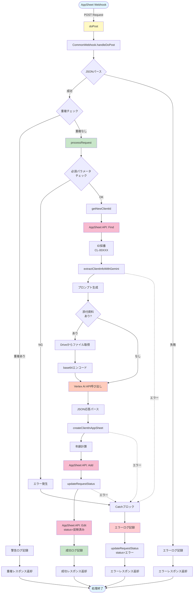
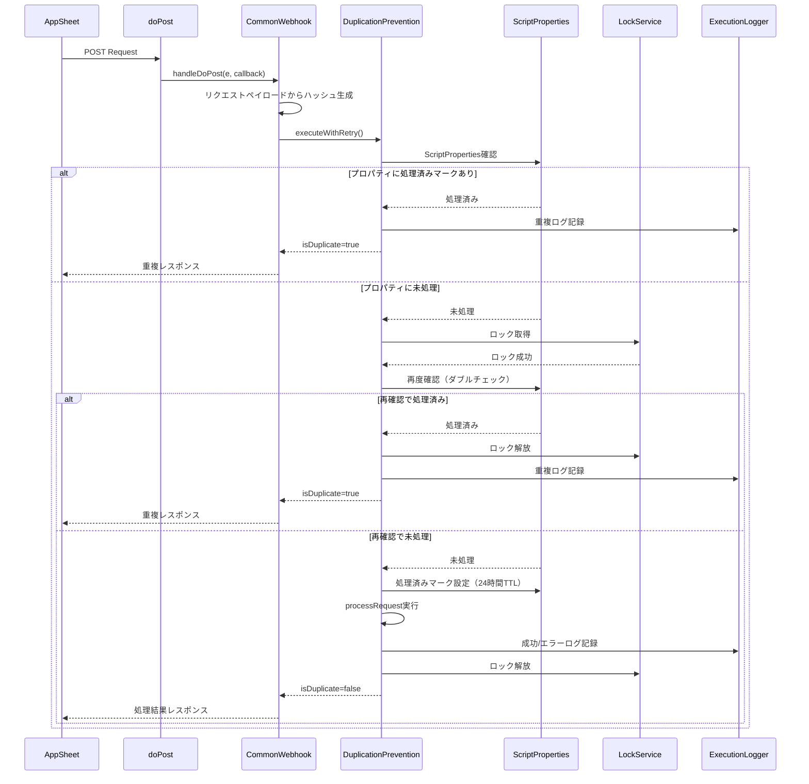
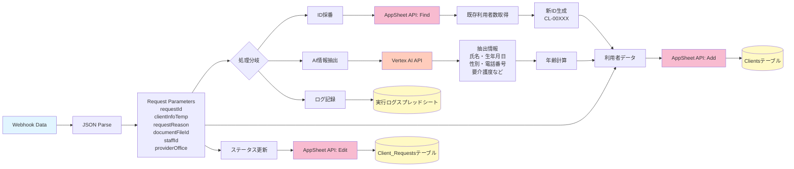
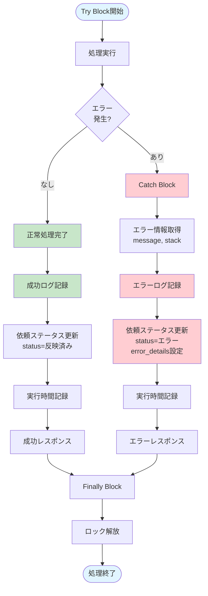
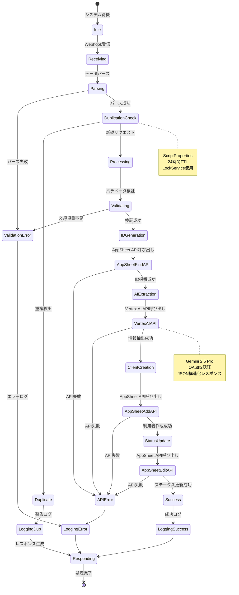
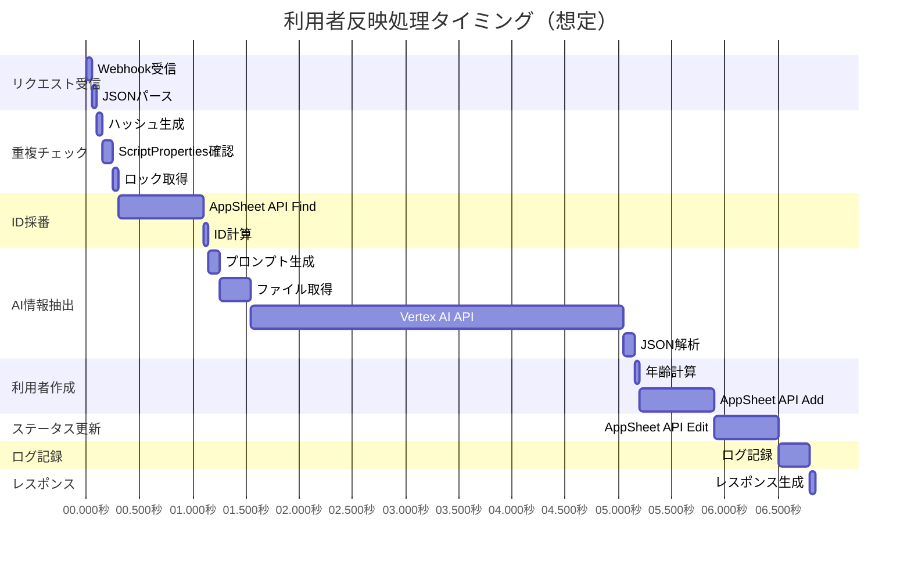
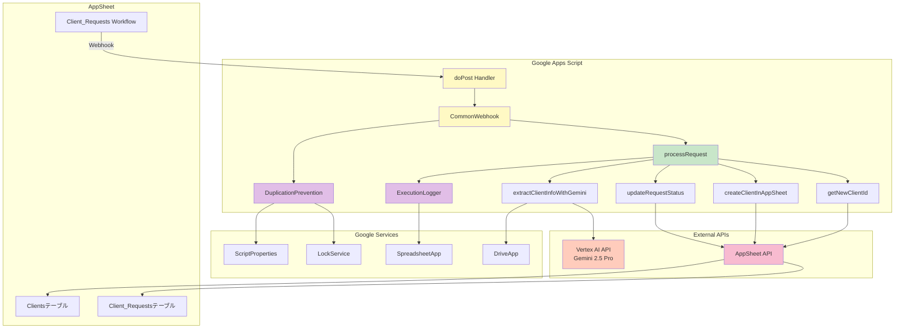

# Appsheet_利用者_反映 - フロー図

## システムフロー図

### メイン処理フロー



## 重複防止フロー



## Vertex AI情報抽出フロー

```mermaid
flowchart TD
    Start([extractClientInfoWithGemini]) --> BuildPrompt[プロンプト生成<br/>医療事務スタッフロール]
    BuildPrompt --> AddText[テキストパート追加<br/>clientInfoTemp + requestReason]

    AddText --> CheckFile{添付資料<br/>fileId指定?}

    CheckFile -->|あり| GetFile[DriveApp.getFileById]
    GetFile --> GetBlob[ファイルBlob取得]
    GetBlob --> Base64[base64エンコード]
    Base64 --> AddInline[inlineDataパート追加<br/>mimeType + data]
    AddInline --> BuildReq

    CheckFile -->|なし| BuildReq[リクエストボディ構築]

    BuildReq --> SetConfig[generationConfig設定<br/>responseMimeType: application/json<br/>temperature: 0.1<br/>maxOutputTokens: 8192]

    SetConfig --> BuildURL[エンドポイントURL構築<br/>us-central1-aiplatform.googleapis.com]

    BuildURL --> GetToken[OAuth2トークン取得<br/>ScriptApp.getOAuthToken]

    GetToken --> CallAPI[UrlFetchApp.fetch<br/>POST リクエスト]

    CallAPI --> CheckStatus{レスポンス<br/>コード?}

    CheckStatus -->|200| ParseResp[JSON応答パース]
    CheckStatus -->|!= 200| LogAPIError[APIエラーログ記録]
    LogAPIError --> ThrowError1[エラー発生]

    ParseResp --> CheckCandidates{candidates<br/>存在?}

    CheckCandidates -->|なし| ThrowError2[エラー発生:<br/>候補なし]

    CheckCandidates -->|あり| CheckFinish{finishReason?}

    CheckFinish -->|MAX_TOKENS| ThrowError3[エラー発生:<br/>トークン制限]

    CheckFinish -->|STOP/その他| CheckContent{content.parts<br/>存在?}

    CheckContent -->|なし| ThrowError4[エラー発生:<br/>コンテンツなし]

    CheckContent -->|あり| ExtractText[parts[0].text取得]

    ExtractText --> ParseJSON[JSONパース]

    ParseJSON --> Return[利用者情報オブジェクト返却]

    ThrowError1 --> End([エラー終了])
    ThrowError2 --> End
    ThrowError3 --> End
    ThrowError4 --> End
    ParseJSON -.JSON不正.-> End
    Return --> Success([正常終了])

    style Start fill:#e1f5ff
    style CallAPI fill:#ffccbc
    style ParseJSON fill:#c8e6c9
    style Return fill:#c8e6c9
    style Success fill:#c8e6c9
    style ThrowError1 fill:#ffcdd2
    style ThrowError2 fill:#ffcdd2
    style ThrowError3 fill:#ffcdd2
    style ThrowError4 fill:#ffcdd2
    style End fill:#ffcdd2
```

## データフロー図



## エラーハンドリングフロー



## AppSheet API連携フロー

```mermaid
sequenceDiagram
    participant Script as processRequest
    participant IDGen as getNewClientId
    participant ASFind as AppSheet API (Find)
    participant Create as createClientInAppSheet
    participant ASAdd as AppSheet API (Add)
    participant Update as updateRequestStatus
    participant ASEdit as AppSheet API (Edit)

    Script->>IDGen: 新しいClientIDを採番
    IDGen->>ASFind: Find Action<br/>Clientsテーブル
    ASFind-->>IDGen: 既存利用者一覧（JSON配列）
    IDGen->>IDGen: 利用者数カウント + 1
    IDGen->>IDGen: CL-00XXX形式でID生成
    IDGen-->>Script: newClientId

    Script->>Script: extractClientInfoWithGemini
    Script-->>Script: extractedInfo

    Script->>Create: createClientInAppSheet
    Create->>Create: calculateAge(birth_date)
    Create->>Create: rowData構築
    Create->>ASAdd: Add Action<br/>Clientsテーブル<br/>Rows: [rowData]
    ASAdd-->>Create: 成功レスポンス
    Create-->>Script: 完了

    Script->>Update: updateRequestStatus<br/>status=反映済み
    Update->>Update: rowData構築
    Update->>ASEdit: Edit Action<br/>Client_Requestsテーブル<br/>Rows: [rowData]
    ASEdit-->>Update: 成功レスポンス
    Update-->>Script: 完了

    Script-->>Script: 処理完了
```

## 状態遷移図



## タイミング図



## コンポーネント図



## 使用例

### 正常フロー

1. AppSheetで新しい依頼を作成（依頼ID: CR-00123）
2. Webhookが自動トリガー
3. doPost関数でリクエスト受信
4. 重複チェック（初回なのでパス）
5. 既存利用者数を取得してID採番（CL-00456）
6. Vertex AIで利用者情報を抽出
7. Clientsテーブルに新規レコード追加
8. 依頼のステータスを「反映済み」に更新
9. 成功ログ記録
10. 成功レスポンス返却

### 重複検出フロー

1. AppSheetから同じ依頼ID（CR-00123）で2回Webhook送信
2. 1回目: 正常処理（ScriptPropertiesに処理済みマーク）
3. 2回目: ScriptPropertiesで重複検出
4. 警告ログ記録
5. 重複レスポンス返却（処理スキップ）

### エラーフロー（Vertex AIエラー）

1. AppSheetからWebhook送信
2. ID採番成功
3. Vertex AI呼び出し → API認証エラー
4. Catchブロックでエラー捕捉
5. エラーログ記録（スタックトレース含む）
6. 依頼ステータスを「エラー」に更新（error_details設定）
7. エラーレスポンス返却

### 添付資料ありフロー

1. AppSheetから依頼を作成（documentFileId指定）
2. Webhook受信
3. ID採番
4. DriveからファイルID指定でファイル取得
5. Blobをbase64エンコード
6. Vertex AIにテキスト + inlineDataで送信
7. AIが添付資料（PDF/画像）も含めて情報抽出
8. 以降は通常フロー
