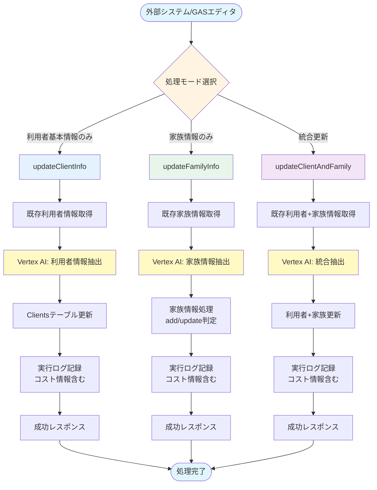
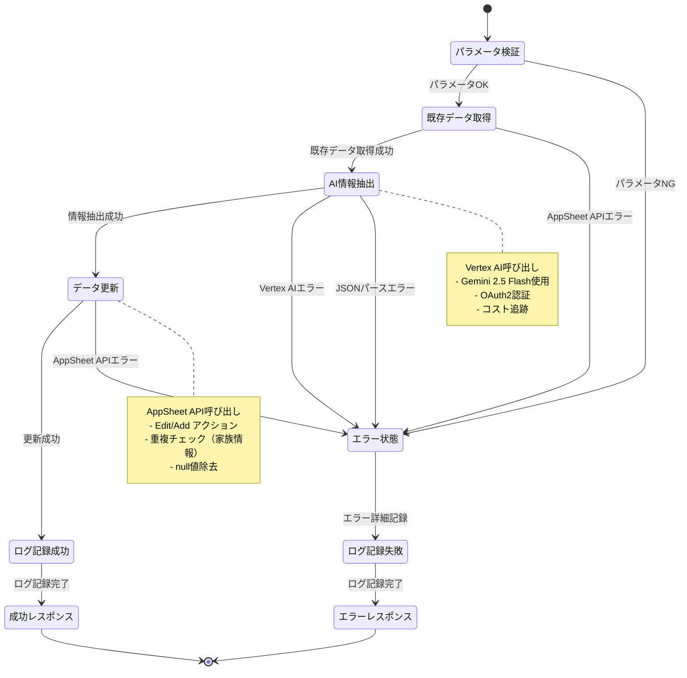
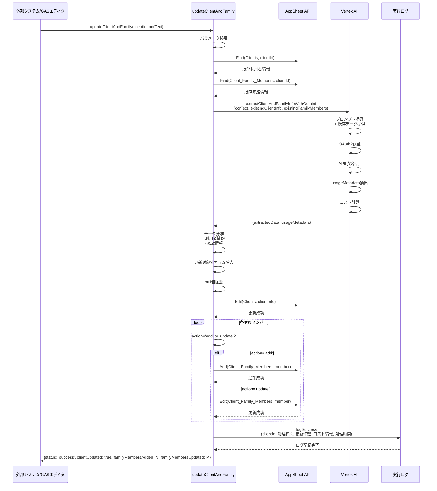
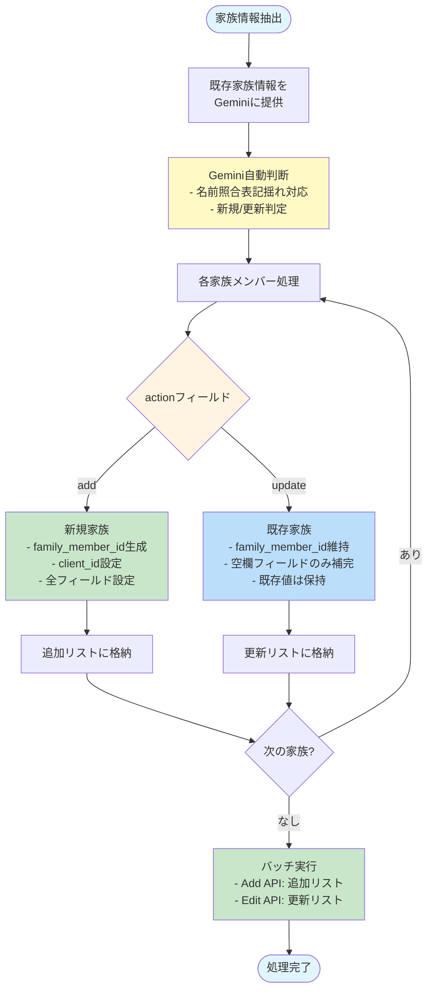
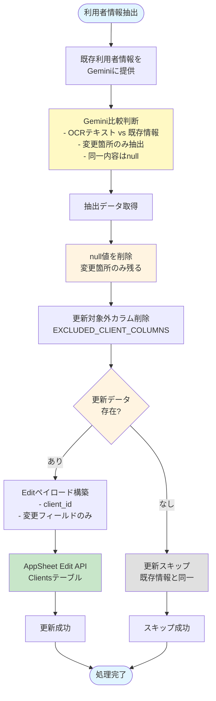
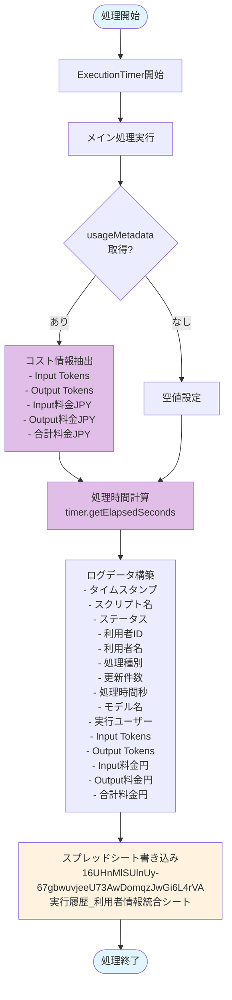

# Appsheet_利用者_情報統合 - 処理フロー図

## 概要フロー



## 詳細フロー1: 利用者基本情報のみ更新

```mermaid
graph TB
    Start([updateClientInfo呼び出し]) --> ValidateParams{パラメータ検証}
    ValidateParams -->|NG| ErrorParam[エラー: パラメータ不足]
    ValidateParams -->|OK| GetExisting[AppSheet Find API<br/>既存利用者情報取得]

    GetExisting --> ExtractInfo[Vertex AI API呼び出し<br/>extractClientInfoWithGemini]

    ExtractInfo --> ParseResponse{AI応答<br/>パース成功?}
    ParseResponse -->|失敗| ErrorParse[エラー: JSON抽出失敗]
    ParseResponse -->|成功| ExtractedData[抽出データ取得]

    ExtractedData --> RemoveFamily[family_membersフィールド削除]
    RemoveFamily --> ExcludeColumns[更新対象外カラム削除<br/>EXCLUDED_CLIENT_COLUMNS]

    ExcludeColumns --> CheckUpdate{更新データ<br/>存在?}
    CheckUpdate -->|なし| NoUpdate[更新スキップ]
    CheckUpdate -->|あり| UpdateAPI[AppSheet Edit API<br/>Clientsテーブル更新]

    UpdateAPI --> LogSuccess[実行ログ記録<br/>- ステータス: 成功<br/>- コスト情報<br/>- 処理時間]
    NoUpdate --> LogSuccess

    LogSuccess --> SuccessResponse[レスポンス:<br/>{status: 'success',<br/>clientUpdated: true/false,<br/>familyMembersAdded: 0,<br/>familyMembersUpdated: 0}]

    ErrorParam --> LogError[実行ログ記録<br/>ステータス: 失敗]
    ErrorParse --> LogError

    LogError --> ErrorResponse[レスポンス:<br/>{status: 'error',<br/>error: エラーメッセージ}]

    SuccessResponse --> End([処理完了])
    ErrorResponse --> End

    style Start fill:#e1f5ff
    style ValidateParams fill:#fff4e1
    style ExtractInfo fill:#fff9c4
    style UpdateAPI fill:#c8e6c9
    style End fill:#e1f5ff
    style ErrorParam fill:#ffcdd2
    style ErrorParse fill:#ffcdd2
```

## 詳細フロー2: 家族情報のみ更新

```mermaid
graph TB
    Start([updateFamilyInfo呼び出し]) --> ValidateParams{パラメータ検証}
    ValidateParams -->|NG| ErrorParam[エラー: パラメータ不足]
    ValidateParams -->|OK| GetExisting[AppSheet Find API<br/>既存家族情報取得]

    GetExisting --> ExtractInfo[Vertex AI API呼び出し<br/>extractFamilyInfoWithGemini]

    ExtractInfo --> ParseResponse{AI応答<br/>パース成功?}
    ParseResponse -->|失敗| ErrorParse[エラー: JSON抽出失敗]
    ParseResponse -->|成功| CheckMembers{家族情報<br/>存在?}

    CheckMembers -->|なし| LogNoData[ログ記録: 家族情報なし]
    CheckMembers -->|あり| ProcessLoop[各家族メンバー処理ループ]

    ProcessLoop --> CheckAction{actionフィールド<br/>の値は?}

    CheckAction -->|add| AddMember[新規家族追加<br/>- family_member_id生成<br/>- client_id設定<br/>- null値削除]
    CheckAction -->|update| UpdateMember[既存家族更新<br/>- family_member_id確認<br/>- null値削除<br/>- 空欄フィールドのみ補完]

    AddMember --> CollectAdd[追加リストに格納]
    UpdateMember --> CollectUpdate[更新リストに格納]

    CollectAdd --> MoreMembers{次の家族<br/>メンバー?}
    CollectUpdate --> MoreMembers

    MoreMembers -->|あり| ProcessLoop
    MoreMembers -->|なし| ExecuteAdd{追加リスト<br/>存在?}

    ExecuteAdd -->|あり| AddAPI[AppSheet Add API<br/>Client_Family_Membersテーブル]
    ExecuteAdd -->|なし| ExecuteUpdate

    AddAPI --> ExecuteUpdate{更新リスト<br/>存在?}
    ExecuteUpdate -->|あり| EditAPI[AppSheet Edit API<br/>Client_Family_Membersテーブル]
    ExecuteUpdate -->|なし| LogSuccess

    EditAPI --> LogSuccess[実行ログ記録<br/>- 追加件数<br/>- 更新件数<br/>- コスト情報]
    LogNoData --> LogSuccess

    LogSuccess --> SuccessResponse[レスポンス:<br/>{status: 'success',<br/>clientUpdated: false,<br/>familyMembersAdded: N,<br/>familyMembersUpdated: M}]

    ErrorParam --> LogError[実行ログ記録<br/>ステータス: 失敗]
    ErrorParse --> LogError

    LogError --> ErrorResponse[レスポンス:<br/>{status: 'error',<br/>error: エラーメッセージ}]

    SuccessResponse --> End([処理完了])
    ErrorResponse --> End

    style Start fill:#e1f5ff
    style ValidateParams fill:#fff4e1
    style ExtractInfo fill:#fff9c4
    style CheckAction fill:#fff4e1
    style AddAPI fill:#c8e6c9
    style EditAPI fill:#c8e6c9
    style End fill:#e1f5ff
    style ErrorParam fill:#ffcdd2
    style ErrorParse fill:#ffcdd2
```

## 詳細フロー3: 利用者＋家族統合更新

```mermaid
graph TB
    Start([updateClientAndFamily呼び出し]) --> ValidateParams{パラメータ検証}
    ValidateParams -->|NG| ErrorParam[エラー: パラメータ不足]
    ValidateParams -->|OK| GetClient[AppSheet Find API<br/>既存利用者情報取得]

    GetClient --> GetFamily[AppSheet Find API<br/>既存家族情報取得]

    GetFamily --> ExtractBoth[Vertex AI API呼び出し<br/>extractClientAndFamilyInfoWithGemini<br/>既存情報を統合プロンプトで提供]

    ExtractBoth --> ParseResponse{AI応答<br/>パース成功?}
    ParseResponse -->|失敗| ErrorParse[エラー: JSON抽出失敗]
    ParseResponse -->|成功| ExtractedData[統合データ取得]

    ExtractedData --> SeparateData[データ分離:<br/>- 利用者情報<br/>- 家族情報]

    SeparateData --> UpdateClient[Clientsテーブル更新<br/>updateClientData]
    UpdateClient --> CheckFamily{家族情報<br/>存在?}

    CheckFamily -->|あり| ProcessFamily[家族情報処理<br/>processFamilyMembersWithAction<br/>add/update分岐]
    CheckFamily -->|なし| SetFamilyZero[familyAdded=0<br/>familyUpdated=0]

    ProcessFamily --> LogSuccess[実行ログ記録<br/>- 利用者更新<br/>- 家族追加/更新件数<br/>- コスト情報<br/>- 処理時間]
    SetFamilyZero --> LogSuccess

    LogSuccess --> SuccessResponse[レスポンス:<br/>{status: 'success',<br/>clientUpdated: true/false,<br/>familyMembersAdded: N,<br/>familyMembersUpdated: M}]

    ErrorParam --> LogError[実行ログ記録<br/>ステータス: 失敗]
    ErrorParse --> LogError

    LogError --> ErrorResponse[レスポンス:<br/>{status: 'error',<br/>error: エラーメッセージ}]

    SuccessResponse --> End([処理完了])
    ErrorResponse --> End

    style Start fill:#e1f5ff
    style ValidateParams fill:#fff4e1
    style ExtractBoth fill:#fff9c4
    style UpdateClient fill:#c8e6c9
    style ProcessFamily fill:#c8e6c9
    style End fill:#e1f5ff
    style ErrorParam fill:#ffcdd2
    style ErrorParse fill:#ffcdd2
```

## Vertex AI統合フロー

```mermaid
graph TB
    Start([Vertex AI呼び出し]) --> BuildPrompt[プロンプト構築<br/>- OCRテキスト<br/>- 既存情報<br/>- 抽出ルール]

    BuildPrompt --> BuildRequest[リクエストボディ構築<br/>- contents<br/>- generationConfig<br/>  - responseMimeType: application/json<br/>  - temperature: 0.1<br/>  - maxOutputTokens: 8192]

    BuildRequest --> OAuth2[OAuth2認証<br/>ScriptApp.getOAuthToken]

    OAuth2 --> CallAPI[UrlFetchApp.fetch<br/>Vertex AI Endpoint<br/>{GCP_PROJECT_ID}/{MODEL}]

    CallAPI --> CheckStatus{HTTPステータス<br/>200?}
    CheckStatus -->|NG| ErrorAPI[エラー: API呼び出し失敗]
    CheckStatus -->|OK| ParseJSON[レスポンスJSON解析]

    ParseJSON --> ExtractUsage[usageMetadata抽出<br/>- promptTokenCount<br/>- candidatesTokenCount]

    ExtractUsage --> CalcCost[コスト計算<br/>- Input料金 = tokens × 単価 × 150円<br/>- Output料金 = tokens × 単価 × 150円<br/>- 合計料金]

    CalcCost --> CheckCandidates{candidates<br/>存在?}
    CheckCandidates -->|なし| ErrorNoCand[エラー: 有効な候補なし]
    CheckCandidates -->|あり| ExtractText[テキスト抽出<br/>candidates[0].content.parts[0].text]

    ExtractText --> ExtractJSON[JSON抽出<br/>- { から } までを切り出し<br/>- マーカー除去]

    ExtractJSON --> ParseData{JSONパース<br/>成功?}
    ParseData -->|失敗| ErrorJSON[エラー: JSON抽出失敗]
    ParseData -->|成功| ReturnResult[戻り値:<br/>{extractedData, usageMetadata}]

    ErrorAPI --> AttachUsage[usageMetadataをエラーに添付]
    ErrorNoCand --> AttachUsage
    ErrorJSON --> AttachUsage

    AttachUsage --> ThrowError[エラーをスロー]

    ReturnResult --> End([呼び出し元へ返却])
    ThrowError --> End

    style Start fill:#e1f5ff
    style BuildRequest fill:#fff9c4
    style CallAPI fill:#fff9c4
    style CalcCost fill:#e1bee7
    style ReturnResult fill:#c8e6c9
    style End fill:#e1f5ff
    style ErrorAPI fill:#ffcdd2
    style ErrorNoCand fill:#ffcdd2
    style ErrorJSON fill:#ffcdd2
```

## データフロー図

```mermaid
graph LR
    OCR[OCRテキスト] --> Func1[updateClientInfo]
    OCR --> Func2[updateFamilyInfo]
    OCR --> Func3[updateClientAndFamily]

    Func1 --> GetC[既存利用者情報]
    Func2 --> GetF[既存家族情報]
    Func3 --> GetCF[既存利用者+家族情報]

    GetC --> AI1[Vertex AI<br/>利用者情報抽出]
    GetF --> AI2[Vertex AI<br/>家族情報抽出]
    GetCF --> AI3[Vertex AI<br/>統合情報抽出]

    AI1 --> Extract1[抽出データ:<br/>- last_name<br/>- first_name<br/>- birth_date<br/>- phone1<br/>...]
    AI2 --> Extract2[抽出データ:<br/>family_members: [<br/>  {action, relationship, ...}<br/>]]
    AI3 --> Extract3[抽出データ:<br/>- 利用者情報<br/>- family_members]

    Extract1 --> Update1[AppSheet Edit<br/>Clientsテーブル]
    Extract2 --> Update2A[AppSheet Add<br/>Client_Family_Members<br/>action='add']
    Extract2 --> Update2B[AppSheet Edit<br/>Client_Family_Members<br/>action='update']
    Extract3 --> Update3A[AppSheet Edit<br/>Clientsテーブル]
    Extract3 --> Update3B[AppSheet Add/Edit<br/>Client_Family_Members]

    Update1 --> Log[実行ログ<br/>スプレッドシート<br/>16UHnMlSUlnUy...]
    Update2A --> Log
    Update2B --> Log
    Update3A --> Log
    Update3B --> Log

    AI1 --> Cost[コスト情報:<br/>- Input Tokens<br/>- Output Tokens<br/>- 料金JPY]
    AI2 --> Cost
    AI3 --> Cost

    Cost --> Log

    style OCR fill:#e1f5ff
    style AI1 fill:#fff9c4
    style AI2 fill:#fff9c4
    style AI3 fill:#fff9c4
    style Cost fill:#e1bee7
    style Log fill:#fff3e0
```

## エラーハンドリングフロー

```mermaid
graph TB
    Start([処理開始]) --> Try{Try処理}

    Try --> Process[メイン処理実行]

    Process --> Success{処理成功?}
    Success -->|成功| LogSuccess[実行ログ記録<br/>- ステータス: 成功<br/>- 更新件数<br/>- コスト情報<br/>- 処理時間]
    Success -->|失敗| Catch[Catchブロック]

    Catch --> CheckUsage{usageMetadata<br/>存在?}
    CheckUsage -->|あり| ExtractUsage[エラーからusageMetadata抽出<br/>error.usageMetadata]
    CheckUsage -->|なし| SetNull[usageMetadata = null]

    ExtractUsage --> LogError[実行ログ記録<br/>- ステータス: 失敗<br/>- エラーメッセージ<br/>- コスト情報可能な限り]
    SetNull --> LogError

    LogSuccess --> ReturnSuccess[成功レスポンス返却<br/>{status: 'success', ...}]
    LogError --> ReturnError[エラーレスポンス返却<br/>{status: 'error', ...}]

    ReturnSuccess --> End([処理終了])
    ReturnError --> End

    style Start fill:#e1f5ff
    style Try fill:#fff4e1
    style Success fill:#fff4e1
    style Catch fill:#ffcdd2
    style LogSuccess fill:#c8e6c9
    style LogError fill:#ffcdd2
    style End fill:#e1f5ff
```

## 状態遷移図



## シーケンス図: 統合更新処理



## コスト追跡フロー

```mermaid
graph TB
    Start([Vertex AI API呼び出し]) --> Response[APIレスポンス受信]

    Response --> ExtractMeta[usageMetadata抽出<br/>jsonResponse.usageMetadata]

    ExtractMeta --> CheckMeta{usageMetadata<br/>存在?}
    CheckMeta -->|なし| ReturnNull[null返却]
    CheckMeta -->|あり| ExtractTokens[トークン数抽出<br/>- promptTokenCount<br/>- candidatesTokenCount]

    ExtractTokens --> GetPricing[価格表取得<br/>pricingTable[modelName]]

    GetPricing --> CalcInputUSD[Input料金USD計算<br/>tokens / 1000000 × inputPer1M]
    CalcInputUSD --> CalcOutputUSD[Output料金USD計算<br/>tokens / 1000000 × outputPer1M]

    CalcOutputUSD --> CalcTotalUSD[合計料金USD<br/>inputUSD + outputUSD]

    CalcTotalUSD --> ConvertJPY[円換算<br/>USD × 150円]

    ConvertJPY --> BuildMetadata[usageMetadataオブジェクト構築<br/>{model, inputTokens, outputTokens,<br/>inputCostJPY, outputCostJPY, totalCostJPY}]

    BuildMetadata --> ReturnMetadata[usageMetadata返却]

    ReturnNull --> End([終了])
    ReturnMetadata --> End

    style Start fill:#e1f5ff
    style ExtractTokens fill:#fff9c4
    style GetPricing fill:#e1bee7
    style ConvertJPY fill:#e1bee7
    style BuildMetadata fill:#c8e6c9
    style End fill:#e1f5ff
```

## 家族情報のaction判定フロー



## 利用者情報の更新判定フロー



## 処理時間とコストの記録フロー


