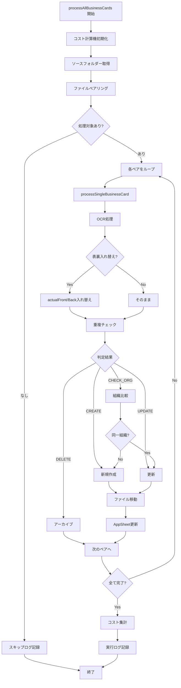
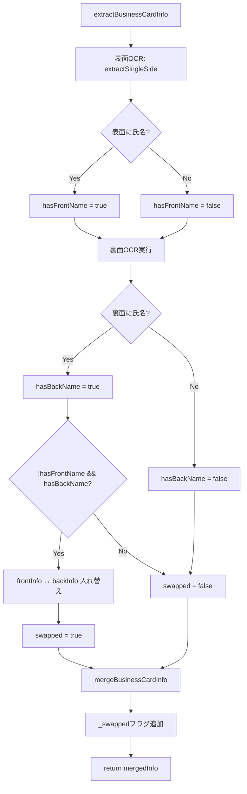
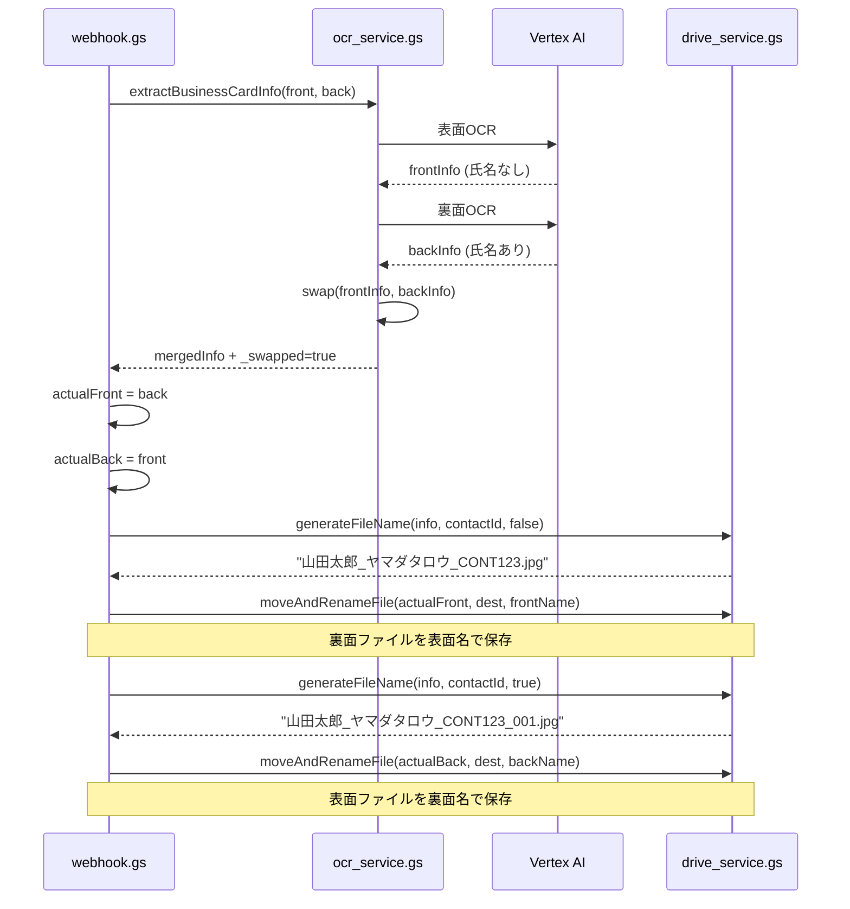

# Appsheet_名刺取り込みシステム - 完全ガイド

**バージョン**: 2.0.0  
**最終更新**: 2025-10-23  
**開発**: Fractal Group

---

## 📋 目次

1. [システム概要](#システム概要)
2. [主な機能](#主な機能)
3. [アーキテクチャ](#アーキテクチャ)
4. [処理フロー](#処理フロー)
5. [コンポーネント詳細](#コンポーネント詳細)
6. [設定値一覧](#設定値一覧)
7. [コスト管理](#コスト管理)
8. [エラーハンドリング](#エラーハンドリング)
9. [テスト](#テスト)
10. [保守・監視](#保守監視)

---

## システム概要

Google Driveにアップロードされた名刺画像を自動的にOCR処理し、AppSheetの連絡先データベースに登録・更新するシステム。

### 技術スタック

- **OCR**: Vertex AI - Gemini 2.5 Flash Lite
- **認証**: OAuth2 (cloud-platform scope)
- **実行環境**: Google Apps Script V8
- **API**: AppSheet API, Google Drive API v3
- **ログ管理**: Google Spreadsheet

---

## 主な機能

### ✅ 実装済み機能

1. **名刺OCR処理**
   - Vertex AI Gemini 2.5 Flash Liteで高精度文字認識
   - 表面・裏面の両面処理
   - 日本語、英語対応

2. **表裏自動判定**
   - 氏名の有無で表裏を自動入れ替え
   - ファイル名・保存パスも自動調整

3. **重複検出**
   - 氏名+カナで完全一致チェック
   - 氏名のみ一致で組織比較

4. **組織比較**
   - AI判定で同一組織かを識別
   - 組織名+住所で総合判断

5. **コスト管理**
   - APIトークン使用量を自動記録
   - USD換算でコスト計算
   - 実行ログに記録

6. **アーカイブ機能**
   - 重複ファイルを削除せず保管
   - 共有ドライブ対応

7. **詳細ログ**
   - 処理の全ステップを記録
   - エラー時のスタックトレース
   - 処理時間・コスト記録

---

## アーキテクチャ

### システム構成図

```
┌─────────────────────┐
│ Google Drive        │
│ (名刺フォルダー)    │
└──────────┬──────────┘
           │ アップロード
           ↓
┌─────────────────────┐
│ GAS: webhook.gs     │
│ ・ファイル検出      │
│ ・表裏ペアリング    │
└──────────┬──────────┘
           │
           ↓
┌─────────────────────┐
│ GAS: ocr_service.gs │
│ ・Vertex AI呼び出し │
│ ・トークン記録      │
└──────────┬──────────┘
           │
           ↓
┌─────────────────────┐
│ Vertex AI API       │
│ (Gemini 2.5 Flash)  │
└──────────┬──────────┘
           │ OCR結果
           ↓
┌─────────────────────────┐
│ GAS: appsheet_service.gs│
│ ・重複チェック          │
│ ・組織比較              │
│ ・AppSheet更新          │
└──────────┬──────────────┘
           │
           ↓
┌─────────────────────┐
│ AppSheet Database   │
│ (関係機関シート)    │
└─────────────────────┘
           │
           ↓
┌─────────────────────┐
│ AutomationLogger    │
│ ・実行ログ記録      │
│ ・コスト計算        │
└─────────────────────┘
```

### ファイル構成

```
scripts/
├── config.gs                 # 設定値一元管理
├── webhook.gs                # メイン処理
├── ocr_service.gs            # OCR処理
├── appsheet_service.gs       # AppSheet連携
├── drive_service.gs          # Drive操作
├── AutomationLogger.gs       # ログ・コスト管理
├── CommonWebhook.gs          # 共通Webhook
├── AppSheetConnector.gs      # AppSheet接続
└── test_functions.gs         # テスト関数
```

---

## 処理フロー

### メインフロー



### OCR処理詳細



### ファイル役割入れ替え



---

## コンポーネント詳細

### 1. config.gs

全設定値を一元管理。

**主要設定**:
- `VERTEX_AI_CONFIG`: AI APIの設定
- `DRIVE_CONFIG`: Driveフォルダー
- `APPSHEET_CONFIG`: AppSheet接続情報
- `SPREADSHEET_CONFIG`: スプレッドシート情報
- `PROCESSING_CONFIG`: 処理制御
- `LOG_CONFIG`: ログ設定

### 2. webhook.gs

メイン処理を実行。

**主要関数**:
- `processAllBusinessCards()`: 全名刺処理
- `processSingleBusinessCard()`: 単一名刺処理
- `pairBusinessCards()`: 表裏ペアリング

### 3. ocr_service.gs

OCR処理とVertex AI連携。

**主要関数**:
- `extractBusinessCardInfo()`: 名刺情報抽出
- `extractSingleSide()`: 単面OCR
- `mergeBusinessCardInfo()`: 表裏マージ
- `callVertexAIForOCR()`: API呼び出し
- `parseVertexAIResponse()`: レスポンス解析

**コスト記録**:
```javascript
// usageMetadataからトークン数取得
if (jsonResponse.usageMetadata) {
  const costCalc = getCostCalculator();
  const inputTokens = jsonResponse.usageMetadata.promptTokenCount;
  const outputTokens = jsonResponse.usageMetadata.candidatesTokenCount;
  costCalc.recordApiCall(model, inputTokens, outputTokens);
}
```

### 4. appsheet_service.gs

AppSheet連携とデータ操作。

**主要関数**:
- `determineContactAction()`: 重複チェック
- `compareOrganizations()`: AI組織比較
- `createContactInAppSheet()`: 新規作成
- `updateContactInAppSheet()`: 更新
- `getContactFromAppSheet()`: データ取得

### 5. drive_service.gs

Google Drive操作。

**主要関数**:
- `generateFileName()`: ファイル名生成
- `moveAndRenameFile()`: 移動+リネーム
- `archiveFile()`: アーカイブ移動
- `getSourceFolder()`: ソースフォルダー取得
- `getDestinationFolder()`: 移動先取得

### 6. AutomationLogger.gs

実行ログとコスト計算。

**主要クラス**:

#### ExecutionTimer
処理時間計測。
```javascript
const timer = new ExecutionTimer();
// ... 処理 ...
const seconds = timer.getElapsedSeconds();
```

#### VertexAICostCalculator
コスト計算。
```javascript
const calc = new VertexAICostCalculator();
calc.recordApiCall(model, inputTokens, outputTokens);
const summary = calc.getSummary(model);
// summary.totalCostUSD
```

**記録関数**:
```javascript
logExecution(
  'Appsheet_名刺取り込み',
  '成功',
  Utilities.getUuid(),
  {
    summary: '10件処理 (成功:8, エラー:2)',
    processingTime: '120.50秒',
    apiUsed: 'Vertex AI',
    modelName: 'gemini-2.5-flash-lite',
    tokens: '4回 | In:12450 Out:850',
    cost: '$0.000594'
  }
);
```

---

## 設定値一覧

### Vertex AI

| 項目 | 値 | 説明 |
|------|-----|------|
| projectId | macro-shadow-458705-v8 | GCPプロジェクトID |
| location | us-central1 | リージョン |
| ocrModel | gemini-2.5-flash-lite | OCRモデル |
| ocrTemperature | 0.1 | OCR生成温度 |
| ocrMaxOutputTokens | 2048 | OCR最大出力 |
| comparisonModel | gemini-2.5-flash-lite | 比較モデル |
| apiCallDelayMs | 1000 | API間隔 (ms) |
| maxRetries | 3 | 最大リトライ回数 |
| retryDelayMs | 5000 | リトライ待機 (ms) |

### Google Drive

| 項目 | ID | 用途 |
|------|-----|------|
| sourceFolderId | 1eOzeBli1FcusgKL6MEyhnZQUoDca-RLd | アップロード先 |
| destinationFolderId | 1c2fguK-hSuF_zgSFkAk9MTgPo1wcboiB | 処理済み移動先 |
| archiveFolderId | 17kpk5HXOS9iKCpxjxWqSXxiZiK4FHRz_ | 重複保管 |

### AppSheet

| 項目 | 値 |
|------|-----|
| appId | d3ecb46e-df6a-4bed-8ac1-05bc5f4ba49e |
| spreadsheetId | 1A7rQhQODlBxqkm1pHR1ckrOa5dQZy9sxEUmB5C9xE6U |
| tableName | 関係機関シート |

### スプレッドシート

| 名称 | ID |
|------|-----|
| 実行ログ | 16UHnMlSUlnUy-67gbwuvjeeU73AwDomqzJwGi6L4rVA |
| 関係機関_置換SS | 1ctSjcAlu9VSloPT9S9hsTyTd7yCw5XvNtF7-URyBeKo |

---

## コスト管理

### 価格設定 (2025年10月時点)

| モデル | 入力 (/1M tokens) | 出力 (/1M tokens) |
|--------|------------------|------------------|
| gemini-2.5-flash-lite | $0.0375 | $0.15 |

### コスト計算例

**処理内容**:
- 10枚の名刺 (表裏あり: 20回のAPI呼び出し)
- 平均入力: 600 tokens/回
- 平均出力: 150 tokens/回

**計算**:
```
入力: 20回 × 600 = 12,000 tokens
出力: 20回 × 150 = 3,000 tokens

入力コスト: 12,000 / 1,000,000 × $0.0375 = $0.00045
出力コスト: 3,000 / 1,000,000 × $0.15 = $0.00045
総コスト: $0.00090 (約0.1円)
```

### ログ記録例

実行ログスプレッドシートに記録される情報:

| 項目 | 値 |
|------|-----|
| タイムスタンプ | 2025/10/23 14:30:00 |
| スクリプト名 | Appsheet_名刺取り込み |
| ステータス | 成功 |
| 処理サマリー | 10件処理 (成功:10, エラー:0) |
| 処理時間 | 120.50秒 |
| API使用 | Vertex AI |
| モデル名 | gemini-2.5-flash-lite |
| トークン数 | 20回 \| In:12000 Out:3000 |
| コスト | $0.000900 |

---

## エラーハンドリング

### API エラー

#### HTTP 400 (Bad Request)
**原因**: リクエストボディ不正  
**対策**: `createVertexAIRequestBody()`を必ず使用

#### HTTP 403 (Forbidden)
**原因**: OAuth2スコープ不足  
**エラーメッセージ**:
```
OAuth2認証エラー: cloud-platformスコープが不足しています。

解決方法:
1. GASエディターで testOAuth2Authorization() を実行
2. 「権限を確認」→「許可」をクリック
3. cloud-platformスコープを含む全権限を承認
4. 再度処理を実行
```

#### HTTP 429 (Resource Exhausted)
**原因**: レート制限超過  
**対策**: 自動リトライ (最大3回、5秒間隔)

### Drive エラー

#### 削除権限なし
**対策**: `archiveFile()`でアーカイブフォルダーへ移動

### AppSheet エラー

#### 接続エラー
**対策**: リトライロジック実装済み

---

## テスト

### OAuth2承認

```javascript
// GASエディターで実行
testOAuth2Authorization()
```

詳細は [OAUTH2_GUIDE.md](./OAUTH2_GUIDE.md) 参照。

### 単体テスト

```javascript
// 単一名刺テスト
testSingleBusinessCard()

// OCRテスト
testExtractBusinessCardInfo()

// 重複チェックテスト
testDetermineContactAction()

// ファイル移動テスト
testMoveAndRenameFile()
```

### 統合テスト

```javascript
// 全名刺処理
processAllBusinessCards()
```

### ログ確認

実行ログスプレッドシートで確認:
```
https://docs.google.com/spreadsheets/d/16UHnMlSUlnUy-67gbwuvjeeU73AwDomqzJwGi6L4rVA
```

---

## 保守・監視

### 定期確認項目

- [ ] 実行ログのエラー率
- [ ] API使用量・コスト
- [ ] 処理時間の傾向
- [ ] 重複検出精度
- [ ] ファイル移動成功率

### アップデート手順

1. ローカルで修正
2. `clasp push --force`
3. GASエディターでテスト実行
4. 実行ログ確認
5. 本番実行

### パフォーマンス目安

| 項目 | 目安値 |
|------|--------|
| 1枚の処理時間 | 10-20秒 |
| API呼び出し | 2-3回/枚 |
| 推奨バッチサイズ | 15-20枚 |
| GAS実行時間制限 | 6分 |

---

## 関連ドキュメント

- [README.md](./README.md) - プロジェクト概要
- [OAUTH2_GUIDE.md](./OAUTH2_GUIDE.md) - OAuth2承認手順
- [REFACTORING_SUMMARY.md](./REFACTORING_SUMMARY.md) - v2.0変更履歴

---

## サポート

- **開発者**: Fractal Group
- **最終更新**: 2025-10-23
- **バージョン**: 2.0.0
