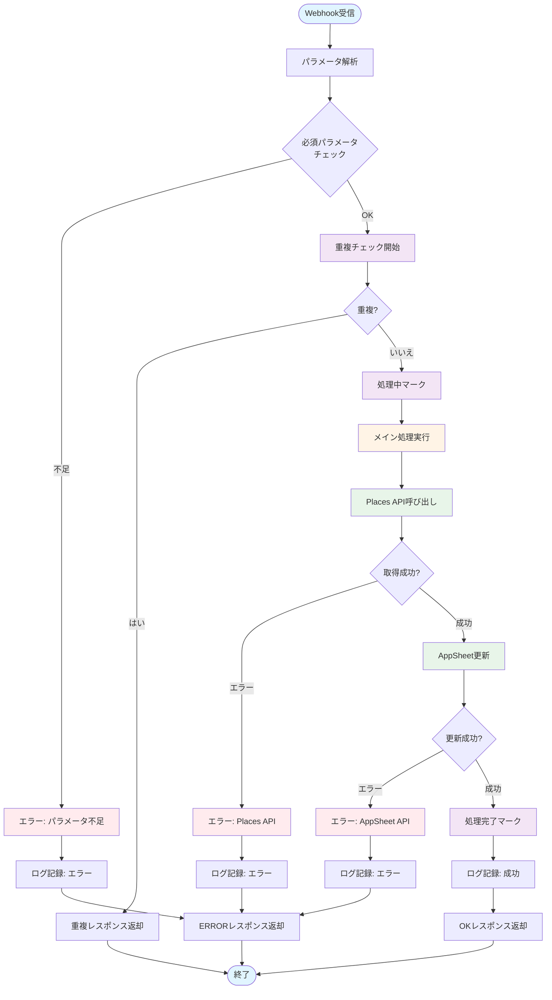
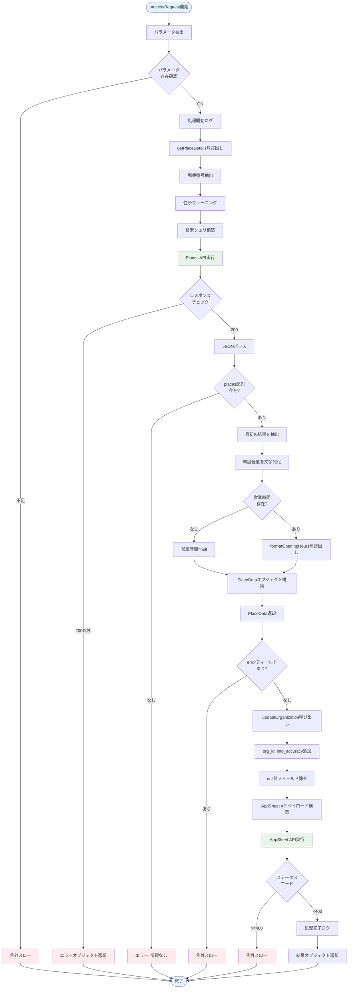
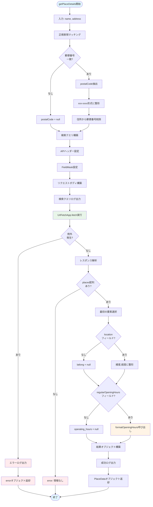
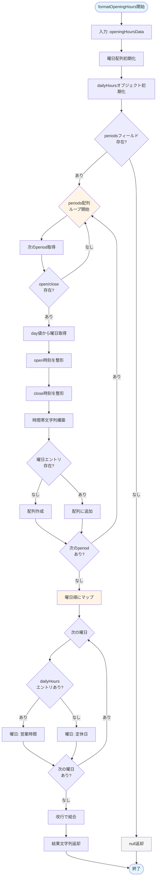
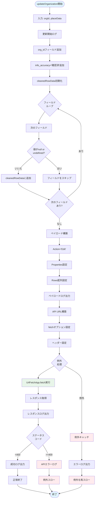
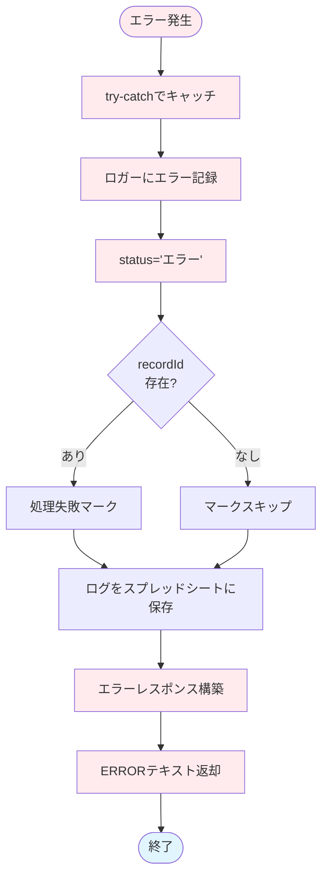
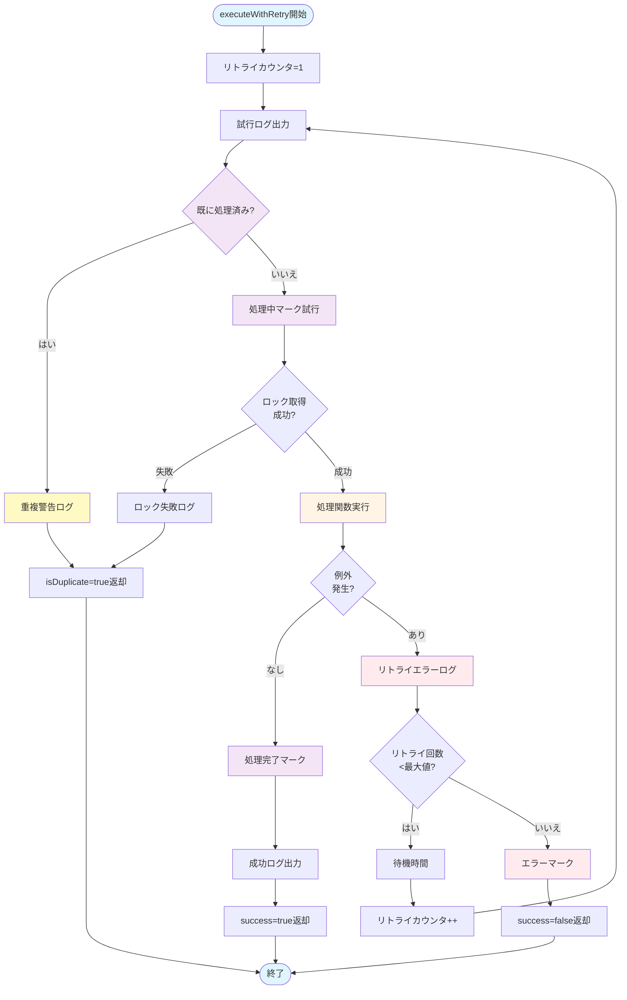
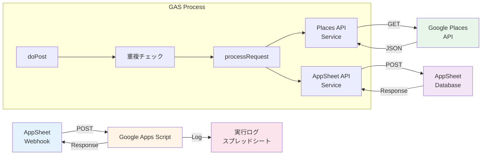
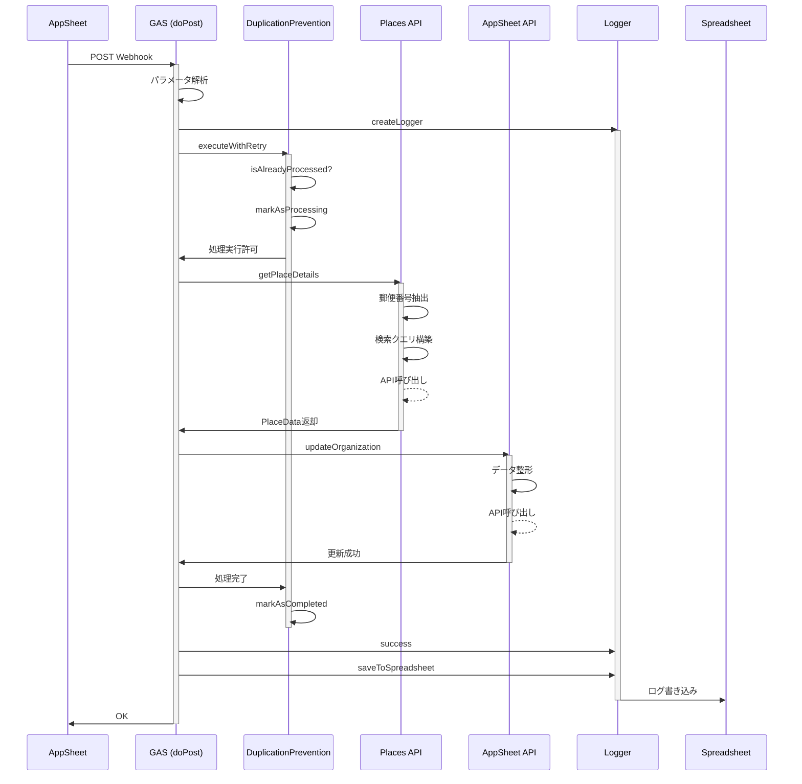

# 処理フロー図 - Appsheet_関係機関_情報取得

## 目次

- [全体フロー](#全体フロー)
- [詳細処理フロー](#詳細処理フロー)
- [Places API検索フロー](#places-api検索フロー)
- [営業時間整形フロー](#営業時間整形フロー)
- [AppSheet更新フロー](#appsheet更新フロー)
- [エラーハンドリングフロー](#エラーハンドリングフロー)
- [重複防止フロー](#重複防止フロー)
- [データフロー図](#データフロー図)
- [シーケンス図](#シーケンス図)

## 全体フロー

## 詳細処理フロー

## Places API検索フロー

## 営業時間整形フロー

## AppSheet更新フロー

## エラーハンドリングフロー

## 重複防止フロー

## データフロー図

## シーケンス図

---

## 凡例

### フローチャート色分け

- **水色** (`#e1f5ff`): 開始/終了
- **黄色** (`#fff4e6`): メイン処理
- **緑色** (`#e8f5e9`): API呼び出し
- **赤色** (`#ffebee`): エラー
- **紫色** (`#f3e5f5`): 重複防止処理
- **グレー** (`#f5f5f5`): null/スキップ

### 記号

- **長方形**: 処理ステップ
- **菱形**: 条件分岐
- **角丸長方形**: 開始/終了
- **矢印**: データフロー
