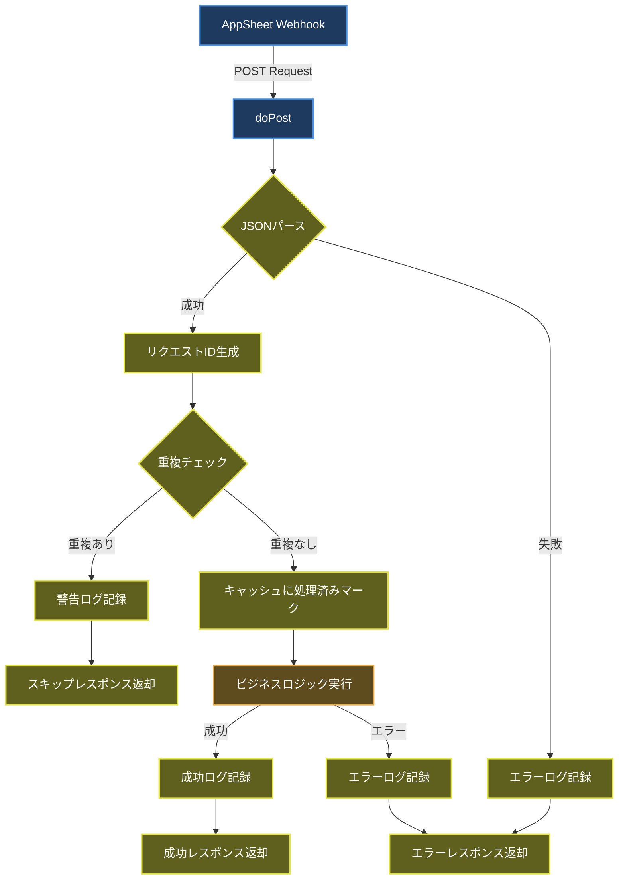
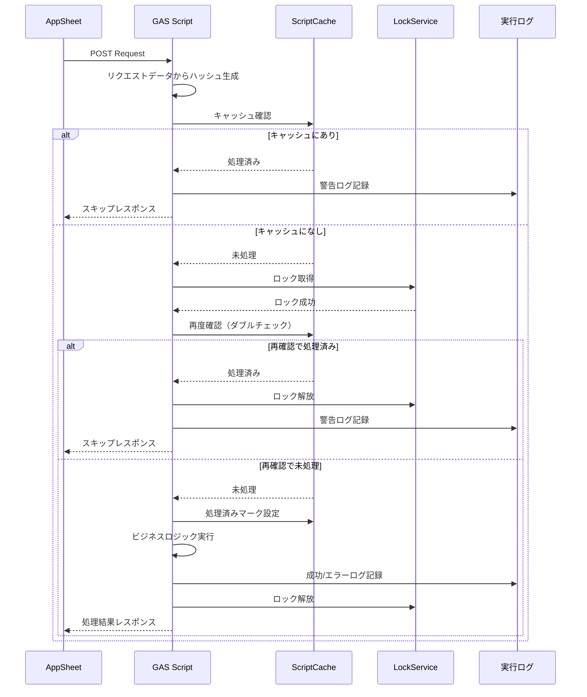
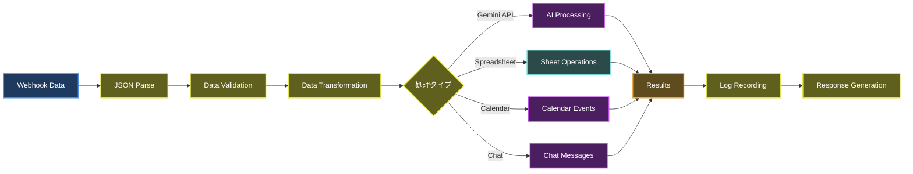
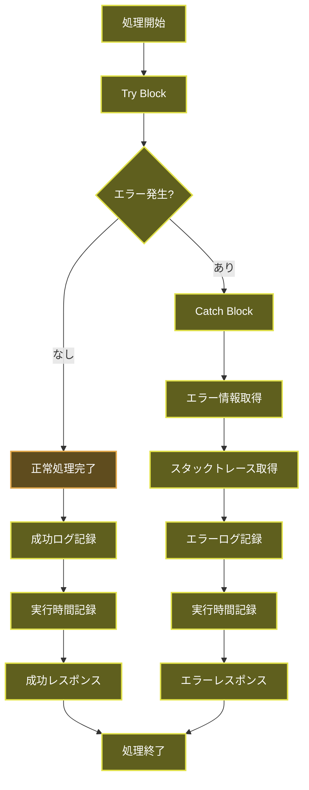
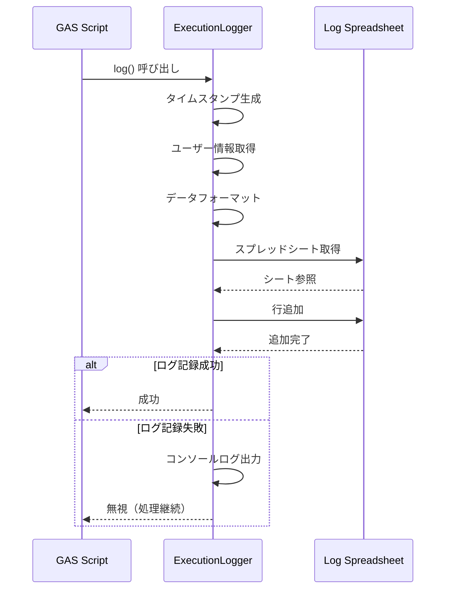
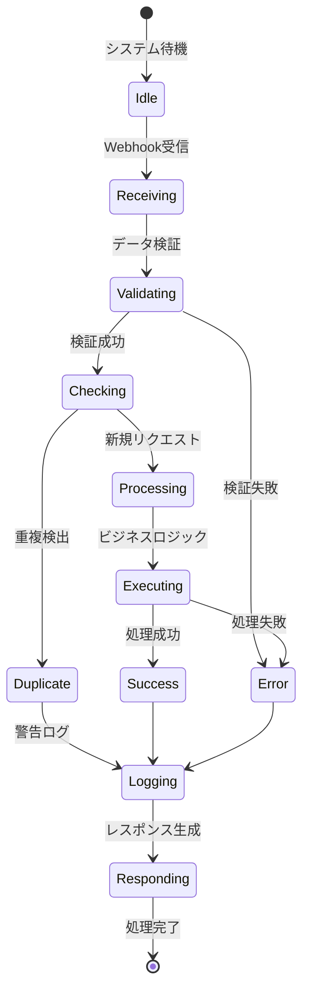
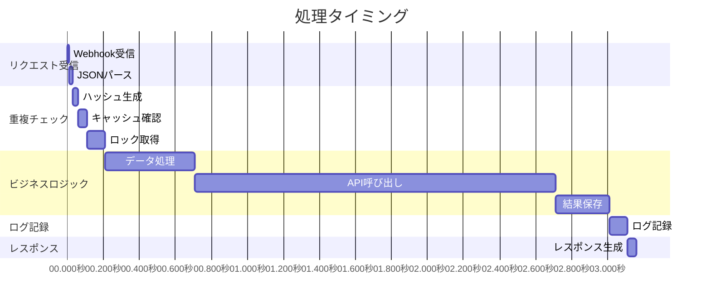
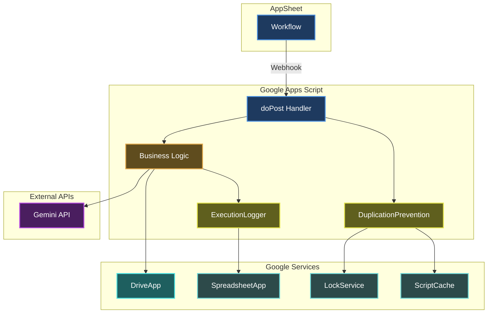

# AppSheetSecureConnector - フロー図

## システムフロー図

### メイン処理フロー

## 重複防止フロー

## データフロー図

## エラーハンドリングフロー

## ログ記録フロー

## 状態遷移図

## タイミング図

## コンポーネント図

## 使用例

### 正常フロー

1. AppSheetからWebhook送信
2. doPost関数でリクエスト受信
3. 重複チェック（初回なのでパス）
4. ビジネスロジック実行
5. 成功ログ記録
6. 成功レスポンス返却

### 重複検出フロー

1. AppSheetから同じリクエストを2回送信
2. 1回目: 正常処理
3. 2回目: キャッシュで重複検出
4. 警告ログ記録
5. スキップレスポンス返却

### エラーフロー

1. AppSheetからWebhook送信
2. ビジネスロジック実行中にエラー
3. Catchブロックでエラー捕捉
4. エラーログ記録（詳細とスタックトレース）
5. エラーレスポンス返却
