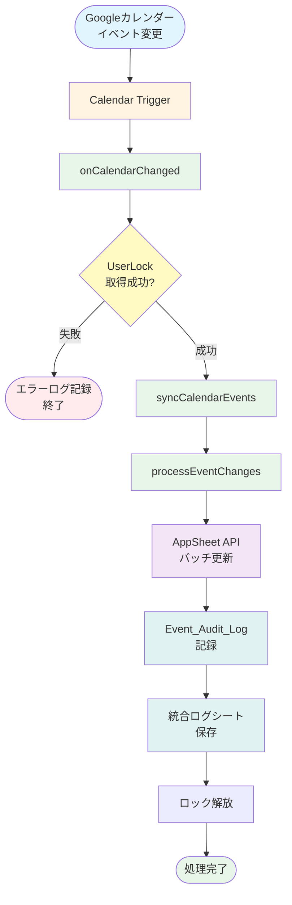
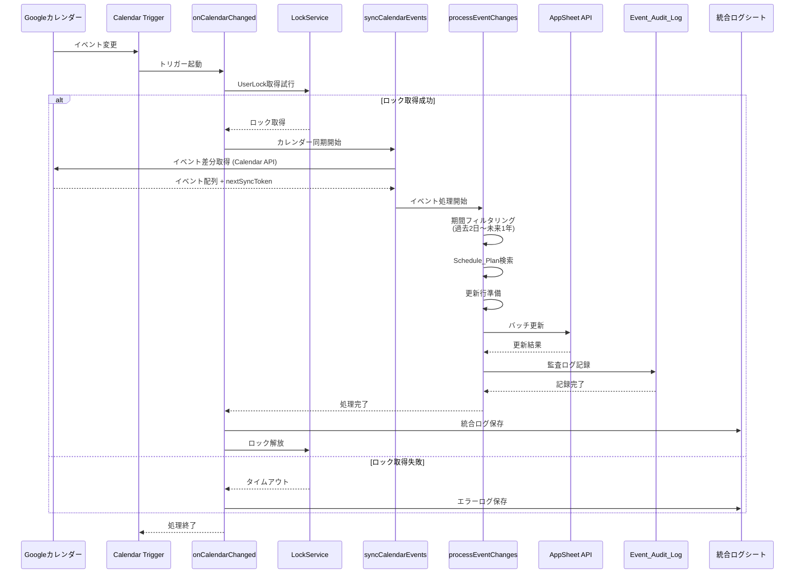
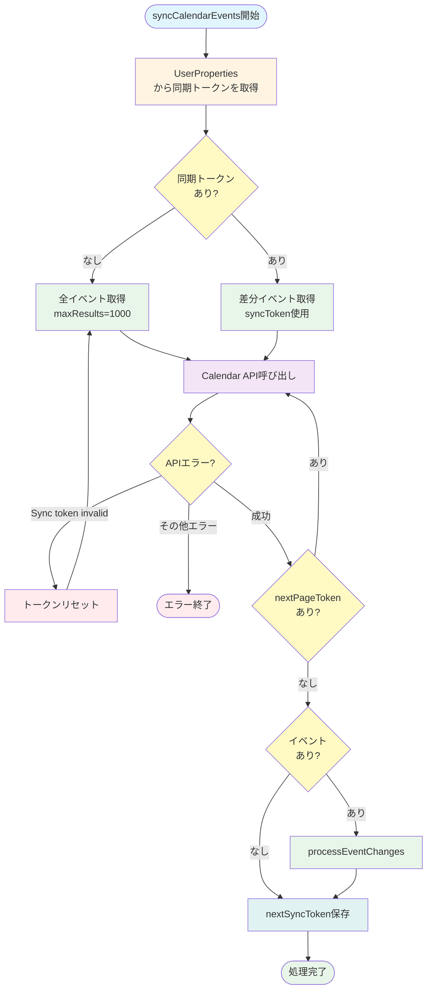
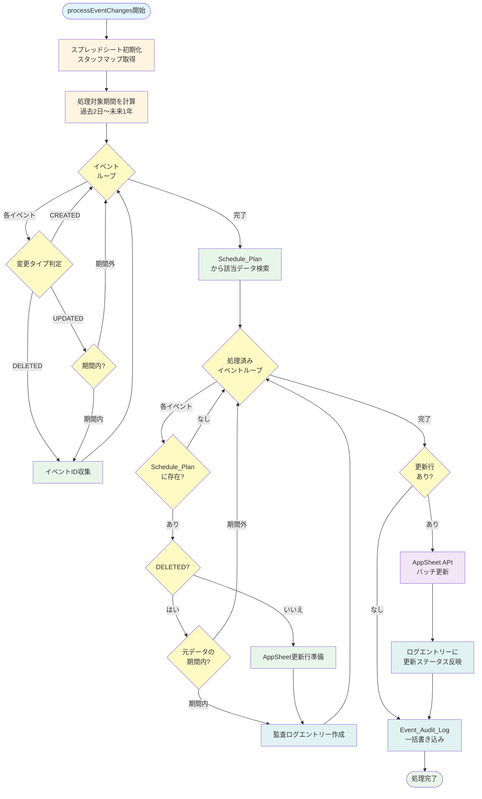
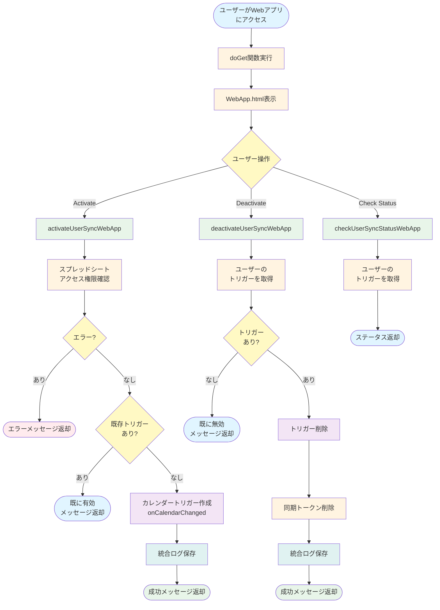
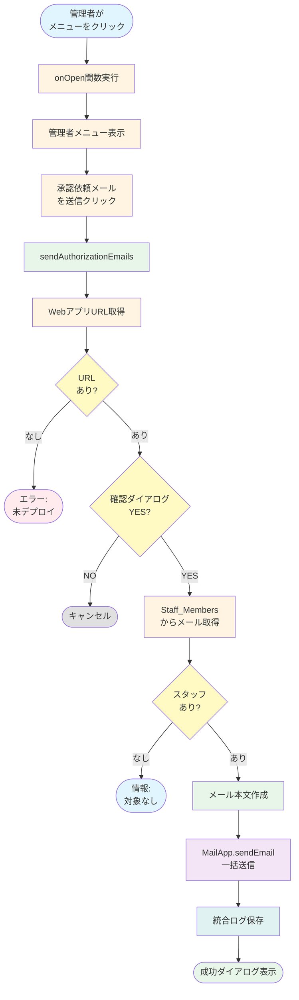
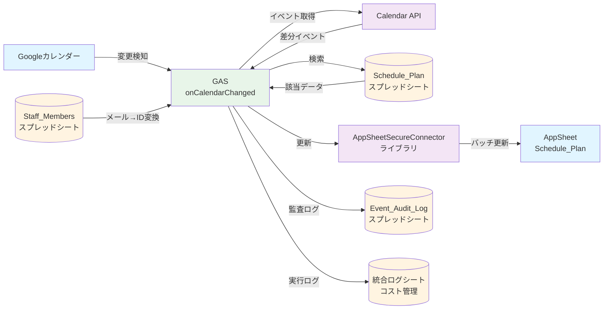
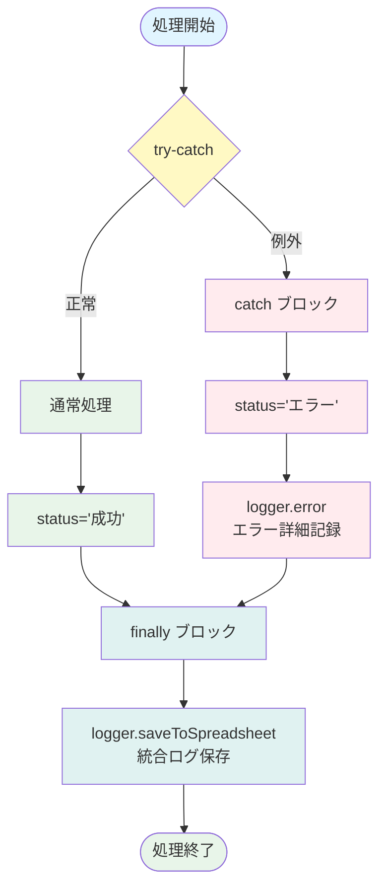

# Appsheet_カレンダー同期 - 処理フロー図

**Version:** 1.0.0
**Last Updated:** 2025-10-27

---

## 全体フロー

---

## onCalendarChanged - メイン処理フロー

---

## syncCalendarEvents - 同期トークンフロー

---

## processEventChanges - イベント処理フロー

---

## Webアプリ - ユーザー有効化フロー

---

## 管理者機能 - メール送信フロー

---

## データフロー

---

## エラーハンドリングフロー

---

## カラーコード凡例

- 🔵 **開始/終了**: `#e1f5ff`
- 🟡 **設定/初期化**: `#fff4e1`
- 🟢 **処理**: `#e8f5e9`
- 🟨 **判定/分岐**: `#fff9c4`
- 🟣 **外部API**: `#f3e5f5`
- 🔷 **ログ/保存**: `#e0f2f1`
- 🔴 **エラー**: `#ffebee`
- ⚪ **キャンセル**: `#e0e0e0`
