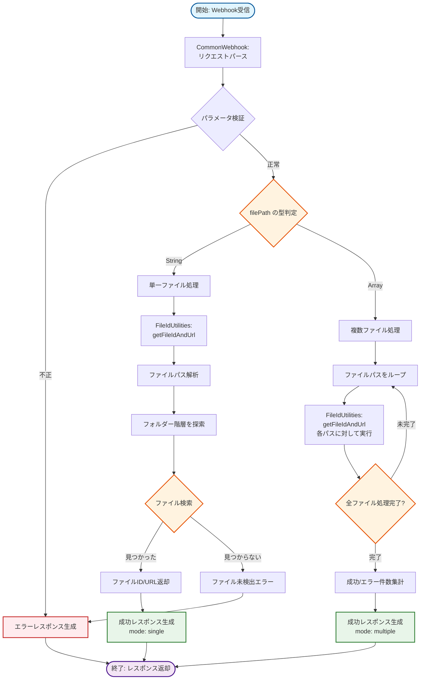
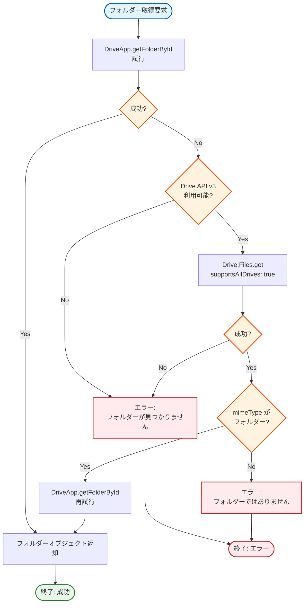
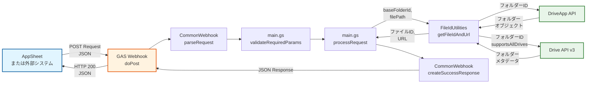
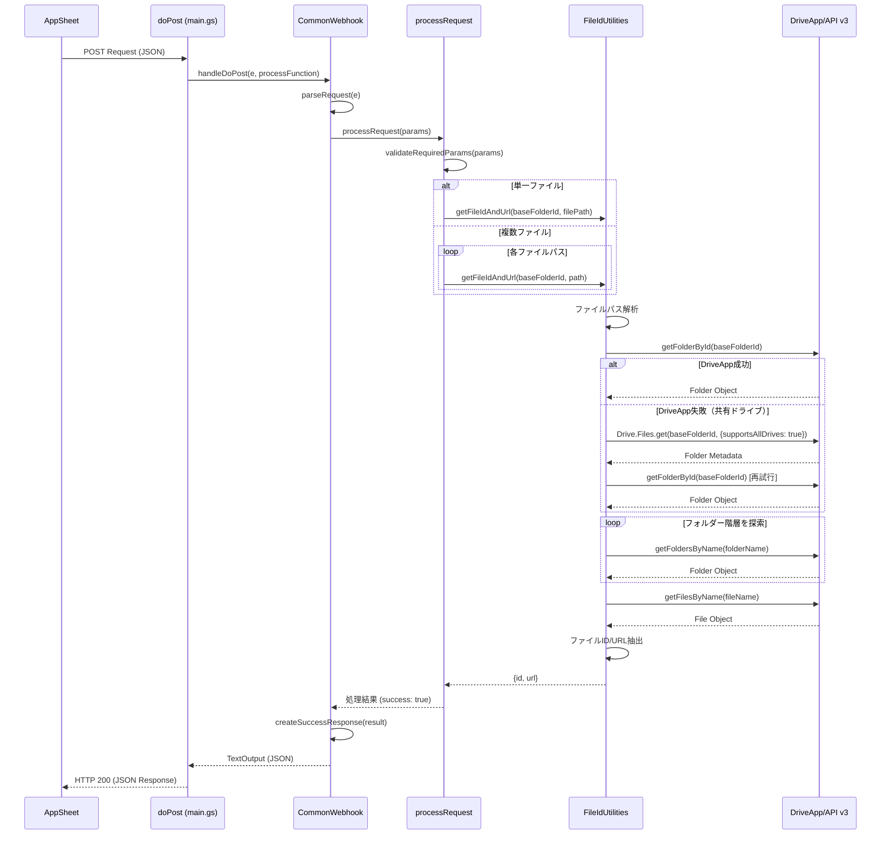
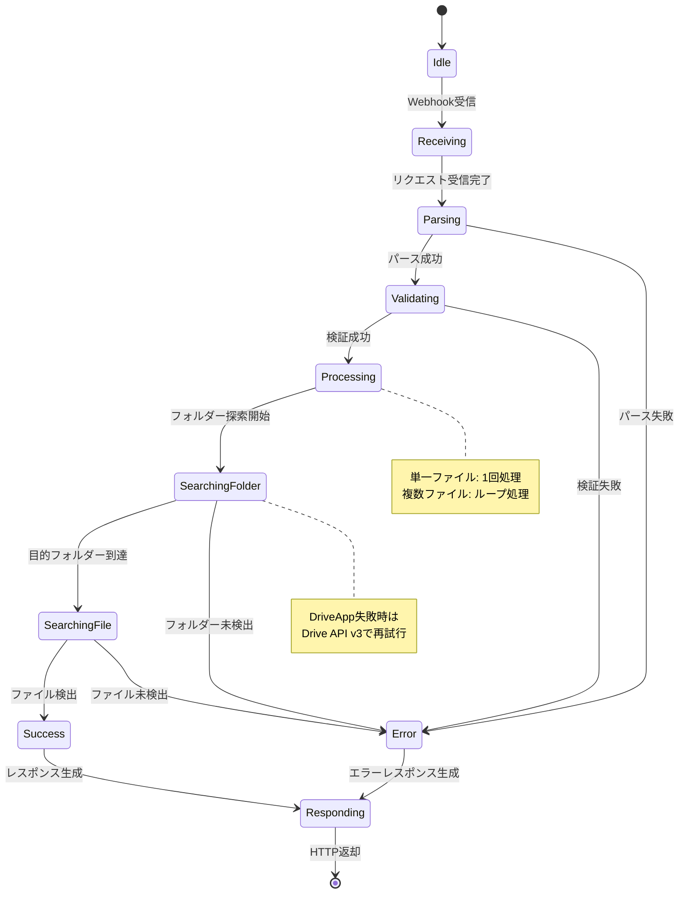
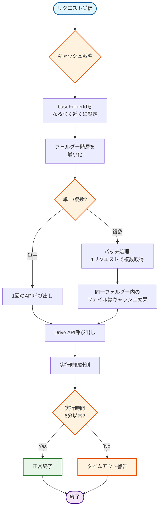

# Appsheet_ファイルID取得 - 処理フロー

## 全体フロー図



## 単一ファイル処理詳細フロー

```mermaid
graph TB
    Start([開始: 単一ファイル処理]) --> ValidateInput{入力パラメータ検証}
    ValidateInput -->|baseFolderId不正| ParamError[パラメータエラー]
    ValidateInput -->|filePath不正| ParamError
    ValidateInput -->|正常| ParseFilePath[ファイルパス解析]

    ParseFilePath --> SplitPath[パスを'/'で分割]
    SplitPath --> ExtractFileName[最後の要素をファイル名として抽出]
    ExtractFileName --> ExtractFolders[残りをフォルダーパスとして保持]

    ExtractFolders --> GetBaseFolder[起点フォルダー取得:<br/>getFolderByIdSafe_]
    GetBaseFolder --> TryStandardAPI{DriveApp.getFolderById}

    TryStandardAPI -->|成功| StartNavigation[フォルダー探索開始]
    TryStandardAPI -->|失敗| TryDriveAPIv3{Drive API v3<br/>supportsAllDrives: true}

    TryDriveAPIv3 -->|成功| StartNavigation
    TryDriveAPIv3 -->|失敗| FolderNotFoundError[フォルダー未検出エラー]

    StartNavigation --> HasMoreFolders{フォルダーパス残存?}
    HasMoreFolders -->|なし| SearchFileInFolder[現在フォルダーでファイル検索]
    HasMoreFolders -->|あり| GetNextFolderName[次のフォルダー名取得]

    GetNextFolderName --> SearchSubFolder{サブフォルダー検索}
    SearchSubFolder -->|見つかった| UpdateCurrentFolder[現在フォルダーを更新]
    SearchSubFolder -->|見つからない| SubFolderNotFoundError[サブフォルダー未検出エラー]

    UpdateCurrentFolder --> HasMoreFolders

    SearchFileInFolder --> FileExists{ファイル存在確認}
    FileExists -->|見つかった| ExtractFileInfo[ファイルID/URL抽出]
    FileExists -->|見つからない| FileNotFoundError[ファイル未検出エラー]

    ExtractFileInfo --> CreateResult[結果オブジェクト生成:<br/>{id, url}]
    CreateResult --> End([終了: 成功])

    ParamError --> EndError([終了: エラー])
    FolderNotFoundError --> EndError
    SubFolderNotFoundError --> EndError
    FileNotFoundError --> EndError

    style Start fill:#e1f5ff,stroke:#01579b,stroke-width:2px
    style End fill:#e8f5e9,stroke:#2e7d32,stroke-width:2px
    style EndError fill:#ffebee,stroke:#c62828,stroke-width:2px
    style ParamError fill:#ffebee,stroke:#c62828,stroke-width:2px
    style FolderNotFoundError fill:#ffebee,stroke:#c62828,stroke-width:2px
    style SubFolderNotFoundError fill:#ffebee,stroke:#c62828,stroke-width:2px
    style FileNotFoundError fill:#ffebee,stroke:#c62828,stroke-width:2px
    style ValidateInput fill:#fff3e0,stroke:#e65100,stroke-width:2px
    style TryStandardAPI fill:#fff3e0,stroke:#e65100,stroke-width:2px
    style TryDriveAPIv3 fill:#fff3e0,stroke:#e65100,stroke-width:2px
    style HasMoreFolders fill:#fff3e0,stroke:#e65100,stroke-width:2px
    style SearchSubFolder fill:#fff3e0,stroke:#e65100,stroke-width:2px
    style FileExists fill:#fff3e0,stroke:#e65100,stroke-width:2px
```

## 複数ファイル処理詳細フロー

```mermaid
graph TB
    Start([開始: 複数ファイル処理]) --> ValidateArray{filePath が配列?}
    ValidateArray -->|No| TypeError[型エラー]
    ValidateArray -->|Yes| InitResults[結果配列を初期化:<br/>results = []]

    InitResults --> InitCounters[カウンターを初期化:<br/>totalCount = 0<br/>successCount = 0<br/>errorCount = 0]

    InitCounters --> LoopStart{次のファイルパス存在?}
    LoopStart -->|No| AggregateResults[集計結果を生成]
    LoopStart -->|Yes| GetNextPath[次のfilePath取得]

    GetNextPath --> IncrementTotal[totalCount++]
    IncrementTotal --> TryGetFileId[try: getFileIdAndUrl]

    TryGetFileId --> ProcessSuccess{処理成功?}
    ProcessSuccess -->|Yes| IncrementSuccess[successCount++]
    ProcessSuccess -->|No| IncrementError[errorCount++]

    IncrementSuccess --> AddSuccessResult[results に追加:<br/>{path, id, url}]
    IncrementError --> AddErrorResult[results に追加:<br/>{path, id: null,<br/>url: null, error}]

    AddSuccessResult --> LoopStart
    AddErrorResult --> LoopStart

    AggregateResults --> CreateResponse[レスポンス生成:<br/>{success: true,<br/>mode: 'multiple',<br/>totalCount,<br/>successCount,<br/>errorCount,<br/>results}]

    CreateResponse --> End([終了: 成功])
    TypeError --> EndError([終了: エラー])

    style Start fill:#e1f5ff,stroke:#01579b,stroke-width:2px
    style End fill:#e8f5e9,stroke:#2e7d32,stroke-width:2px
    style EndError fill:#ffebee,stroke:#c62828,stroke-width:2px
    style TypeError fill:#ffebee,stroke:#c62828,stroke-width:2px
    style ValidateArray fill:#fff3e0,stroke:#e65100,stroke-width:2px
    style LoopStart fill:#fff3e0,stroke:#e65100,stroke-width:2px
    style ProcessSuccess fill:#fff3e0,stroke:#e65100,stroke-width:2px
    style IncrementSuccess fill:#e8f5e9,stroke:#2e7d32,stroke-width:1px
    style IncrementError fill:#ffebee,stroke:#c62828,stroke-width:1px
```

## 共有ドライブ対応フロー



## エラーハンドリングフロー

```mermaid
graph TB
    Start([エラー発生]) --> CatchError[catch block でエラー捕捉]

    CatchError --> LogError[Logger.log:<br/>エラーメッセージとスタック]

    LogError --> CheckErrorType{エラータイプ判定}

    CheckErrorType -->|パラメータエラー| CreateParamError[エラーレスポンス:<br/>'必須パラメータが不足']
    CheckErrorType -->|フォルダー未検出| CreateFolderError[エラーレスポンス:<br/>'フォルダーが見つかりません']
    CheckErrorType -->|ファイル未検出| CreateFileError[エラーレスポンス:<br/>'ファイルが見つかりません']
    CheckErrorType -->|権限エラー| CreatePermError[エラーレスポンス:<br/>'アクセス権限がありません']
    CheckErrorType -->|その他| CreateGenericError[エラーレスポンス:<br/>error.message]

    CreateParamError --> WrapResponse[CommonWebhook:<br/>createErrorResponse]
    CreateFolderError --> WrapResponse
    CreateFileError --> WrapResponse
    CreatePermError --> WrapResponse
    CreateGenericError --> WrapResponse

    WrapResponse --> BuildJSON[JSON形式で構築:<br/>{status: 'error',<br/>timestamp,<br/>error: {...}}]

    BuildJSON --> SetMimeType[MimeType設定:<br/>application/json]

    SetMimeType --> ReturnResponse[HTTP 200で返却]

    ReturnResponse --> End([終了])

    style Start fill:#ffebee,stroke:#c62828,stroke-width:2px
    style End fill:#f3e5f5,stroke:#4a148c,stroke-width:2px
    style CheckErrorType fill:#fff3e0,stroke:#e65100,stroke-width:2px
    style CreateParamError fill:#ffebee,stroke:#c62828,stroke-width:1px
    style CreateFolderError fill:#ffebee,stroke:#c62828,stroke-width:1px
    style CreateFileError fill:#ffebee,stroke:#c62828,stroke-width:1px
    style CreatePermError fill:#ffebee,stroke:#c62828,stroke-width:1px
    style CreateGenericError fill:#ffebee,stroke:#c62828,stroke-width:1px
```

## データフロー図



## シーケンス図



## 状態遷移図



## パフォーマンス最適化フロー



## 関連ドキュメント

- [README.md](./README.md) - ユーザー向けドキュメント
- [SPECIFICATIONS.md](./SPECIFICATIONS.md) - 技術仕様書
- [共通モジュール仕様](../../../common_modules/README.md)
