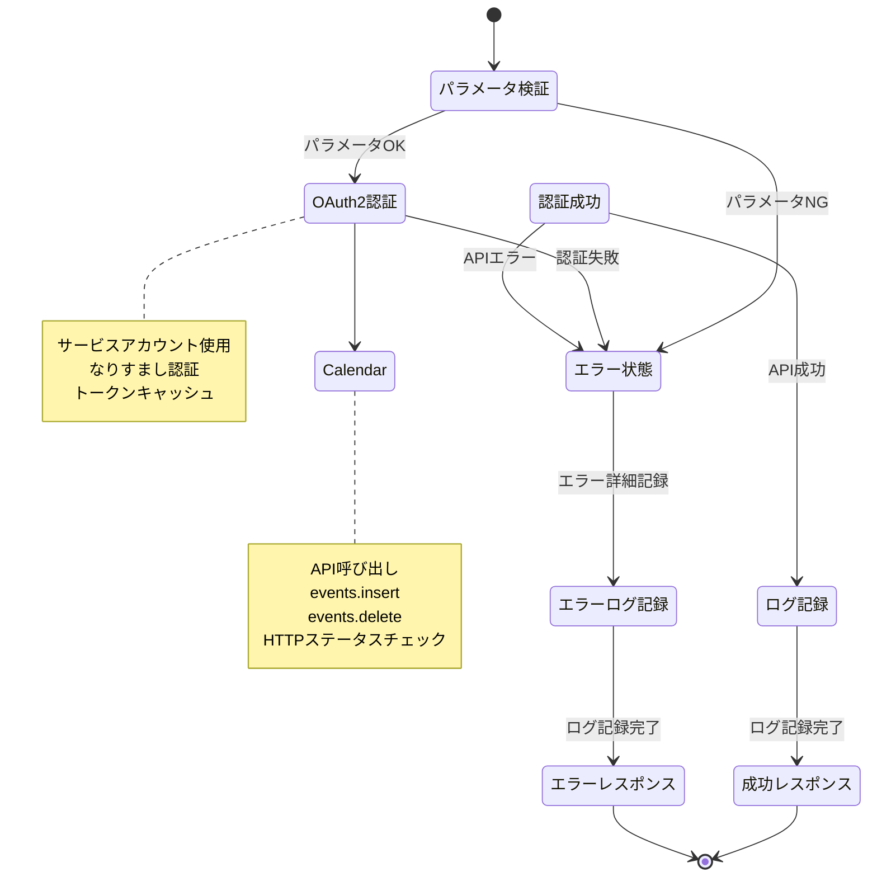
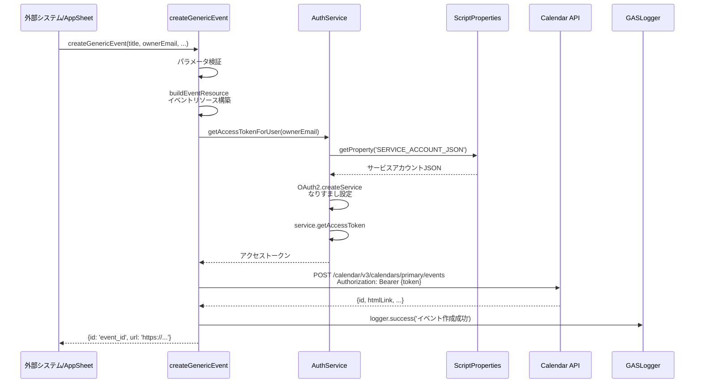

# Appsheet_汎用_イベント作成 - 処理フロー図

## 概要フロー

```mermaid
graph TB
    Start([外部システム/AppSheet/GASエディタ]) --> Entry{エントリーポイント}

    Entry -->|直接呼び出し| Direct[個別引数関数呼び出し]
    Entry -->|Webhook| DoPost[doPost]

    Direct --> ActionType{処理タイプ}
    DoPost --> Parse[JSONペイロードパース]
    Parse --> ActionType

    ActionType -->|CREATE| CreateEvent[createGenericEvent]
    ActionType -->|DELETE| DeleteEvent[deleteGenericEvent]
    ActionType -->|CREATE_OOO| CreateOOO[createOutOfOfficeEvent]
    ActionType -->|DELETE_OOO| DeleteOOO[deleteOutOfOfficeEvent]
    ActionType -->|CREATE_DAILY_OOO| CreateDaily[createDailyOutOfOfficeEvent]

    CreateEvent --> OAuth2_1[OAuth2認証トークン取得]
    DeleteEvent --> OAuth2_2[OAuth2認証トークン取得]
    CreateOOO --> OAuth2_3[OAuth2認証トークン取得]
    DeleteOOO --> OAuth2_4[OAuth2認証トークン取得]
    CreateDaily --> CreateOOO

    OAuth2_1 --> API_Create[Calendar API<br/>events.insert]
    OAuth2_2 --> API_Delete[Calendar API<br/>events.delete]
    OAuth2_3 --> API_Create
    OAuth2_4 --> API_Delete

    API_Create --> Log1[実行ログ記録]
    API_Delete --> Log2[実行ログ記録]

    Log1 --> Response1[レスポンス返却<br/>{id, url}]
    Log2 --> Response2[レスポンス返却<br/>{success, message}]

    Response1 --> End([処理完了])
    Response2 --> End

    style Start fill:#e1f5ff
    style ActionType fill:#fff4e1
    style OAuth2_1 fill:#fff9c4
    style OAuth2_2 fill:#fff9c4
    style OAuth2_3 fill:#fff9c4
    style OAuth2_4 fill:#fff9c4
    style API_Create fill:#c8e6c9
    style API_Delete fill:#ffab91
    style End fill:#e1f5ff
```

## 詳細フロー1: 通常イベント作成

```mermaid
graph TB
    Start([createGenericEvent呼び出し]) --> ValidateTitle{titleパラメータ<br/>存在?}
    ValidateTitle -->|なし| ErrorTitle[エラー: タイトルは必須です]
    ValidateTitle -->|あり| SetDefaults[デフォルト値設定<br/>- ownerEmail<br/>- colorId<br/>- startDateTime<br/>- endDateTime<br/>- timeZone]

    SetDefaults --> BuildResource[イベントリソース構築<br/>buildEventResource]

    BuildResource --> SetSummary[summary: title]
    SetSummary --> SetDescription[description: description]
    SetDescription --> SetDateTime[start/end:<br/>dateTime, timeZone]
    SetDateTime --> CheckAttendees{attendees<br/>存在?}

    CheckAttendees -->|あり| SetAttendees[attendees配列設定<br/>カンマ区切りをパース]
    CheckAttendees -->|なし| CheckColor

    SetAttendees --> CheckColor{colorId<br/>存在?}
    CheckColor -->|あり| SetColor[colorId設定]
    CheckColor -->|なし| CheckLocation

    SetColor --> CheckLocation{location<br/>存在?}
    CheckLocation -->|あり| SetLocation[location設定]
    CheckLocation -->|なし| CheckRecurrence

    SetLocation --> CheckRecurrence{recurrence<br/>存在?}
    CheckRecurrence -->|あり| SetRecurrence[recurrence配列設定]
    CheckRecurrence -->|なし| CheckReminders

    SetRecurrence --> CheckReminders{reminders<br/>存在?}
    CheckReminders -->|あり| SetReminders[reminders設定]
    CheckReminders -->|なし| OAuth2

    SetReminders --> OAuth2[AuthService.getAccessTokenForUser<br/>OAuth2トークン取得]

    OAuth2 --> CheckToken{トークン<br/>取得成功?}
    CheckToken -->|失敗| ErrorOAuth[エラー: OAuth2認証失敗]
    CheckToken -->|成功| BuildURL[Calendar APIエンドポイント構築<br/>/calendar/v3/calendars/primary/events]

    BuildURL --> CheckSend{sendUpdates?}
    CheckSend -->|true| AddQuery[クエリパラメータ追加<br/>?sendUpdates=all]
    CheckSend -->|false| CallAPI

    AddQuery --> CallAPI[UrlFetchApp.fetch<br/>POST リクエスト]

    CallAPI --> CheckStatus{HTTPステータス<br/>200-299?}
    CheckStatus -->|NG| ErrorAPI[エラー: Calendar APIエラー]
    CheckStatus -->|OK| ParseResponse[レスポンスJSON解析]

    ParseResponse --> ExtractID[id: result.id]
    ExtractID --> ExtractURL[url: result.htmlLink]

    ExtractURL --> LogSuccess[ログ記録: 成功]
    LogSuccess --> ReturnSuccess[レスポンス返却<br/>{id, url}]

    ErrorTitle --> LogError[ログ記録: エラー]
    ErrorOAuth --> LogError
    ErrorAPI --> LogError

    LogError --> ThrowError[エラーをスロー]

    ReturnSuccess --> End([処理完了])
    ThrowError --> End

    style Start fill:#e1f5ff
    style ValidateTitle fill:#fff4e1
    style OAuth2 fill:#fff9c4
    style CallAPI fill:#c8e6c9
    style End fill:#e1f5ff
    style ErrorTitle fill:#ffcdd2
    style ErrorOAuth fill:#ffcdd2
    style ErrorAPI fill:#ffcdd2
```

## 詳細フロー2: 不在イベント作成

```mermaid
graph TB
    Start([createOutOfOfficeEvent呼び出し]) --> ValidateParams{必須パラメータ<br/>存在?}
    ValidateParams -->|title なし| ErrorTitle[エラー: タイトルは必須です]
    ValidateParams -->|startDate なし| ErrorStart[エラー: 開始日は必須です]
    ValidateParams -->|endDate なし| ErrorEnd[エラー: 終了日は必須です]
    ValidateParams -->|OK| SetDefaults[デフォルト値設定<br/>- reason: OTHER<br/>- ownerEmail<br/>- timeZone<br/>- allDay: true]

    SetDefaults --> BuildResource[不在イベントリソース構築<br/>buildOutOfOfficeEventResource]

    BuildResource --> SetSummary[summary: title]
    SetSummary --> SetEventType[eventType: 'outOfOffice']

    SetEventType --> CheckAllDay{allDay?}

    CheckAllDay -->|true| SetDateOnly[start/end:<br/>date形式<br/>YYYY-MM-DD]
    CheckAllDay -->|false| SetDateTime[start/end:<br/>dateTime形式<br/>ISO 8601]

    SetDateOnly --> AdjustEndDate[終了日を+1日<br/>Googleカレンダー仕様]
    SetDateTime --> SetProperties

    AdjustEndDate --> SetProperties[outOfOfficeProperties設定<br/>- autoDeclineMode<br/>- declineMessage]

    SetProperties --> OAuth2[AuthService.getAccessTokenForUser<br/>OAuth2トークン取得]

    OAuth2 --> CheckToken{トークン<br/>取得成功?}
    CheckToken -->|失敗| ErrorOAuth[エラー: OAuth2認証失敗]
    CheckToken -->|成功| BuildURL[Calendar APIエンドポイント構築<br/>/calendar/v3/calendars/primary/events]

    BuildURL --> CheckSend{sendUpdates?}
    CheckSend -->|true| AddQuery[クエリパラメータ追加<br/>?sendUpdates=all]
    CheckSend -->|false| CallAPI

    AddQuery --> CallAPI[UrlFetchApp.fetch<br/>POST リクエスト]

    CallAPI --> CheckStatus{HTTPステータス<br/>200-299?}
    CheckStatus -->|NG| ErrorAPI[エラー: Calendar APIエラー]
    CheckStatus -->|OK| ParseResponse[レスポンスJSON解析]

    ParseResponse --> ExtractID[id: result.id]
    ExtractID --> ExtractURL[url: result.htmlLink]

    ExtractURL --> LogSuccess[ログ記録: 成功]
    LogSuccess --> ReturnSuccess[レスポンス返却<br/>{id, url}]

    ErrorTitle --> LogError[ログ記録: エラー]
    ErrorStart --> LogError
    ErrorEnd --> LogError
    ErrorOAuth --> LogError
    ErrorAPI --> LogError

    LogError --> ThrowError[エラーをスロー]

    ReturnSuccess --> End([処理完了])
    ThrowError --> End

    style Start fill:#e1f5ff
    style ValidateParams fill:#fff4e1
    style CheckAllDay fill:#fff4e1
    style OAuth2 fill:#fff9c4
    style CallAPI fill:#c8e6c9
    style End fill:#e1f5ff
    style ErrorTitle fill:#ffcdd2
    style ErrorStart fill:#ffcdd2
    style ErrorEnd fill:#ffcdd2
    style ErrorOAuth fill:#ffcdd2
    style ErrorAPI fill:#ffcdd2
```

## 詳細フロー3: イベント削除

```mermaid
graph TB
    Start([deleteGenericEvent呼び出し]) --> ValidateParams{必須パラメータ<br/>存在?}
    ValidateParams -->|ownerEmail なし| ErrorOwner[エラー: ownerEmailは必須です]
    ValidateParams -->|eventId なし| ErrorEventId[エラー: eventIdは必須です]
    ValidateParams -->|OK| OAuth2[AuthService.getAccessTokenForUser<br/>OAuth2トークン取得]

    OAuth2 --> CheckToken{トークン<br/>取得成功?}
    CheckToken -->|失敗| ErrorOAuth[エラー: OAuth2認証失敗]
    CheckToken -->|成功| BuildURL[Calendar APIエンドポイント構築<br/>/calendar/v3/calendars/primary/events/{eventId}]

    BuildURL --> CheckSend{sendUpdates?}
    CheckSend -->|true| AddQuery[クエリパラメータ追加<br/>?sendUpdates=all]
    CheckSend -->|false| CallAPI

    AddQuery --> CallAPI[UrlFetchApp.fetch<br/>DELETE リクエスト]

    CallAPI --> CheckStatus{HTTPステータス<br/>コード?}

    CheckStatus -->|204| Success[削除成功]
    CheckStatus -->|410| AlreadyDeleted[既に削除済み]
    CheckStatus -->|404| NotFound[イベント不存在]
    CheckStatus -->|400以上| ErrorAPI[エラー: Calendar APIエラー]

    Success --> LogSuccess[ログ記録: 成功]
    AlreadyDeleted --> LogSuccess
    NotFound --> LogSuccess

    LogSuccess --> ReturnSuccess[レスポンス返却<br/>{success: true, message: 'イベントを削除しました'}]

    ErrorOwner --> LogError[ログ記録: エラー]
    ErrorEventId --> LogError
    ErrorOAuth --> LogError
    ErrorAPI --> LogError

    LogError --> ThrowError[エラーをスロー]

    ReturnSuccess --> End([処理完了])
    ThrowError --> End

    style Start fill:#e1f5ff
    style ValidateParams fill:#fff4e1
    style OAuth2 fill:#fff9c4
    style CallAPI fill:#ffab91
    style CheckStatus fill:#fff4e1
    style End fill:#e1f5ff
    style ErrorOwner fill:#ffcdd2
    style ErrorEventId fill:#ffcdd2
    style ErrorOAuth fill:#ffcdd2
    style ErrorAPI fill:#ffcdd2
```

## 詳細フロー4: 簡易版不在イベント作成

```mermaid
graph TB
    Start([createDailyOutOfOfficeEvent呼び出し]) --> ValidateParams{必須パラメータ<br/>存在?}
    ValidateParams -->|date なし| ErrorDate[エラー: 日付は必須です]
    ValidateParams -->|ownerEmail なし| ErrorOwner[エラー: ownerEmailは必須です]
    ValidateParams -->|OK| ConvertDate[日付をDateオブジェクトに変換<br/>new Date(date)]

    ConvertDate --> ValidateDate{日付妥当性<br/>チェック}
    ValidateDate -->|無効| ErrorInvalid[エラー: 無効な日付形式です]
    ValidateDate -->|有効| SetStartDate[開始日設定<br/>00:00:00に設定]

    SetStartDate --> SetEndDate[終了日設定<br/>開始日と同じ日]

    SetEndDate --> SetDefaults[デフォルト値設定<br/>- title: '不在'<br/>- declineMessage: '本日は不在です。'<br/>- reason: 'OTHER'<br/>- sendUpdates: false]

    SetDefaults --> LogInfo[ログ記録: 簡易版不在イベント作成]

    LogInfo --> CallCreateOOO[createOutOfOfficeEvent呼び出し<br/>- title<br/>- reason<br/>- ownerEmail<br/>- startDate<br/>- endDate<br/>- declineMessage<br/>- sendUpdates<br/>- timeZone: 'Asia/Tokyo'<br/>- allDay: true]

    CallCreateOOO --> CheckResult{結果<br/>成功?}
    CheckResult -->|成功| ReturnSuccess[レスポンス返却<br/>{id, url}]
    CheckResult -->|失敗| CatchError[エラーキャッチ]

    CatchError --> LogError[ログ記録: エラー]
    LogError --> ThrowError[エラーをスロー]

    ErrorDate --> ThrowError
    ErrorOwner --> ThrowError
    ErrorInvalid --> ThrowError

    ReturnSuccess --> End([処理完了])
    ThrowError --> End

    style Start fill:#e1f5ff
    style ValidateParams fill:#fff4e1
    style ValidateDate fill:#fff4e1
    style CallCreateOOO fill:#e3f2fd
    style End fill:#e1f5ff
    style ErrorDate fill:#ffcdd2
    style ErrorOwner fill:#ffcdd2
    style ErrorInvalid fill:#ffcdd2
```

## OAuth2認証フロー

```mermaid
graph TB
    Start([AuthService.getAccessTokenForUser]) --> GetProperty[ScriptProperties取得<br/>SERVICE_ACCOUNT_JSON]

    GetProperty --> CheckProperty{プロパティ<br/>存在?}
    CheckProperty -->|なし| ErrorProperty[エラー: プロパティが設定されていません]
    CheckProperty -->|あり| ParseJSON[JSONパース<br/>serviceAccountInfo]

    ParseJSON --> CreateService[OAuth2.createService作成<br/>CalendarImpersonation:{userEmail}]

    CreateService --> SetTokenURL[setTokenUrl<br/>https://oauth2.googleapis.com/token]
    SetTokenURL --> SetPrivateKey[setPrivateKey<br/>serviceAccountInfo.private_key]
    SetPrivateKey --> SetIssuer[setIssuer<br/>serviceAccountInfo.client_email]
    SetIssuer --> SetClientId[setClientId<br/>serviceAccountInfo.client_id]
    SetClientId --> SetSubject[setSubject<br/>userEmail なりすまし対象]

    SetSubject --> SetScope[setScope<br/>https://www.googleapis.com/auth/calendar]
    SetScope --> SetPropertyStore[setPropertyStore<br/>ScriptProperties]
    SetPropertyStore --> SetCache[setCache<br/>CacheService]
    SetCache --> SetLock[setLock<br/>LockService]

    SetLock --> CheckAccess{hasAccess?}
    CheckAccess -->|なし| LogRefresh[ログ: トークンリフレッシュ実行]
    CheckAccess -->|あり| GetToken

    LogRefresh --> GetToken[service.getAccessToken]

    GetToken --> CheckToken{トークン<br/>取得成功?}
    CheckToken -->|失敗| ErrorToken[エラー: OAuth2アクセストークン取得失敗]
    CheckToken -->|成功| ReturnToken[トークン返却]

    ErrorProperty --> End([処理終了])
    ErrorToken --> End
    ReturnToken --> End

    style Start fill:#e1f5ff
    style CheckProperty fill:#fff4e1
    style SetSubject fill:#fff9c4
    style GetToken fill:#c8e6c9
    style End fill:#e1f5ff
    style ErrorProperty fill:#ffcdd2
    style ErrorToken fill:#ffcdd2
```

## Webhookエントリーポイント（doPost）フロー

```mermaid
graph TB
    Start([doPost呼び出し]) --> CreateLogger[ロガー作成<br/>createLogger]

    CreateLogger --> TryParse{Try-Catch}

    TryParse --> ParseJSON[JSONペイロードパース<br/>e.postData.contents]

    ParseJSON --> GetAction[action取得<br/>デフォルト: CREATE]
    GetAction --> GetRecordId[recordId取得<br/>record_id or eventId or title]

    GetRecordId --> LogInfo[ログ記録: Webhook受信]

    LogInfo --> CreateDup[重複防止インスタンス作成<br/>createDuplicationPrevention]

    CreateDup --> ExecuteWithRetry[重複チェック実行<br/>executeWithRetry]

    ExecuteWithRetry --> CheckAction{action値}

    CheckAction -->|DELETE| ProcessDelete[deleteGenericEvent呼び出し]
    CheckAction -->|CREATE_OOO| ProcessCreateOOO[createOutOfOfficeEvent呼び出し]
    CheckAction -->|DELETE_OOO| ProcessDeleteOOO[deleteOutOfOfficeEvent呼び出し]
    CheckAction -->|CREATE_DAILY_OOO| ProcessDaily[createDailyOutOfOfficeEvent呼び出し]
    CheckAction -->|CREATE or その他| ProcessCreate[createGenericEvent呼び出し]

    ProcessDelete --> CheckDuplicate{重複実行?}
    ProcessCreateOOO --> CheckDuplicate
    ProcessDeleteOOO --> CheckDuplicate
    ProcessDaily --> CheckDuplicate
    ProcessCreate --> CheckDuplicate

    CheckDuplicate -->|true| LogDup[ログ: 重複実行を検知]
    CheckDuplicate -->|false| LogSuccess[ログ: 成功]

    LogDup --> ReturnDup[レスポンス返却<br/>{duplicate: true}]
    LogSuccess --> ReturnSuccess[レスポンス返却<br/>処理結果]

    TryParse -->|Catch| CatchError[例外キャッチ]
    CatchError --> LogError[ログ記録: エラー]
    LogError --> ReturnError[レスポンス返却<br/>{error: エラーメッセージ}]

    ReturnDup --> End([処理完了])
    ReturnSuccess --> End
    ReturnError --> End

    style Start fill:#e1f5ff
    style CheckAction fill:#fff4e1
    style CheckDuplicate fill:#fff4e1
    style ExecuteWithRetry fill:#e1bee7
    style End fill:#e1f5ff
    style CatchError fill:#ffcdd2
```

## データフロー図

```mermaid
graph LR
    Input[Webhook/直接呼び出し] --> Params[パラメータ<br/>- title<br/>- ownerEmail<br/>- startDateTime<br/>- endDateTime<br/>...]

    Params --> Validate[パラメータ検証]

    Validate --> Resource[イベントリソース構築<br/>- summary<br/>- start/end<br/>- attendees<br/>- colorId]

    Resource --> OAuth2[OAuth2認証<br/>AuthService]

    OAuth2 --> ScriptProps[ScriptProperties<br/>SERVICE_ACCOUNT_JSON]
    ScriptProps --> Token[アクセストークン]

    Token --> CalendarAPI[Calendar API<br/>- events.insert<br/>- events.delete]

    CalendarAPI --> Response[レスポンス<br/>- id<br/>- htmlLink]

    Response --> Result[結果<br/>{id, url}]

    Result --> Logger[実行ログ<br/>GASLogger]

    Logger --> Spreadsheet[ログスプレッドシート<br/>GAS実行ログ]

    style Input fill:#e1f5ff
    style OAuth2 fill:#fff9c4
    style ScriptProps fill:#fff3e0
    style CalendarAPI fill:#c8e6c9
    style Spreadsheet fill:#fff3e0
```

## エラーハンドリングフロー

```mermaid
graph TB
    Start([処理開始]) --> Try{Try処理}

    Try --> MainProcess[メイン処理実行]

    MainProcess --> Success{処理成功?}
    Success -->|成功| LogSuccess[ログ記録: 成功<br/>- ステータス<br/>- 実行時間<br/>- イベントID]
    Success -->|失敗| Catch[Catchブロック]

    Catch --> ErrorType{エラータイプ}

    ErrorType -->|パラメータエラー| LogParam[ログ記録: パラメータエラー]
    ErrorType -->|OAuth2エラー| LogOAuth[ログ記録: OAuth2エラー]
    ErrorType -->|Calendar APIエラー| LogAPI[ログ記録: Calendar APIエラー]
    ErrorType -->|その他| LogOther[ログ記録: その他エラー]

    LogParam --> ReturnError[エラーレスポンス返却<br/>{error: エラーメッセージ}]
    LogOAuth --> ReturnError
    LogAPI --> ReturnError
    LogOther --> ReturnError

    LogSuccess --> ReturnSuccess[成功レスポンス返却]

    ReturnSuccess --> End([処理終了])
    ReturnError --> End

    style Start fill:#e1f5ff
    style Try fill:#fff4e1
    style Success fill:#fff4e1
    style Catch fill:#ffcdd2
    style LogSuccess fill:#c8e6c9
    style End fill:#e1f5ff
```

## 状態遷移図



## シーケンス図: イベント作成処理



## 重複防止フロー

```mermaid
graph TB
    Start([executeWithRetry呼び出し]) --> CalcHash[リクエストペイロードの<br/>SHA-256ハッシュ計算]

    CalcHash --> CheckCache[ScriptPropertiesチェック<br/>ハッシュ存在?]

    CheckCache -->|存在| LogDup[ログ: 重複実行検出]
    CheckCache -->|なし| Lock[LockService取得]

    Lock --> SetProperty[ScriptProperties保存<br/>TTL: 24時間]

    SetProperty --> Execute[メイン処理実行]

    Execute --> CheckResult{処理成功?}
    CheckResult -->|成功| ReturnResult[結果返却<br/>{isDuplicate: false, result: ...}]
    CheckResult -->|失敗| CatchError[エラーキャッチ]

    CatchError --> RemoveProperty[ScriptProperties削除<br/>失敗時はクリア]
    RemoveProperty --> ThrowError[エラーをスロー]

    LogDup --> ReturnDup[結果返却<br/>{isDuplicate: true}]

    ReturnResult --> End([処理完了])
    ReturnDup --> End
    ThrowError --> End

    style Start fill:#e1f5ff
    style CheckCache fill:#e1bee7
    style Execute fill:#c8e6c9
    style End fill:#e1f5ff
```
