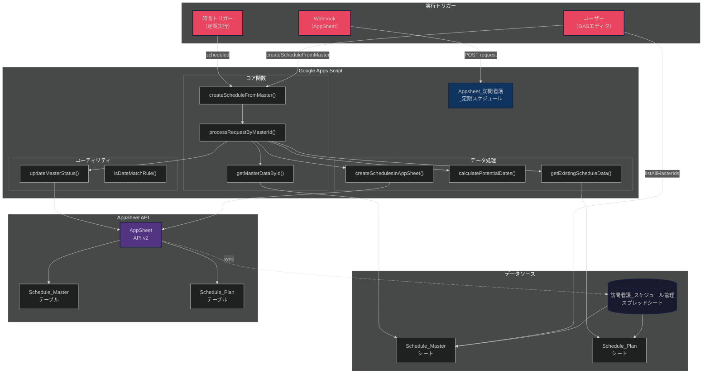
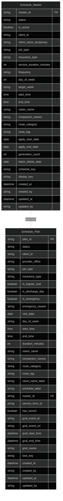
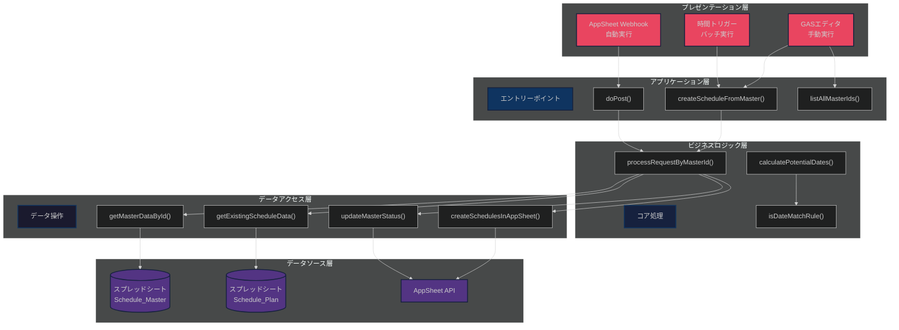
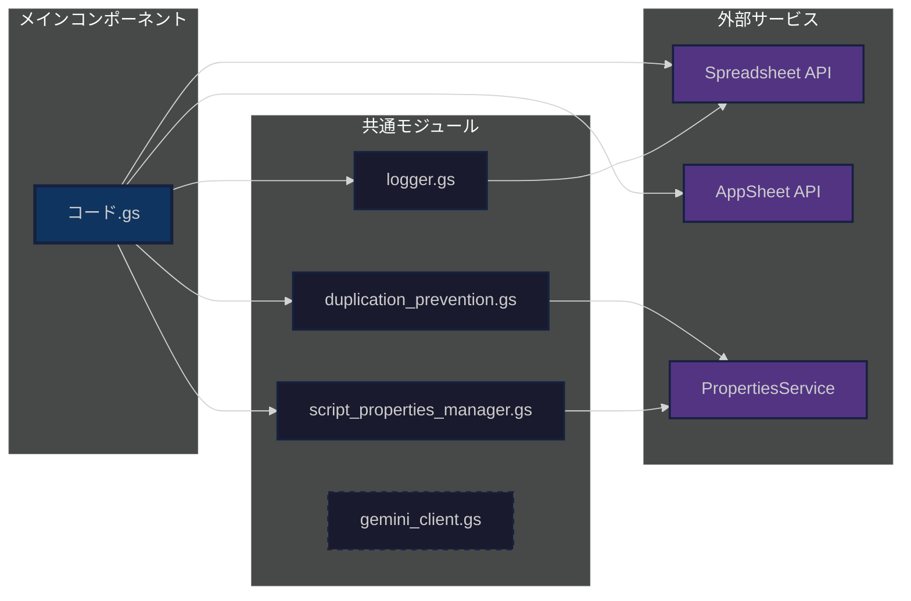
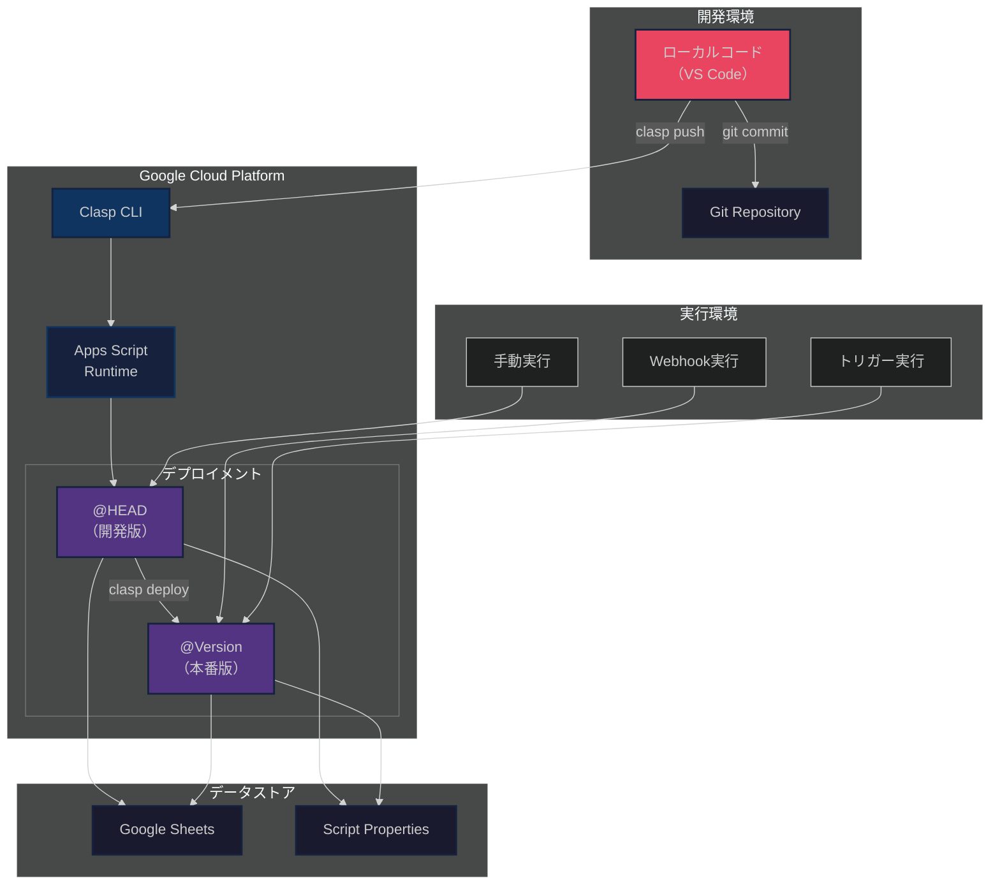
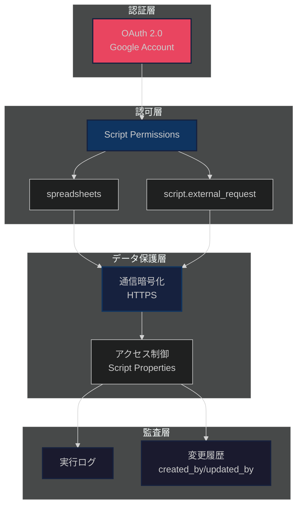

# Appsheet_訪問看護_定期スケジュール - アーキテクチャ図

## システム全体構成

```mermaid
%%{init: {'theme':'dark'}}%%
graph TB
    subgraph "データソース"
        SS[("訪問看護_スケジュール管理<br/>スプレッドシート")]
        SM["Schedule_Master<br/>シート"]
        SP["Schedule_Plan<br/>シート"]
    end

    subgraph "Google Apps Script"
        GAS["Appsheet_訪問看護<br/>_定期スケジュール"]

        subgraph "コア関数"
            CSM["createScheduleFromMaster()"]
            PRBM["processRequestByMasterId()"]
            GMD["getMasterDataById()"]
        end

        subgraph "データ処理"
            GESD["getExistingScheduleData()"]
            CPD["calculatePotentialDates()"]
            CSAS["createSchedulesInAppSheet()"]
        end

        subgraph "ユーティリティ"
            UMS["updateMasterStatus()"]
            IDMR["isDateMatchRule()"]
        end
    end

    subgraph "AppSheet API"
        AS["AppSheet<br/>API v2"]
        ASM["Schedule_Master<br/>テーブル"]
        ASP["Schedule_Plan<br/>テーブル"]
    end

    subgraph "実行トリガー"
        USER["ユーザー<br/>（GASエディタ）"]
        WH["Webhook<br/>（AppSheet）"]
        TRIG["時間トリガー<br/>（定期実行）"]
    end

    %% データソース接続
    SS --> SM
    SS --> SP

    %% 実行フロー
    USER -->|listAllMasterIds| SM
    USER -->|createScheduleFromMaster| CSM
    WH -->|POST request| GAS
    TRIG -->|scheduled| CSM

    %% GAS内部フロー
    CSM --> PRBM
    PRBM --> GMD
    GMD --> SM
    PRBM --> GESD
    GESD --> SP
    PRBM --> CPD
    PRBM --> CSAS
    PRBM --> UMS

    %% AppSheet API連携
    CSAS --> AS
    UMS --> AS
    AS --> ASP
    AS --> ASM

    %% 結果の保存
    AS -.->|sync| SS

    style SS fill:#1a1a2e,stroke:#16213e,stroke-width:2px
    style GAS fill:#0f3460,stroke:#16213e,stroke-width:2px
    style AS fill:#533483,stroke:#16213e,stroke-width:2px
    style USER fill:#e94560,stroke:#16213e,stroke-width:2px
    style WH fill:#e94560,stroke:#16213e,stroke-width:2px
    style TRIG fill:#e94560,stroke:#16213e,stroke-width:2px
```

---

## データモデル

```mermaid
%%{init: {'theme':'dark'}}%%
erDiagram
    Schedule_Master ||--o{ Schedule_Plan : generates

    Schedule_Master {
        string master_id PK
        string status
        boolean is_active
        string client_id
        string client_name_temporary
        string job_type
        string insurance_type
        int service_duration_minutes
        string frequency
        int day_of_week
        string target_week
        time start_time
        time end_time
        string visitor_name
        string companion_names
        string route_category
        string route_tag
        date apply_start_date
        date apply_end_date
        int generation_count
        date batch_delete_date
        string schedule_key
        string display_key
        datetime created_at
        string created_by
        datetime updated_at
        string updated_by
    }

    Schedule_Plan {
        string plan_id PK
        string status
        string client_id
        string provider_office
        string job_type
        string insurance_type
        boolean is_regular_visit
        boolean is_discharge_day
        boolean is_emergency
        string emergency_reason
        date visit_date
        string day_of_week
        time start_time
        time end_time
        int duration_minutes
        string visitor_name
        string companion_names
        string route_category
        string route_tag
        string client_name_label
        string schedule_label
        string master_id FK
        string service_form_id
        boolean has_record
        string gcal_event_id
        string gcal_event_url
        datetime gcal_start_time
        datetime gcal_end_time
        string gcal_owner
        string lock_key
        datetime created_at
        string created_by
        datetime updated_at
        string updated_by
    }
```

---

## レイヤーアーキテクチャ

```mermaid
%%{init: {'theme':'dark'}}%%
graph TB
    subgraph "プレゼンテーション層"
        UI1["GASエディタ<br/>手動実行"]
        UI2["AppSheet Webhook<br/>自動実行"]
        UI3["時間トリガー<br/>バッチ実行"]
    end

    subgraph "アプリケーション層"
        API["エントリーポイント"]
        API1["createScheduleFromMaster()"]
        API2["doPost()"]
        API3["listAllMasterIds()"]
    end

    subgraph "ビジネスロジック層"
        BL["コア処理"]
        BL1["processRequestByMasterId()"]
        BL2["calculatePotentialDates()"]
        BL3["isDateMatchRule()"]
    end

    subgraph "データアクセス層"
        DAL["データ操作"]
        DAL1["getMasterDataById()"]
        DAL2["getExistingScheduleData()"]
        DAL3["createSchedulesInAppSheet()"]
        DAL4["updateMasterStatus()"]
    end

    subgraph "データソース層"
        DS1[("スプレッドシート<br/>Schedule_Master")]
        DS2[("スプレッドシート<br/>Schedule_Plan")]
        DS3["AppSheet API"]
    end

    %% プレゼンテーション → アプリケーション
    UI1 --> API1
    UI1 --> API3
    UI2 --> API2
    UI3 --> API1

    %% アプリケーション → ビジネスロジック
    API1 --> BL1
    API2 --> BL1

    %% ビジネスロジック → データアクセス
    BL1 --> DAL1
    BL1 --> DAL2
    BL1 --> DAL3
    BL1 --> DAL4
    BL2 --> BL3

    %% データアクセス → データソース
    DAL1 --> DS1
    DAL2 --> DS2
    DAL3 --> DS3
    DAL4 --> DS3

    style UI1 fill:#e94560,stroke:#16213e,stroke-width:2px
    style UI2 fill:#e94560,stroke:#16213e,stroke-width:2px
    style UI3 fill:#e94560,stroke:#16213e,stroke-width:2px
    style API fill:#0f3460,stroke:#16213e,stroke-width:2px
    style BL fill:#16213e,stroke:#0f3460,stroke-width:2px
    style DAL fill:#1a1a2e,stroke:#0f3460,stroke-width:2px
    style DS1 fill:#533483,stroke:#16213e,stroke-width:2px
    style DS2 fill:#533483,stroke:#16213e,stroke-width:2px
    style DS3 fill:#533483,stroke:#16213e,stroke-width:2px
```

---

## コンポーネント構成

```mermaid
%%{init: {'theme':'dark'}}%%
graph LR
    subgraph "メインコンポーネント"
        MAIN["コード.gs"]
    end

    subgraph "共通モジュール"
        LOG["logger.gs"]
        DUP["duplication_prevention.gs"]
        SPM["script_properties_manager.gs"]
        GEM["gemini_client.gs"]
    end

    subgraph "外部サービス"
        SS["Spreadsheet API"]
        AS["AppSheet API"]
        PROPS["PropertiesService"]
    end

    MAIN --> LOG
    MAIN --> DUP
    MAIN --> SPM
    MAIN --> SS
    MAIN --> AS

    LOG --> SS
    DUP --> PROPS
    SPM --> PROPS

    style MAIN fill:#0f3460,stroke:#16213e,stroke-width:3px
    style LOG fill:#1a1a2e,stroke:#16213e,stroke-width:2px
    style DUP fill:#1a1a2e,stroke:#16213e,stroke-width:2px
    style SPM fill:#1a1a2e,stroke:#16213e,stroke-width:2px
    style GEM fill:#1a1a2e,stroke:#16213e,stroke-width:2px,stroke-dasharray: 5 5
    style SS fill:#533483,stroke:#16213e,stroke-width:2px
    style AS fill:#533483,stroke:#16213e,stroke-width:2px
    style PROPS fill:#533483,stroke:#16213e,stroke-width:2px
```

---

## デプロイメント構成

```mermaid
%%{init: {'theme':'dark'}}%%
graph TB
    subgraph "開発環境"
        DEV["ローカルコード<br/>（VS Code）"]
        GIT["Git Repository"]
    end

    subgraph "Google Cloud Platform"
        CLASP["Clasp CLI"]
        GAS["Apps Script<br/>Runtime"]

        subgraph "デプロイメント"
            HEAD["@HEAD<br/>（開発版）"]
            DEPLOY["@Version<br/>（本番版）"]
        end
    end

    subgraph "実行環境"
        EXEC1["手動実行"]
        EXEC2["Webhook実行"]
        EXEC3["トリガー実行"]
    end

    subgraph "データストア"
        SHEET["Google Sheets"]
        PROPS2["Script Properties"]
    end

    DEV -->|clasp push| CLASP
    DEV -->|git commit| GIT
    CLASP --> GAS
    GAS --> HEAD
    HEAD -->|clasp deploy| DEPLOY

    EXEC1 --> HEAD
    EXEC2 --> DEPLOY
    EXEC3 --> DEPLOY

    HEAD --> SHEET
    DEPLOY --> SHEET
    HEAD --> PROPS2
    DEPLOY --> PROPS2

    style DEV fill:#e94560,stroke:#16213e,stroke-width:2px
    style GIT fill:#1a1a2e,stroke:#16213e,stroke-width:2px
    style CLASP fill:#0f3460,stroke:#16213e,stroke-width:2px
    style GAS fill:#16213e,stroke:#0f3460,stroke-width:2px
    style HEAD fill:#533483,stroke:#16213e,stroke-width:2px
    style DEPLOY fill:#533483,stroke:#16213e,stroke-width:2px
    style SHEET fill:#1a1a2e,stroke:#16213e,stroke-width:2px
    style PROPS2 fill:#1a1a2e,stroke:#16213e,stroke-width:2px
```

---

## セキュリティアーキテクチャ

```mermaid
%%{init: {'theme':'dark'}}%%
graph TB
    subgraph "認証層"
        AUTH["OAuth 2.0<br/>Google Account"]
    end

    subgraph "認可層"
        PERM["Script Permissions"]
        SCOPE1["spreadsheets"]
        SCOPE2["script.external_request"]
    end

    subgraph "データ保護層"
        ENCRYPT["通信暗号化<br/>HTTPS"]
        ACCESS["アクセス制御<br/>Script Properties"]
    end

    subgraph "監査層"
        LOG2["実行ログ"]
        AUDIT["変更履歴<br/>created_by/updated_by"]
    end

    AUTH --> PERM
    PERM --> SCOPE1
    PERM --> SCOPE2
    SCOPE1 --> ENCRYPT
    SCOPE2 --> ENCRYPT
    ENCRYPT --> ACCESS
    ACCESS --> LOG2
    ACCESS --> AUDIT

    style AUTH fill:#e94560,stroke:#16213e,stroke-width:2px
    style PERM fill:#0f3460,stroke:#16213e,stroke-width:2px
    style ENCRYPT fill:#16213e,stroke:#0f3460,stroke-width:2px
    style LOG2 fill:#1a1a2e,stroke:#16213e,stroke-width:2px
    style AUDIT fill:#1a1a2e,stroke:#16213e,stroke-width:2px
```
