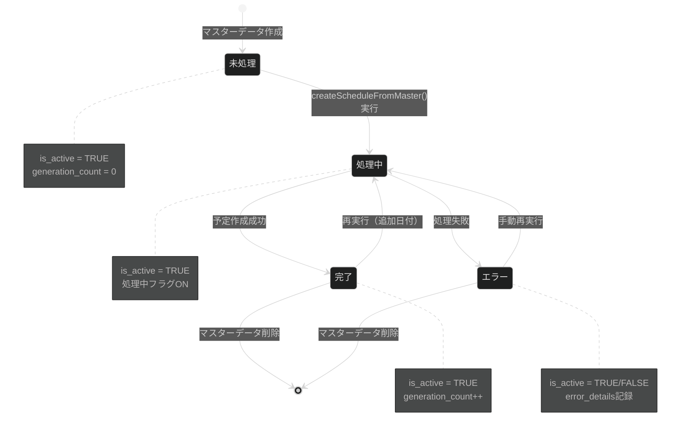

# Appsheet_訪問看護_定期スケジュール - 処理フロー図

## メイン処理フロー

```mermaid
%%{init: {'theme':'dark'}}%%
sequenceDiagram
    actor User as ユーザー
    participant GAS as Google Apps Script
    participant SS as スプレッドシート
    participant API as AppSheet API

    %% 実行開始
    User->>+GAS: createScheduleFromMaster(masterId, creatorId)
    Note over GAS: processRequestByMasterId()

    %% マスターデータ取得
    GAS->>+SS: getMasterDataById(masterId)
    SS-->>-GAS: マスターデータ返却

    alt マスターデータが見つからない
        GAS-->>User: エラー: master_id が見つかりません
    end

    %% ステータス更新（処理中）
    GAS->>+API: updateMasterStatus(masterId, "処理中")
    API-->>-GAS: OK

    %% 既存予定取得
    GAS->>+SS: getExistingScheduleData()
    Note over SS: Schedule_Planシートから<br/>既存予定を全取得
    SS-->>-GAS: {masterKeys: Set, visitorMap: Map}

    %% 日付計算
    Note over GAS: calculatePotentialDates(masterData)
    GAS->>GAS: 適用開始日〜終了日の範囲で<br/>frequency条件に合う日付を算出

    %% 重複チェック
    loop 各候補日付
        GAS->>GAS: 重複判定キー生成<br/>masterId|visitDate|startTime|endTime
        alt 既存予定に存在
            Note over GAS: スキップ
        else 新規予定
            Note over GAS: 作成リストに追加
        end
    end

    alt 作成対象が0件
        GAS->>+API: updateMasterStatus(masterId, "完了")
        API-->>-GAS: OK
        GAS-->>-User: 成功: 作成すべき新しい予定はありません
    end

    %% AppSheetに予定作成
    GAS->>+API: createSchedulesInAppSheet(rows)
    Note over API: AppSheet API<br/>Add Action
    API-->>-GAS: 作成成功

    %% ステータス更新（完了）
    GAS->>+API: updateMasterStatus(masterId, "完了")
    API-->>-GAS: OK

    %% 結果返却
    GAS-->>-User: 成功: N件の予定を作成しました

    %% エラーハンドリング
    Note over GAS,API: エラー発生時は<br/>status="エラー"に更新
```

---

## 重複防止の仕組み

```mermaid
%%{init: {'theme':'dark'}}%%
flowchart TD
    START([開始]) --> GET_EXISTING[既存予定をSchedule_Planから取得]

    GET_EXISTING --> CREATE_SET[重複判定キーのSetを作成]

    CREATE_SET --> LOOP_START{候補日付を<br/>順次処理}

    LOOP_START -->|各日付| GEN_KEY[重複判定キーを生成<br/>masterId|visitDate|startTime|endTime]

    GEN_KEY --> CHECK_DUP{Setに<br/>存在する?}

    CHECK_DUP -->|Yes| SKIP[スキップ]
    CHECK_DUP -->|No| ADD[作成リストに追加]

    SKIP --> LOOP_END{次の日付}
    ADD --> LOOP_END

    LOOP_END -->|まだある| LOOP_START
    LOOP_END -->|終了| CREATE_API[AppSheet APIで<br/>一括作成]

    CREATE_API --> END([終了])

    style START fill:#e94560,stroke:#16213e,stroke-width:2px
    style END fill:#e94560,stroke:#16213e,stroke-width:2px
    style GET_EXISTING fill:#0f3460,stroke:#16213e,stroke-width:2px
    style CREATE_SET fill:#0f3460,stroke:#16213e,stroke-width:2px
    style GEN_KEY fill:#16213e,stroke:#0f3460,stroke-width:2px
    style CHECK_DUP fill:#533483,stroke:#16213e,stroke-width:2px
    style SKIP fill:#1a1a2e,stroke:#16213e,stroke-width:2px
    style ADD fill:#1a1a2e,stroke:#16213e,stroke-width:2px
    style CREATE_API fill:#0f3460,stroke:#16213e,stroke-width:2px
```

---

## 日付計算ロジック（頻度別）

### 毎週

```mermaid
%%{init: {'theme':'dark'}}%%
flowchart TD
    START([開始]) --> INIT[currentDate = apply_start_date]

    INIT --> LOOP{currentDate ≤<br/>apply_end_date?}

    LOOP -->|Yes| CHECK_DOW{曜日が<br/>一致?}

    CHECK_DOW -->|Yes| ADD[日付を結果に追加]
    CHECK_DOW -->|No| SKIP[スキップ]

    ADD --> NEXT
    SKIP --> NEXT[currentDate += 1日]

    NEXT --> LOOP

    LOOP -->|No| END([終了])

    style START fill:#e94560,stroke:#16213e,stroke-width:2px
    style END fill:#e94560,stroke:#16213e,stroke-width:2px
    style CHECK_DOW fill:#533483,stroke:#16213e,stroke-width:2px
    style ADD fill:#0f3460,stroke:#16213e,stroke-width:2px
    style SKIP fill:#1a1a2e,stroke:#16213e,stroke-width:2px
```



### 隔週

```mermaid
%%{init: {'theme':'dark'}}%%
flowchart TD
    START([開始]) --> INIT[currentDate = apply_start_date]

    INIT --> LOOP{currentDate ≤<br/>apply_end_date?}

    LOOP -->|Yes| CHECK_DOW{曜日が<br/>一致?}

    CHECK_DOW -->|No| SKIP
    CHECK_DOW -->|Yes| CALC_WEEKS[経過週数を計算<br/>diffWeeks = floor(diffDays / 7)]

    CALC_WEEKS --> CHECK_EVEN{diffWeeks % 2<br/>== 0?}

    CHECK_EVEN -->|Yes| ADD[日付を結果に追加]
    CHECK_EVEN -->|No| SKIP[スキップ]

    ADD --> NEXT
    SKIP --> NEXT[currentDate += 1日]

    NEXT --> LOOP

    LOOP -->|No| END([終了])

    style START fill:#e94560,stroke:#16213e,stroke-width:2px
    style END fill:#e94560,stroke:#16213e,stroke-width:2px
    style CHECK_DOW fill:#533483,stroke:#16213e,stroke-width:2px
    style CALC_WEEKS fill:#16213e,stroke:#0f3460,stroke-width:2px
    style CHECK_EVEN fill:#533483,stroke:#16213e,stroke-width:2px
    style ADD fill:#0f3460,stroke:#16213e,stroke-width:2px
    style SKIP fill:#1a1a2e,stroke:#16213e,stroke-width:2px
```

### 毎月（第N週）

```mermaid
%%{init: {'theme':'dark'}}%%
flowchart TD
    START([開始]) --> INIT[currentDate = apply_start_date]

    INIT --> LOOP{currentDate ≤<br/>apply_end_date?}

    LOOP -->|Yes| CHECK_DOW{曜日が<br/>一致?}

    CHECK_DOW -->|No| SKIP
    CHECK_DOW -->|Yes| CALC_WEEK[その月の第何週かを計算<br/>weekOfMonth = floor((date - 1) / 7) + 1]

    CALC_WEEK --> CHECK_TARGET{weekOfMonth ==<br/>target_week?}

    CHECK_TARGET -->|Yes| ADD[日付を結果に追加]
    CHECK_TARGET -->|No| SKIP[スキップ]

    ADD --> NEXT
    SKIP --> NEXT[currentDate += 1日]

    NEXT --> LOOP

    LOOP -->|No| END([終了])

    style START fill:#e94560,stroke:#16213e,stroke-width:2px
    style END fill:#e94560,stroke:#16213e,stroke-width:2px
    style CHECK_DOW fill:#533483,stroke:#16213e,stroke-width:2px
    style CALC_WEEK fill:#16213e,stroke:#0f3460,stroke-width:2px
    style CHECK_TARGET fill:#533483,stroke:#16213e,stroke-width:2px
    style ADD fill:#0f3460,stroke:#16213e,stroke-width:2px
    style SKIP fill:#1a1a2e,stroke:#16213e,stroke-width:2px
```

---

## エラーハンドリングフロー

```mermaid
%%{init: {'theme':'dark'}}%%
flowchart TD
    START([処理開始]) --> TRY[try ブロック]

    TRY --> VALIDATE{パラメータ検証}

    VALIDATE -->|OK| GET_MASTER[マスターデータ取得]
    VALIDATE -->|NG| THROW_PARAM[エラー: パラメータ不正]

    GET_MASTER --> CHECK_EXIST{データ存在?}

    CHECK_EXIST -->|Yes| PROCESS[メイン処理実行]
    CHECK_EXIST -->|No| THROW_NOT_FOUND[エラー: データなし]

    PROCESS --> SUCCESS{成功?}

    SUCCESS -->|Yes| UPDATE_OK[ステータス: 完了]
    SUCCESS -->|No| THROW_PROCESS[エラー: 処理失敗]

    UPDATE_OK --> RETURN_OK[成功レスポンス返却]

    THROW_PARAM --> CATCH
    THROW_NOT_FOUND --> CATCH
    THROW_PROCESS --> CATCH

    CATCH[catch ブロック] --> LOG_ERROR[エラーログ出力]

    LOG_ERROR --> UPDATE_ERR[ステータス: エラー]

    UPDATE_ERR --> RETURN_ERR[エラーレスポンス返却]

    RETURN_OK --> END([終了])
    RETURN_ERR --> END

    style START fill:#e94560,stroke:#16213e,stroke-width:2px
    style END fill:#e94560,stroke:#16213e,stroke-width:2px
    style TRY fill:#0f3460,stroke:#16213e,stroke-width:2px
    style CATCH fill:#e94560,stroke:#16213e,stroke-width:3px
    style VALIDATE fill:#533483,stroke:#16213e,stroke-width:2px
    style CHECK_EXIST fill:#533483,stroke:#16213e,stroke-width:2px
    style SUCCESS fill:#533483,stroke:#16213e,stroke-width:2px
    style UPDATE_OK fill:#16213e,stroke:#0f3460,stroke-width:2px
    style UPDATE_ERR fill:#e94560,stroke:#16213e,stroke-width:2px
    style RETURN_OK fill:#0f3460,stroke:#16213e,stroke-width:2px
    style RETURN_ERR fill:#1a1a2e,stroke:#e94560,stroke-width:2px
```



---

## データフロー

```mermaid
%%{init: {'theme':'dark'}}%%
graph LR
    subgraph "入力"
        INPUT1[master_id]
        INPUT2[creator_id]
    end

    subgraph "Schedule_Master"
        MASTER[マスターデータ<br/>- frequency<br/>- day_of_week<br/>- apply_start_date<br/>- apply_end_date<br/>- start_time<br/>- end_time<br/>- etc.]
    end

    subgraph "Schedule_Plan<br/>（既存）"
        EXISTING[既存予定リスト<br/>- master_id<br/>- visit_date<br/>- start_time<br/>- end_time]
    end

    subgraph "処理"
        CALC[日付計算<br/>候補日付リスト]
        FILTER[重複フィルタ<br/>新規日付リスト]
        BUILD[予定データ構築<br/>rows配列]
    end

    subgraph "出力"
        OUTPUT1[Schedule_Plan<br/>新規予定追加]
        OUTPUT2[Schedule_Master<br/>status更新]
    end

    INPUT1 --> MASTER
    MASTER --> CALC
    EXISTING --> FILTER
    CALC --> FILTER
    FILTER --> BUILD
    INPUT2 --> BUILD
    BUILD --> OUTPUT1
    BUILD --> OUTPUT2

    style INPUT1 fill:#e94560,stroke:#16213e,stroke-width:2px
    style INPUT2 fill:#e94560,stroke:#16213e,stroke-width:2px
    style MASTER fill:#0f3460,stroke:#16213e,stroke-width:2px
    style EXISTING fill:#0f3460,stroke:#16213e,stroke-width:2px
    style CALC fill:#16213e,stroke:#0f3460,stroke-width:2px
    style FILTER fill:#16213e,stroke:#0f3460,stroke-width:2px
    style BUILD fill:#16213e,stroke:#0f3460,stroke-width:2px
    style OUTPUT1 fill:#533483,stroke:#16213e,stroke-width:2px
    style OUTPUT2 fill:#533483,stroke:#16213e,stroke-width:2px
```



---

## ステータス遷移図



---

## Webhook実行フロー

```mermaid
%%{init: {'theme':'dark'}}%%
sequenceDiagram
    actor AS as AppSheet
    participant WH as Webhook<br/>doPost()
    participant GAS as processRequestByMasterId()
    participant SS as Spreadsheet
    participant API as AppSheet API

    AS->>+WH: POST /exec<br/>{master_id, creator_id}

    WH->>WH: JSON parse

    WH->>+GAS: processRequestByMasterId(masterId, creatorId)

    GAS->>+SS: getMasterDataById(masterId)
    SS-->>-GAS: masterData

    GAS->>+SS: getExistingScheduleData()
    SS-->>-GAS: {masterKeys, visitorMap}

    GAS->>GAS: calculatePotentialDates(masterData)

    GAS->>GAS: 重複フィルタリング

    GAS->>+API: createSchedulesInAppSheet(rows)
    API-->>-GAS: success

    GAS->>+API: updateMasterStatus("完了")
    API-->>-GAS: success

    GAS-->>-WH: {status: "success", createdCount: N}

    WH-->>-AS: JSON response

    style AS fill:#e94560,stroke:#16213e,stroke-width:2px
    style WH fill:#0f3460,stroke:#16213e,stroke-width:2px
    style GAS fill:#16213e,stroke:#0f3460,stroke-width:2px
    style SS fill:#533483,stroke:#16213e,stroke-width:2px
    style API fill:#533483,stroke:#16213e,stroke-width:2px
```

---

## バッチ処理フロー（複数マスター一括実行）

```mermaid
%%{init: {'theme':'dark'}}%%
flowchart TD
    START([トリガー実行]) --> GET_LIST[全マスターIDリスト取得<br/>status = "未処理"<br/>is_active = TRUE]

    GET_LIST --> CHECK_EMPTY{リスト<br/>空?}

    CHECK_EMPTY -->|Yes| END([終了: 処理対象なし])
    CHECK_EMPTY -->|No| LOOP_START{各マスターID<br/>を順次処理}

    LOOP_START -->|各ID| PROCESS[createScheduleFromMaster(masterId)]

    PROCESS --> WAIT[待機<br/>Utilities.sleep(1000)]

    WAIT --> LOG[結果をログ出力]

    LOG --> LOOP_END{次のID}

    LOOP_END -->|まだある| LOOP_START
    LOOP_END -->|終了| SUMMARY[処理サマリー出力]

    SUMMARY --> END2([終了])

    style START fill:#e94560,stroke:#16213e,stroke-width:2px
    style END fill:#1a1a2e,stroke:#16213e,stroke-width:2px
    style END2 fill:#e94560,stroke:#16213e,stroke-width:2px
    style GET_LIST fill:#0f3460,stroke:#16213e,stroke-width:2px
    style CHECK_EMPTY fill:#533483,stroke:#16213e,stroke-width:2px
    style PROCESS fill:#16213e,stroke:#0f3460,stroke-width:2px
    style WAIT fill:#1a1a2e,stroke:#16213e,stroke-width:2px
    style LOG fill:#0f3460,stroke:#16213e,stroke-width:2px
    style SUMMARY fill:#0f3460,stroke:#16213e,stroke-width:2px
```
