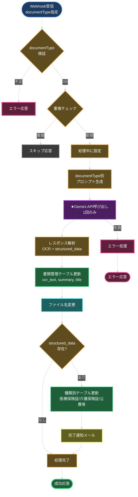
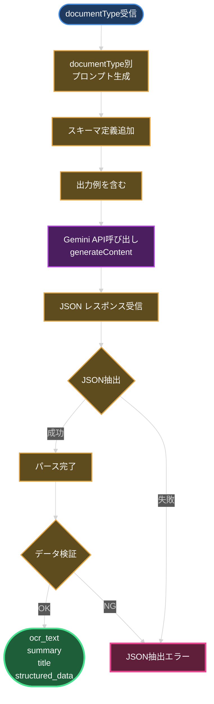
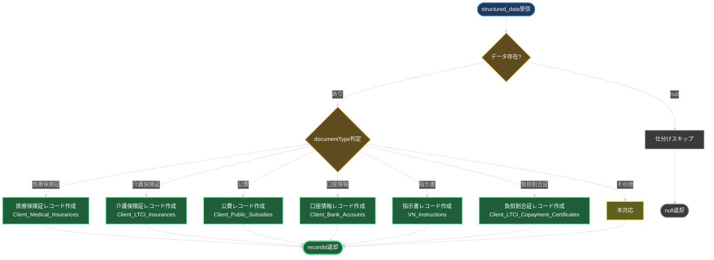
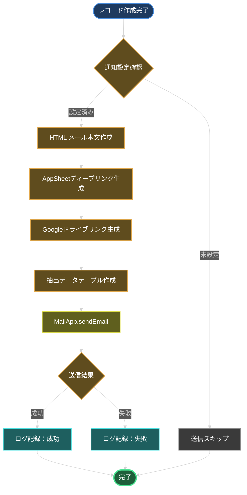
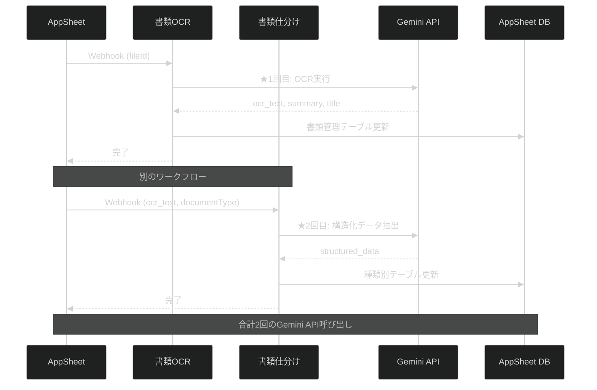
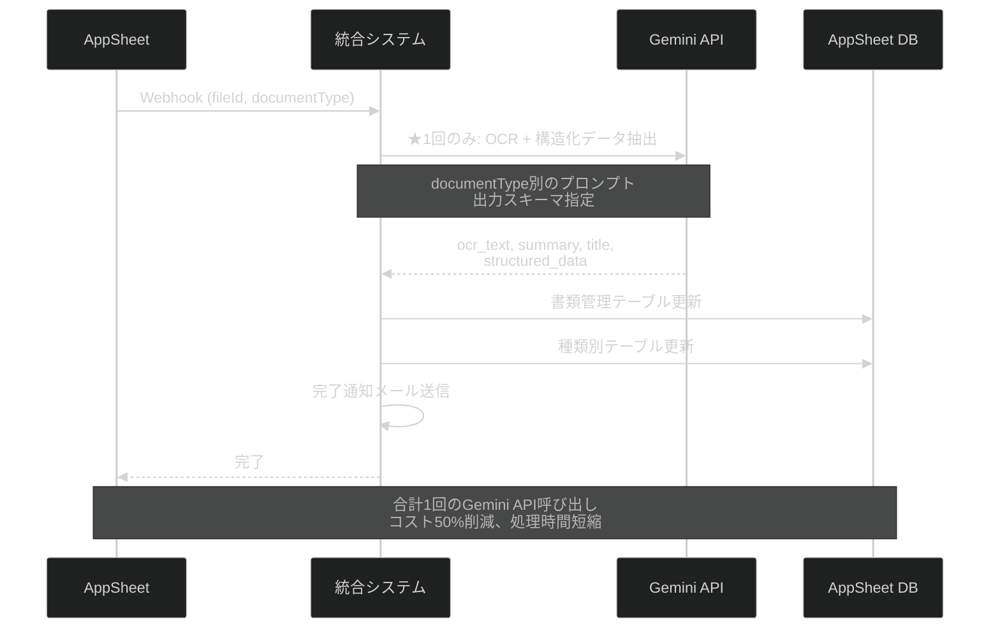
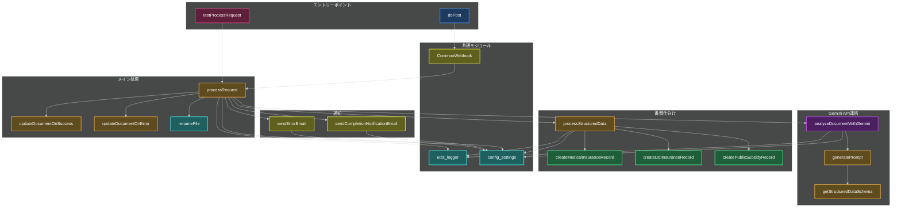

# Appsheet_訪問看護_書類OCR - 処理フロー図

本ドキュメントでは、書類OCR + 書類仕分け統合システムの処理フローを図解します。

## 1. メイン処理フロー（統合版）

## 2. Gemini API呼び出し詳細（1回で完結）

## 3. 書類仕分け処理フロー

## 4. 完了通知メール送信フロー

## 5. 従来版との比較

### 従来版（2回のAPI呼び出し）

### 統合版（1回のAPI呼び出し）

## 6. モジュール構成図

---

**最終更新**: 2025-10-18
**バージョン**: v2.0.0
