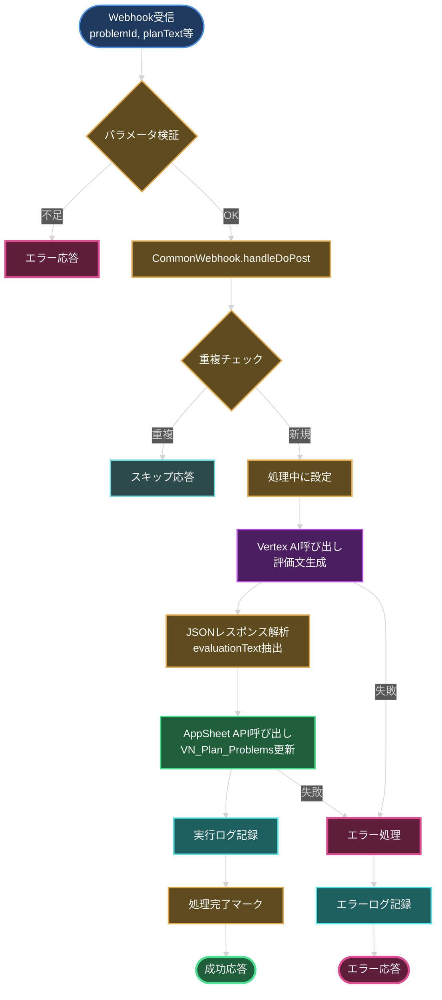
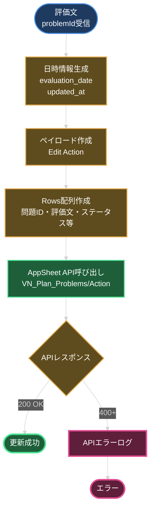
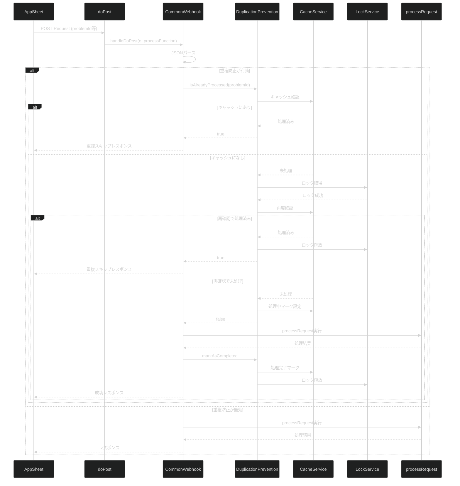
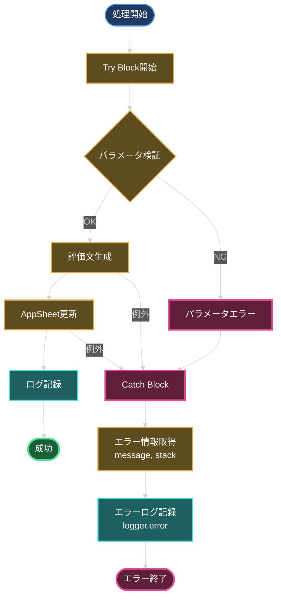
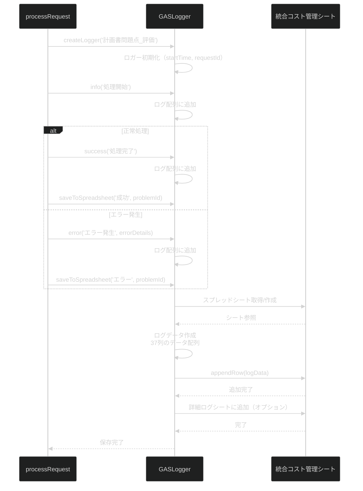
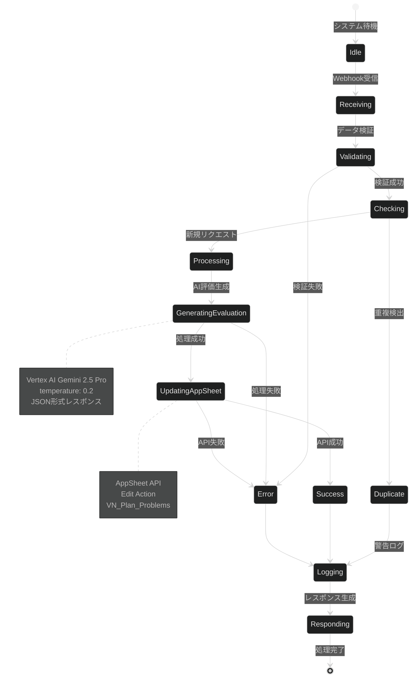
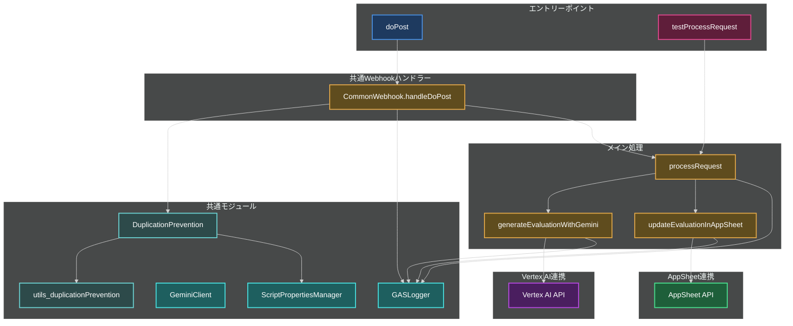
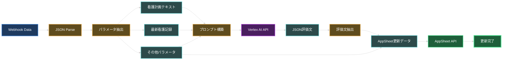
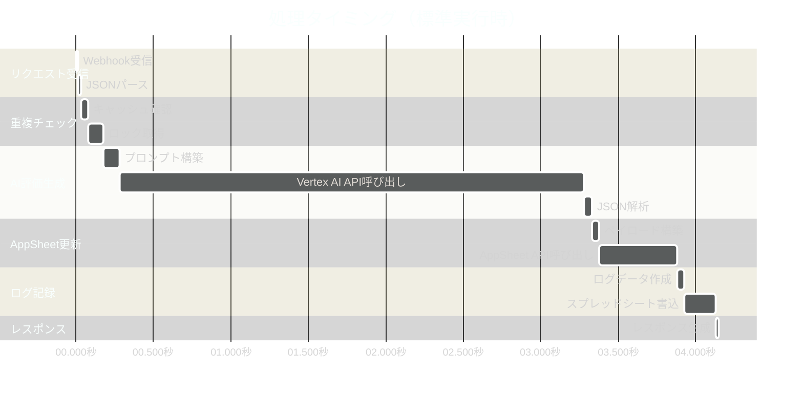

# Appsheet_訪問看護_計画書問題点_評価 - 処理フロー図

本ドキュメントでは、看護計画問題点評価システムの処理フローを図解します。

## 1. メイン処理フロー



## 2. Vertex AI評価生成フロー

```mermaid
%%{init: {'theme':'dark'}}%%
graph TB
    Start([看護計画<br/>最新記録受信]):::input --> BuildPrompt[プロンプト生成<br/>評価指示含む]:::process

    BuildPrompt --> Config[generationConfig設定<br/>JSON形式・temperature 0.2]:::process

    Config --> API[Vertex AI API呼び出し<br/>gemini-2.5-pro]:::gemini

    API --> Response{APIレスポンス}:::decision

    Response -->|200 OK| Extract[JSONレスポンス抽出<br/>candidates[0].content.parts[0].text]:::process
    Response -->|エラー| APIError[APIエラー]:::error

    Extract --> JSONParse[JSON範囲特定<br/>最初の\{から最後の\}]:::process

    JSONParse --> Parse{JSON解析}:::decision

    Parse -->|成功| Validate{評価文検証}:::decision
    Parse -->|失敗| ParseError[JSON解析エラー]:::error

    Validate -->|OK| Result([evaluationText返却<br/>50文字未満]):::success
    Validate -->|NG| ValidateError[データ不正]:::error

    APIError --> ErrorEnd([エラー]):::error
    ParseError --> ErrorEnd
    ValidateError --> ErrorEnd

    classDef input fill:#1e3a5f,stroke:#4a90e2,stroke-width:2px,color:#ffffff
    classDef process fill:#5f4c1e,stroke:#e2a84a,stroke-width:2px,color:#ffffff
    classDef decision fill:#5f4c1e,stroke:#e2a84a,stroke-width:2px,color:#ffffff
    classDef gemini fill:#4a1e5f,stroke:#b84ae2,stroke-width:2px,color:#ffffff
    classDef success fill:#1e5f3a,stroke:#4ae290,stroke-width:3px,color:#ffffff
    classDef error fill:#5f1e3a,stroke:#e24a90,stroke-width:3px,color:#ffffff
```

## 3. AppSheet更新フロー



## 4. 重複防止フロー



## 5. エラーハンドリングフロー



## 6. 実行ログ記録フロー



## 7. 状態遷移図



## 8. モジュール構成図



## 9. データフロー詳細



## 10. タイミング図



## 使用例

### 正常フロー

1. AppSheetからWebhook送信（problemId, planText, latestRecords等）
2. doPost関数でリクエスト受信
3. 重複チェック（初回なのでパス）
4. Vertex AI APIで評価文生成
5. AppSheet VN_Plan_Problemsテーブル更新
6. 成功ログ記録
7. 成功レスポンス返却

### 重複検出フロー

1. AppSheetから同じproblemIdで2回送信
2. 1回目: 正常処理
3. 2回目: キャッシュで重複検出
4. 警告ログ記録
5. スキップレスポンス返却

### エラーフロー

1. AppSheetからWebhook送信
2. Vertex AI API呼び出し中にエラー
3. Catchブロックでエラー捕捉
4. エラーログ記録（詳細とスタックトレース）
5. エラーレスポンス返却

---

**最終更新**: 2025-10-23
**バージョン**: v2.1.0
