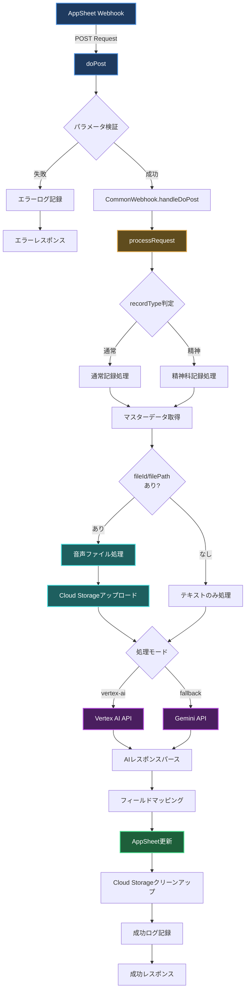
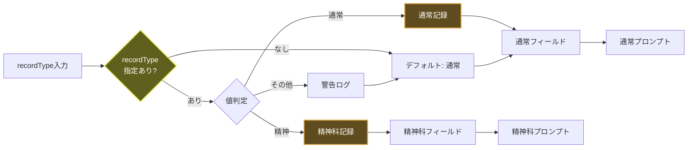
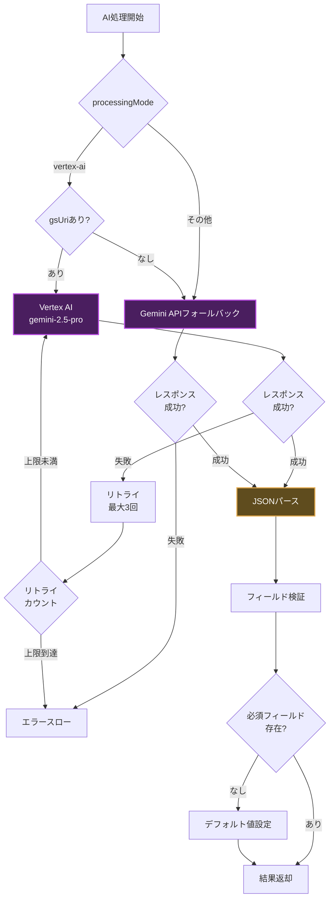
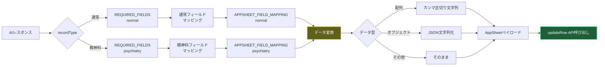
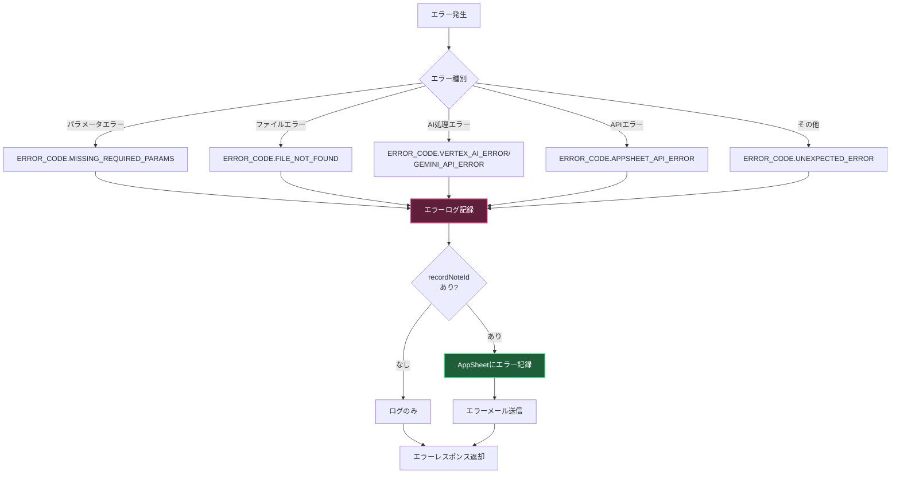
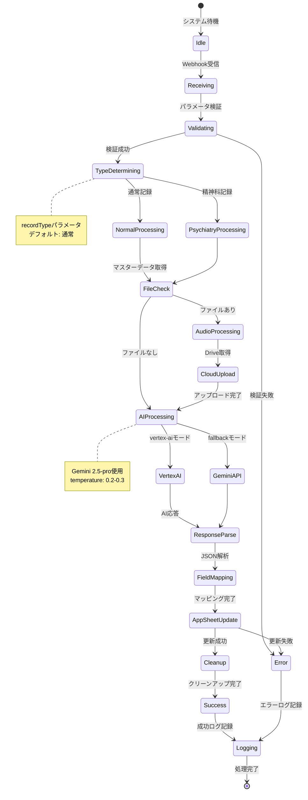
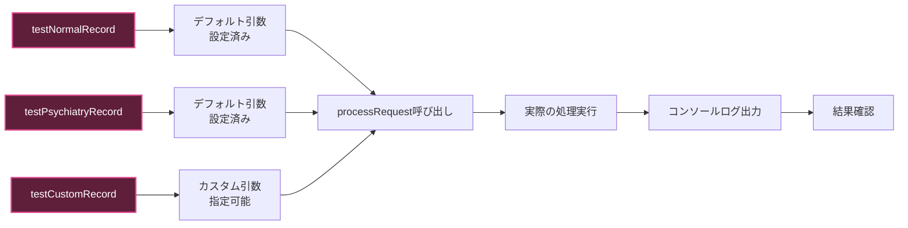

# Appsheet_訪問看護_通常記録 - フロー図

## システム概要

訪問看護記録の自動生成を行うGASプロジェクト。通常記録と精神科記録の両方に対応し、Gemini 2.5-proを使用してAI支援による記録作成を実現します。

## メイン処理フロー



## 記録タイプ判定フロー



## 音声ファイル処理フロー

```mermaid
sequenceDiagram
    participant P as processRequest
    participant D as DriveApp
    participant CS as Cloud Storage
    participant AI as Vertex AI/Gemini

    P->>D: fileId/filePathからファイル取得
    D-->>P: File Blob + MIME Type

    P->>P: ファイル名とMIME検証

    P->>CS: uploadToCloudStorage
    CS->>CS: バケットにアップロード
    CS-->>P: gsUri (gs://bucket/file)

    P->>AI: gsUri + mimeType + prompt
    AI-->>P: 生成結果JSON

    P->>CS: deleteFromCloudStorage
    CS->>CS: ファイル削除
    CS-->>P: 削除完了

    style P fill:#5f4c1e,stroke:#e2a84a,stroke-width:2px,color:#ffffff
    style D fill:#1e5f5f,stroke:#4ae2e2,stroke-width:2px,color:#ffffff
    style CS fill:#2d4a4a,stroke:#6dd6d6,stroke-width:2px,color:#ffffff
    style AI fill:#4a1e5f,stroke:#b84ae2,stroke-width:2px,color:#ffffff
```

## AIモデル選択フロー



## フィールドマッピングフロー



## エラーハンドリングフロー



## 状態遷移図



## テスト実行フロー



## コンポーネント構成図

```mermaid
graph TB
    subgraph "エントリーポイント"
        A[main.gs::doPost]
        B[main.gs::processRequest]
    end

    subgraph "共通モジュール"
        C[共通モジュール/CommonWebhook]
        D[共通モジュール/CommonTest]
    end

    subgraph "設定"
        E[config_settings.gs]
        F[utils_constants.gs]
    end

    subgraph "AI処理"
        G[modules_aiProcessor.gs]
        G1[callVertexAIWithPrompt]
        G2[callGeminiAPIWithPrompt]
        G3[buildNormalPrompt]
        G4[buildPsychiatryPrompt]
    end

    subgraph "データアクセス"
        H[modules_dataAccess.gs]
        I[modules_fileHandler.gs]
    end

    subgraph "AppSheet連携"
        J[modules_appsheetClient.gs]
    end

    subgraph "ユーティリティ"
        K[utils_validators.gs]
        L[utils_errorHandler.gs]
        M[utils_logger.gs]
    end

    subgraph "テスト"
        N[testNormalRecord]
        O[testPsychiatryRecord]
        P[testCustomRecord]
    end

    A --> C
    C --> B
    B --> E
    B --> K
    B --> G
    B --> H
    B --> I
    B --> J

    G --> G1
    G --> G2
    G --> G3
    G --> G4

    N --> B
    O --> B
    P --> B

    style A fill:#1e3a5f,stroke:#4a90e2,stroke-width:2px,color:#ffffff
    style B fill:#5f4c1e,stroke:#e2a84a,stroke-width:2px,color:#ffffff
    style C fill:#5f5f1e,stroke:#e2e24a,stroke-width:2px,color:#ffffff
    style D fill:#5f5f1e,stroke:#e2e24a,stroke-width:2px,color:#ffffff
    style E fill:#5f5f1e,stroke:#e2e24a,stroke-width:2px,color:#ffffff
    style F fill:#5f5f1e,stroke:#e2e24a,stroke-width:2px,color:#ffffff
    style G fill:#4a1e5f,stroke:#b84ae2,stroke-width:2px,color:#ffffff
    style G1 fill:#4a1e5f,stroke:#b84ae2,stroke-width:2px,color:#ffffff
    style G2 fill:#4a1e5f,stroke:#b84ae2,stroke-width:2px,color:#ffffff
    style H fill:#2d4a4a,stroke:#6dd6d6,stroke-width:2px,color:#ffffff
    style I fill:#1e5f5f,stroke:#4ae2e2,stroke-width:2px,color:#ffffff
    style J fill:#1e5f3a,stroke:#4ae290,stroke-width:2px,color:#ffffff
    style K fill:#5f5f1e,stroke:#e2e24a,stroke-width:2px,color:#ffffff
    style L fill:#5f5f1e,stroke:#e2e24a,stroke-width:2px,color:#ffffff
    style M fill:#5f5f1e,stroke:#e2e24a,stroke-width:2px,color:#ffffff
    style N fill:#5f1e3a,stroke:#e24a90,stroke-width:2px,color:#ffffff
    style O fill:#5f1e3a,stroke:#e24a90,stroke-width:2px,color:#ffffff
    style P fill:#5f1e3a,stroke:#e24a90,stroke-width:2px,color:#ffffff
```



## 使用例

### 正常フロー（通常記録）

1. AppSheetから通常記録Webhookを送信
2. `doPost`でリクエスト受信
3. `processRequest`で記録タイプ判定（通常）
4. マスターデータ取得
5. Vertex AIで記録生成（gemini-2.5-pro）
6. フィールドマッピング（通常記録フィールド）
7. AppSheetのCare_Recordsテーブル更新
8. 成功ログ記録・レスポンス返却

### 正常フロー（精神科記録 + 音声）

1. AppSheetから精神科記録Webhookを送信（fileId付き）
2. `doPost`でリクエスト受信
3. `processRequest`で記録タイプ判定（精神科）
4. マスターデータ取得
5. DriveからfileId音声ファイル取得
6. Cloud Storageにアップロード
7. Vertex AIで記録生成（gsUri + 精神科プロンプト）
8. フィールドマッピング（精神科フィールド）
9. AppSheet更新
10. Cloud Storageファイル削除
11. 成功ログ記録・レスポンス返却

### エラーフロー

1. AppSheetからWebhook送信
2. パラメータ検証失敗（必須項目不足）
3. エラーログ記録
4. AppSheetにエラーステータス記録
5. エラーメール送信
6. エラーレスポンス返却

## パフォーマンス考慮

### 処理時間の目安

- **テキストのみ（通常）**: 約3-5秒
- **テキストのみ（精神科）**: 約3-5秒
- **音声あり（通常）**: 約15-30秒
- **音声あり（精神科）**: 約15-30秒

### 最適化ポイント

1. **マスターデータキャッシュ**: `getGuidanceMasterCached()`で1時間キャッシュ
2. **並列処理**: 独立した処理は並列実行
3. **Cloud Storage自動クリーンアップ**: 処理後即座に削除
4. **リトライ戦略**: Vertex AIエラー時の指数バックオフ（30秒、1分、2分）
