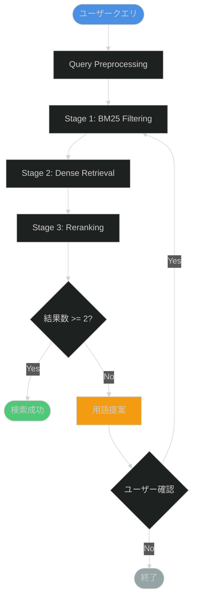
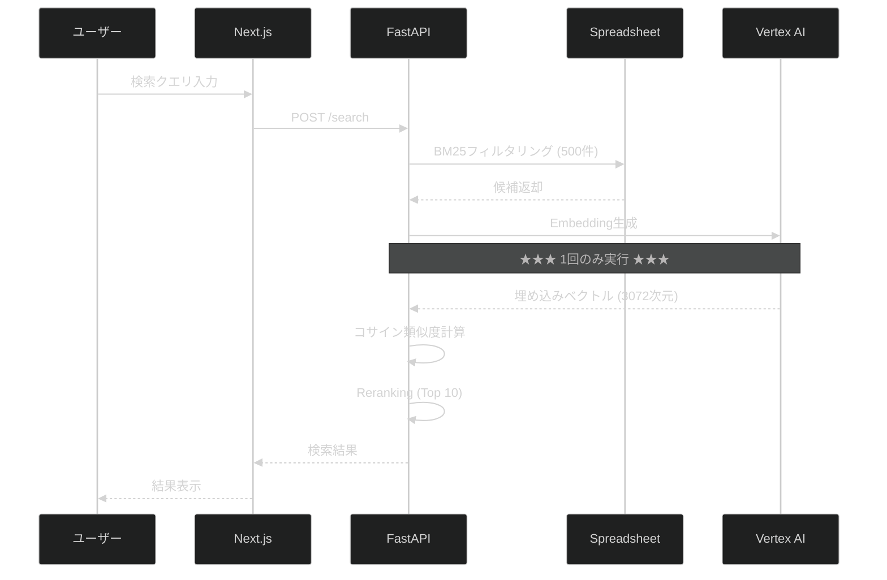

# RAGシステム - Claude Code プロジェクトガイド

## クイックスタート

このプロジェクトは**医療特化型RAGシステム**の開発プロジェクトです。

### よく使うコマンド

#### 開発環境管理

- `/start-dev` - Backend + Frontend 同時起動
- `/kill-dev` - 全開発サーバー停止
- `/restart-dev` - 開発サーバー再起動

#### データ処理

- `/vectorize-data` - 既存データのベクトル化

#### テスト・検証

- `/check-consistency` - 計画と実装の整合性チェック
- `/test-backend` - Backend単体テスト実行
- `/test-frontend` - Frontend単体テスト実行
- `/check-api-calls` - API呼び出し回数確認

#### デプロイ

- `/deploy-vercel` - Vercel デプロイ（Frontend）

#### ドキュメント

- `/update-docs` - ドキュメント更新

### 重要な制約

1. **API呼び出し: 絶対にリトライループを実装しない**
   - 1処理 = 1API呼び出し厳守
   - `docs/API_CALL_PREVENTION.md` を必読

2. **エラー記録: 全てのエラーを記録**
   - `docs/ERROR_LOG.md` に必ず記載
   - 発生日時、原因、解決策、再発防止策を明記

3. **セキュリティ: 個人情報保護**
   - ログ出力時はマスキング必須
   - `docs/07_SECURITY.md` 参照

4. **テスト: 実装前にテスト関数作成**
   - 全ての機能にテストを用意
   - API呼び出し回数を必ず確認

## プロジェクト構造

```
rag_system/
├── docs/              # 設計書・仕様書
│   ├── 01_PROJECT_OVERVIEW.md
│   ├── 02_ARCHITECTURE.md
│   ├── 03_HYBRID_SEARCH_SPEC.md
│   ├── 04_API_SPECIFICATION.md
│   ├── 06_DEPLOYMENT.md
│   ├── 07_SECURITY.md
│   ├── ERROR_LOG.md          # エラーログ
│   └── API_CALL_PREVENTION.md # API予防策
├── backend/           # FastAPI Backend
├── frontend/          # Next.js Frontend
├── .claude/           # Claude Code設定
└── README.md
```

## 開発ワークフロー

### 1. 新機能開発

1. `docs/01_PROJECT_OVERVIEW.md` でスコープ確認
2. 該当する仕様書確認 (`02_ARCHITECTURE.md`, `03_HYBRID_SEARCH_SPEC.md`等)
3. テスト関数作成
4. 実装
5. API呼び出し回数確認 (`/check-api-calls`)
6. ドキュメント更新 (`/update-docs`)
7. コミット

### 2. エラー対応

1. エラー内容を`docs/ERROR_LOG.md`に記録
   - 発生日時
   - エラーメッセージ
   - 発生状況
2. 原因調査
3. 解決策実施
4. `docs/ERROR_LOG.md`に結論・再発防止策を記載
5. コミット

### 3. API呼び出し実装

**必須チェック:**
- [ ] リトライループがないこと
- [ ] 1処理 = 1API呼び出しであること
- [ ] エラー時は即座に`throw`/`raise`すること
- [ ] API呼び出し前後にログ出力すること
- [ ] カウンター増加すること

**参考:**
- `docs/API_CALL_PREVENTION.md`
- `common_modules/embeddings_service.gs`

## コーディング規約

### GAS (Google Apps Script)

```javascript
/**
 * 関数説明
 *
 * @param {string} param1 - パラメータ説明
 * @returns {Object} 戻り値説明
 */
function functionName(param1) {
  const logger = createLogger('スクリプト名');

  try {
    // ★★★ API呼び出し: 1回のみ実行 ★★★
    logger.info('API呼び出し開始');
    const result = apiCall();
    logger.info('API呼び出し成功');
    return result;
  } catch (error) {
    logger.error(`エラー: ${error.toString()}`);
    throw error;  // 即座にスロー
  }
}
```

### Python (FastAPI)

```python
from typing import Optional
import logging

logger = logging.getLogger(__name__)

async def function_name(param1: str) -> dict:
    """
    関数説明

    Args:
        param1: パラメータ説明

    Returns:
        戻り値説明

    Raises:
        Exception: エラー説明
    """
    try:
        # ★★★ API呼び出し: 1回のみ実行 ★★★
        logger.info("API呼び出し開始")
        result = await api_call()
        logger.info("API呼び出し成功")
        return result
    except Exception as e:
        logger.error(f"エラー: {e}")
        raise  # 即座にraise
```

### TypeScript (Next.js)

```typescript
/**
 * 関数説明
 * @param param1 - パラメータ説明
 * @returns 戻り値説明
 */
export async function functionName(param1: string): Promise<Result> {
  try {
    // ★★★ API呼び出し: 1回のみ実行 ★★★
    console.log('API呼び出し開始');
    const result = await apiCall();
    console.log('API呼び出し成功');
    return result;
  } catch (error) {
    console.error('エラー:', error);
    throw error;  // 即座にthrow
  }
}
```

## Mermaid図の作成ガイドライン

### ダークモード対応配色

```mermaid
%%{init: {'theme':'dark', 'themeVariables': { 'primaryColor':'#4A90E2','secondaryColor':'#7B68EE','tertiaryColor':'#50C878','primaryBorderColor':'#4A90E2','secondaryBorderColor':'#7B68EE','tertiaryBorderColor':'#50C878'}}}%%
```

**カラーパレット:**
- Primary (青): `#4A90E2` - メインフロー
- Secondary (紫): `#7B68EE` - サブフロー
- Success (緑): `#50C878` - 成功パス
- Error (赤): `#E74C3C` - エラーパス
- Warning (黄): `#F39C12` - 警告
- Gray (灰): `#95A5A6` - 背景・補助

### フローチャート例



### シーケンス図例



## ドキュメント更新時の注意

1. **常に最新状態を保つ**
   - 実装変更時は必ず対応ドキュメントを更新
   - Mermaid図も更新

2. **エラーログは必ず記録**
   - `docs/ERROR_LOG.md` に追記

3. **API変更時はAPI仕様書更新**
   - `docs/04_API_SPECIFICATION.md`

4. **セキュリティ変更時は設計書更新**
   - `docs/07_SECURITY.md`

## テスト実行

### Backend

```bash
cd backend
pytest tests/ -v
```

### Frontend

```bash
cd frontend
npm test
npm run e2e
```

### API呼び出し回数確認

```bash
# GAS
# testAllRAGModules() を実行してログ確認

# Backend
curl http://localhost:8000/metrics | grep api_call_count
```

## デプロイ前チェックリスト

- [ ] 全テスト成功
- [ ] API呼び出し回数確認（異常な増加なし）
- [ ] エラーログ更新
- [ ] ドキュメント更新
- [ ] セキュリティチェック
- [ ] Mermaid図の更新
- [ ] コミットメッセージに変更内容明記

## 追加リソース

- [Vertex AI Embeddings API](https://cloud.google.com/vertex-ai/generative-ai/docs/embeddings/get-text-embeddings)
- [FastAPI Documentation](https://fastapi.tiangolo.com/)
- [Next.js Documentation](https://nextjs.org/docs)
- [Mermaid Documentation](https://mermaid.js.org/)

---

**最終更新**: 2025-10-27
**レビュー**: 毎週月曜日
