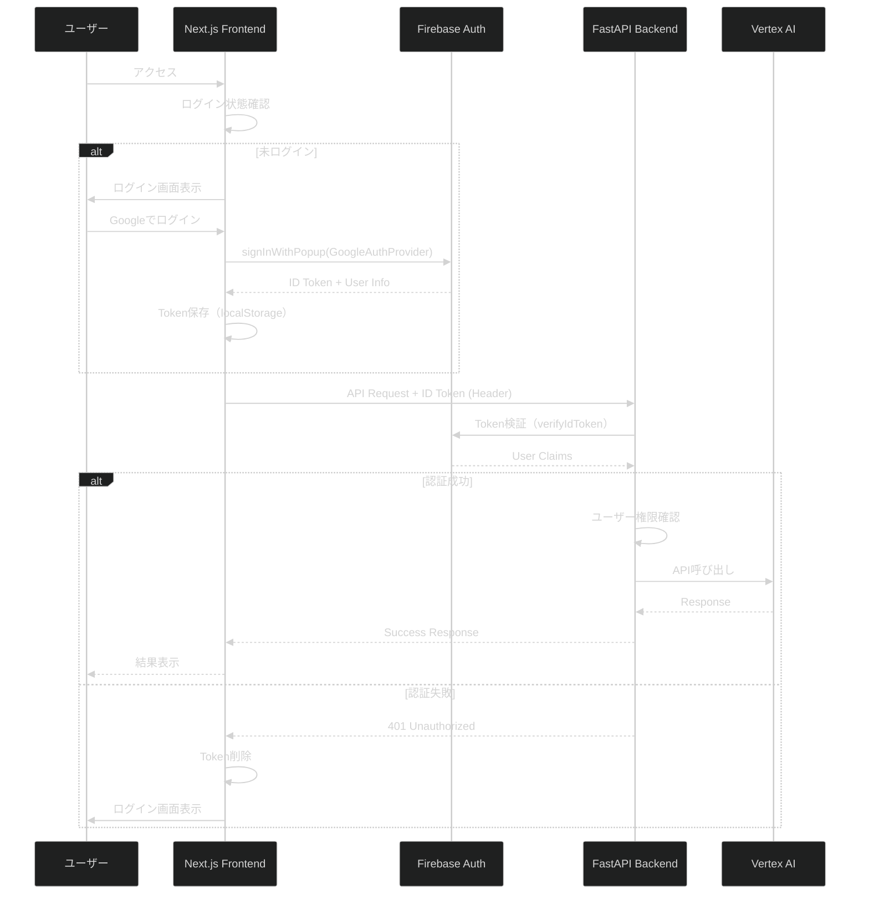

# Firebase認証統合設計書

**最終更新**: 2025-10-27
**ステータス**: 設計中
**対象環境**: Production

---

## 概要

RAG Medical Assistant APIに社内用OAuth2認証を統合します。Firebase Authenticationを使用し、Googleアカウントでのログインを実装します。

---

## 認証フロー



---

## アーキテクチャ設計

### 1. Frontend認証レイヤー（Next.js）

**ファイル構成:**
```
frontend/
├── src/
│   ├── lib/
│   │   ├── firebase.ts              # Firebase初期化
│   │   └── auth.ts                  # 認証ヘルパー関数
│   ├── contexts/
│   │   └── AuthContext.tsx          # 認証コンテキスト
│   ├── components/
│   │   ├── LoginPage.tsx            # ログイン画面
│   │   ├── ProtectedRoute.tsx       # 認証ガード
│   │   └── UserMenu.tsx             # ユーザーメニュー
│   └── hooks/
│       └── useAuth.ts               # 認証フック
└── .env.local                       # Firebase設定（Git除外）
```

**主要機能:**
- Firebase SDK初期化
- Googleプロバイダーでのログイン/ログアウト
- ID Token取得・更新
- 認証状態の管理（Context API）
- 保護されたルートコンポーネント

### 2. Backend認証レイヤー（FastAPI）

**ファイル構成:**
```
backend/
├── app/
│   ├── middleware/
│   │   └── auth.py                  # 認証ミドルウェア
│   ├── services/
│   │   └── firebase_admin.py        # Firebase Admin SDK
│   └── models/
│       └── user.py                  # ユーザーモデル
└── .env                             # Firebase Admin設定
```

**主要機能:**
- Firebase Admin SDK初期化
- ID Token検証
- ユーザー権限管理
- 認証デコレーター（`@require_auth`）
- エンドポイント保護

---

## 実装詳細

### Phase 1: Firebase設定

#### 1.1 Firebaseプロジェクト作成

```bash
# Firebase Consoleで実施
1. https://console.firebase.google.com/ にアクセス
2. "プロジェクトを追加" → 既存GCPプロジェクト選択（fractal-ecosystem）
3. Firebase プロジェクト作成完了
```

#### 1.2 Firebase Authentication有効化

```bash
# Firebase Console > Authentication > Sign-in method
1. Googleプロバイダーを有効化
2. 承認済みドメインに追加:
   - localhost（開発用）
   - your-production-domain.com（本番用）
```

#### 1.3 Firebase設定ファイル取得

**Frontend用（Web App）:**
```bash
# Firebase Console > プロジェクトの設定 > マイアプリ > Web
# SDKの設定と構成を取得

# frontend/.env.local に保存
NEXT_PUBLIC_FIREBASE_API_KEY=AIzaSy...
NEXT_PUBLIC_FIREBASE_AUTH_DOMAIN=fractal-ecosystem.firebaseapp.com
NEXT_PUBLIC_FIREBASE_PROJECT_ID=fractal-ecosystem
NEXT_PUBLIC_FIREBASE_STORAGE_BUCKET=fractal-ecosystem.appspot.com
NEXT_PUBLIC_FIREBASE_MESSAGING_SENDER_ID=411046620715
NEXT_PUBLIC_FIREBASE_APP_ID=1:411046620715:web:...
```

**Backend用（Service Account）:**
```bash
# Firebase Console > プロジェクトの設定 > サービスアカウント
# "新しい秘密鍵の生成" → JSON ダウンロード

# backend/.env に保存
FIREBASE_ADMIN_CREDENTIALS_PATH=/path/to/service-account-key.json

# または、環境変数として直接設定（Cloud Run推奨）
FIREBASE_ADMIN_CREDENTIALS_JSON='{"type":"service_account",...}'
```

---

### Phase 2: Frontend実装

#### 2.1 Firebase SDK初期化

**`frontend/src/lib/firebase.ts`:**
```typescript
import { initializeApp, getApps, FirebaseApp } from 'firebase/app';
import { getAuth, Auth } from 'firebase/auth';

const firebaseConfig = {
  apiKey: process.env.NEXT_PUBLIC_FIREBASE_API_KEY,
  authDomain: process.env.NEXT_PUBLIC_FIREBASE_AUTH_DOMAIN,
  projectId: process.env.NEXT_PUBLIC_FIREBASE_PROJECT_ID,
  storageBucket: process.env.NEXT_PUBLIC_FIREBASE_STORAGE_BUCKET,
  messagingSenderId: process.env.NEXT_PUBLIC_FIREBASE_MESSAGING_SENDER_ID,
  appId: process.env.NEXT_PUBLIC_FIREBASE_APP_ID,
};

// Firebase App初期化（シングルトン）
let app: FirebaseApp;
if (!getApps().length) {
  app = initializeApp(firebaseConfig);
} else {
  app = getApps()[0];
}

// Auth初期化
export const auth = getAuth(app);
export default app;
```

#### 2.2 認証コンテキスト

**`frontend/src/contexts/AuthContext.tsx`:**
```typescript
'use client';

import React, { createContext, useContext, useEffect, useState } from 'react';
import {
  User,
  GoogleAuthProvider,
  signInWithPopup,
  signOut as firebaseSignOut,
  onAuthStateChanged,
} from 'firebase/auth';
import { auth } from '@/lib/firebase';

interface AuthContextType {
  user: User | null;
  loading: boolean;
  signInWithGoogle: () => Promise<void>;
  signOut: () => Promise<void>;
  getIdToken: () => Promise<string | null>;
}

const AuthContext = createContext<AuthContextType | undefined>(undefined);

export function AuthProvider({ children }: { children: React.ReactNode }) {
  const [user, setUser] = useState<User | null>(null);
  const [loading, setLoading] = useState(true);

  useEffect(() => {
    const unsubscribe = onAuthStateChanged(auth, (user) => {
      setUser(user);
      setLoading(false);
    });

    return () => unsubscribe();
  }, []);

  const signInWithGoogle = async () => {
    const provider = new GoogleAuthProvider();
    try {
      await signInWithPopup(auth, provider);
    } catch (error) {
      console.error('ログインエラー:', error);
      throw error;
    }
  };

  const signOut = async () => {
    try {
      await firebaseSignOut(auth);
    } catch (error) {
      console.error('ログアウトエラー:', error);
      throw error;
    }
  };

  const getIdToken = async (): Promise<string | null> => {
    if (!user) return null;
    try {
      return await user.getIdToken();
    } catch (error) {
      console.error('トークン取得エラー:', error);
      return null;
    }
  };

  return (
    <AuthContext.Provider
      value={{ user, loading, signInWithGoogle, signOut, getIdToken }}
    >
      {children}
    </AuthContext.Provider>
  );
}

export const useAuth = () => {
  const context = useContext(AuthContext);
  if (context === undefined) {
    throw new Error('useAuth must be used within AuthProvider');
  }
  return context;
};
```

#### 2.3 ログイン画面

**`frontend/src/components/LoginPage.tsx`:**
```typescript
'use client';

import React, { useState } from 'react';
import { useAuth } from '@/contexts/AuthContext';
import { useRouter } from 'next/navigation';

export default function LoginPage() {
  const { signInWithGoogle } = useAuth();
  const [loading, setLoading] = useState(false);
  const [error, setError] = useState<string | null>(null);
  const router = useRouter();

  const handleLogin = async () => {
    setLoading(true);
    setError(null);

    try {
      await signInWithGoogle();
      router.push('/'); // ログイン成功後、ホームへリダイレクト
    } catch (error) {
      setError('ログインに失敗しました。もう一度お試しください。');
      console.error(error);
    } finally {
      setLoading(false);
    }
  };

  return (
    <div className="min-h-screen flex items-center justify-center bg-background">
      <div className="max-w-md w-full space-y-8 p-8 bg-card rounded-lg shadow-lg">
        <div className="text-center">
          <h2 className="text-3xl font-bold text-foreground">
            RAG Medical Assistant
          </h2>
          <p className="mt-2 text-sm text-muted-foreground">
            社内用Googleアカウントでログインしてください
          </p>
        </div>

        {error && (
          <div className="bg-red-100 border border-red-400 text-red-700 px-4 py-3 rounded">
            {error}
          </div>
        )}

        <button
          onClick={handleLogin}
          disabled={loading}
          className="w-full flex justify-center items-center gap-3 py-3 px-4 border border-gray-300 rounded-md shadow-sm text-sm font-medium text-gray-700 bg-white hover:bg-gray-50 focus:outline-none focus:ring-2 focus:ring-offset-2 focus:ring-indigo-500 disabled:opacity-50"
        >
          <svg className="w-5 h-5" viewBox="0 0 24 24">
            <path
              fill="#4285F4"
              d="M22.56 12.25c0-.78-.07-1.53-.2-2.25H12v4.26h5.92c-.26 1.37-1.04 2.53-2.21 3.31v2.77h3.57c2.08-1.92 3.28-4.74 3.28-8.09z"
            />
            <path
              fill="#34A853"
              d="M12 23c2.97 0 5.46-.98 7.28-2.66l-3.57-2.77c-.98.66-2.23 1.06-3.71 1.06-2.86 0-5.29-1.93-6.16-4.53H2.18v2.84C3.99 20.53 7.7 23 12 23z"
            />
            <path
              fill="#FBBC05"
              d="M5.84 14.09c-.22-.66-.35-1.36-.35-2.09s.13-1.43.35-2.09V7.07H2.18C1.43 8.55 1 10.22 1 12s.43 3.45 1.18 4.93l2.85-2.22.81-.62z"
            />
            <path
              fill="#EA4335"
              d="M12 5.38c1.62 0 3.06.56 4.21 1.64l3.15-3.15C17.45 2.09 14.97 1 12 1 7.7 1 3.99 3.47 2.18 7.07l3.66 2.84c.87-2.6 3.3-4.53 6.16-4.53z"
            />
          </svg>
          {loading ? 'ログイン中...' : 'Googleでログイン'}
        </button>
      </div>
    </div>
  );
}
```

#### 2.4 保護されたルート

**`frontend/src/components/ProtectedRoute.tsx`:**
```typescript
'use client';

import { useAuth } from '@/contexts/AuthContext';
import { useRouter } from 'next/navigation';
import { useEffect } from 'react';

export default function ProtectedRoute({ children }: { children: React.ReactNode }) {
  const { user, loading } = useAuth();
  const router = useRouter();

  useEffect(() => {
    if (!loading && !user) {
      router.push('/login');
    }
  }, [user, loading, router]);

  if (loading) {
    return (
      <div className="min-h-screen flex items-center justify-center">
        <div className="animate-spin rounded-full h-12 w-12 border-b-2 border-primary"></div>
      </div>
    );
  }

  if (!user) {
    return null;
  }

  return <>{children}</>;
}
```

#### 2.5 API呼び出しにトークン追加

**`frontend/src/lib/api.ts`（修正）:**
```typescript
import { getAuth } from 'firebase/auth';

export async function* streamChatMessage(...) {
  // ID Token取得
  const auth = getAuth();
  const user = auth.currentUser;

  if (!user) {
    throw new Error('認証が必要です');
  }

  const idToken = await user.getIdToken();

  const response = await fetch(`${API_URL}/chat/stream`, {
    method: 'POST',
    headers: {
      'Content-Type': 'application/json',
      'Authorization': `Bearer ${idToken}`,  // ★★★ ID Token追加 ★★★
    },
    body: JSON.stringify(request),
  });

  // ... 以降同じ
}
```

---

### Phase 3: Backend実装

#### 3.1 Firebase Admin SDK初期化

**`backend/app/services/firebase_admin.py`:**
```python
"""
Firebase Admin SDK初期化

ID Token検証とユーザー管理を提供します。
"""

import json
import logging
from typing import Optional, Dict, Any

import firebase_admin
from firebase_admin import auth, credentials
from app.config import get_settings

logger = logging.getLogger(__name__)
settings = get_settings()

# グローバルFirebase Adminインスタンス
_firebase_app: Optional[firebase_admin.App] = None


def initialize_firebase_admin():
    """
    Firebase Admin SDKを初期化

    環境変数からサービスアカウント認証情報を読み込みます。
    """
    global _firebase_app

    if _firebase_app is not None:
        logger.info("Firebase Admin SDK already initialized")
        return _firebase_app

    try:
        # 認証情報の読み込み
        if settings.firebase_admin_credentials_json:
            # JSON文字列から読み込み（Cloud Run推奨）
            cred_dict = json.loads(settings.firebase_admin_credentials_json)
            cred = credentials.Certificate(cred_dict)
            logger.info("Firebase credentials loaded from JSON string")
        elif settings.firebase_admin_credentials_path:
            # ファイルパスから読み込み（ローカル開発）
            cred = credentials.Certificate(settings.firebase_admin_credentials_path)
            logger.info(f"Firebase credentials loaded from {settings.firebase_admin_credentials_path}")
        else:
            raise ValueError("Firebase Admin credentials not configured")

        # Firebase Admin初期化
        _firebase_app = firebase_admin.initialize_app(cred)
        logger.info("✅ Firebase Admin SDK initialized successfully")

        return _firebase_app

    except Exception as e:
        logger.error(f"Failed to initialize Firebase Admin SDK: {e}", exc_info=True)
        raise


def verify_id_token(id_token: str) -> Dict[str, Any]:
    """
    Firebase ID Tokenを検証

    Args:
        id_token: Firebase ID Token

    Returns:
        検証済みユーザー情報（claims）

    Raises:
        ValueError: トークンが無効な場合
    """
    try:
        # トークン検証
        decoded_token = auth.verify_id_token(id_token)

        logger.info(f"✅ Token verified for user: {decoded_token.get('email')}")

        return decoded_token

    except firebase_admin.auth.InvalidIdTokenError:
        logger.warning("Invalid ID token")
        raise ValueError("Invalid authentication token")
    except firebase_admin.auth.ExpiredIdTokenError:
        logger.warning("Expired ID token")
        raise ValueError("Authentication token expired")
    except Exception as e:
        logger.error(f"Token verification error: {e}", exc_info=True)
        raise ValueError(f"Token verification failed: {str(e)}")


def get_firebase_app() -> firebase_admin.App:
    """
    Firebase Adminインスタンスを取得

    Returns:
        Firebase Admin App
    """
    if _firebase_app is None:
        return initialize_firebase_admin()
    return _firebase_app
```

#### 3.2 認証ミドルウェア

**`backend/app/middleware/auth.py`:**
```python
"""
認証ミドルウェア

Firebase ID Token検証とユーザー認証を提供します。
"""

import logging
from typing import Optional
from fastapi import Request, HTTPException, status
from fastapi.security import HTTPBearer, HTTPAuthorizationCredentials

from app.services.firebase_admin import verify_id_token

logger = logging.getLogger(__name__)

# Bearer Token認証スキーム
security = HTTPBearer()


async def get_current_user(
    credentials: HTTPAuthorizationCredentials = security
) -> dict:
    """
    現在のユーザーを取得

    Args:
        credentials: Bearer Token認証情報

    Returns:
        検証済みユーザー情報

    Raises:
        HTTPException: 認証失敗時
    """
    token = credentials.credentials

    try:
        # Firebase ID Token検証
        user_info = verify_id_token(token)

        logger.info(f"Authenticated user: {user_info.get('email')}")

        return user_info

    except ValueError as e:
        logger.warning(f"Authentication failed: {e}")
        raise HTTPException(
            status_code=status.HTTP_401_UNAUTHORIZED,
            detail=str(e),
            headers={"WWW-Authenticate": "Bearer"},
        )


async def get_current_user_optional(
    request: Request
) -> Optional[dict]:
    """
    現在のユーザーを取得（オプショナル）

    認証ヘッダーがない場合はNoneを返します。

    Args:
        request: FastAPI Request

    Returns:
        検証済みユーザー情報またはNone
    """
    auth_header = request.headers.get("Authorization")

    if not auth_header or not auth_header.startswith("Bearer "):
        return None

    token = auth_header.split(" ")[1]

    try:
        user_info = verify_id_token(token)
        return user_info
    except ValueError:
        return None
```

#### 3.3 設定追加

**`backend/app/config.py`（追加）:**
```python
# Firebase Admin設定
firebase_admin_credentials_path: str = ""  # サービスアカウントJSONファイルパス
firebase_admin_credentials_json: str = ""  # サービスアカウントJSON文字列（Cloud Run用）
require_authentication: bool = False       # 認証を必須にするか（段階的導入用）
```

#### 3.4 エンドポイント保護

**`backend/app/routers/chat.py`（修正例）:**
```python
from fastapi import Depends
from app.middleware.auth import get_current_user

@router.post("/stream")
async def chat_stream(
    request: ChatRequest,
    current_user: dict = Depends(get_current_user)  # ★★★ 認証必須 ★★★
):
    """
    チャットストリーミング（認証必須）

    Args:
        request: チャットリクエスト
        current_user: 認証済みユーザー情報
    """
    logger.info(f"Chat request from user: {current_user.get('email')}")

    # ... 既存の実装 ...
```

#### 3.5 main.pyに追加

**`backend/app/main.py`（修正）:**
```python
from app.services.firebase_admin import initialize_firebase_admin

@asynccontextmanager
async def lifespan(app: FastAPI):
    # 起動時処理
    logger.info("=" * 60)

    # Firebase Admin SDK初期化
    try:
        initialize_firebase_admin()
    except Exception as e:
        logger.error(f"Firebase Admin initialization failed: {e}")
        # 認証が必須でない場合は続行
        if settings.require_authentication:
            raise

    # ... 既存の起動処理 ...

    yield

    # ... 既存の終了処理 ...
```

---

### Phase 4: デプロイ設定

#### 4.1 環境変数設定

**`backend/.env.example`（追加）:**
```bash
# ================================================================
# Firebase Authentication設定
# ================================================================
# サービスアカウントJSONファイルパス（ローカル開発）
FIREBASE_ADMIN_CREDENTIALS_PATH=/path/to/service-account-key.json

# サービスアカウントJSON文字列（Cloud Run本番）
# FIREBASE_ADMIN_CREDENTIALS_JSON='{"type":"service_account",...}'

# 認証を必須にする（段階的導入: false → true）
REQUIRE_AUTHENTICATION=false
```

#### 4.2 Cloud Runデプロイ

```bash
# サービスアカウントJSONをSecret Managerに保存
cat service-account-key.json | gcloud secrets create FIREBASE_ADMIN_CREDENTIALS \
  --data-file=-

# Cloud Runデプロイ時にSecret追加
gcloud run deploy rag-backend \
  --source backend/ \
  --region us-central1 \
  --set-secrets FIREBASE_ADMIN_CREDENTIALS_JSON=FIREBASE_ADMIN_CREDENTIALS:latest \
  --set-env-vars REQUIRE_AUTHENTICATION=true
```

#### 4.3 Frontend環境変数

**Vercel環境変数設定:**
```bash
# Vercelダッシュボード > Settings > Environment Variables
NEXT_PUBLIC_FIREBASE_API_KEY=AIzaSy...
NEXT_PUBLIC_FIREBASE_AUTH_DOMAIN=fractal-ecosystem.firebaseapp.com
NEXT_PUBLIC_FIREBASE_PROJECT_ID=fractal-ecosystem
NEXT_PUBLIC_FIREBASE_STORAGE_BUCKET=fractal-ecosystem.appspot.com
NEXT_PUBLIC_FIREBASE_MESSAGING_SENDER_ID=411046620715
NEXT_PUBLIC_FIREBASE_APP_ID=1:411046620715:web:...
```

---

## セキュリティ考慮事項

### 1. トークン管理

- **有効期限**: Firebase ID Tokenは1時間で自動失効
- **自動更新**: Firebase SDKが自動的にトークンをリフレッシュ
- **保存場所**: メモリ内のみ（localStorageには保存しない）

### 2. CORS設定

```python
# 認証済みドメインのみ許可
cors_origins: list[str] = [
    "https://your-production-domain.com"
]
```

### 3. 権限管理

**将来の拡張:**
- カスタムクレームで役割管理（admin, user, viewer）
- エンドポイントごとの権限チェック
- 組織・部署による制限

---

## テスト計画

### 1. 単体テスト

```python
# tests/test_firebase_auth.py
def test_verify_valid_token():
    """有効なトークンを検証"""
    # モックトークン生成
    # verify_id_token() テスト

def test_verify_expired_token():
    """期限切れトークンを拒否"""
    # 期限切れトークン
    # ValueError発生を確認
```

### 2. 統合テスト

```typescript
// frontend/tests/auth.test.ts
describe('Authentication Flow', () => {
  it('should login with Google', async () => {
    // ログインフロー実行
    // トークン取得確認
  });

  it('should redirect to login when unauthenticated', async () => {
    // 未認証アクセス
    // リダイレクト確認
  });
});
```

---

## ロールアウト計画

### Phase 1: 開発環境テスト（1週間）
- [ ] Firebase設定完了
- [ ] Frontend認証UI実装
- [ ] Backend認証ミドルウェア実装
- [ ] ローカルでのE2Eテスト

### Phase 2: ステージング環境（1週間）
- [ ] ステージング環境デプロイ
- [ ] 社内ユーザーでのアルファテスト
- [ ] バグ修正・UI調整

### Phase 3: 本番環境（段階的）
- [ ] 認証オプショナル（`REQUIRE_AUTHENTICATION=false`）でデプロイ
- [ ] 一部ユーザーでベータテスト
- [ ] フィードバック収集・改善
- [ ] 認証必須化（`REQUIRE_AUTHENTICATION=true`）

---

## トラブルシューティング

### 問題: "Invalid ID token"

**原因**: トークンが無効または期限切れ

**解決策:**
```typescript
// Frontend: トークン再取得
const user = getAuth().currentUser;
await user?.getIdToken(true);  // 強制リフレッシュ
```

### 問題: "Firebase Admin SDK not initialized"

**原因**: サービスアカウント認証情報が設定されていない

**解決策:**
```bash
# 環境変数確認
echo $FIREBASE_ADMIN_CREDENTIALS_PATH

# Secret Manager確認（Cloud Run）
gcloud secrets versions access latest --secret=FIREBASE_ADMIN_CREDENTIALS
```

---

## 参考リンク

- [Firebase Authentication Docs](https://firebase.google.com/docs/auth)
- [Firebase Admin SDK (Python)](https://firebase.google.com/docs/admin/setup)
- [Google Sign-In for Web](https://developers.google.com/identity/sign-in/web)
- [FastAPI Security](https://fastapi.tiangolo.com/tutorial/security/)

---

**次のステップ:**
1. Firebase Console設定
2. Frontend認証UI実装
3. Backend認証ミドルウェア実装
4. ローカルテスト
5. ステージングデプロイ
6. 本番ロールアウト

---

**最終更新**: 2025-10-27
**作成者**: Claude Code
**レビュー**: 必須（実装前）
