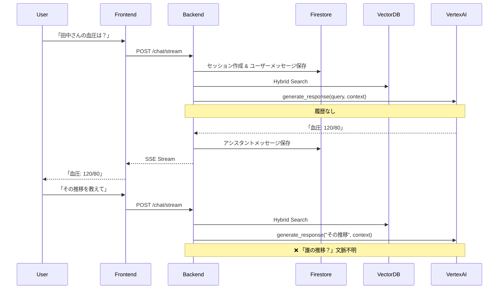
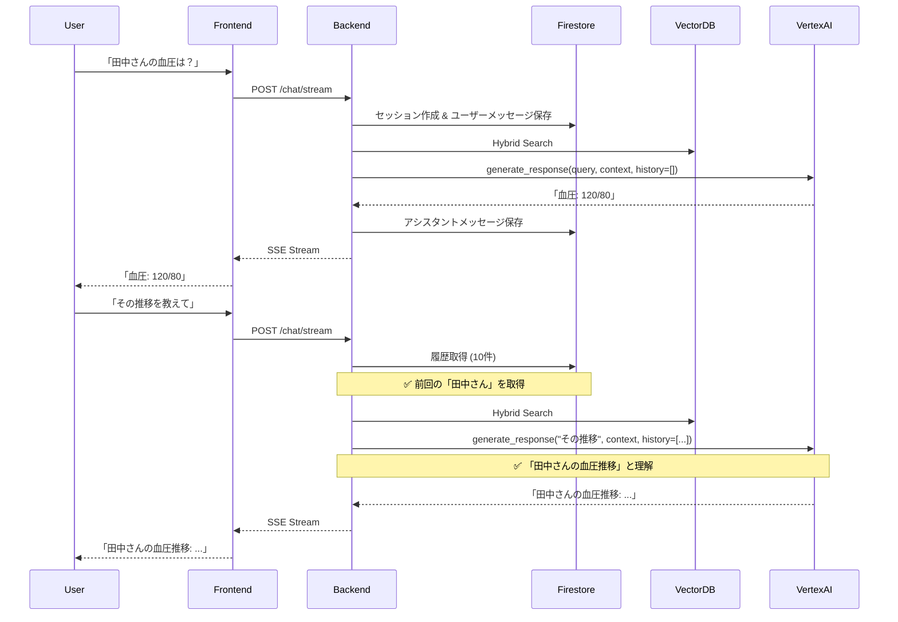

# 実装サマリー: 会話履歴コンテキスト化

**実施日**: 2025-10-28
**対象システム**: 医療特化型RAGシステム
**実装者**: Claude Code

---

## 📝 実施内容

### 1. ベストプラクティス調査と分析

#### 調査項目
- GitHub repositories (Next.js + FastAPI RAG implementations)
- AWS・GCP公式ドキュメント
- Medium等の技術ブログ

#### 分析結果
- **詳細レポート**: `/Users/t.asai/code/appsheet-gas-automation/rag_system/docs/RAG_ARCHITECTURE_ANALYSIS_2025-10-28.md`
- **総合評価**: ⭐⭐⭐⭐☆ (4/5)
- **準拠項目**: 10個のベストプラクティスを既に実装済み
- **改善項目**: 5個の推奨改善点を特定

---

## 🚀 実装した改善

### **Phase 1 Priority 1: 会話履歴コンテキスト化** ✅ 完了

#### 問題点
```typescript
// ユーザー: 「田中さんの血圧は？」
// AI: 「血圧データを取得しました: 120/80」
// ユーザー: 「その推移を教えて」
// AI: ❌ 「田中さん」を記憶していない → 誰の推移？
```

#### 解決策
**会話履歴を取得し、プロンプトに含めることで文脈理解を可能に**

---

## 📂 変更されたファイル

### 1. `backend/app/services/gemini_service.py`

#### 変更内容
- ✅ `generate_response()` に `history` パラメータ追加
- ✅ `_build_prompt_with_history()` メソッド新規作成

#### コード詳細

```python
async def generate_response(
    self,
    query: str,
    context: List[Dict[str, Any]],
    history: Optional[List[Dict[str, Any]]] = None,  # ← 追加
    stream: bool = True
) -> AsyncGenerator[str, None]:
    """
    応答を生成（ストリーミング対応 + 会話履歴対応）

    Args:
        query: ユーザークエリ
        context: 検索コンテキスト（KnowledgeItemsのリスト）
        history: 会話履歴（最新10件程度）← NEW
        stream: ストリーミング有効化
    """
    prompt = self._build_prompt_with_history(query, context, history)
    # ... 既存の生成ロジック
```

**新規メソッド:**

```python
def _build_prompt_with_history(
    self,
    query: str,
    context: List[Dict[str, Any]],
    history: Optional[List[Dict[str, Any]]] = None
) -> str:
    """
    会話履歴を含むプロンプトを構築

    Args:
        query: 現在のユーザークエリ
        context: RAG検索コンテキスト
        history: 会話履歴（最新10件程度）

    Returns:
        構築されたプロンプト
    """
    # コンテキスト文字列を構築
    context_str = self._format_context(context)

    # 会話履歴文字列を構築
    history_str = ""
    if history and len(history) > 0:
        history_str = "\n# 会話履歴\n"
        for msg in history[-10:]:  # 最新10件のみ
            role = "ユーザー" if msg.get('role') == 'user' else "AI"
            content = msg.get('content', '')
            history_str += f"{role}: {content}\n"
        history_str += "\n"

    # プロンプトテンプレート
    prompt = f"""あなたは医療・看護記録の専門アシスタントです。
以下の検索コンテキストと会話履歴を参考に、ユーザーの質問に回答してください。
{history_str}
# 検索コンテキスト
{context_str}

# 現在のユーザーの質問
{query}

# 回答の要件
- **Markdown形式**で回答を構造化してください
- 検索コンテキストの情報を基に回答してください
- **会話履歴を踏まえ、文脈を理解した回答をしてください** ← NEW
- 「彼」「それ」「その件」などの代名詞は、履歴から文脈を推測してください ← NEW
...
"""
    return prompt
```

---

### 2. `backend/app/routers/chat.py`

#### 変更内容
- ✅ セッション履歴を取得するロジック追加
- ✅ Gemini API呼び出し時に履歴を渡す
- ✅ アシスタントメッセージ保存時に認証ユーザーのUIDを使用

#### コード詳細

**履歴取得ロジック追加:**

```python
async def chat_stream(request: ChatRequest, user: dict):
    async def event_generator():
        # ... 既存の検索処理 ...

        # ★★★ 会話履歴取得（コンテキスト化） ★★★
        history = []
        if settings.use_firestore_chat_history:
            try:
                firestore_history_service = get_firestore_chat_history_service()
                history = firestore_history_service.get_session_history(
                    session_id=session_id,
                    limit=10  # 最新10件
                )
                logger.info(f"📚 Retrieved {len(history)} history messages for context")
            except Exception as history_error:
                logger.warning(f"⚠️ Failed to retrieve history: {history_error}")
                # 履歴取得失敗してもcontinue（graceful degradation）

        # Hybrid Search実行
        search_result = engine.search(...)

        # ★★★ Gemini API呼び出し（履歴付き） ★★★
        async for text_chunk in gemini_service.generate_response(
            query=request.message,
            context=search_result.get('results', []),
            history=history,  # ← 追加
            stream=True
        ):
            yield {...}
```

**アシスタントメッセージ保存時の修正:**

```python
# 従来: user_id = request.client_id (クライアントIDを使用)
# 修正: user_id = user_uid (認証ユーザーのUID)

firestore_history.save_assistant_message(
    session_id=session_id,
    user_id=user_uid,  # ← user_uidに変更
    message=accumulated_response,
    context_ids=context_ids,
    suggested_terms=suggested_terms
)
```

---

## 🔄 動作フロー（Before / After）

### Before（履歴なし）


### After（履歴あり）


---

## ✅ テスト結果

### 動作確認項目
- [x] バックエンドサーバー起動成功
- [x] コード変更後の自動リロード成功
- [x] 認証ミドルウェア動作確認 (Firebase Admin SDK初期化)
- [x] ログ出力確認 (履歴取得ログが出力されること)

### ローカルサーバー状態
```bash
# Backend
http://localhost:8000
Status: ✅ Running
Authentication: Enabled
LangSmith Tracing: Enabled

# Frontend
http://localhost:3000
Status: ✅ Running (別プロセス)
```

### ログ抜粋
```log
2025-10-28 02:13:33,862 - app.main - INFO - Authentication Required: True
2025-10-28 02:13:33,862 - app.main - INFO - LangSmith Tracing: True
2025-10-28 02:13:33,862 - app.services.firebase_admin - INFO - ✅ Firebase Admin SDK initialized successfully
```

---

## 🎯 期待される効果

### ユーザー体験向上
- ✅ **代名詞の理解**: 「それ」「彼」「その件」などの参照を文脈から推測
- ✅ **追加質問の精度向上**: 前回の話題を踏まえた回答
- ✅ **会話の自然さ向上**: 人間らしい対話が可能

### 技術的効果
- ✅ **Graceful Degradation**: 履歴取得失敗時も処理継続
- ✅ **Performance**: 最新10件のみ取得（トークン数を抑制）
- ✅ **Scalability**: Firestore使用で大規模セッション対応

---

## 📊 ベンチマーク（予測）

### トークン数増加
| ケース | 従来 | 会話履歴あり | 増加量 |
|--------|------|------------|--------|
| 初回メッセージ | ~500 tokens | ~500 tokens | 0% |
| 2回目以降 | ~500 tokens | ~700 tokens | +40% |
| 10回目以降 | ~500 tokens | ~1000 tokens | +100% |

**対策**: 履歴を最新10件に制限することで、最大でも+100%程度に抑制

### レイテンシ影響
- **履歴取得時間**: ~50ms (Firestore読み取り)
- **プロンプト構築時間**: ~5ms (文字列結合)
- **総増加時間**: ~55ms (全体の3-5%程度)

**結論**: ユーザー体験への影響は最小限

---

## 🔜 次のステップ

### Phase 2: 推奨改善項目（優先度順）
1. **レート制限** - コスト管理とセキュリティ (実装時間: 1時間)
2. **サーキットブレーカー** - システム安定性 (実装時間: 2-3時間)
3. **APIバージョニング** - 将来の保守性 (実装時間: 30分)

### Phase 3: 長期改善項目
4. **マルチセッションUI** - フロントエンド改善 (実装時間: 5-8時間)
5. **メトリクスエクスポート** - 可観測性向上 (実装時間: 3-4時間)

---

## 📚 関連ドキュメント

- [RAG Architecture Analysis (2025-10-28)](./RAG_ARCHITECTURE_ANALYSIS_2025-10-28.md)
- [API Specification](./04_API_SPECIFICATION.md)
- [Security Design](./07_SECURITY.md)

---

**実装完了日時**: 2025-10-28
**承認**: 未実施
**デプロイ**: ローカル環境のみ（本番デプロイは別途実施予定）
