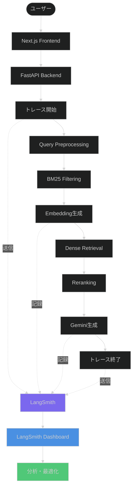

# LangSmith監視統合設計書

**最終更新**: 2025-10-27
**ステータス**: 設計中
**対象環境**: Production

---

## 概要

LangSmithをRAG Medical Assistant APIに統合し、LLM呼び出しのトレーシング、パフォーマンス監視、コスト追跡、プロンプト最適化を実現します。

---

## LangSmithとは

**LangSmith** は、LLMアプリケーション開発のための観測性プラットフォームです。

**主要機能:**
- **トレーシング**: LLM呼び出しのエンドツーエンド可視化
- **プロンプト管理**: バージョン管理とA/Bテスト
- **パフォーマンス分析**: レイテンシ、トークン使用量、コスト
- **デバッグ**: エラーログ、入出力の詳細記録
- **評価**: プロンプトの品質評価とベンチマーク

---

## アーキテクチャ設計



---

## トレーシング設計

### 1. トレース階層

```
Root Trace: /chat/stream
├── Span 1: Query Preprocessing
├── Span 2: BM25 Filtering (Spreadsheet)
├── Span 3: Embedding Generation (Vertex AI)
│   └── LLM Call: Vertex AI Embeddings
├── Span 4: Dense Retrieval (Cosine Similarity)
├── Span 5: Reranking (Vertex AI Ranking API)
│   └── LLM Call: Vertex AI Ranking
└── Span 6: Response Generation (Gemini)
    └── LLM Call: Vertex AI Gemini
```

### 2. 記録される情報

各スパンで以下を記録:

| 項目 | 内容 | 例 |
|------|------|-----|
| **入力** | クエリテキスト、パラメータ | "利用者Aの血圧は?" |
| **出力** | 検索結果、生成テキスト | "血圧: 120/80 mmHg" |
| **メタデータ** | クライアントID、ユーザーID | client_12345 |
| **タイミング** | 開始時刻、終了時刻、所要時間 | 2.3秒 |
| **トークン数** | 入力トークン、出力トークン | 1000 / 500 |
| **コスト** | API呼び出しコスト | ¥1.295 |
| **エラー** | エラーメッセージ、スタックトレース | TimeoutError |

---

## 実装詳細

### Phase 1: LangSmith設定

#### 1.1 LangSmithアカウント設定

```bash
# LangSmith Console (https://smith.langchain.com/)
1. プロジェクト作成: "RAG-Medical-Assistant"
2. API Key取得: Settings > API Keys
3. 環境変数に設定
```

#### 1.2 環境変数設定

**`backend/.env`:**
```bash
# ================================================================
# LangSmith設定
# ================================================================
LANGCHAIN_TRACING_V2=true
LANGCHAIN_ENDPOINT=https://api.smith.langchain.com
LANGCHAIN_API_KEY=ls__...
LANGCHAIN_PROJECT=RAG-Medical-Assistant

# オプション: サンプリングレート（全リクエストの何%をトレース）
LANGSMITH_SAMPLING_RATE=1.0  # 1.0 = 100%（全て）、0.1 = 10%
```

---

### Phase 2: Backend実装

#### 2.1 依存パッケージ追加

**`backend/requirements.txt`（追加）:**
```txt
langsmith>=0.1.0
langchain-core>=0.1.0
```

#### 2.2 LangSmithクライアント初期化

**`backend/app/services/langsmith_service.py`（新規作成）:**
```python
"""
LangSmith監視サービス

LLM呼び出しのトレーシングとメトリクス記録を提供します。
"""

import logging
import os
from typing import Optional, Dict, Any, List
from datetime import datetime
import random

from langsmith import Client
from langsmith.run_helpers import traceable
from app.config import get_settings

logger = logging.getLogger(__name__)
settings = get_settings()

# グローバルLangSmithクライアント
_langsmith_client: Optional[Client] = None


def get_langsmith_client() -> Optional[Client]:
    """
    LangSmithクライアントを取得

    Returns:
        LangSmith Client（無効化されている場合はNone）
    """
    global _langsmith_client

    if not settings.langchain_tracing_v2:
        logger.info("LangSmith tracing is disabled")
        return None

    if _langsmith_client is not None:
        return _langsmith_client

    try:
        # 環境変数から初期化（langsmith SDKが自動的に読み込み）
        _langsmith_client = Client()
        logger.info("✅ LangSmith client initialized")
        return _langsmith_client

    except Exception as e:
        logger.error(f"Failed to initialize LangSmith client: {e}", exc_info=True)
        return None


def should_trace() -> bool:
    """
    サンプリングレートに基づいてトレースすべきか判定

    Returns:
        トレースする場合True
    """
    if not settings.langchain_tracing_v2:
        return False

    sampling_rate = settings.langsmith_sampling_rate
    return random.random() < sampling_rate


class LangSmithTracer:
    """
    LangSmithトレーシングヘルパークラス
    """

    def __init__(self, client: Optional[Client] = None):
        """
        初期化

        Args:
            client: LangSmith Client（省略時は自動取得）
        """
        self.client = client or get_langsmith_client()
        self.enabled = self.client is not None and should_trace()

    @traceable(run_type="chain", name="RAG Chat Pipeline")
    async def trace_chat_pipeline(
        self,
        query: str,
        client_id: Optional[str] = None,
        user_email: Optional[str] = None,
        **kwargs
    ) -> Dict[str, Any]:
        """
        チャットパイプライン全体をトレース

        Args:
            query: ユーザークエリ
            client_id: クライアントID
            user_email: ユーザーメールアドレス
            **kwargs: その他のメタデータ

        Returns:
            実行結果
        """
        # この関数内で呼び出される全ての@traceable関数が
        # 自動的に子スパンとして記録される
        pass

    @traceable(run_type="llm", name="Vertex AI Embeddings")
    async def trace_embeddings(
        self,
        text: str,
        model: str = "gemini-embedding-001",
        **kwargs
    ) -> List[float]:
        """
        Embedding生成をトレース

        Args:
            text: 入力テキスト
            model: モデル名
            **kwargs: その他のパラメータ

        Returns:
            埋め込みベクトル
        """
        # 実際の実装は vertex_ai_service.py に委譲
        # ここではトレーシングのみ
        pass

    @traceable(run_type="llm", name="Vertex AI Gemini Generation")
    async def trace_generation(
        self,
        prompt: str,
        model: str = "gemini-2.5-flash",
        temperature: float = 0.3,
        **kwargs
    ) -> str:
        """
        テキスト生成をトレース

        Args:
            prompt: プロンプト
            model: モデル名
            temperature: 温度パラメータ
            **kwargs: その他のパラメータ

        Returns:
            生成テキスト
        """
        # 実際の実装は gemini_service.py に委譲
        pass

    @traceable(run_type="retriever", name="Hybrid Search")
    async def trace_search(
        self,
        query: str,
        top_k: int = 10,
        **kwargs
    ) -> List[Dict[str, Any]]:
        """
        ハイブリッド検索をトレース

        Args:
            query: 検索クエリ
            top_k: 取得件数
            **kwargs: その他のパラメータ

        Returns:
            検索結果リスト
        """
        pass

    def log_feedback(
        self,
        run_id: str,
        score: float,
        comment: Optional[str] = None
    ):
        """
        フィードバックを記録

        Args:
            run_id: トレースのRun ID
            score: スコア（0.0-1.0）
            comment: コメント
        """
        if not self.enabled or not self.client:
            return

        try:
            self.client.create_feedback(
                run_id=run_id,
                key="user_score",
                score=score,
                comment=comment
            )
            logger.info(f"Feedback logged for run {run_id}: {score}")
        except Exception as e:
            logger.error(f"Failed to log feedback: {e}", exc_info=True)


# グローバルトレーサー
_tracer: Optional[LangSmithTracer] = None


def get_tracer() -> LangSmithTracer:
    """
    グローバルトレーサーを取得

    Returns:
        LangSmithTracer
    """
    global _tracer
    if _tracer is None:
        _tracer = LangSmithTracer()
    return _tracer
```

#### 2.3 既存サービスへの統合

**`backend/app/services/vertex_ai.py`（修正）:**
```python
from app.services.langsmith_service import get_tracer
from langsmith.run_helpers import traceable

class VertexAIService:
    # ... 既存コード ...

    @traceable(run_type="llm", name="Vertex AI Embeddings API")
    def generate_query_embedding(
        self,
        query: str,
        output_dimensionality: Optional[int] = None
    ) -> List[float]:
        """
        クエリEmbeddingを生成（LangSmithトレーシング付き）

        Args:
            query: クエリテキスト
            output_dimensionality: 出力次元数

        Returns:
            埋め込みベクトル
        """
        # キャッシュキーを生成
        cache = get_cache_service()
        cache_key = hashlib.sha256(f"{query}_{output_dimensionality}".encode()).hexdigest()

        if settings.cache_enabled:
            cached_embedding = cache.get("embeddings", cache_key)
            if cached_embedding is not None:
                logger.info(f"✅ Using cached query embedding")
                # キャッシュヒットもLangSmithに記録
                return cached_embedding

        # ★★★ Vertex AI API呼び出し: 1回のみ実行 ★★★
        logger.info(f"📡 Generating query embedding via Vertex AI...")

        start_time = time.time()

        try:
            embedding = self._call_embeddings_api(query, output_dimensionality)
            elapsed_time = time.time() - start_time

            logger.info(f"✅ Embedding generated in {elapsed_time:.2f}s")

            # キャッシュに保存
            if settings.cache_enabled:
                cache.set("embeddings", cache_key, embedding, settings.cache_embeddings_ttl)

            return embedding

        except Exception as e:
            logger.error(f"Embedding generation error: {e}", exc_info=True)
            raise

    def _call_embeddings_api(
        self,
        query: str,
        output_dimensionality: Optional[int] = None
    ) -> List[float]:
        """
        実際のEmbeddings API呼び出し（内部メソッド）

        @traceable デコレータは付けない（親関数でトレース済み）
        """
        # ... 既存の実装 ...
```

**`backend/app/services/gemini_service.py`（修正）:**
```python
from langsmith.run_helpers import traceable

class GeminiService:
    # ... 既存コード ...

    @traceable(run_type="llm", name="Vertex AI Gemini Generation")
    async def generate_response(
        self,
        prompt: str,
        search_results: List[Dict[str, Any]],
        stream: bool = True
    ) -> AsyncGenerator[str, None]:
        """
        RAG回答生成（LangSmithトレーシング付き）

        Args:
            prompt: ユーザークエリ
            search_results: 検索結果
            stream: ストリーミング有効化

        Yields:
            生成テキストチャンク
        """
        logger.info("=== Gemini Response Generation ===")
        logger.info(f"Prompt: {prompt[:100]}...")
        logger.info(f"Search Results Count: {len(search_results)}")

        # プロンプト構築
        full_prompt = self._build_prompt(prompt, search_results)

        # ★★★ Vertex AI API呼び出し: 1回のみ実行 ★★★
        try:
            if stream:
                async for chunk in self._call_gemini_api_stream(full_prompt):
                    yield chunk
            else:
                result = await self._call_gemini_api(full_prompt)
                yield result

        except Exception as e:
            logger.error(f"Generation error: {e}", exc_info=True)
            raise
```

#### 2.4 エンドポイント統合

**`backend/app/routers/chat.py`（修正）:**
```python
from app.services.langsmith_service import get_tracer
from langsmith.run_helpers import traceable

@router.post("/stream")
@traceable(run_type="chain", name="Chat Stream Endpoint")
async def chat_stream(
    request: ChatRequest,
    current_user: dict = Depends(get_current_user)
):
    """
    チャットストリーミング（LangSmithトレーシング付き）

    Args:
        request: チャットリクエスト
        current_user: 認証済みユーザー情報
    """
    logger.info("=" * 60)
    logger.info("📨 Chat Stream Request")
    logger.info(f"Client: {request.clientId}")
    logger.info(f"Query: {request.query}")
    logger.info(f"User: {current_user.get('email')}")
    logger.info("=" * 60)

    # LangSmithメタデータ設定
    tracer = get_tracer()
    if tracer.enabled:
        # 現在のトレースにメタデータを追加
        from langsmith import get_current_run_tree
        run_tree = get_current_run_tree()
        if run_tree:
            run_tree.extra = {
                "client_id": request.clientId,
                "user_email": current_user.get('email'),
                "streaming": request.streaming,
                "environment": settings.environment
            }

    # ... 既存の実装 ...
```

#### 2.5 設定追加

**`backend/app/config.py`（追加）:**
```python
# LangSmith設定
langchain_tracing_v2: bool = False  # LangSmithトレーシング有効化
langchain_endpoint: str = "https://api.smith.langchain.com"
langchain_api_key: str = ""
langchain_project: str = "RAG-Medical-Assistant"
langsmith_sampling_rate: float = 1.0  # 0.0-1.0（1.0 = 全リクエストをトレース）
```

---

### Phase 3: フィードバック機能

#### 3.1 フィードバックエンドポイント

**`backend/app/routers/feedback.py`（新規作成）:**
```python
"""
フィードバックエンドポイント

ユーザーフィードバックをLangSmithに記録します。
"""

import logging
from fastapi import APIRouter, HTTPException, Depends
from pydantic import BaseModel, Field

from app.middleware.auth import get_current_user
from app.services.langsmith_service import get_tracer

logger = logging.getLogger(__name__)
router = APIRouter()


class FeedbackRequest(BaseModel):
    """フィードバックリクエスト"""
    run_id: str = Field(..., description="トレースのRun ID")
    score: float = Field(..., ge=0.0, le=1.0, description="スコア（0.0-1.0）")
    comment: str = Field(None, description="コメント")


@router.post("/feedback")
async def submit_feedback(
    request: FeedbackRequest,
    current_user: dict = Depends(get_current_user)
):
    """
    ユーザーフィードバックを送信

    Args:
        request: フィードバックリクエスト
        current_user: 認証済みユーザー
    """
    logger.info(f"Feedback from {current_user.get('email')}: {request.score}")

    tracer = get_tracer()

    try:
        tracer.log_feedback(
            run_id=request.run_id,
            score=request.score,
            comment=request.comment
        )

        return {
            "status": "success",
            "message": "Feedback recorded"
        }

    except Exception as e:
        logger.error(f"Failed to record feedback: {e}", exc_info=True)
        raise HTTPException(status_code=500, detail="Failed to record feedback")
```

**`backend/app/main.py`（ルーター登録）:**
```python
from app.routers import chat, clients, health, feedback

app.include_router(feedback.router, prefix="/feedback", tags=["Feedback"])
```

#### 3.2 Frontend フィードバックUI

**`frontend/src/components/Message.tsx`（追加）:**
```typescript
import { useState } from 'react';

interface MessageProps {
  // ... 既存のprops
  runId?: string;  // LangSmith Run ID
}

export default function Message({ message, runId }: MessageProps) {
  const [feedbackScore, setFeedbackScore] = useState<number | null>(null);

  const submitFeedback = async (score: number) => {
    if (!runId) return;

    try {
      const response = await fetch(`${API_URL}/feedback`, {
        method: 'POST',
        headers: {
          'Content-Type': 'application/json',
          'Authorization': `Bearer ${idToken}`,
        },
        body: JSON.stringify({
          run_id: runId,
          score: score / 5.0,  // 5段階 → 0.0-1.0に変換
        }),
      });

      if (response.ok) {
        setFeedbackScore(score);
        console.log('Feedback submitted:', score);
      }
    } catch (error) {
      console.error('Failed to submit feedback:', error);
    }
  };

  return (
    <div className="message">
      {/* ... 既存のメッセージ表示 ... */}

      {message.role === 'assistant' && runId && (
        <div className="feedback-buttons">
          <span className="text-sm text-muted-foreground">この回答は役に立ちましたか？</span>
          {[1, 2, 3, 4, 5].map((score) => (
            <button
              key={score}
              onClick={() => submitFeedback(score)}
              className={`feedback-btn ${feedbackScore === score ? 'selected' : ''}`}
            >
              {score}⭐
            </button>
          ))}
        </div>
      )}
    </div>
  );
}
```

---

## メトリクス・ダッシュボード

### 1. LangSmith Dashboard

**自動的に記録される指標:**
- リクエスト数（時系列）
- 平均レイテンシ
- トークン使用量（入力/出力）
- エラー率
- コスト推定
- ユーザーフィードバックスコア

**カスタムメトリクス:**
- クライアント別使用量
- 検索精度（検索結果数、再ランクスコア）
- キャッシュヒット率（カスタムタグで記録）

### 2. プロンプト管理

**LangSmith Hub機能:**
- プロンプトテンプレートのバージョン管理
- A/Bテスト（プロンプトバリエーション比較）
- プロンプトのコミット履歴

**活用例:**
```python
# LangSmith Hubからプロンプトを取得
from langsmith import hub

prompt_template = hub.pull("rag-medical-assistant/main")
prompt = prompt_template.format(query=query, context=context)
```

---

## デプロイ設定

### 1. 環境変数設定

**本番環境（Cloud Run）:**
```bash
# Secret Managerに保存
echo -n "ls__your-api-key" | gcloud secrets create LANGCHAIN_API_KEY --data-file=-

# Cloud Run環境変数設定
gcloud run services update rag-backend \
  --set-env-vars LANGCHAIN_TRACING_V2=true \
  --set-env-vars LANGCHAIN_PROJECT=RAG-Medical-Assistant \
  --set-env-vars LANGSMITH_SAMPLING_RATE=0.1 \  # 本番では10%サンプリング推奨
  --set-secrets LANGCHAIN_API_KEY=LANGCHAIN_API_KEY:latest
```

**開発環境:**
```bash
# backend/.env
LANGCHAIN_TRACING_V2=true
LANGCHAIN_API_KEY=ls__your-api-key
LANGCHAIN_PROJECT=RAG-Medical-Assistant-Dev
LANGSMITH_SAMPLING_RATE=1.0  # 開発では100%
```

### 2. サンプリングレート調整

**推奨設定:**

| 環境 | サンプリングレート | 理由 |
|------|------------------|------|
| Development | 100% (1.0) | 全リクエストをデバッグ |
| Staging | 50% (0.5) | コスト削減とデータ収集のバランス |
| Production (低トラフィック) | 100% (1.0) | 全データ記録 |
| Production (高トラフィック) | 10-20% (0.1-0.2) | コスト削減 |

---

## セキュリティ・プライバシー

### 1. 個人情報のマスキング

**実装例:**
```python
import re

def mask_personal_info(text: str) -> str:
    """
    個人情報をマスキング

    Args:
        text: 入力テキスト

    Returns:
        マスキング済みテキスト
    """
    # 利用者名のマスキング
    text = re.sub(r'利用者[A-Z]', '利用者[MASKED]', text)

    # 電話番号のマスキング
    text = re.sub(r'\d{2,4}-\d{2,4}-\d{4}', 'XXX-XXXX-XXXX', text)

    # メールアドレスのマスキング
    text = re.sub(r'\S+@\S+\.\S+', '[EMAIL]', text)

    return text

# LangSmith記録前に適用
@traceable(run_type="llm")
async def trace_generation_masked(prompt: str, **kwargs):
    masked_prompt = mask_personal_info(prompt)
    # トレーシングにはマスク済みプロンプトを使用
    # 実際のAPI呼び出しは元のプロンプトを使用
    ...
```

### 2. データ保持期間

**LangSmith設定:**
- デフォルト: 90日間保持
- カスタム: プロジェクト設定で変更可能

---

## コスト見積もり

### LangSmith料金

**無料プラン:**
- 5,000トレース/月まで無料
- 基本的なダッシュボード機能

**Developerプラン ($39/月):**
- 50,000トレース/月
- プロンプト管理機能
- チームコラボレーション

**Enterpriseプラン:**
- カスタムトレース数
- 専用サポート
- オンプレミス展開

### 推定使用量

**想定トラフィック: 1,000リクエスト/日**

| シナリオ | サンプリングレート | 月間トレース数 | プラン推奨 |
|---------|------------------|--------------|----------|
| 低負荷 | 100% | 30,000 | Developer |
| 中負荷 | 50% | 15,000 | Developer |
| 高負荷 | 10% | 3,000 | Free |

---

## ロールアウト計画

### Phase 1: 開発環境テスト（1週間）
- [ ] LangSmithアカウント設定
- [ ] Backend統合実装
- [ ] ローカルトレーステスト
- [ ] メトリクス確認

### Phase 2: ステージング環境（1週間）
- [ ] ステージングデプロイ
- [ ] サンプリングレート調整
- [ ] ダッシュボード設定
- [ ] フィードバック機能テスト

### Phase 3: 本番環境（段階的）
- [ ] 10%サンプリングで開始
- [ ] 1週間モニタリング
- [ ] コスト・パフォーマンス評価
- [ ] サンプリングレート最適化

---

## トラブルシューティング

### 問題: トレースが記録されない

**原因**: API Key未設定またはサンプリングレート0

**解決策:**
```bash
# 環境変数確認
echo $LANGCHAIN_API_KEY
echo $LANGCHAIN_TRACING_V2

# サンプリングレート確認
echo $LANGSMITH_SAMPLING_RATE
```

### 問題: トレースが遅延する

**原因**: LangSmith APIへの送信がブロッキング

**解決策**: 非同期送信を使用（langsmith SDKはデフォルトで非同期）

---

## 参考リンク

- [LangSmith Documentation](https://docs.smith.langchain.com/)
- [LangSmith Python SDK](https://github.com/langchain-ai/langsmith-sdk)
- [Tracing with LangSmith](https://docs.smith.langchain.com/tracing)
- [Prompt Management](https://docs.smith.langchain.com/prompt-hub)

---

**次のステップ:**
1. LangSmithアカウント設定
2. Backend実装
3. ローカルテスト
4. ダッシュボード設定
5. ステージングデプロイ
6. 本番ロールアウト

---

**最終更新**: 2025-10-27
**作成者**: Claude Code
**レビュー**: 必須（実装前）
