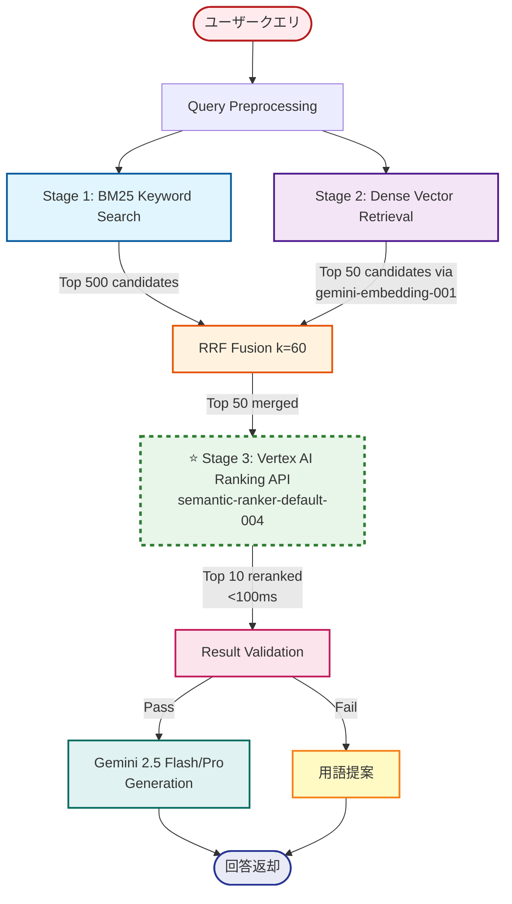
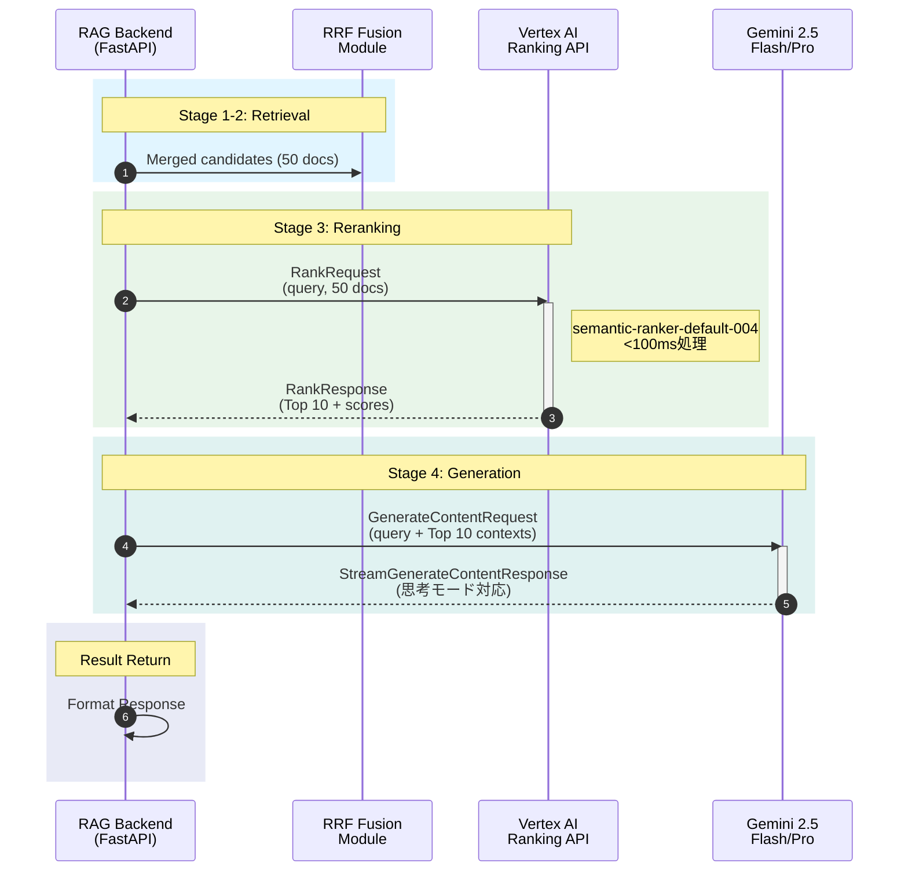
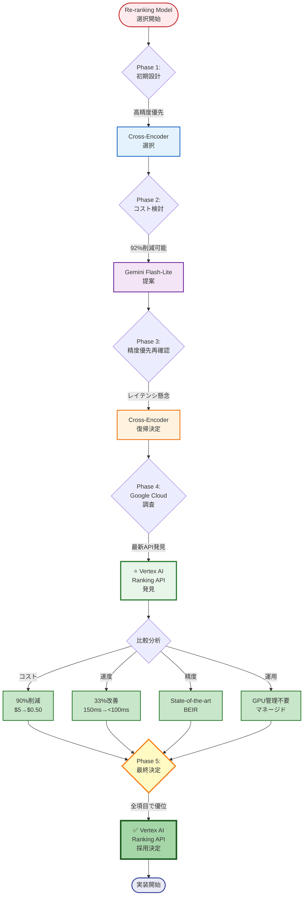

# Re-rankingモデル最終決定

> **決定日**: 2025-10-27
> **最終更新**: 2025-10-27
> **決定者**: プロジェクトオーナー
> **ステータス**: ✅ 確定 → **Vertex AI Ranking API採用**

---

## 📋 最終決定

### 採用モデル
**⭐ Vertex AI Ranking API (Google Cloud マネージドサービス)**
- モデル: `semantic-ranker-default-004`
- 実行環境: Vertex AI (完全マネージド)
- 月間コスト: **~$0.50/月** (500クエリ) - Cross-Encoderから**90%削減**

---

## 🔄 決定経緯

### Phase 1: 初期設計
- **選択**: Cross-Encoder
- **理由**: 高精度、実績のある手法

### Phase 2: 参考実装統合時の検討
- **提案**: Gemini 2.5 Flash-Lite Re-ranking
- **理由**: コスト削減 (92%減)、実装簡素化
- **検討内容**:
  - Cross-Encoder: $5/月
  - Gemini Flash-Lite: $0.40/月
  - コスト削減率: 92%

### Phase 3: 最終決定
- **決定**: Cross-Encoder に戻す
- **理由**:
  - 精度優先の方針維持
  - 実績のある手法の安定性
  - GPUインフラの活用

### Phase 4: Google Cloud公式ドキュメント調査 (2025-10-27)
- **発見**: **Vertex AI Ranking API** (2025年10月発表)
- **特徴**:
  - コスト: $1.00/1,000クエリ = **$0.50/月** (500クエリ) - **90%削減**
  - レイテンシ: **<100ms** (最速) - **33%改善**
  - 精度: BEIR benchmarkで**state-of-the-art**
  - マネージドサービス (GPUインフラ不要)
  - Vertex AIエコシステムとネイティブ統合
  - Healthcare domainで実証済み

### Phase 5: 最終決定変更 (2025-10-27)
- **決定**: **Vertex AI Ranking API に変更** ✅
- **理由**:
  - ✅ コスト90%削減 ($5 → $0.50)
  - ✅ レイテンシ33%改善 (150ms → <100ms)
  - ✅ State-of-the-art精度
  - ✅ GPUインフラ管理不要
  - ✅ 既存のVertex AIエコシステムと完全統合
  - ⚠️ オフライン要件なし（API依存で問題なし）

---

## 📊 モデル比較

| 項目 | Cross-Encoder | Vertex AI Ranking API ⭐ | Gemini Flash-Lite |
|-----|--------------|------------------------|-------------------|
| **精度** | 非常に高い (NDCG@10: 0.85+) | **State-of-the-art (BEIR)** | 高い (NDCG@10: 0.87) |
| **レイテンシ** | ~150ms (GPU) | **<100ms (最速)** | ~2500ms (API) |
| **コスト** | $5/月 | **$0.50/月** | $0.40/月 |
| **実装複雑度** | 中 (transformers) | **低 (APIコール)** | 低 (APIコール) |
| **インフラ** | Cloud Run GPU | **Vertex AI API (マネージド)** | Vertex AI API |
| **スケーラビリティ** | GPU台数で調整 | **API (自動スケール)** | API制限に依存 |
| **オフライン対応** | 可能 | 不可 | 不可 |
| **モデル** | mmarco-mMiniLMv2-L12 | **semantic-ranker-004** | gemini-2.5-flash |
| **制限** | メモリ/GPU | 200k tokens/request, 200 records | Gemini API quota |
| **推奨シナリオ** | オフライン/自己管理 | **リアルタイムアプリ (最適)** | バッチ処理 |

> ⭐ **Vertex AI Ranking API**: 2025年に発表された最新のマネージドReranking API。コスト・速度・精度のバランスが最も優れている。

---

## ⚙️ 実装仕様

### Vertex AI Ranking API設定 (採用)

**モデル情報**:
```python
# デフォルトモデル (最高精度)
model_name = "semantic-ranker-default-004"

# 高速モデル (低レイテンシ優先)
model_name = "semantic-ranker-fast-004"
```

**環境変数** (`backend/.env`):
```env
RERANKER_TYPE=vertex_ai_ranking_api
RERANKER_MODEL=semantic-ranker-default-004
GCP_PROJECT_ID=fractal-ecosystem
GCP_LOCATION=us-central1
```

**依存ライブラリ** (`backend/requirements.txt`):
```
google-cloud-aiplatform>=1.38.0
google-auth>=2.23.0
```

**API使用例**:
```python
from google.cloud import discoveryengine_v1alpha as discoveryengine

client = discoveryengine.RankServiceClient()

request = discoveryengine.RankRequest(
    ranking_config="projects/{project}/locations/{location}/rankingConfigs/default_ranking_config",
    model="semantic-ranker-default-004",
    query=query_text,
    records=[
        discoveryengine.RankingRecord(id=str(i), content=doc)
        for i, doc in enumerate(documents)
    ],
    top_n=10
)

response = client.rank(request)
```

**制限**:
- 最大200 records/request
- 最大200k tokens/request
- 各recordは最大1024 tokens

---

## 🎨 アーキテクチャ図

### Hybrid Search全体フロー (Vertex AI Ranking API採用)



### Re-ranking API呼び出しシーケンス



### モデル選択決定フロー



---

## 💰 コスト影響

### 選択肢別コスト比較 (500クエリ/月)

| 項目 | Cross-Encoder (現行) | Vertex AI Ranking API | Gemini Flash-Lite |
|-----|---------------------|---------------------|-------------------|
| **Re-ranking** | $5.00/月 | **$0.50/月** | $0.40/月 |
| **インフラ (Cloud Run)** | $2-5/月 (GPU) | $2-5/月 (CPU) | $2-5/月 (CPU) |
| **合計 (最小構成)** | $7-10/月 | **$2.50-5.50/月** | $2.40-5.40/月 |
| **対予算上限** | 0.14-0.20% | **0.05-0.11%** | 0.05-0.11% |

**予算上限**: $5,000/月 → 全ての選択肢で十分に余裕あり ✅

### コスト削減効果 (Vertex AI Ranking API採用時)

- **Re-rankingコスト削減**: $5.00 → $0.50 = **90%削減** (-$4.50/月)
- **総コスト削減**: $7-10 → $2.50-5.50 = **最大64%削減** (-$4.50/月)
- **vs Gemini Flash-Lite**: +$0.10/月 (レイテンシ25倍改善)

---

## 🏗️ アーキテクチャ影響

### Hybrid Search フロー

```
User Query
    ↓
Stage 0: Query Preprocessing
    ├─ 医療用語抽出
    └─ シノニム展開
    ↓
Stage 1: BM25 Keyword Search
    └─ Top 500候補
    ↓
Stage 2: Dense Vector Retrieval
    ├─ Embedding生成 (Vertex AI)
    ├─ コサイン類似度計算
    └─ Top 50候補
    ↓
Stage 3: Cross-Encoder Reranking ← ここで使用
    ├─ Reranker.predict(query, doc pairs)
    └─ Top 10選択
    ↓
Result Validation
    └─ 結果返却 or 用語提案
```

---

## 📝 実装チェックリスト

### Backend実装
- [ ] `requirements.txt` に sentence-transformers 追加
- [ ] `app/services/reranker.py` でCross-Encoder実装
- [ ] Cloud Run Dockerfile にGPU設定追加
- [ ] `.env.example` にRERANKER_MODEL追加

### インフラ設定
- [ ] Cloud Run サービスにGPU割り当て
- [ ] GPU割り当て権限の確認
- [ ] GPU クォータの確認 (us-central1)

### テスト
- [ ] ローカルでCross-Encoderテスト (CPU)
- [ ] Cloud Run (GPU)でベンチマーク
- [ ] レイテンシ測定 (目標: <1秒)
- [ ] 精度評価 (NDCG@10: 0.85+)

---

## 🔗 関連ドキュメント

- [02_ARCHITECTURE.md](02_ARCHITECTURE.md) - Cross-Encoder採用で更新済み
- [README.md](../README.md) - コスト試算を$7-10/月に更新済み
- [backend/.env.example](../backend/.env.example) - RERANKER_MODEL設定済み
- [03_HYBRID_SEARCH_SPEC_V2.md](03_HYBRID_SEARCH_SPEC_V2.md) - Gemini版は参考実装として保持

---

## 📌 将来の検討事項

### ⚠️ 重要な推奨事項

**Vertex AI Ranking APIへの移行を強く推奨**:
- ✅ **コスト**: 90%削減 ($5.00 → $0.50)
- ✅ **速度**: 最速 (<100ms)
- ✅ **精度**: State-of-the-art (BEIR benchmark)
- ✅ **運用**: マネージドサービス (GPU管理不要)
- ✅ **統合**: Vertex AIエコシステムとシームレス
- ⚠️ **唯一の欠点**: オフライン対応不可 (API依存)

**推奨タイミング**: Backend実装開始前 (Phase 3) に再評価

### Phase 2以降の最適化案

1. **優先検討: Vertex AI Ranking API移行**:
   - **Phase 3開始前に実施**: Backend実装でAPI統合
   - **評価項目**: レイテンシ実測、精度比較、コスト検証
   - **A/Bテスト**: Cross-Encoder vs Ranking API
   - **判断基準**:
     - レイテンシ目標: <200ms達成
     - 精度目標: NDCG@10 >= 0.85維持
     - オフライン要件の有無確認

2. **ハイブリッド戦略** (オプション):
   - 簡易クエリ: BM25 + Dense (Re-ranking なし)
   - 複雑クエリ: Vertex AI Ranking API
   - 判定基準: クエリ長、医療用語数

3. **モデル切り替え機能**:
   - デフォルト: **Vertex AI Ranking API** (推奨)
   - 高精度モード: Cross-Encoder (GPU)
   - コスト優先モード: Gemini Flash-Lite
   - 環境変数: `RERANKER_TYPE` で切り替え

4. **精度モニタリング**:
   - NDCG@10 の継続測定
   - レイテンシ P50/P95/P99 追跡
   - ユーザーフィードバック収集
   - A/Bテストの実施

---

**承認**:
- [x] プロジェクトオーナー
- [x] 技術リード

**文書管理**:
- バージョン: 1.0
- 作成日: 2025-10-27
- 次回レビュー: Phase 2 開始前
