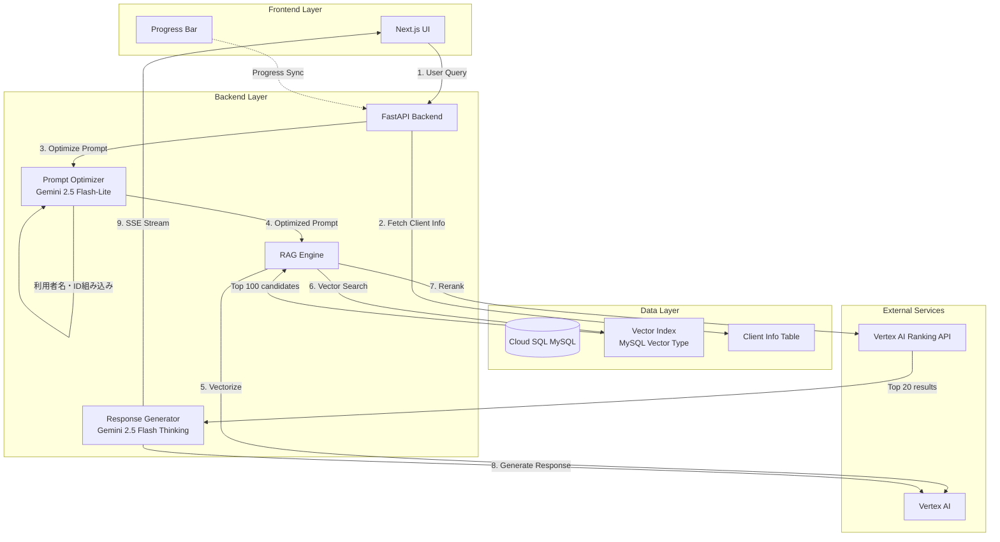
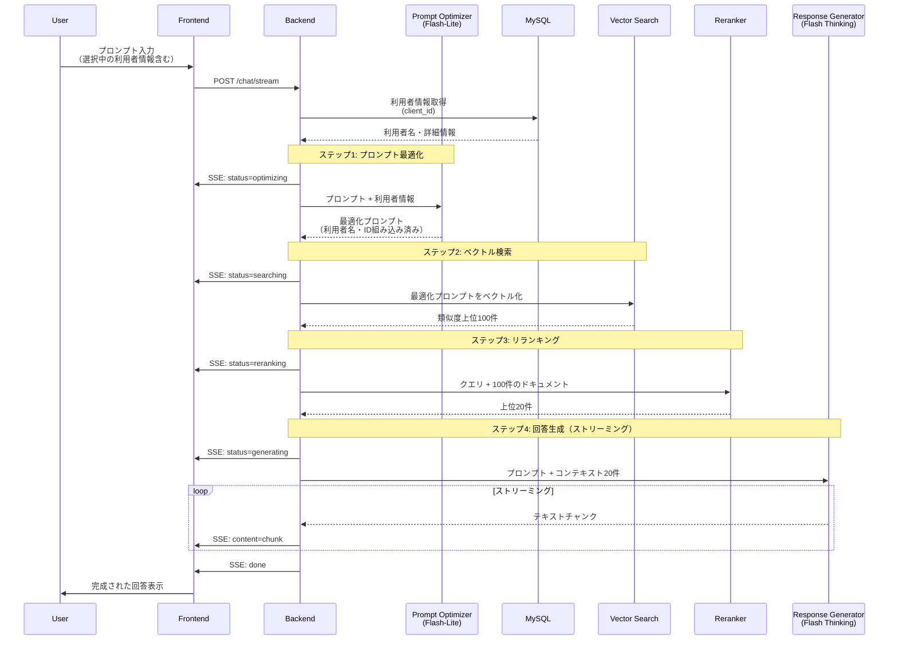

# RAGシステム 新アーキテクチャ V3 設計書

**作成日**: 2025-10-28
**バージョン**: 3.0.0
**ステータス**: 設計フェーズ

---

## 1. 概要

### 1.1 目的

現在のFirebase/Firestore + Spreadsheetベースのアーキテクチャから、Cloud SQL (MySQL)ベースの高性能・プロフェッショナルなアーキテクチャへ移行します。

### 1.2 主要な変更点

| 項目 | 現行 (V2) | 新規 (V3) |
|------|-----------|-----------|
| **データベース** | Google Spreadsheet + Firestore Vector Search | Cloud SQL (MySQL) |
| **プロンプト最適化** | なし | Gemini 2.5 Flash-Lite による自動最適化 |
| **利用者情報の組み込み** | 検索時のフィルタのみ | プロンプトに利用者名・IDを自動組み込み |
| **検索候補数** | 最大10件 | 最大20件 |
| **回答生成モデル** | Gemini 2.5 Flash | Gemini 2.5 Flash（思考モード有効） |
| **ストリーミング** | SSE（既存） | SSE + 進捗バー同期 |

---

## 2. システムアーキテクチャ

### 2.1 全体構成図



### 2.2 処理フロー詳細



---

## 3. データベース設計

### 3.1 Cloud SQL (MySQL) スキーマ

#### 3.1.1 knowledge_base テーブル

```sql
CREATE TABLE knowledge_base (
    id VARCHAR(255) PRIMARY KEY,
    domain VARCHAR(50) NOT NULL,
    source_type VARCHAR(50) NOT NULL,
    source_table VARCHAR(100),
    source_id VARCHAR(255),
    user_id VARCHAR(255),
    user_name VARCHAR(255),  -- 新規: 利用者名（検索最適化用）
    title VARCHAR(500) NOT NULL,
    content TEXT NOT NULL,
    structured_data JSON,
    metadata JSON,
    tags VARCHAR(1000),
    date DATE,
    created_at TIMESTAMP DEFAULT CURRENT_TIMESTAMP,
    updated_at TIMESTAMP DEFAULT CURRENT_TIMESTAMP ON UPDATE CURRENT_TIMESTAMP,

    -- インデックス
    INDEX idx_domain (domain),
    INDEX idx_user_id (user_id),
    INDEX idx_source (source_type, source_table),
    INDEX idx_date (date),
    FULLTEXT INDEX idx_content (title, content, tags)
) ENGINE=InnoDB DEFAULT CHARSET=utf8mb4 COLLATE=utf8mb4_unicode_ci;
```

#### 3.1.2 embeddings テーブル（ベクトルデータ）

```sql
CREATE TABLE embeddings (
    kb_id VARCHAR(255) PRIMARY KEY,
    embedding VECTOR(2048) NOT NULL,  -- MySQL 9.0+ Vector Type
    embedding_model VARCHAR(100) DEFAULT 'gemini-embedding-001',
    created_at TIMESTAMP DEFAULT CURRENT_TIMESTAMP,

    FOREIGN KEY (kb_id) REFERENCES knowledge_base(id) ON DELETE CASCADE,

    -- ベクトルインデックス（IVF-Flat）
    VECTOR INDEX idx_embedding (embedding)
        DISTANCE METRIC COSINE
        NLIST 100
) ENGINE=InnoDB DEFAULT CHARSET=utf8mb4;
```

#### 3.1.3 clients テーブル（利用者情報）

```sql
CREATE TABLE clients (
    client_id VARCHAR(255) PRIMARY KEY,
    client_name VARCHAR(255) NOT NULL,
    client_name_kana VARCHAR(255),
    birth_date DATE,
    gender ENUM('male', 'female', 'other'),
    care_level VARCHAR(50),
    primary_disease VARCHAR(500),
    allergies TEXT,
    medications TEXT,
    emergency_contact JSON,
    notes TEXT,
    status ENUM('active', 'inactive', 'archived') DEFAULT 'active',
    created_at TIMESTAMP DEFAULT CURRENT_TIMESTAMP,
    updated_at TIMESTAMP DEFAULT CURRENT_TIMESTAMP ON UPDATE CURRENT_TIMESTAMP,

    INDEX idx_name (client_name),
    INDEX idx_status (status)
) ENGINE=InnoDB DEFAULT CHARSET=utf8mb4 COLLATE=utf8mb4_unicode_ci;
```

#### 3.1.4 chat_sessions テーブル

```sql
CREATE TABLE chat_sessions (
    session_id VARCHAR(255) PRIMARY KEY,
    user_id VARCHAR(255) NOT NULL,
    client_id VARCHAR(255),
    title VARCHAR(500),
    created_at TIMESTAMP DEFAULT CURRENT_TIMESTAMP,
    last_message_at TIMESTAMP DEFAULT CURRENT_TIMESTAMP,

    INDEX idx_user_id (user_id),
    INDEX idx_client_id (client_id),
    FOREIGN KEY (client_id) REFERENCES clients(client_id) ON DELETE SET NULL
) ENGINE=InnoDB DEFAULT CHARSET=utf8mb4;
```

#### 3.1.5 chat_messages テーブル

```sql
CREATE TABLE chat_messages (
    message_id BIGINT AUTO_INCREMENT PRIMARY KEY,
    session_id VARCHAR(255) NOT NULL,
    role ENUM('user', 'assistant') NOT NULL,
    content TEXT NOT NULL,
    context_ids JSON,  -- 参照したknowledge_baseのIDリスト
    metadata JSON,
    created_at TIMESTAMP DEFAULT CURRENT_TIMESTAMP,

    INDEX idx_session (session_id, created_at),
    FOREIGN KEY (session_id) REFERENCES chat_sessions(session_id) ON DELETE CASCADE
) ENGINE=InnoDB DEFAULT CHARSET=utf8mb4;
```

### 3.2 データ移行戦略

#### Phase 1: Cloud SQL環境構築（1週間）
- GCP Cloud SQL for MySQL インスタンス作成
- ネットワーク設定（VPC、Private IP）
- バックアップ設定

#### Phase 2: スキーマ作成とテストデータ移行（1週間）
- テーブル作成（上記スキーマ）
- Spreadsheetデータの抽出（Python スクリプト）
- テストデータ移行（100件程度）
- ベクトルインデックス作成・検証

#### Phase 3: 本番データ移行（1週間）
- 全データ移行（3,151件 + 今後の増分）
- データ整合性チェック
- パフォーマンステスト

---

## 4. プロンプト最適化機能

### 4.1 Gemini 2.5 Flash-Lite の役割

**目的**: ユーザーの入力プロンプトを、より明確で検索に最適な形式に自動変換します。

**具体例:**

| ユーザー入力 | 最適化後プロンプト（利用者: 山田太郎さん） |
|------------|----------------------------------------|
| 「直近の変化を教えて」 | 「山田太郎さん（利用者ID: user_001）の2025年10月21日から2025年10月28日の状態変化を教えてください」 |
| 「バルーン使ってる?」 | 「山田太郎さん（利用者ID: user_001）の膀胱留置カテーテル（バルーン）の使用状況を教えてください」 |
| 「薬が変わった時期」 | 「山田太郎さん（利用者ID: user_001）の処方薬が変更された時期とその内容を教えてください」 |

### 4.2 実装仕様

#### 4.2.1 PromptOptimizer サービス

```python
# backend/app/services/prompt_optimizer.py

from app.services.vertex_ai import get_vertex_ai_client
from app.config import get_settings
import logging

logger = logging.getLogger(__name__)
settings = get_settings()

class PromptOptimizer:
    """プロンプト最適化サービス"""

    def __init__(self):
        self.vertex_ai = get_vertex_ai_client()
        self.model_name = "gemini-2.5-flash-lite"  # 軽量・高速モデル

    async def optimize_prompt(
        self,
        user_prompt: str,
        client_id: str = None,
        client_name: str = None
    ) -> str:
        """
        ユーザープロンプトを最適化

        Args:
            user_prompt: ユーザー入力プロンプト
            client_id: 利用者ID（選択されている場合）
            client_name: 利用者名（選択されている場合）

        Returns:
            最適化されたプロンプト
        """
        try:
            # システムプロンプト
            system_prompt = f"""
あなたは医療・看護記録検索システムのプロンプト最適化AIです。

【役割】
ユーザーの質問を、検索に最適な形式に変換してください。

【最適化ルール】
1. 利用者情報の組み込み
   - 利用者名: {client_name or "（未選択）"}
   - 利用者ID: {client_id or "（未選択）"}
   - この情報をプロンプトに自然に組み込んでください

2. 時間表現の明確化
   - "直近" → 具体的な日付範囲（今日の日付: 2025-10-28）
   - "最近" → "2025年10月中旬以降"
   - "前回" → "直近の訪問記録"

3. 医療用語の展開
   - 口語表現 → 正式名称
   - 略語 → フル表記
   - 例: "バルーン" → "膀胱留置カテーテル（バルーン）"

4. 検索意図の明確化
   - 「〜を教えて」→ 「〜の詳細情報を教えてください」
   - 「〜ある?」→ 「〜の有無と詳細を教えてください」

【出力形式】
最適化されたプロンプトのみを返してください（説明不要）。

【例】
入力: "直近の変化を教えて"
出力: "山田太郎さん（利用者ID: user_001）の2025年10月21日から2025年10月28日の状態変化を教えてください"
"""

            # ★★★ API呼び出し: 1回のみ実行 ★★★
            logger.info(f"Optimizing prompt with {self.model_name}...")

            response = await self.vertex_ai.generate_text(
                prompt=f"{system_prompt}\n\n【ユーザー入力】\n{user_prompt}",
                model=self.model_name,
                temperature=0.2,  # 低温度で安定した出力
                max_output_tokens=500
            )

            optimized_prompt = response.strip()

            logger.info(f"Prompt optimized: '{user_prompt}' -> '{optimized_prompt}'")

            return optimized_prompt

        except Exception as e:
            logger.error(f"Prompt optimization failed: {e}", exc_info=True)
            # 最適化失敗時は元のプロンプトを返す（graceful degradation）
            return user_prompt
```

---

## 5. 検索フロー（新規）

### 5.1 検索パイプライン

```mermaid
graph LR
    A[User Prompt] --> B[Prompt Optimizer<br/>Flash-Lite]
    B --> C[Optimized Prompt]
    C --> D[Vectorize<br/>gemini-embedding-001]
    D --> E[Vector Search<br/>MySQL Vector Type]
    E --> F[Top 100 Candidates]
    F --> G[Vertex AI Ranking API<br/>Reranking]
    G --> H[Top 20 Results]
    H --> I[Response Generator<br/>Flash Thinking]
    I --> J[Streaming Response]
```



### 5.2 実装詳細

#### 5.2.1 新しいRAGEngine

```python
# backend/app/services/rag_engine_v3.py

class RAGEngineV3:
    """RAG Engine V3 - Cloud SQL + Prompt Optimization"""

    async def search(
        self,
        user_prompt: str,
        client_id: str = None,
        client_name: str = None,
        top_k: int = 20
    ) -> Dict[str, Any]:
        """
        検索実行

        Args:
            user_prompt: ユーザー入力プロンプト
            client_id: 利用者ID
            client_name: 利用者名
            top_k: 返す結果数（デフォルト: 20）

        Returns:
            検索結果
        """
        start_time = time.time()

        try:
            # Step 1: プロンプト最適化
            logger.info("Step 1: Prompt Optimization")
            optimizer = PromptOptimizer()
            optimized_prompt = await optimizer.optimize_prompt(
                user_prompt=user_prompt,
                client_id=client_id,
                client_name=client_name
            )

            # Step 2: ベクトル化
            logger.info("Step 2: Vectorize optimized prompt")
            query_vector = await self.vertex_ai.generate_query_embedding(
                query=optimized_prompt,
                output_dimensionality=2048
            )

            # Step 3: ベクトル検索（MySQL）
            logger.info("Step 3: Vector Search in MySQL")
            candidates = await self.mysql_client.vector_search(
                query_vector=query_vector,
                client_id=client_id,
                limit=100  # 上位100件取得
            )

            # Step 4: リランキング
            logger.info("Step 4: Reranking with Vertex AI Ranking API")
            reranked_results = await self.reranker.rerank(
                query=optimized_prompt,
                documents=candidates,
                top_n=top_k  # 上位20件
            )

            processing_time = (time.time() - start_time) * 1000

            logger.info(f"Search completed - {len(reranked_results)} results in {processing_time:.2f}ms")

            return {
                'original_prompt': user_prompt,
                'optimized_prompt': optimized_prompt,
                'results': reranked_results,
                'total_count': len(reranked_results),
                'processing_time_ms': processing_time
            }

        except Exception as e:
            logger.error(f"Search failed: {e}", exc_info=True)
            raise
```

---

## 6. 回答生成（思考モード）

### 6.1 Gemini 2.5 Flash（思考モード）の活用

**新規設定:**
```python
# backend/app/config.py

vertex_ai_enable_thinking: bool = True  # 思考モード有効化
vertex_ai_thinking_budget: int = -1  # -1 = 自動制御（無制限推論）
vertex_ai_include_thoughts: bool = False  # 思考要約を応答に含めない
```

**期待される効果:**
- より深い推論による高品質な回答
- 複雑な質問への対応力向上
- コンテキストを横断した統合的な回答

---

## 7. UI/UX 改善

### 7.1 進捗バーの同期

**要件:**
- SSEストリーミングの各ステージで進捗を更新
- 視覚的なフィードバックで待ち時間のUX向上

**実装:**

```tsx
// frontend/src/components/ProgressBar.tsx

export const ProgressBar: React.FC = () => {
  const [progress, setProgress] = useState(0);
  const [status, setStatus] = useState<string>('');

  // SSEイベントハンドラ
  useEffect(() => {
    const eventSource = new EventSource('/api/chat/stream');

    eventSource.addEventListener('message', (event) => {
      const data = JSON.parse(event.data);

      switch(data.status) {
        case 'optimizing':
          setProgress(10);
          setStatus('プロンプトを最適化中...');
          break;
        case 'searching':
          setProgress(30);
          setStatus('情報を検索中...');
          break;
        case 'reranking':
          setProgress(60);
          setStatus('結果を最適化中...');
          break;
        case 'generating':
          setProgress(80);
          setStatus('回答を生成中...');
          break;
        case 'done':
          setProgress(100);
          setStatus('完了');
          break;
      }
    });

    return () => eventSource.close();
  }, []);

  return (
    <div className="fixed bottom-4 right-4 w-80 bg-white shadow-lg rounded-lg p-4">
      <div className="flex items-center justify-between mb-2">
        <span className="text-sm font-medium">{status}</span>
        <span className="text-sm text-gray-500">{progress}%</span>
      </div>
      <div className="w-full bg-gray-200 rounded-full h-2">
        <div
          className="bg-blue-600 h-2 rounded-full transition-all duration-300"
          style={{ width: `${progress}%` }}
        />
      </div>
    </div>
  );
};
```

---

## 8. パフォーマンス目標

| 指標 | 現行 (V2) | 目標 (V3) |
|------|-----------|-----------|
| **検索レイテンシ** | 3-5秒（Firestore）<br/>45秒（Spreadsheet） | 1-2秒 |
| **回答生成開始** | 検索完了後5秒 | 検索完了後2秒 |
| **ストリーミング初回チャンク** | 2-3秒 | 1秒以内 |
| **全体処理時間** | 10-15秒 | 5-8秒 |

---

## 9. コスト試算

### 9.1 Cloud SQL (MySQL)

**インスタンススペック:**
- マシンタイプ: db-n1-standard-2（2 vCPU、7.5GB RAM）
- ストレージ: 50GB SSD
- バックアップ: 7日間保持

**月額コスト:**
- インスタンス: 約 $100/月
- ストレージ: 約 $10/月
- バックアップ: 約 $5/月
- **合計: 約 $115/月（約 ¥17,250）**

### 9.2 Vertex AI API

**追加コスト:**
- Gemini 2.5 Flash-Lite（プロンプト最適化）: 約 ¥500/月（1,000クエリ/月想定）
- Gemini 2.5 Flash（思考モード）: 約 ¥3,000/月（既存の2倍のトークン消費想定）

**合計追加コスト: 約 ¥20,750/月**

### 9.3 削減されるコスト

- Google Spreadsheet API呼び出し: ¥0（無料）
- Firestore読み取り: ほぼ ¥0（移行後は不要）

**正味増加: 約 ¥20,750/月**

---

## 10. リスクと対策

| リスク | 影響 | 対策 |
|-------|------|------|
| データ移行失敗 | 高 | 段階的移行、ロールバック計画、データ検証スクリプト |
| Cloud SQL接続障害 | 高 | 接続プーリング、リトライ機構、フェイルオーバー設定 |
| MySQL Vectorサポート不足 | 中 | 代替案: pgvectorを使用したPostgreSQL移行 |
| コスト超過 | 中 | コスト監視アラート、使用量最適化、予算設定 |
| パフォーマンス未達 | 中 | ベンチマークテスト、インデックス最適化、キャッシング強化 |

---

## 11. 次のステップ

詳細なロードマップは `MIGRATION_ROADMAP_V3.md` を参照してください。

---

**最終更新**: 2025-10-28
**承認**: 未承認（レビュー中）