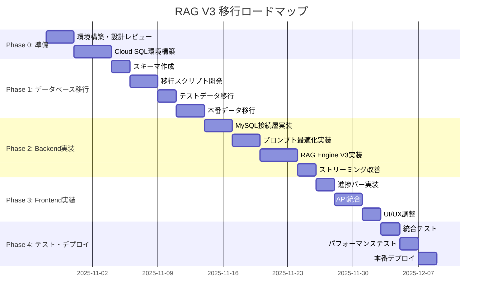

# RAGシステム V2 → V3 移行ロードマップ

**作成日**: 2025-10-28
**予定期間**: 6週間（2025-10-28 〜 2025-12-09）
**プロジェクトマネージャー**: Claude (AI Assistant)

---

## 📊 プロジェクト概要

### 目標

1. **データベース移行**: Spreadsheet/Firestore → Cloud SQL (MySQL)
2. **プロンプト最適化**: Gemini 2.5 Flash-Liteによる自動最適化実装
3. **検索精度向上**: 類似度上位20件、利用者情報組み込み
4. **UX改善**: 進捗バー同期、ストリーミング表示最適化
5. **パフォーマンス向上**: 検索1-2秒、全体5-8秒以内

### 成功基準

- [ ] Cloud SQL環境構築完了
- [ ] 全データ移行完了（3,151件 + 増分）
- [ ] プロンプト最適化機能実装
- [ ] 検索レイテンシ 1-2秒達成
- [ ] ストリーミング初回チャンク 1秒以内
- [ ] 全エンドツーエンドテスト合格
- [ ] 本番デプロイ完了

---

## 🗓️ タイムライン



---

## Phase 0: 準備（3日間）

**期間**: 2025-10-28 〜 2025-10-31

### タスク一覧

#### Task 0.1: 設計レビュー（1日）

- [ ] NEW_ARCHITECTURE_V3.md のレビュー
- [ ] ステークホルダーからのフィードバック収集
- [ ] 技術選定の最終確認
- [ ] リスク評価とミティゲーション計画

**担当**: プロジェクトマネージャー
**成果物**: 承認された設計書

#### Task 0.2: 開発環境準備（1日）

- [ ] GCP プロジェクト設定確認
- [ ] Cloud SQL for MySQL 有効化
- [ ] VPC ネットワーク設定
- [ ] 開発用MySQLクライアントセットアップ
- [ ] `.env` ファイル更新

**担当**: Backend開発者
**成果物**: 開発環境構築手順書

#### Task 0.3: Cloud SQL インスタンス作成（1日）

- [ ] Cloud SQL インスタンス作成（db-n1-standard-2）
- [ ] データベース `rag_system` 作成
- [ ] ユーザー・権限設定
- [ ] SSL接続設定
- [ ] バックアップ設定（7日保持）
- [ ] モニタリング設定

**担当**: DevOps/Backend開発者
**成果物**: Cloud SQL接続情報、認証情報

---

## Phase 1: データベース移行（10日間）

**期間**: 2025-11-04 〜 2025-11-14

### Task 1.1: スキーマ作成（2日）

**優先度**: 🔴 High

#### サブタスク

- [ ] `knowledge_base` テーブル作成
- [ ] `embeddings` テーブル作成（Vector Type使用）
- [ ] `clients` テーブル作成
- [ ] `chat_sessions` テーブル作成
- [ ] `chat_messages` テーブル作成
- [ ] インデックス作成
- [ ] 外部キー制約設定
- [ ] テーブル権限設定

**担当**: Backend開発者
**成果物**: `schema.sql`、テーブル作成スクリプト

**実装ファイル**:
```bash
backend/database/schema.sql
backend/database/migrations/001_create_tables.sql
backend/database/migrations/002_create_indexes.sql
```

### Task 1.2: 移行スクリプト開発（3日）

**優先度**: 🔴 High

#### サブタスク

- [ ] Spreadsheet → MySQL 移行スクリプト（knowledge_base）
- [ ] Embeddings → MySQL 移行スクリプト
- [ ] Firestore → MySQL 移行スクリプト（chat_history）
- [ ] データ検証スクリプト
- [ ] ロールバックスクリプト
- [ ] 移行進捗モニタリング

**担当**: Backend開発者
**成果物**: `scripts/migrate_to_mysql.py`

**実装ファイル**:
```bash
backend/scripts/migrate_to_mysql.py
backend/scripts/validate_migration.py
backend/scripts/rollback_migration.py
```

**コード例**:
```python
# backend/scripts/migrate_to_mysql.py

import asyncio
import logging
from typing import List, Dict, Any
import mysql.connector
from google.oauth2 import service_account
from googleapiclient.discovery import build

logger = logging.getLogger(__name__)

class DataMigrator:
    """Spreadsheet/Firestore → MySQL データ移行"""

    def __init__(self, mysql_config: Dict[str, str]):
        self.mysql_conn = mysql.connector.connect(**mysql_config)
        self.cursor = self.mysql_conn.cursor()

    async def migrate_knowledge_base(self):
        """knowledge_base テーブル移行"""
        logger.info("Migrating knowledge_base...")

        # Spreadsheetから読み込み
        kb_records = self._read_spreadsheet_knowledge_base()

        # MySQLに挿入
        insert_query = """
        INSERT INTO knowledge_base
        (id, domain, source_type, source_table, source_id, user_id, user_name,
         title, content, structured_data, metadata, tags, date, created_at)
        VALUES (%s, %s, %s, %s, %s, %s, %s, %s, %s, %s, %s, %s, %s, %s)
        """

        batch_size = 100
        for i in range(0, len(kb_records), batch_size):
            batch = kb_records[i:i+batch_size]
            self.cursor.executemany(insert_query, batch)
            self.mysql_conn.commit()
            logger.info(f"Migrated {i+len(batch)}/{len(kb_records)} records")

        logger.info("knowledge_base migration completed")

    async def migrate_embeddings(self):
        """embeddings テーブル移行"""
        logger.info("Migrating embeddings...")

        # Spreadsheetから読み込み
        embeddings = self._read_spreadsheet_embeddings()

        # MySQLに挿入（Vector Type）
        insert_query = """
        INSERT INTO embeddings (kb_id, embedding, embedding_model)
        VALUES (%s, VECTOR(%s), %s)
        """

        batch_size = 50
        for i in range(0, len(embeddings), batch_size):
            batch = embeddings[i:i+batch_size]
            self.cursor.executemany(insert_query, batch)
            self.mysql_conn.commit()
            logger.info(f"Migrated {i+len(batch)}/{len(embeddings)} embeddings")

        logger.info("embeddings migration completed")

    def validate_migration(self) -> bool:
        """移行データ検証"""
        logger.info("Validating migration...")

        # 件数チェック
        self.cursor.execute("SELECT COUNT(*) FROM knowledge_base")
        kb_count = self.cursor.fetchone()[0]

        self.cursor.execute("SELECT COUNT(*) FROM embeddings")
        emb_count = self.cursor.fetchone()[0]

        logger.info(f"knowledge_base: {kb_count} records")
        logger.info(f"embeddings: {emb_count} records")

        # 整合性チェック
        self.cursor.execute("""
            SELECT COUNT(*) FROM knowledge_base kb
            LEFT JOIN embeddings e ON kb.id = e.kb_id
            WHERE e.kb_id IS NULL
        """)
        missing_embeddings = self.cursor.fetchone()[0]

        if missing_embeddings > 0:
            logger.warning(f"{missing_embeddings} records missing embeddings")
            return False

        logger.info("Migration validation passed")
        return True
```

### Task 1.3: テストデータ移行（2日）

**優先度**: 🟡 Medium

#### サブタスク

- [ ] テストデータ抽出（100件）
- [ ] 移行スクリプト実行
- [ ] データ検証
- [ ] パフォーマンステスト
- [ ] 問題修正

**担当**: Backend開発者
**成果物**: テスト移行レポート

### Task 1.4: 本番データ移行（3日）

**優先度**: 🔴 High

#### サブタスク

- [ ] 移行前バックアップ
- [ ] 本番データ移行実行（3,151件 + 増分）
- [ ] データ整合性チェック
- [ ] パフォーマンス検証
- [ ] ロールバックテスト

**担当**: Backend開発者 + DevOps
**成果物**: 移行完了レポート、パフォーマンスベンチマーク

---

## Phase 2: Backend実装（12日間）

**期間**: 2025-11-14 〜 2025-11-26

### Task 2.1: MySQL接続層実装（3日）

**優先度**: 🔴 High

#### サブタスク

- [ ] MySQL接続クライアント実装
- [ ] コネクションプーリング設定
- [ ] ORM設定（SQLAlchemy or Prisma）
- [ ] トランザクション管理
- [ ] エラーハンドリング
- [ ] リトライ機構

**担当**: Backend開発者
**成果物**: `backend/app/services/mysql_client.py`

**実装ファイル**:
```bash
backend/app/services/mysql_client.py
backend/app/models/database.py
backend/app/database/connection.py
```

**コード例**:
```python
# backend/app/services/mysql_client.py

import logging
from typing import List, Dict, Any, Optional
import mysql.connector
from mysql.connector import pooling
from app.config import get_settings

logger = logging.getLogger(__name__)
settings = get_settings()

class MySQLClient:
    """MySQL接続クライアント"""

    def __init__(self):
        """初期化 - コネクションプール作成"""
        self.pool = pooling.MySQLConnectionPool(
            pool_name="rag_pool",
            pool_size=10,
            pool_reset_session=True,
            host=settings.mysql_host,
            port=settings.mysql_port,
            database=settings.mysql_database,
            user=settings.mysql_user,
            password=settings.mysql_password,
            ssl_ca=settings.mysql_ssl_ca,
            ssl_disabled=False
        )
        logger.info("MySQL connection pool initialized")

    async def vector_search(
        self,
        query_vector: List[float],
        client_id: Optional[str] = None,
        limit: int = 100
    ) -> List[Dict[str, Any]]:
        """
        ベクトル検索（MySQL Vector Type使用）

        Args:
            query_vector: クエリベクトル（2048次元）
            client_id: 利用者IDフィルタ
            limit: 取得件数

        Returns:
            検索結果リスト
        """
        try:
            conn = self.pool.get_connection()
            cursor = conn.cursor(dictionary=True)

            # ★★★ ベクトル検索クエリ ★★★
            query = """
            SELECT
                kb.id,
                kb.domain,
                kb.source_type,
                kb.user_id,
                kb.user_name,
                kb.title,
                kb.content,
                kb.structured_data,
                kb.tags,
                kb.date,
                COSINE_DISTANCE(e.embedding, VECTOR(%s)) AS similarity
            FROM knowledge_base kb
            JOIN embeddings e ON kb.id = e.kb_id
            WHERE 1=1
            """

            params = [str(query_vector)]

            # 利用者IDフィルタ
            if client_id:
                query += " AND kb.user_id = %s"
                params.append(client_id)

            # 類似度順にソート、上位N件取得
            query += " ORDER BY similarity DESC LIMIT %s"
            params.append(limit)

            cursor.execute(query, params)
            results = cursor.fetchall()

            cursor.close()
            conn.close()

            logger.info(f"Vector search returned {len(results)} results")
            return results

        except Exception as e:
            logger.error(f"Vector search failed: {e}", exc_info=True)
            raise

    async def get_client_info(self, client_id: str) -> Optional[Dict[str, Any]]:
        """
        利用者情報取得

        Args:
            client_id: 利用者ID

        Returns:
            利用者情報（存在しない場合None）
        """
        try:
            conn = self.pool.get_connection()
            cursor = conn.cursor(dictionary=True)

            query = "SELECT * FROM clients WHERE client_id = %s AND status = 'active'"
            cursor.execute(query, (client_id,))
            result = cursor.fetchone()

            cursor.close()
            conn.close()

            return result

        except Exception as e:
            logger.error(f"Failed to get client info: {e}", exc_info=True)
            return None


# シングルトン
_mysql_client: Optional[MySQLClient] = None

def get_mysql_client() -> MySQLClient:
    """MySQL クライアント取得"""
    global _mysql_client
    if _mysql_client is None:
        _mysql_client = MySQLClient()
    return _mysql_client
```

### Task 2.2: プロンプト最適化実装（3日）

**優先度**: 🔴 High

#### サブタスク

- [ ] PromptOptimizer サービス実装
- [ ] Gemini 2.5 Flash-Lite 統合
- [ ] 利用者情報組み込みロジック
- [ ] 時間表現の自動変換
- [ ] 医療用語展開
- [ ] キャッシング機構（類似プロンプト）

**担当**: Backend開発者
**成果物**: `backend/app/services/prompt_optimizer.py`

**実装ファイル**:
```bash
backend/app/services/prompt_optimizer.py
backend/tests/test_prompt_optimizer.py
```

**詳細**: `NEW_ARCHITECTURE_V3.md` の Section 4.2.1 参照

### Task 2.3: RAG Engine V3実装（4日）

**優先度**: 🔴 High

#### サブタスク

- [ ] RAGEngineV3 クラス実装
- [ ] MySQL Vector Search統合
- [ ] プロンプト最適化統合
- [ ] リランキング（Vertex AI Ranking API）
- [ ] エラーハンドリング
- [ ] ログ記録・監視

**担当**: Backend開発者
**成果物**: `backend/app/services/rag_engine_v3.py`

**実装ファイル**:
```bash
backend/app/services/rag_engine_v3.py
backend/tests/test_rag_engine_v3.py
```

**詳細**: `NEW_ARCHITECTURE_V3.md` の Section 5.2.1 参照

### Task 2.4: ストリーミング改善（2日）

**優先度**: 🟡 Medium

#### サブタスク

- [ ] Gemini 2.5 Flash（思考モード）統合
- [ ] SSEストリーミング最適化
- [ ] 進捗ステータス送信（optimizing, searching, reranking, generating）
- [ ] エラーハンドリング改善
- [ ] パフォーマンス最適化

**担当**: Backend開発者
**成果物**: `backend/app/routers/chat_v3.py`

**実装ファイル**:
```bash
backend/app/routers/chat_v3.py
backend/app/services/gemini_service_v3.py
```

---

## Phase 3: Frontend実装（7日間）

**期間**: 2025-11-26 〜 2025-12-03

### Task 3.1: 進捗バー実装（2日）

**優先度**: 🟡 Medium

#### サブタスク

- [ ] ProgressBar コンポーネント作成
- [ ] SSEイベントリスナー統合
- [ ] ステージ別進捗表示（10% → 30% → 60% → 80% → 100%）
- [ ] アニメーション・スタイリング
- [ ] レスポンシブ対応

**担当**: Frontend開発者
**成果物**: `frontend/src/components/ProgressBar.tsx`

**実装ファイル**:
```bash
frontend/src/components/ProgressBar.tsx
frontend/src/hooks/useProgress.ts
```

**詳細**: `NEW_ARCHITECTURE_V3.md` の Section 7.1 参照

### Task 3.2: API統合（3日）

**優先度**: 🔴 High

#### サブタスク

- [ ] Backend V3 API エンドポイント統合
- [ ] SSEストリーミング受信処理
- [ ] エラーハンドリング
- [ ] ローディング状態管理
- [ ] リトライ機構

**担当**: Frontend開発者
**成果物**: `frontend/src/lib/api_v3.ts`

**実装ファイル**:
```bash
frontend/src/lib/api_v3.ts
frontend/src/hooks/useChatV3.ts
```

### Task 3.3: UI/UX調整（2日）

**優先度**: 🟢 Low

#### サブタスク

- [ ] レイアウト調整
- [ ] レスポンシブ対応確認
- [ ] アクセシビリティ改善
- [ ] ダークモード対応
- [ ] ユーザーフィードバック収集

**担当**: Frontend開発者
**成果物**: UIデザインドキュメント

---

## Phase 4: テスト・デプロイ（6日間）

**期間**: 2025-12-03 〜 2025-12-09

### Task 4.1: 統合テスト（2日）

**優先度**: 🔴 High

#### サブタスク

- [ ] エンドツーエンドテスト実行
- [ ] プロンプト最適化テスト
- [ ] 検索精度テスト
- [ ] ストリーミングテスト
- [ ] 進捗バーテスト
- [ ] エラーシナリオテスト

**担当**: QA/全員
**成果物**: テストレポート

**テストケース**:
```bash
backend/tests/integration/test_e2e_search.py
backend/tests/integration/test_streaming.py
frontend/cypress/integration/test_chat_v3.spec.ts
```

### Task 4.2: パフォーマンステスト（2日）

**優先度**: 🔴 High

#### サブタスク

- [ ] 検索レイテンシ測定（目標: 1-2秒）
- [ ] ストリーミング初回チャンク測定（目標: 1秒以内）
- [ ] 全体処理時間測定（目標: 5-8秒）
- [ ] 同時接続負荷テスト
- [ ] ボトルネック分析・最適化

**担当**: Backend開発者 + DevOps
**成果物**: パフォーマンスベンチマークレポート

**ベンチマークスクリプト**:
```bash
backend/scripts/benchmark_v3.py
```

### Task 4.3: 本番デプロイ（2日）

**優先度**: 🔴 High

#### サブタスク

- [ ] Cloud Run デプロイ（Backend）
- [ ] Vercel デプロイ（Frontend）
- [ ] 環境変数設定
- [ ] Cloud SQL 接続設定
- [ ] ヘルスチェック確認
- [ ] モニタリング・アラート設定
- [ ] ロールバック計画確認

**担当**: DevOps
**成果物**: デプロイ完了レポート

**デプロイスクリプト**:
```bash
backend/deploy.sh
frontend/deploy.sh
```

---

## 🎯 マイルストーン

| マイルストーン | 期限 | 成果物 |
|------------|------|--------|
| **M1: 環境構築完了** | 2025-11-01 | Cloud SQL稼働、接続確認完了 |
| **M2: データ移行完了** | 2025-11-14 | 全データMySQL移行、検証完了 |
| **M3: Backend実装完了** | 2025-11-26 | RAG Engine V3、プロンプト最適化実装完了 |
| **M4: Frontend実装完了** | 2025-12-03 | 進捗バー、API統合完了 |
| **M5: 本番リリース** | 2025-12-09 | V3本番デプロイ完了 |

---

## 📋 タスク管理

### 使用ツール

- **GitHub Projects**: エピック・タスク管理
- **GitHub Issues**: 個別タスク・バグ追跡
- **このドキュメント**: 全体ロードマップ

### タスクステータス

- 🔴 **High Priority**: 必須、ブロッカー
- 🟡 **Medium Priority**: 重要、柔軟な期限
- 🟢 **Low Priority**: Nice-to-have

### 週次レビュー

**毎週月曜日 10:00**
- 前週の進捗確認
- 今週の目標設定
- ブロッカー・リスク確認
- リソース調整

---

## 🚨 リスク管理

### 高リスク項目

1. **MySQL Vector Type サポート不足**
   - **確率**: 30%
   - **影響**: 高
   - **対策**: PostgreSQL + pgvector への切替準備

2. **データ移行失敗**
   - **確率**: 20%
   - **影響**: 高
   - **対策**: 段階的移行、ロールバック計画、検証スクリプト

3. **パフォーマンス目標未達**
   - **確率**: 40%
   - **影響**: 中
   - **対策**: 早期ベンチマーク、インデックス最適化、キャッシング強化

### 中リスク項目

4. **コスト超過**
   - **確率**: 30%
   - **影響**: 中
   - **対策**: コスト監視アラート、予算上限設定

5. **スケジュール遅延**
   - **確率**: 50%
   - **影響**: 中
   - **対策**: バッファ期間確保（1週間）、優先度調整

---

## 📞 連絡先・エスカレーション

### プロジェクトチーム

- **プロジェクトマネージャー**: Claude (AI Assistant)
- **Backend開発者**: TBD
- **Frontend開発者**: TBD
- **DevOps**: TBD
- **QA**: TBD

### エスカレーションパス

1. **技術的問題**: Backend Lead → CTO
2. **スケジュール問題**: PM → ステークホルダー
3. **予算問題**: PM → 財務担当

---

## 📚 関連ドキュメント

- [NEW_ARCHITECTURE_V3.md](NEW_ARCHITECTURE_V3.md) - アーキテクチャ設計書
- [02_ARCHITECTURE.md](02_ARCHITECTURE.md) - 現行アーキテクチャ
- [ERROR_LOG.md](ERROR_LOG.md) - エラー記録
- [DECISIONS.md](DECISIONS.md) - アーキテクチャ決定記録

---

**最終更新**: 2025-10-28
**次回レビュー**: 2025-11-04（Phase 1開始時）