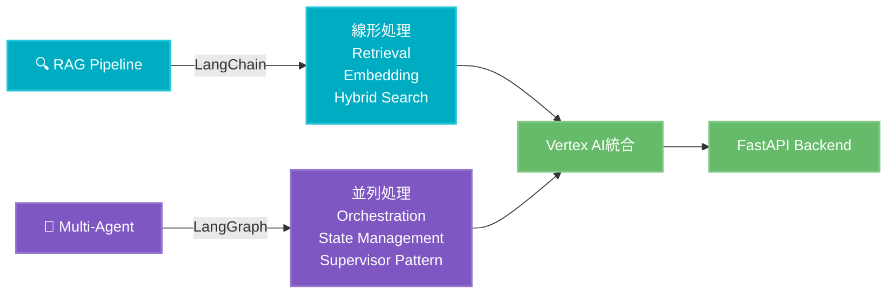
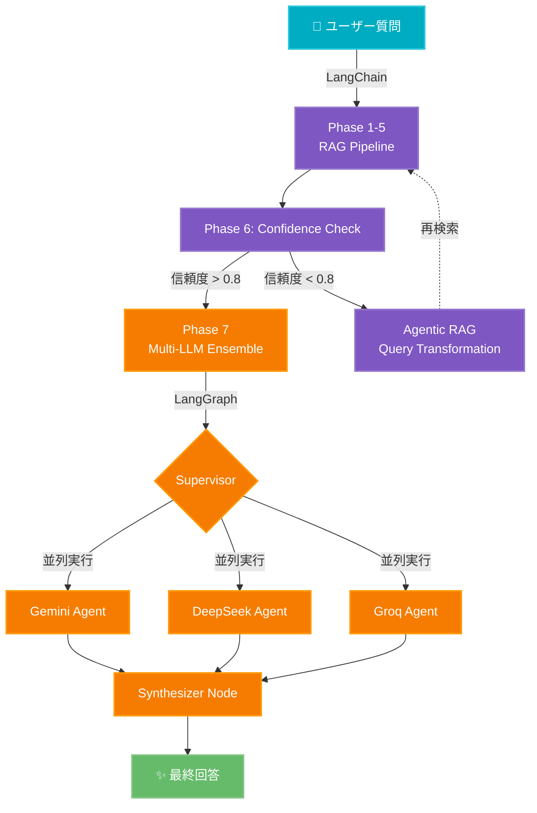

# LangChain + LangGraph 統合実装ガイド

> **Document Version:** 1.0
> **Last Updated:** 2025年10月9日
> **Decision:** ADR-007で採用決定
> **Status:** ✅ 確定

## 目次

1. [概要](#1-概要)
2. [アーキテクチャ設計](#2-アーキテクチャ設計)
3. [LangChain実装（RAGパイプライン)](#3-langchain実装ragパイプライン)
4. [LangGraph実装（マルチエージェント)](#4-langgraph実装マルチエージェント)
5. [Anthropic Research-First Workflow統合](#5-anthropic-research-first-workflow統合)
6. [本番環境デプロイ](#6-本番環境デプロイ)
7. [モニタリングとデバッグ](#7-モニタリングとデバッグ)

---

## 1. 概要

### 1.1. 採用決定理由

| 項目 | 内容 |
|------|------|
| **決定日** | 2025年10月9日 |
| **決定内容** | LangChain + LangGraph ハイブリッドアプローチ |
| **主な理由** | 本番実績（400社+）、Vertex AI統合、成熟したエコシステム |
| **代替案** | Google ADK（早期段階）、AutoGen（複雑性） |

### 1.2. 役割分担



**相補的な関係:**

- **LangChain:** RAGの線形処理（Retrieval → Ranking → Generation）
- **LangGraph:** マルチエージェントのグラフベース制御（並列実行 → 統合）

---

## 2. アーキテクチャ設計

### 2.1. 7フェーズRAG + マルチLLMアンサンブル統合



### 2.2. ディレクトリ構造

```text
app/
├── services/
│   ├── rag/
│   │   ├── __init__.py
│   │   ├── pipeline.py           # LangChain RAGパイプライン
│   │   ├── embeddings.py         # Vertex AI Embeddings
│   │   ├── vector_store.py       # Vector Search統合
│   │   ├── hybrid_search.py      # Vector + BM25
│   │   ├── reranker.py           # Gemini Re-ranking
│   │   └── chunker.py            # Semantic Chunking
│   │
│   ├── agents/
│   │   ├── __init__.py
│   │   ├── graph.py              # LangGraph StateGraph
│   │   ├── nodes.py              # Agent Nodes実装
│   │   ├── state.py              # Shared State定義
│   │   ├── supervisor.py         # Supervisor Pattern
│   │   └── synthesizer.py        # Flash-Lite統合
│   │
│   └── vertex_ai/
│       ├── __init__.py
│       ├── client.py             # Vertex AI Client
│       └── models.py             # Model Configuration
│
├── api/
│   └── v1/
│       └── endpoints/
│           └── chat.py           # Chat API (LangGraph統合)
│
└── tests/
    ├── test_pipeline.py
    └── test_agents.py
```

---

## 3. LangChain実装（RAGパイプライン）

### 3.1. Vertex AI Embeddings統合

```python
# app/services/rag/embeddings.py

from langchain_google_vertexai import VertexAIEmbeddings
from typing import List
import logging

logger = logging.getLogger(__name__)

class FractalLinkEmbeddings:
    """fractal-link用Vertex AI Embeddings (gemini-embedding-001)"""

    def __init__(
        self,
        project_id: str,
        location: str = "asia-northeast1",
        model_name: str = "gemini-embedding-001"
    ):
        self.embeddings = VertexAIEmbeddings(
            model_name=model_name,
            project=project_id,
            location=location
        )
        logger.info(f"Initialized Vertex AI Embeddings: {model_name}")

    def embed_query(self, text: str) -> List[float]:
        """クエリ用Embedding（task_type=RETRIEVAL_QUERY）"""
        return self.embeddings.embed_query(
            text,
            task_type="RETRIEVAL_QUERY",
            output_dimensionality=3072  # デフォルト次元
        )

    def embed_documents(self, texts: List[str]) -> List[List[float]]:
        """ドキュメント用Embedding（task_type=RETRIEVAL_DOCUMENT）"""
        return self.embeddings.embed_documents(
            texts,
            task_type="RETRIEVAL_DOCUMENT",
            output_dimensionality=3072
        )
```

### 3.2. Vector Search統合

```python
# app/services/rag/vector_store.py

from langchain_google_vertexai import VectorSearchVectorStore
from langchain_core.documents import Document
from typing import List
import logging

logger = logging.getLogger(__name__)

class FractalLinkVectorStore:
    """Vertex AI Vector Search統合"""

    def __init__(
        self,
        project_id: str,
        location: str,
        index_id: str,
        endpoint_id: str,
        embeddings: FractalLinkEmbeddings
    ):
        self.vector_store = VectorSearchVectorStore(
            project_id=project_id,
            region=location,
            index_id=index_id,
            endpoint_id=endpoint_id,
            embedding=embeddings.embeddings,
            gcs_bucket_name=f"{project_id}-fractal-link-docs"
        )
        logger.info(f"Initialized Vector Store: {index_id}")

    def similarity_search(
        self,
        query: str,
        k: int = 20,
        filter: dict = None
    ) -> List[Document]:
        """Vector類似度検索（Top K）"""
        results = self.vector_store.similarity_search(
            query=query,
            k=k,
            filter=filter
        )
        logger.info(f"Vector search returned {len(results)} results")
        return results

    def add_documents(self, documents: List[Document]):
        """ドキュメント追加（Indexing）"""
        self.vector_store.add_documents(documents)
        logger.info(f"Added {len(documents)} documents to vector store")
```

### 3.3. Hybrid Search実装

```python
# app/services/rag/hybrid_search.py

from typing import List
from langchain_core.documents import Document
from collections import defaultdict
import logging

logger = logging.getLogger(__name__)

class HybridSearchRetriever:
    """Vector Search + BM25 Hybrid Search"""

    def __init__(
        self,
        vector_store: FractalLinkVectorStore,
        bm25_scorer: 'JapaneseBM25Scorer',
        vector_weight: float = 0.7,
        bm25_weight: float = 0.3,
        k: int = 60  # RRF constant
    ):
        self.vector_store = vector_store
        self.bm25_scorer = bm25_scorer
        self.vector_weight = vector_weight
        self.bm25_weight = bm25_weight
        self.k = k

    def retrieve(self, query: str, top_k: int = 20) -> List[Document]:
        """Reciprocal Rank Fusion (RRF)で統合検索"""

        # 1. Vector Search
        vector_results = self.vector_store.similarity_search(
            query=query,
            k=top_k * 2  # 余裕を持って取得
        )

        # 2. BM25 Search
        bm25_results = self.bm25_scorer.search(
            query=query,
            top_k=top_k * 2
        )

        # 3. RRF統合
        scores = defaultdict(float)

        for rank, doc in enumerate(vector_results):
            doc_id = doc.metadata.get("chunk_id")
            scores[doc_id] += self.vector_weight / (self.k + rank)

        for rank, doc in enumerate(bm25_results):
            doc_id = doc.metadata.get("chunk_id")
            scores[doc_id] += self.bm25_weight / (self.k + rank)

        # 4. スコア順でソート
        sorted_ids = sorted(scores.items(), key=lambda x: x[1], reverse=True)

        # 5. Top K取得
        final_docs = []
        doc_map = {d.metadata["chunk_id"]: d for d in vector_results + bm25_results}

        for doc_id, score in sorted_ids[:top_k]:
            doc = doc_map.get(doc_id)
            if doc:
                doc.metadata["hybrid_score"] = score
                final_docs.append(doc)

        logger.info(f"Hybrid search returned {len(final_docs)} documents")
        return final_docs
```

### 3.4. Semantic Chunking

```python
# app/services/rag/chunker.py

from langchain_experimental.text_splitter import SemanticChunker
from langchain_google_vertexai import VertexAIEmbeddings
from langchain_core.documents import Document
from typing import List
import logging

logger = logging.getLogger(__name__)

class FractalLinkChunker:
    """セマンティックチャンキング（LangChain公式推奨）"""

    def __init__(self, embeddings: FractalLinkEmbeddings):
        self.chunker = SemanticChunker(
            embeddings=embeddings.embeddings,
            breakpoint_threshold_type="percentile",
            breakpoint_threshold_amount=95,  # 95パーセンタイル
            number_of_chunks=None  # 自動決定
        )
        logger.info("Initialized Semantic Chunker")

    def chunk_document(
        self,
        text: str,
        metadata: dict = None
    ) -> List[Document]:
        """ドキュメントをセマンティック境界で分割"""

        chunks = self.chunker.create_documents(
            texts=[text],
            metadatas=[metadata] if metadata else None
        )

        # チャンクメタデータ追加
        for i, chunk in enumerate(chunks):
            chunk.metadata.update({
                "chunk_index": i,
                "total_chunks": len(chunks),
                "chunk_size": len(chunk.page_content)
            })

        logger.info(f"Created {len(chunks)} semantic chunks")
        return chunks
```

### 3.5. RAGパイプライン統合

```python
# app/services/rag/pipeline.py

from langchain_core.runnables import RunnablePassthrough, RunnableParallel
from langchain_core.output_parsers import StrOutputParser
from langchain_google_vertexai import ChatVertexAI
from typing import Dict, Any
import logging

logger = logging.getLogger(__name__)

class RAGPipeline:
    """7フェーズRAGパイプライン（LangChain LCEL）"""

    def __init__(
        self,
        hybrid_retriever: HybridSearchRetriever,
        reranker: 'GeminiReranker',
        llm: ChatVertexAI
    ):
        self.retriever = hybrid_retriever
        self.reranker = reranker
        self.llm = llm

        # LCEL Chain構築
        self.chain = self._build_chain()
        logger.info("Initialized RAG Pipeline")

    def _build_chain(self):
        """LangChain Expression Language (LCEL) Chain"""

        # Phase 1-2: Hybrid Retrieval
        retrieval = RunnablePassthrough.assign(
            documents=lambda x: self.retriever.retrieve(
                query=x["query"],
                top_k=20
            )
        )

        # Phase 3: Re-ranking
        reranking = RunnablePassthrough.assign(
            ranked_docs=lambda x: self.reranker.rerank(
                query=x["query"],
                documents=x["documents"],
                top_k=5
            )
        )

        # Phase 4: Context Formatting
        context_format = RunnablePassthrough.assign(
            context=lambda x: self._format_context(x["ranked_docs"])
        )

        # Phase 5: Confidence Check (LangGraphで処理)
        # Phase 6-7: Multi-LLM Ensemble (LangGraphで処理)

        # Chain連結
        chain = retrieval | reranking | context_format

        return chain

    def _format_context(self, documents: List[Document]) -> str:
        """コンテキスト整形"""
        context_parts = []
        for i, doc in enumerate(documents, 1):
            context_parts.append(
                f"【文書{i}】\n"
                f"出典: {doc.metadata.get('filename', 'Unknown')}\n"
                f"内容:\n{doc.page_content}\n"
            )
        return "\n".join(context_parts)

    def invoke(self, query: str) -> Dict[str, Any]:
        """RAGパイプライン実行"""
        result = self.chain.invoke({"query": query})
        logger.info("RAG pipeline completed")
        return result
```

---

## 4. LangGraph実装（マルチエージェント）

### 4.1. State定義（Shared Memory + Private Scratchpad）

```python
# app/services/agents/state.py

from typing import TypedDict, List, Dict, Annotated
import operator
from langchain_core.messages import BaseMessage

class SharedState(TypedDict):
    """共有状態（全エージェント参照可能）"""
    messages: Annotated[List[BaseMessage], operator.add]
    query: str
    context: str
    final_answer: str
    confidence: float
    iteration: int
    max_iterations: int

class AgentScratchpad(TypedDict):
    """エージェント固有の作業領域（非共有）"""
    agent_name: str
    thinking: List[str]
    intermediate_answer: str
    sources: List[str]
```

### 4.2. Agent Nodes実装

```python
# app/services/agents/nodes.py

from typing import Dict, Any
from langchain_google_vertexai import ChatVertexAI
from langchain_core.messages import HumanMessage, AIMessage
import asyncio
import logging

logger = logging.getLogger(__name__)

class MultiLLMAgentNodes:
    """3モデルアンサンブルAgent Nodes"""

    def __init__(self):
        # Gemini 2.5 Flash-Lite
        self.gemini_lite = ChatVertexAI(
            model_name="gemini-2.5-flash-lite",
            temperature=0.3,
            max_output_tokens=500
        )

        # DeepSeek V3.2 (OpenAI互換)
        from langchain_openai import ChatOpenAI
        self.deepseek = ChatOpenAI(
            model="deepseek-chat",
            api_key=os.getenv("DEEPSEEK_API_KEY"),
            base_url="https://api.deepseek.com",
            temperature=0.3,
            max_tokens=500
        )

        # Groq Llama 3.1 8B
        self.groq_llama = ChatOpenAI(
            model="llama-3.1-8b-instant",
            api_key=os.getenv("GROQ_API_KEY"),
            base_url="https://api.groq.com/openai/v1",
            temperature=0.3,
            max_tokens=500
        )

        logger.info("Initialized Multi-LLM Agent Nodes")

    async def gemini_agent_node(self, state: SharedState) -> Dict:
        """Gemini Flash-Lite Agent Node"""
        logger.info("Gemini agent processing...")

        prompt = self._build_agent_prompt(
            query=state["query"],
            context=state["context"]
        )

        response = await self.gemini_lite.ainvoke([HumanMessage(content=prompt)])

        return {
            "messages": [AIMessage(content=response.content, name="gemini")],
            "gemini_answer": response.content
        }

    async def deepseek_agent_node(self, state: SharedState) -> Dict:
        """DeepSeek V3.2 Agent Node"""
        logger.info("DeepSeek agent processing...")

        prompt = self._build_agent_prompt(
            query=state["query"],
            context=state["context"]
        )

        response = await self.deepseek.ainvoke([HumanMessage(content=prompt)])

        return {
            "messages": [AIMessage(content=response.content, name="deepseek")],
            "deepseek_answer": response.content
        }

    async def groq_agent_node(self, state: SharedState) -> Dict:
        """Groq Llama 3.1 8B Agent Node"""
        logger.info("Groq agent processing...")

        prompt = self._build_agent_prompt(
            query=state["query"],
            context=state["context"]
        )

        response = await self.groq_llama.ainvoke([HumanMessage(content=prompt)])

        return {
            "messages": [AIMessage(content=response.content, name="groq")],
            "groq_answer": response.content
        }

    def _build_agent_prompt(self, query: str, context: str) -> str:
        """エージェント用プロンプト構築"""
        return f"""あなたは訪問看護の専門家です。以下の参照文書を使用して質問に回答してください。

【質問】
{query}

【参照文書】
{context}

【指示】
- 参照文書の内容に基づいて回答してください
- 根拠を明確に示してください
- 推測は避け、事実のみを記載してください
- 500文字以内で簡潔に回答してください

【回答】"""
```

### 4.3. Synthesizer Node実装

```python
# app/services/agents/synthesizer.py

from typing import Dict
from langchain_google_vertexai import ChatVertexAI
from langchain_core.messages import HumanMessage
import logging

logger = logging.getLogger(__name__)

class SynthesizerNode:
    """Flash-Lite統合ノード"""

    def __init__(self):
        self.synthesizer = ChatVertexAI(
            model_name="gemini-2.5-flash-lite",
            temperature=0.2,  # 一貫性重視
            max_output_tokens=800
        )
        logger.info("Initialized Synthesizer Node")

    async def synthesize_node(self, state: Dict) -> Dict:
        """3モデル回答を統合"""
        logger.info("Synthesizing multi-agent responses...")

        prompt = f"""以下の3つのAI回答を統合し、最も正確で完全な回答を生成してください。

【質問】
{state["query"]}

【Gemini Flash-Lite回答】
{state.get("gemini_answer", "[応答なし]")}

【DeepSeek V3.2回答】
{state.get("deepseek_answer", "[応答なし]")}

【Groq Llama回答】
{state.get("groq_answer", "[応答なし]")}

【統合指示】
1. 共通点: 3モデルが一致する情報は信頼性が高いため必ず含める
2. 矛盾点: 最も医学的根拠が強い情報を採用し、理由を明記
3. 補完: 各モデル固有の有益な情報を統合
4. 出典: 参照した文書を明記

【出力形式】
- 簡潔で実用的な回答（800文字以内）
- 根拠と出典を明示
- 医療スタッフが実務で使用できる内容

【統合回答】"""

        response = await self.synthesizer.ainvoke([HumanMessage(content=prompt)])

        return {
            "final_answer": response.content,
            "confidence": 0.95  # 3モデルアンサンブルによる高信頼度
        }
```

### 4.4. LangGraph StateGraph構築

```python
# app/services/agents/graph.py

from langgraph.graph import StateGraph, END
from langgraph.checkpoint.memory import MemorySaver
from typing import Dict
import logging

logger = logging.getLogger(__name__)

class MultiAgentRAGGraph:
    """LangGraph: Multi-Agent RAG Orchestration"""

    def __init__(
        self,
        agent_nodes: MultiLLMAgentNodes,
        synthesizer: SynthesizerNode
    ):
        self.agent_nodes = agent_nodes
        self.synthesizer = synthesizer

        # StateGraph構築
        self.graph = self._build_graph()

        # Memory Saver（会話履歴保持）
        self.checkpointer = MemorySaver()

        # Compile
        self.app = self.graph.compile(checkpointer=self.checkpointer)

        logger.info("Initialized Multi-Agent RAG Graph")

    def _build_graph(self) -> StateGraph:
        """StateGraph構築"""
        workflow = StateGraph(SharedState)

        # Nodes追加
        workflow.add_node("gemini_agent", self.agent_nodes.gemini_agent_node)
        workflow.add_node("deepseek_agent", self.agent_nodes.deepseek_agent_node)
        workflow.add_node("groq_agent", self.agent_nodes.groq_agent_node)
        workflow.add_node("synthesizer", self.synthesizer.synthesize_node)

        # Entry point
        workflow.set_entry_point("gemini_agent")

        # Edges（並列実行）
        workflow.add_edge("gemini_agent", "deepseek_agent")
        workflow.add_edge("gemini_agent", "groq_agent")

        # 統合ノードへ
        workflow.add_edge("deepseek_agent", "synthesizer")
        workflow.add_edge("groq_agent", "synthesizer")

        # End
        workflow.add_edge("synthesizer", END)

        return workflow

    async def invoke(self, query: str, context: str) -> Dict:
        """グラフ実行"""
        initial_state = {
            "messages": [],
            "query": query,
            "context": context,
            "final_answer": "",
            "confidence": 0.0,
            "iteration": 0,
            "max_iterations": 3
        }

        result = await self.app.ainvoke(initial_state)

        logger.info("Multi-agent graph execution completed")
        return result
```

---

## 5. Anthropic Research-First Workflow統合

### 5.1. Research Agent Pattern

```python
# app/services/agents/research_agent.py

from typing import Dict, List
from langgraph.graph import StateGraph, END
import logging

logger = logging.getLogger(__name__)

class ResearchFirstAgent:
    """Anthropic Research-First Workflow Pattern"""

    def __init__(self, rag_pipeline: RAGPipeline):
        self.rag_pipeline = rag_pipeline
        self.graph = self._build_research_graph()
        self.app = self.graph.compile()

    def _build_research_graph(self) -> StateGraph:
        """Research-First Graph構築"""
        workflow = StateGraph(SharedState)

        # Research Phase Nodes
        workflow.add_node("analyze_query", self._analyze_query_node)
        workflow.add_node("gather_info", self._gather_info_node)
        workflow.add_node("verify_info", self._verify_info_node)
        workflow.add_node("generate_answer", self._generate_answer_node)

        # Entry
        workflow.set_entry_point("analyze_query")

        # Edges with conditional routing
        workflow.add_conditional_edges(
            "analyze_query",
            self._should_gather_more_info,
            {
                "gather": "gather_info",
                "generate": "generate_answer"
            }
        )

        workflow.add_edge("gather_info", "verify_info")
        workflow.add_conditional_edges(
            "verify_info",
            self._is_info_sufficient,
            {
                "sufficient": "generate_answer",
                "insufficient": "gather_info"
            }
        )

        workflow.add_edge("generate_answer", END)

        return workflow

    async def _analyze_query_node(self, state: Dict) -> Dict:
        """Step 1: クエリ分析"""
        logger.info("Analyzing query complexity...")

        # クエリの複雑さを評価
        query_complexity = self._assess_complexity(state["query"])

        return {
            **state,
            "complexity": query_complexity
        }

    async def _gather_info_node(self, state: Dict) -> Dict:
        """Step 2: 情報収集（RAG Pipeline使用）"""
        logger.info("Gathering information from RAG...")

        rag_result = self.rag_pipeline.invoke(state["query"])

        return {
            **state,
            "context": rag_result["context"],
            "sources": rag_result["ranked_docs"]
        }

    async def _verify_info_node(self, state: Dict) -> Dict:
        """Step 3: 情報検証"""
        logger.info("Verifying information sufficiency...")

        # 信頼度評価
        confidence = self._calculate_confidence(
            query=state["query"],
            context=state["context"]
        )

        return {
            **state,
            "confidence": confidence,
            "iteration": state["iteration"] + 1
        }

    def _should_gather_more_info(self, state: Dict) -> str:
        """条件分岐: 情報収集が必要か"""
        if state.get("complexity", "medium") == "high":
            return "gather"
        return "generate"

    def _is_info_sufficient(self, state: Dict) -> str:
        """条件分岐: 情報が十分か"""
        if state["confidence"] > 0.8 or state["iteration"] >= state["max_iterations"]:
            return "sufficient"
        return "insufficient"
```

---

## 6. 本番環境デプロイ

### 6.1. FastAPI統合

```python
# app/api/v1/endpoints/chat.py

from fastapi import APIRouter, HTTPException, Depends
from fastapi.responses import StreamingResponse
from pydantic import BaseModel
from typing import AsyncGenerator
import logging

logger = logging.getLogger(__name__)

router = APIRouter()

class ChatRequest(BaseModel):
    query: str
    session_id: str = None

class ChatResponse(BaseModel):
    answer: str
    confidence: float
    sources: List[Dict]

@router.post("/chat", response_model=ChatResponse)
async def chat_endpoint(
    request: ChatRequest,
    rag_pipeline: RAGPipeline = Depends(get_rag_pipeline),
    agent_graph: MultiAgentRAGGraph = Depends(get_agent_graph)
):
    """
    7フェーズRAG + マルチLLMアンサンブル Chat API

    1. RAG Pipeline (LangChain) でコンテキスト取得
    2. Multi-Agent Graph (LangGraph) で回答生成
    """
    try:
        logger.info(f"Chat request: {request.query[:50]}...")

        # Phase 1-5: RAG Pipeline
        rag_result = rag_pipeline.invoke(request.query)

        # Phase 6: Confidence Check
        if rag_result["confidence"] < 0.5:
            raise HTTPException(
                status_code=404,
                detail="関連する情報が見つかりませんでした"
            )

        # Phase 7: Multi-Agent Ensemble
        agent_result = await agent_graph.invoke(
            query=request.query,
            context=rag_result["context"]
        )

        return ChatResponse(
            answer=agent_result["final_answer"],
            confidence=agent_result["confidence"],
            sources=[
                {
                    "filename": doc.metadata["filename"],
                    "content": doc.page_content[:200]
                }
                for doc in rag_result["ranked_docs"]
            ]
        )

    except Exception as e:
        logger.error(f"Chat error: {str(e)}")
        raise HTTPException(status_code=500, detail=str(e))

@router.post("/chat/stream")
async def chat_stream_endpoint(
    request: ChatRequest,
    agent_graph: MultiAgentRAGGraph = Depends(get_agent_graph)
):
    """ストリーミングChat API"""

    async def generate() -> AsyncGenerator[str, None]:
        async for chunk in agent_graph.astream(request.query):
            yield f"data: {chunk}\n\n"

    return StreamingResponse(generate(), media_type="text/event-stream")
```

### 6.2. Docker + Cloud Run デプロイ

```dockerfile
# Dockerfile

FROM python:3.11-slim

WORKDIR /app

# 依存関係インストール
COPY requirements.txt .
RUN pip install --no-cache-dir -r requirements.txt

# アプリケーションコピー
COPY app/ ./app/

# 環境変数
ENV PYTHONPATH=/app
ENV PORT=8080

# FastAPI起動
CMD exec uvicorn app.main:app --host 0.0.0.0 --port ${PORT}
```

```yaml
# cloudbuild.yaml

steps:
  # Docker Build
  - name: 'gcr.io/cloud-builders/docker'
    args: ['build', '-t', 'asia-northeast1-docker.pkg.dev/$PROJECT_ID/fractal-link/api:$SHORT_SHA', '.']

  # Docker Push
  - name: 'gcr.io/cloud-builders/docker'
    args: ['push', 'asia-northeast1-docker.pkg.dev/$PROJECT_ID/fractal-link/api:$SHORT_SHA']

  # Cloud Run Deploy
  - name: 'gcr.io/google.com/cloudsdktool/cloud-sdk'
    args:
      - 'gcloud'
      - 'run'
      - 'deploy'
      - 'fractal-link-api'
      - '--image=asia-northeast1-docker.pkg.dev/$PROJECT_ID/fractal-link/api:$SHORT_SHA'
      - '--region=asia-northeast1'
      - '--platform=managed'
      - '--allow-unauthenticated'
      - '--memory=4Gi'
      - '--cpu=2'
      - '--timeout=300s'
      - '--concurrency=80'
      - '--set-env-vars=ENVIRONMENT=production'

options:
  machineType: 'E2_HIGHCPU_8'
```

---

## 7. モニタリングとデバッグ

### 7.1. LangSmith統合（推奨）

```python
# app/core/tracing.py

import os
from langsmith import Client

def setup_langsmith():
    """LangSmith Tracing Setup"""
    os.environ["LANGCHAIN_TRACING_V2"] = "true"
    os.environ["LANGCHAIN_ENDPOINT"] = "https://api.smith.langchain.com"
    os.environ["LANGCHAIN_API_KEY"] = os.getenv("LANGSMITH_API_KEY")
    os.environ["LANGCHAIN_PROJECT"] = "fractal-link-production"

    client = Client()
    return client
```

### 7.2. Cloud Logging統合

```python
# app/core/logging_config.py

import logging
from google.cloud import logging as cloud_logging

def setup_logging():
    """Cloud Logging Setup"""
    client = cloud_logging.Client()
    client.setup_logging()

    logger = logging.getLogger("fractal-link")
    logger.setLevel(logging.INFO)

    return logger
```

### 7.3. パフォーマンスモニタリング

```python
# app/core/monitoring.py

from functools import wraps
import time
from prometheus_client import Counter, Histogram
import logging

logger = logging.getLogger(__name__)

# Prometheus Metrics
rag_pipeline_duration = Histogram(
    'rag_pipeline_duration_seconds',
    'RAG Pipeline execution time'
)

agent_graph_duration = Histogram(
    'agent_graph_duration_seconds',
    'Agent Graph execution time'
)

chat_requests_total = Counter(
    'chat_requests_total',
    'Total chat requests'
)

def monitor_performance(metric: Histogram):
    """パフォーマンス監視デコレータ"""
    def decorator(func):
        @wraps(func)
        async def wrapper(*args, **kwargs):
            start_time = time.time()
            try:
                result = await func(*args, **kwargs)
                return result
            finally:
                duration = time.time() - start_time
                metric.observe(duration)
                logger.info(f"{func.__name__} completed in {duration:.2f}s")
        return wrapper
    return decorator

# 使用例
@monitor_performance(rag_pipeline_duration)
async def execute_rag_pipeline(query: str):
    # RAG処理
    pass
```

---

## まとめ

### 実装優先順位

| Phase | 内容 | 期間 | 依存関係 |
|-------|------|------|---------|
| Week 1-2 | LangChain RAG Pipeline実装 | 2週間 | Vertex AI設定完了 |
| Week 3-4 | LangGraph Multi-Agent実装 | 2週間 | RAG Pipeline完成 |
| Week 5 | FastAPI統合 & テスト | 1週間 | 両フレームワーク完成 |
| Week 6 | Cloud Run デプロイ | 1週間 | 統合テスト完了 |
| Week 7 | LangSmith統合 & モニタリング | 1週間 | 本番環境稼働 |
| Week 8 | Research-First Pattern統合 | 1週間 | 基本機能安定 |

### 次のステップ

1. ✅ Vertex AIプロジェクト設定（ADR-005参照）
2. ✅ Cloud SQL MySQL 8.0セットアップ（ADR-004参照）
3. 🔄 LangChain RAG Pipeline実装（Week 1-2）
4. 🔄 LangGraph Multi-Agent実装（Week 3-4）

---

**関連ドキュメント:**

- [ADR-007: AIフレームワーク選定](../development/08_技術的意思決定記録.md#adr-007-aiフレームワーク選定)
- [Multi-Agent Development Guide](./multi_agent_development_guide.md)
- [GCP RAG Implementation Guide](../rag/08_gcp_rag_implementation_guide.md)
