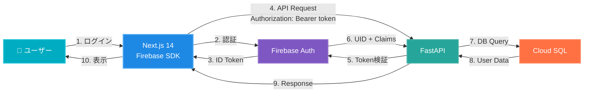

# Firebase Authentication 実装ガイド

> **Document Version:** 1.0
> **Last Updated:** 2025年10月9日
> **Decision:** ADR-002で採用決定
> **Status:** ✅ 確定

## 目次

1. [概要](#1-概要)
2. [Firebase初期設定](#2-firebase初期設定)
3. [Next.js 14フロントエンド実装](#3-nextjs-14フロントエンド実装)
4. [FastAPIバックエンド実装](#4-fastapiバックエンド実装)
5. [Custom Claims（マルチテナント)](#5-custom-claimsマルチテナント)
6. [セキュリティベストプラクティス](#6-セキュリティベストプラクティス)
7. [本番環境デプロイ](#7-本番環境デプロイ)

---

## 1. 概要

### 1.1. 採用決定理由

| 項目 | 内容 |
|------|------|
| **決定日** | 2025年10月9日 |
| **認証方式** | Email/Password + Google OAuth |
| **主な理由** | GCP統合、運用負荷削減、エンタープライズグレード |
| **代替案** | Auth0（コスト高）、独自実装（運用負荷） |

### 1.2. アーキテクチャ概要



---

## 2. Firebase初期設定

### 2.1. Firebaseプロジェクト作成

```bash
# Firebase CLI インストール
npm install -g firebase-tools

# Firebase ログイン
firebase login

# プロジェクト作成（GCPプロジェクトと連携）
firebase projects:create fractal-link --display-name "Fractal Link"

# プロジェクト初期化
firebase init
```

**選択項目:**

- ✅ Authentication
- ✅ Hosting (Next.js用)
- ❌ Firestore（Cloud SQLを使用）
- ❌ Functions（Cloud Runを使用）

### 2.2. Firebase Authentication有効化

```bash
# Authenticationを有効化
firebase use fractal-link

# Google Cloud Consoleでも確認
open https://console.firebase.google.com/project/fractal-link/authentication
```

**有効化する認証プロバイダー:**

1. **Email/Password**
   - ✅ 有効化
   - ✅ メール確認を必須にする

2. **Google OAuth**
   - ✅ 有効化
   - OAuth同意画面を設定
   - 承認済みドメイン追加: `fractal-link.jp`, `localhost:3000`

### 2.3. サービスアカウントキー生成

```bash
# FastAPI用サービスアカウントキー生成
gcloud iam service-accounts create firebase-admin \
  --display-name="Firebase Admin SDK" \
  --project=fractal-link

# キーをダウンロード
gcloud iam service-accounts keys create firebase-admin-key.json \
  --iam-account=firebase-admin@fractal-link.iam.gserviceaccount.com

# 権限付与
gcloud projects add-iam-policy-binding fractal-link \
  --member="serviceAccount:firebase-admin@fractal-link.iam.gserviceaccount.com" \
  --role="roles/firebase.admin"
```

---

## 3. Next.js 14フロントエンド実装

### 3.1. Firebase SDK インストール

```bash
npm install firebase firebase-admin
npm install @tanstack/react-query  # API通信用
```

### 3.2. Firebase初期化

```typescript
// lib/firebase/config.ts

import { initializeApp, getApps } from 'firebase/app';
import { getAuth, connectAuthEmulator } from 'firebase/auth';

const firebaseConfig = {
  apiKey: process.env.NEXT_PUBLIC_FIREBASE_API_KEY,
  authDomain: process.env.NEXT_PUBLIC_FIREBASE_AUTH_DOMAIN,
  projectId: process.env.NEXT_PUBLIC_FIREBASE_PROJECT_ID,
  storageBucket: process.env.NEXT_PUBLIC_FIREBASE_STORAGE_BUCKET,
  messagingSenderId: process.env.NEXT_PUBLIC_FIREBASE_MESSAGING_SENDER_ID,
  appId: process.env.NEXT_PUBLIC_FIREBASE_APP_ID,
};

// 初期化（重複防止）
const app = getApps().length === 0 ? initializeApp(firebaseConfig) : getApps()[0];

// Authentication
export const auth = getAuth(app);

// ローカル開発時はエミュレータ接続
if (process.env.NODE_ENV === 'development') {
  connectAuthEmulator(auth, 'http://localhost:9099');
}
```

### 3.3. 環境変数設定

```bash
# .env.local

NEXT_PUBLIC_FIREBASE_API_KEY="AIzaSy..."
NEXT_PUBLIC_FIREBASE_AUTH_DOMAIN="fractal-link.firebaseapp.com"
NEXT_PUBLIC_FIREBASE_PROJECT_ID="fractal-link"
NEXT_PUBLIC_FIREBASE_STORAGE_BUCKET="fractal-link.appspot.com"
NEXT_PUBLIC_FIREBASE_MESSAGING_SENDER_ID="123456789"
NEXT_PUBLIC_FIREBASE_APP_ID="1:123456789:web:abc123"

# FastAPI Backend URL
NEXT_PUBLIC_API_BASE_URL="http://localhost:8000"
```

### 3.4. AuthContext実装（App Router対応）

```typescript
// contexts/AuthContext.tsx

'use client';

import { createContext, useContext, useEffect, useState, ReactNode } from 'react';
import {
  User,
  onAuthStateChanged,
  signInWithEmailAndPassword,
  signInWithPopup,
  GoogleAuthProvider,
  signOut as firebaseSignOut,
  createUserWithEmailAndPassword,
} from 'firebase/auth';
import { auth } from '@/lib/firebase/config';

interface AuthContextType {
  user: User | null;
  loading: boolean;
  signIn: (email: string, password: string) => Promise<void>;
  signInWithGoogle: () => Promise<void>;
  signUp: (email: string, password: string) => Promise<void>;
  signOut: () => Promise<void>;
  getIdToken: () => Promise<string | null>;
}

const AuthContext = createContext<AuthContextType | undefined>(undefined);

export function AuthProvider({ children }: { children: ReactNode }) {
  const [user, setUser] = useState<User | null>(null);
  const [loading, setLoading] = useState(true);

  useEffect(() => {
    // Firebase Auth状態監視
    const unsubscribe = onAuthStateChanged(auth, (user) => {
      setUser(user);
      setLoading(false);
    });

    return () => unsubscribe();
  }, []);

  // Email/Password ログイン
  const signIn = async (email: string, password: string) => {
    try {
      await signInWithEmailAndPassword(auth, email, password);
    } catch (error) {
      console.error('Sign in error:', error);
      throw error;
    }
  };

  // Google OAuth ログイン
  const signInWithGoogle = async () => {
    try {
      const provider = new GoogleAuthProvider();
      await signInWithPopup(auth, provider);
    } catch (error) {
      console.error('Google sign in error:', error);
      throw error;
    }
  };

  // ユーザー登録
  const signUp = async (email: string, password: string) => {
    try {
      await createUserWithEmailAndPassword(auth, email, password);
    } catch (error) {
      console.error('Sign up error:', error);
      throw error;
    }
  };

  // ログアウト
  const signOut = async () => {
    try {
      await firebaseSignOut(auth);
    } catch (error) {
      console.error('Sign out error:', error);
      throw error;
    }
  };

  // ID Token取得（API呼び出し用）
  const getIdToken = async (): Promise<string | null> => {
    if (!user) return null;
    try {
      return await user.getIdToken();
    } catch (error) {
      console.error('Get ID token error:', error);
      return null;
    }
  };

  const value: AuthContextType = {
    user,
    loading,
    signIn,
    signInWithGoogle,
    signUp,
    signOut,
    getIdToken,
  };

  return <AuthContext.Provider value={value}>{children}</AuthContext.Provider>;
}

// カスタムフック
export function useAuth() {
  const context = useContext(AuthContext);
  if (context === undefined) {
    throw new Error('useAuth must be used within an AuthProvider');
  }
  return context;
}
```

### 3.5. ログインページ実装

```typescript
// app/login/page.tsx

'use client';

import { useState } from 'react';
import { useRouter } from 'next/navigation';
import { useAuth } from '@/contexts/AuthContext';

export default function LoginPage() {
  const [email, setEmail] = useState('');
  const [password, setPassword] = useState('');
  const [error, setError] = useState('');
  const [loading, setLoading] = useState(false);

  const { signIn, signInWithGoogle } = useAuth();
  const router = useRouter();

  const handleEmailLogin = async (e: React.FormEvent) => {
    e.preventDefault();
    setError('');
    setLoading(true);

    try {
      await signIn(email, password);
      router.push('/dashboard');
    } catch (err: any) {
      setError(err.message || 'ログインに失敗しました');
    } finally {
      setLoading(false);
    }
  };

  const handleGoogleLogin = async () => {
    setError('');
    setLoading(true);

    try {
      await signInWithGoogle();
      router.push('/dashboard');
    } catch (err: any) {
      setError(err.message || 'Googleログインに失敗しました');
    } finally {
      setLoading(false);
    }
  };

  return (
    <div className="min-h-screen flex items-center justify-center bg-gray-50">
      <div className="max-w-md w-full space-y-8 p-8 bg-white rounded-lg shadow">
        <div>
          <h2 className="text-center text-3xl font-bold text-gray-900">
            Fractal Link
          </h2>
          <p className="mt-2 text-center text-sm text-gray-600">
            訪問看護業務支援システム
          </p>
        </div>

        <form onSubmit={handleEmailLogin} className="mt-8 space-y-6">
          {error && (
            <div className="bg-red-50 text-red-500 p-3 rounded">
              {error}
            </div>
          )}

          <div className="space-y-4">
            <div>
              <label htmlFor="email" className="block text-sm font-medium text-gray-700">
                メールアドレス
              </label>
              <input
                id="email"
                type="email"
                required
                value={email}
                onChange={(e) => setEmail(e.target.value)}
                className="mt-1 block w-full px-3 py-2 border border-gray-300 rounded-md"
              />
            </div>

            <div>
              <label htmlFor="password" className="block text-sm font-medium text-gray-700">
                パスワード
              </label>
              <input
                id="password"
                type="password"
                required
                value={password}
                onChange={(e) => setPassword(e.target.value)}
                className="mt-1 block w-full px-3 py-2 border border-gray-300 rounded-md"
              />
            </div>
          </div>

          <button
            type="submit"
            disabled={loading}
            className="w-full flex justify-center py-2 px-4 border border-transparent rounded-md shadow-sm text-sm font-medium text-white bg-blue-600 hover:bg-blue-700 disabled:opacity-50"
          >
            {loading ? 'ログイン中...' : 'ログイン'}
          </button>
        </form>

        <div className="relative">
          <div className="absolute inset-0 flex items-center">
            <div className="w-full border-t border-gray-300" />
          </div>
          <div className="relative flex justify-center text-sm">
            <span className="px-2 bg-white text-gray-500">または</span>
          </div>
        </div>

        <button
          onClick={handleGoogleLogin}
          disabled={loading}
          className="w-full flex items-center justify-center py-2 px-4 border border-gray-300 rounded-md shadow-sm text-sm font-medium text-gray-700 bg-white hover:bg-gray-50"
        >
          <svg className="w-5 h-5 mr-2" viewBox="0 0 24 24">
            {/* Google Logo SVG */}
          </svg>
          Googleでログイン
        </button>
      </div>
    </div>
  );
}
```

### 3.6. API Client実装（Token自動付与）

```typescript
// lib/api/client.ts

import { auth } from '@/lib/firebase/config';

const API_BASE_URL = process.env.NEXT_PUBLIC_API_BASE_URL;

export async function apiClient(
  endpoint: string,
  options: RequestInit = {}
): Promise<Response> {
  // Firebase ID Token取得
  const user = auth.currentUser;
  let token: string | null = null;

  if (user) {
    token = await user.getIdToken();
  }

  // ヘッダー設定
  const headers = new Headers(options.headers);
  if (token) {
    headers.set('Authorization', `Bearer ${token}`);
  }
  headers.set('Content-Type', 'application/json');

  // API呼び出し
  const response = await fetch(`${API_BASE_URL}${endpoint}`, {
    ...options,
    headers,
  });

  if (!response.ok) {
    if (response.status === 401) {
      // Token期限切れ → ログアウト
      await auth.signOut();
      window.location.href = '/login';
    }
    throw new Error(`API Error: ${response.status}`);
  }

  return response;
}

// 使用例
export async function getClients() {
  const response = await apiClient('/api/v1/clients');
  return response.json();
}
```

### 3.7. 認証ガード（Middleware）

```typescript
// middleware.ts

import { NextRequest, NextResponse } from 'next/server';

export function middleware(request: NextRequest) {
  const { pathname } = request.nextUrl;

  // 公開ページ
  const publicPaths = ['/login', '/signup', '/forgot-password'];
  if (publicPaths.includes(pathname)) {
    return NextResponse.next();
  }

  // 認証確認（Cookieにトークンがあるか）
  const token = request.cookies.get('firebase-token');

  if (!token) {
    return NextResponse.redirect(new URL('/login', request.url));
  }

  return NextResponse.next();
}

export const config = {
  matcher: [
    /*
     * Match all request paths except:
     * - _next/static (static files)
     * - _next/image (image optimization files)
     * - favicon.ico (favicon file)
     */
    '/((?!_next/static|_next/image|favicon.ico).*)',
  ],
};
```

---

## 4. FastAPIバックエンド実装

### 4.1. Firebase Admin SDK インストール

```bash
pip install firebase-admin
pip install fastapi[all]
```

### 4.2. Firebase Admin初期化

```python
# app/core/firebase.py

import firebase_admin
from firebase_admin import credentials, auth
import logging
import os

logger = logging.getLogger(__name__)

def initialize_firebase():
    """Firebase Admin SDK初期化"""
    if not firebase_admin._apps:
        # サービスアカウントキーのパス
        cred_path = os.getenv("FIREBASE_ADMIN_KEY_PATH", "firebase-admin-key.json")

        if os.path.exists(cred_path):
            cred = credentials.Certificate(cred_path)
        else:
            # Cloud Run環境ではデフォルト認証情報使用
            cred = credentials.ApplicationDefault()

        firebase_admin.initialize_app(cred, {
            'projectId': os.getenv("GCP_PROJECT_ID", "fractal-link"),
        })

        logger.info("Firebase Admin SDK initialized")

# アプリ起動時に実行
initialize_firebase()
```

### 4.3. Token検証Middleware

```python
# app/middleware/auth.py

from fastapi import Request, HTTPException, status
from fastapi.security import HTTPBearer, HTTPAuthorizationCredentials
from firebase_admin import auth
from typing import Dict
import logging

logger = logging.getLogger(__name__)

security = HTTPBearer()

async def verify_firebase_token(
    credentials: HTTPAuthorizationCredentials = Depends(security)
) -> Dict:
    """Firebase ID Token検証"""
    token = credentials.credentials

    try:
        # Token検証
        decoded_token = auth.verify_id_token(token)

        # Custom Claims取得
        uid = decoded_token['uid']
        email = decoded_token.get('email')
        org_id = decoded_token.get('organization_id')
        role = decoded_token.get('role')

        logger.info(f"Authenticated user: {email} (UID: {uid})")

        return {
            'uid': uid,
            'email': email,
            'organization_id': org_id,
            'role': role,
            'token': decoded_token
        }

    except auth.InvalidIdTokenError:
        logger.error("Invalid Firebase ID token")
        raise HTTPException(
            status_code=status.HTTP_401_UNAUTHORIZED,
            detail="Invalid authentication token"
        )

    except auth.ExpiredIdTokenError:
        logger.error("Expired Firebase ID token")
        raise HTTPException(
            status_code=status.HTTP_401_UNAUTHORIZED,
            detail="Authentication token expired"
        )

    except Exception as e:
        logger.error(f"Token verification error: {str(e)}")
        raise HTTPException(
            status_code=status.HTTP_401_UNAUTHORIZED,
            detail="Authentication failed"
        )
```

### 4.4. 保護されたエンドポイント実装

```python
# app/api/v1/endpoints/clients.py

from fastapi import APIRouter, Depends, HTTPException
from sqlalchemy.orm import Session
from typing import List
import logging

from app.middleware.auth import verify_firebase_token
from app.db.session import get_db
from app.models.client import Client
from app.schemas.client import ClientResponse

logger = logging.getLogger(__name__)

router = APIRouter()

@router.get("/clients", response_model=List[ClientResponse])
async def get_clients(
    db: Session = Depends(get_db),
    current_user: dict = Depends(verify_firebase_token)
):
    """
    利用者一覧取得（認証必須）

    - **Firebase Authentication**: 必須
    - **Custom Claims**: organization_id で組織フィルタリング
    """
    try:
        # 組織IDでフィルタリング
        org_id = current_user.get('organization_id')
        if not org_id:
            raise HTTPException(
                status_code=403,
                detail="Organization not assigned"
            )

        # DB Query
        clients = db.query(Client).filter(
            Client.organization_id == org_id,
            Client.deleted_at.is_(None)
        ).all()

        logger.info(f"Retrieved {len(clients)} clients for org {org_id}")

        return clients

    except Exception as e:
        logger.error(f"Get clients error: {str(e)}")
        raise HTTPException(status_code=500, detail=str(e))

@router.get("/clients/{client_id}", response_model=ClientResponse)
async def get_client(
    client_id: int,
    db: Session = Depends(get_db),
    current_user: dict = Depends(verify_firebase_token)
):
    """利用者詳細取得（認証 + 権限チェック）"""
    try:
        org_id = current_user.get('organization_id')

        client = db.query(Client).filter(
            Client.id == client_id,
            Client.organization_id == org_id,
            Client.deleted_at.is_(None)
        ).first()

        if not client:
            raise HTTPException(status_code=404, detail="Client not found")

        return client

    except HTTPException:
        raise
    except Exception as e:
        logger.error(f"Get client error: {str(e)}")
        raise HTTPException(status_code=500, detail=str(e))
```

---

## 5. Custom Claims（マルチテナント）

### 5.1. Custom Claims構造設計

```json
{
  "uid": "user123",
  "email": "nurse@example.com",
  "organization_id": "org001",
  "role": "nurse",
  "department_ids": ["dept01", "dept02"],
  "permissions": [
    "read:clients",
    "write:visit_records",
    "read:documents"
  ]
}
```

### 5.2. Custom Claims設定関数

```python
# app/services/auth/custom_claims.py

from firebase_admin import auth
from typing import List, Dict
import logging

logger = logging.getLogger(__name__)

async def set_custom_claims(
    uid: str,
    organization_id: str,
    role: str,
    department_ids: List[str],
    permissions: List[str]
) -> None:
    """Custom Claims設定（マルチテナント用）"""
    try:
        custom_claims = {
            'organization_id': organization_id,
            'role': role,
            'department_ids': department_ids,
            'permissions': permissions
        }

        auth.set_custom_user_claims(uid, custom_claims)

        logger.info(f"Set custom claims for user {uid}")

    except Exception as e:
        logger.error(f"Set custom claims error: {str(e)}")
        raise

async def get_user_claims(uid: str) -> Dict:
    """Custom Claims取得"""
    try:
        user = auth.get_user(uid)
        return user.custom_claims or {}

    except Exception as e:
        logger.error(f"Get user claims error: {str(e)}")
        raise
```

### 5.3. ユーザー登録時のClaims設定

```python
# app/api/v1/endpoints/auth.py

from fastapi import APIRouter, HTTPException, Depends
from pydantic import BaseModel, EmailStr
from sqlalchemy.orm import Session
import logging

from app.db.session import get_db
from app.models.user import User
from app.services.auth.custom_claims import set_custom_claims

logger = logging.getLogger(__name__)

router = APIRouter()

class UserCreateRequest(BaseModel):
    email: EmailStr
    password: str
    first_name: str
    last_name: str
    organization_id: str
    department_id: str
    role: str

@router.post("/auth/register")
async def register_user(
    request: UserCreateRequest,
    db: Session = Depends(get_db)
):
    """
    ユーザー登録 + Custom Claims設定

    1. Firebase Authenticationでユーザー作成
    2. Cloud SQLにユーザー情報保存
    3. Custom Claims設定
    """
    try:
        # 1. Firebase Authentication ユーザー作成
        from firebase_admin import auth
        firebase_user = auth.create_user(
            email=request.email,
            password=request.password
        )

        logger.info(f"Created Firebase user: {firebase_user.uid}")

        # 2. Cloud SQL保存
        db_user = User(
            firebase_uid=firebase_user.uid,
            email=request.email,
            first_name=request.first_name,
            last_name=request.last_name,
            organization_id=request.organization_id,
            role=request.role
        )
        db.add(db_user)
        db.commit()
        db.refresh(db_user)

        logger.info(f"Saved user to database: {db_user.id}")

        # 3. Custom Claims設定
        permissions = _get_permissions_for_role(request.role)

        await set_custom_claims(
            uid=firebase_user.uid,
            organization_id=request.organization_id,
            role=request.role,
            department_ids=[request.department_id],
            permissions=permissions
        )

        return {
            "uid": firebase_user.uid,
            "email": firebase_user.email,
            "message": "User registered successfully"
        }

    except Exception as e:
        logger.error(f"User registration error: {str(e)}")
        raise HTTPException(status_code=500, detail=str(e))

def _get_permissions_for_role(role: str) -> List[str]:
    """ロール別権限マッピング"""
    role_permissions = {
        "admin": [
            "read:clients", "write:clients", "delete:clients",
            "read:visit_records", "write:visit_records",
            "read:documents", "write:documents",
            "read:users", "write:users"
        ],
        "nurse": [
            "read:clients", "write:clients",
            "read:visit_records", "write:visit_records",
            "read:documents", "write:documents"
        ],
        "viewer": [
            "read:clients",
            "read:visit_records",
            "read:documents"
        ]
    }
    return role_permissions.get(role, [])
```

---

## 6. セキュリティベストプラクティス

### 6.1. Token Refresh戦略

```typescript
// lib/auth/tokenRefresh.ts

import { auth } from '@/lib/firebase/config';

// Token自動更新（55分ごと、Tokenの有効期限は60分）
export function setupTokenRefresh() {
  const REFRESH_INTERVAL = 55 * 60 * 1000; // 55分

  setInterval(async () => {
    const user = auth.currentUser;
    if (user) {
      try {
        await user.getIdToken(true); // force refresh
        console.log('Token refreshed');
      } catch (error) {
        console.error('Token refresh failed:', error);
      }
    }
  }, REFRESH_INTERVAL);
}
```

### 6.2. CORS設定

```python
# app/main.py

from fastapi import FastAPI
from fastapi.middleware.cors import CORSMiddleware

app = FastAPI()

# CORS設定（本番環境では厳格に）
app.add_middleware(
    CORSMiddleware,
    allow_origins=[
        "http://localhost:3000",  # 開発環境
        "https://fractal-link.jp",  # 本番環境
    ],
    allow_credentials=True,
    allow_methods=["GET", "POST", "PUT", "DELETE"],
    allow_headers=["Authorization", "Content-Type"],
)
```

### 6.3. Rate Limiting

```python
# app/middleware/rate_limit.py

from slowapi import Limiter, _rate_limit_exceeded_handler
from slowapi.util import get_remote_address
from slowapi.errors import RateLimitExceeded
from fastapi import Request

limiter = Limiter(key_func=get_remote_address)

# app/main.py に追加
app.state.limiter = limiter
app.add_exception_handler(RateLimitExceeded, _rate_limit_exceeded_handler)

# エンドポイントに適用
@router.post("/auth/login")
@limiter.limit("5/minute")  # 1分間に5回まで
async def login(request: Request):
    pass
```

---

## 7. 本番環境デプロイ

### 7.1. 環境変数設定（Cloud Run）

```bash
# Firebase Admin Key を Secret Manager に保存
gcloud secrets create firebase-admin-key \
  --data-file=firebase-admin-key.json \
  --project=fractal-link

# Cloud Run デプロイ時に環境変数設定
gcloud run deploy fractal-link-api \
  --image=asia-northeast1-docker.pkg.dev/fractal-link/api:latest \
  --region=asia-northeast1 \
  --platform=managed \
  --set-env-vars="GCP_PROJECT_ID=fractal-link" \
  --set-secrets="FIREBASE_ADMIN_KEY=/secrets/firebase-admin-key=firebase-admin-key:latest"
```

### 7.2. Firebase Hosting（Next.js）

```bash
# Next.js ビルド
npm run build

# Firebase Hosting デプロイ
firebase deploy --only hosting
```

```json
// firebase.json

{
  "hosting": {
    "public": "out",
    "ignore": ["firebase.json", "**/.*", "**/node_modules/**"],
    "rewrites": [
      {
        "source": "**",
        "destination": "/index.html"
      }
    ],
    "headers": [
      {
        "source": "**",
        "headers": [
          {
            "key": "Cache-Control",
            "value": "public, max-age=3600, s-maxage=3600"
          }
        ]
      }
    ]
  }
}
```

---

## まとめ

### 実装チェックリスト

- [x] Firebase プロジェクト作成
- [x] Email/Password認証有効化
- [x] Google OAuth設定
- [x] Next.js 14 Firebase SDK統合
- [x] FastAPI Firebase Admin SDK統合
- [x] Token検証Middleware実装
- [x] Custom Claims設計・実装
- [ ] Token Refresh自動化
- [ ] Rate Limiting実装
- [ ] 本番環境デプロイ

### 関連ドキュメント

- [ADR-002: 認証方式選定](../development/08_技術的意思決定記録.md#adr-002-認証方式選定)
- [ADR-001: Next.js 14採用決定](../development/08_技術的意思決定記録.md#adr-001-フロントエンドフレームワーク選定)
- [02_アーキテクチャ.md - セキュリティ設計](../../core/02_アーキテクチャ.md#5-セキュリティ設計)
