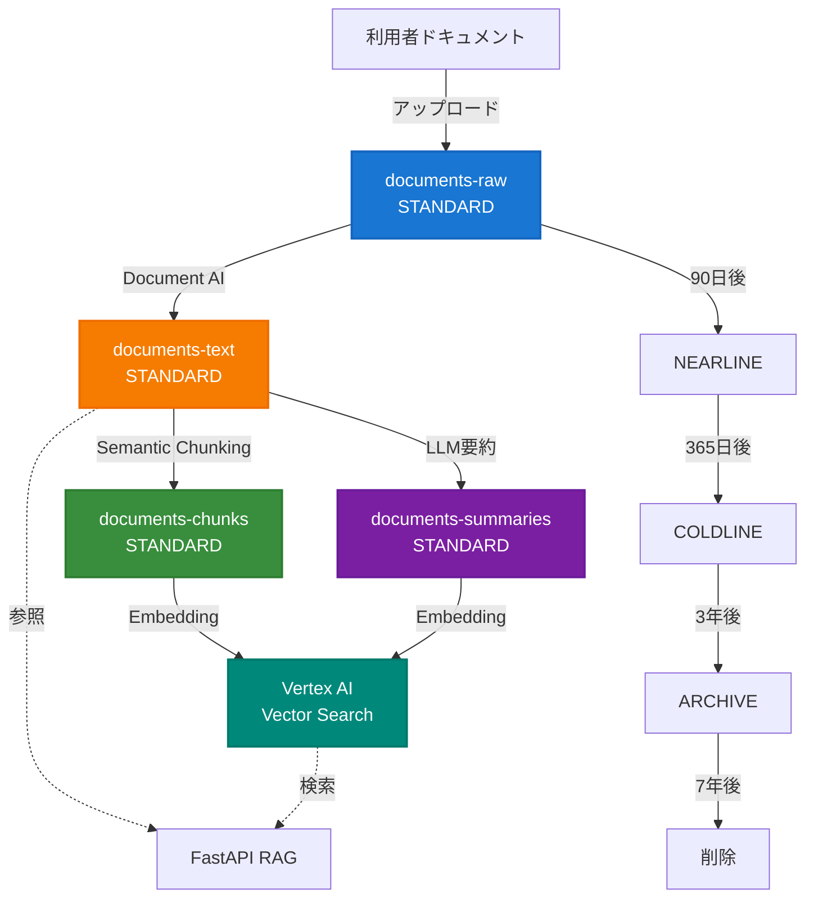

# Cloud Storage フォルダ構造設計書

> **Document Version:** 1.0
> **Last Updated:** 2025年10月9日
> **Status:** ✅ 確定
> **Compliance:** 医療情報システムの安全管理に関するガイドライン v6.0準拠

## 目次

1. [概要](#1-概要)
2. [バケット戦略](#2-バケット戦略)
3. [フォルダ構造](#3-フォルダ構造)
4. [メタデータ設計](#4-メタデータ設計)
5. [ライフサイクルポリシー](#5-ライフサイクルポリシー)
6. [セキュリティ構成](#6-セキュリティ構成)
7. [RAG最適化](#7-rag最適化)
8. [実装コード](#8-実装コード)
9. [コスト試算](#9-コスト試算)

---

## 1. 概要

### 1.1. 設計原則

| 原則 | 実装方法 | 根拠 |
|------|---------|------|
| **マルチテナント分離** | 組織ID階層による完全分離 | セキュリティ、課金分離 |
| **コスト最適化** | GCSテキスト保存（-93%削減） | Vector Searchは高額 |
| **7年保存対応** | ライフサイクル自動遷移 | 医療法準拠 |
| **RAG最適化** | 専用バケット+二重保存 | 検索精度向上 |
| **CMEK暗号化** | 全バケットKMS管理 | APPI/HIPAA相当 |

### 1.2. アーキテクチャ概要



---

## 2. バケット戦略

### 2.1. マルチバケット構成

```bash
# 本番環境
fractal-link-prod-documents-raw          # 原本PDF/画像（7年保存）
fractal-link-prod-documents-text         # Document AI抽出テキスト
fractal-link-prod-documents-chunks       # セマンティックチャンク
fractal-link-prod-documents-summaries    # LLM生成要約
fractal-link-prod-documents-temp         # 一時ファイル（24時間TTL）

# 開発環境
fractal-link-dev-documents-raw
fractal-link-dev-documents-text
...
```

**メリット:**

| バケット | 目的 | ライフサイクル | Storage Class |
|---------|------|--------------|---------------|
| **raw** | 法的保存義務 | 7年→削除 | STANDARD→ARCHIVE |
| **text** | RAG検索用 | 7年→削除 | STANDARD→NEARLINE |
| **chunks** | Vector Search用 | 削除なし | STANDARD |
| **summaries** | 高精度検索用 | 削除なし | STANDARD |
| **temp** | アップロード一時保管 | 24時間→削除 | STANDARD |

### 2.2. Terraform構成

```hcl
# terraform/modules/storage/buckets.tf

locals {
  buckets = {
    raw = {
      name          = "${var.project_id}-${var.environment}-documents-raw"
      lifecycle_days = {
        nearline = 90
        coldline = 365
        archive  = 1095
        delete   = 2555  # 7 years
      }
    }
    text = {
      name          = "${var.project_id}-${var.environment}-documents-text"
      lifecycle_days = {
        nearline = 30
        delete   = 2555
      }
    }
    chunks = {
      name = "${var.project_id}-${var.environment}-documents-chunks"
    }
    summaries = {
      name = "${var.project_id}-${var.environment}-documents-summaries"
    }
    temp = {
      name = "${var.project_id}-${var.environment}-documents-temp"
      lifecycle_days = {
        delete = 1
      }
    }
  }
}

resource "google_storage_bucket" "documents" {
  for_each = local.buckets

  name          = each.value.name
  location      = var.region
  storage_class = "STANDARD"

  uniform_bucket_level_access {
    enabled = true
  }

  versioning {
    enabled = true
  }

  encryption {
    default_kms_key_name = google_kms_crypto_key.documents_key.id
  }

  public_access_prevention = "enforced"

  labels = {
    environment = var.environment
    compliance  = "medical-records"
    cost_center = "healthcare-operations"
  }
}
```

---

## 3. フォルダ構造

### 3.1. 完全版ディレクトリツリー

```text
{bucket}/
├── organizations/                      # 組織別分離
│   └── {organization_id}/              # 例: org_001
│       └── clients/                    # 利用者別
│           └── {hash_prefix}/          # 負荷分散用（MD5先頭2文字）
│               └── {client_id}/        # 例: client_00012345
│                   ├── medical_directives/    # 訪問看護指示書
│                   │   └── {year}/            # 例: 2025
│                   │       └── {month}/       # 例: 10
│                   │           ├── {document_id}_v{version}.pdf
│                   │           └── {document_id}_metadata.json
│                   │
│                   ├── contracts/             # 契約書（永久保存）
│                   │   └── {contract_date}/
│                   │       └── {contract_id}.pdf
│                   │
│                   ├── visit_records/         # 訪問記録（7年保存）
│                   │   └── {year}/
│                   │       └── {month}/
│                   │           └── {visit_id}_{date}.pdf
│                   │
│                   ├── insurance_cards/       # 保険証コピー
│                   │   └── {card_type}/
│                   │       └── {card_id}_{expiry}.pdf
│                   │
│                   ├── consent_forms/         # 同意書（永久保存）
│                   │   └── {form_type}/
│                   │       └── {consent_id}_{signed_date}.pdf
│                   │
│                   ├── billing/               # 請求書類（7年保存）
│                   │   └── {year}/
│                   │       └── {month}/
│                   │           └── billing_{yyyymm}.pdf
│                   │
│                   └── photos/                # 利用者写真
│                       ├── profile/
│                       │   └── {photo_id}_{date}.jpg
│                       └── care_situation/
│                           └── {photo_id}_{date}.jpg
│
├── departments/                        # 事業所別書類
│   └── {department_id}/
│       ├── certifications/             # 指定更新書類
│       ├── staff_records/              # 職員記録
│       └── policies/                   # 規程類
│
└── system/                             # システム内部
    ├── training_data/                  # RAG学習用データ
    ├── logs/                           # アプリケーションログ
    └── temp/                           # 一時ファイル
```

### 3.2. パス生成ロジック

```python
# app/services/storage/path_generator.py

import hashlib
from datetime import datetime
from typing import Optional

class StoragePathGenerator:
    """GCSパス生成ユーティリティ"""

    @staticmethod
    def generate_document_path(
        organization_id: str,
        client_id: int,
        document_type: str,
        filename: str,
        year: Optional[int] = None,
        month: Optional[int] = None
    ) -> str:
        """ドキュメントパス生成（ハッシュプレフィックス付き）"""

        # 負荷分散用ハッシュプレフィックス
        client_str = f"{client_id:08d}"
        hash_prefix = hashlib.md5(client_str.encode()).hexdigest()[:2]

        # 年月（指定なしは現在）
        if year is None:
            now = datetime.now()
            year = now.year
            month = now.month

        # パス構築
        path_parts = [
            "organizations",
            organization_id,
            "clients",
            hash_prefix,
            client_str,
            document_type,
            str(year)
        ]

        if month is not None:
            path_parts.append(f"{month:02d}")

        path_parts.append(filename)

        return "/".join(path_parts)

    @staticmethod
    def generate_chunk_path(
        organization_id: str,
        client_id: int,
        document_id: str,
        chunk_index: int
    ) -> str:
        """チャンクパス生成"""
        client_str = f"{client_id:08d}"
        hash_prefix = hashlib.md5(client_str.encode()).hexdigest()[:2]

        return (
            f"organizations/{organization_id}/"
            f"clients/{hash_prefix}/{client_str}/"
            f"chunks/{document_id}/"
            f"chunk_{chunk_index:04d}.txt"
        )

# 使用例
generator = StoragePathGenerator()

# 医療指示書パス
path = generator.generate_document_path(
    organization_id="org_001",
    client_id=12345,
    document_type="medical_directives",
    filename="directive_20251009_v1.pdf",
    year=2025,
    month=10
)
# => "organizations/org_001/clients/e8/00012345/medical_directives/2025/10/directive_20251009_v1.pdf"
```

---

## 4. メタデータ設計

### 4.1. GCSオブジェクトメタデータ（8KB制限内）

```json
{
  "organization_id": "org_001",
  "client_id": "00012345",
  "document_id": "doc_20251009_001",
  "document_type": "medical_directive",
  "version": "1",
  "issue_date": "2025-10-01",
  "expiry_date": "2026-03-31",
  "uploader_uid": "firebase_uid_456",
  "uploaded_at": "2025-10-09T10:30:00Z",
  "content_hash_sha256": "abc123...",
  "file_size_bytes": "2457600",
  "mime_type": "application/pdf",
  "ocr_status": "completed",
  "rag_indexed": "true",
  "vector_search_ids": "vs_abc123,vs_def456",
  "retention_years": "7",
  "storage_class": "STANDARD",
  "encryption": "CMEK",
  "pii_level": "high",
  "tags": "重要,期限管理,往診指示"
}
```

### 4.2. 詳細メタデータJSON（別ファイル）

```json
{
  "document_info": {
    "id": "doc_20251009_001",
    "version": 1,
    "type": "medical_directive",
    "title": "訪問看護指示書（田中花子様）",
    "category": "医療文書",
    "subcategory": "指示書",
    "language": "ja",
    "page_count": 5,
    "character_count": 12500,
    "file_size_bytes": 2457600,
    "mime_type": "application/pdf",
    "content_hash": "sha256:abc123...",
    "original_filename": "directive_tanaka_20251001.pdf"
  },
  "lifecycle": {
    "created_at": "2025-10-01T00:00:00Z",
    "uploaded_at": "2025-10-09T10:30:00Z",
    "issue_date": "2025-10-01",
    "expiry_date": "2026-03-31",
    "effective_from": "2025-10-01",
    "effective_until": "2026-03-31",
    "retention_years": 7,
    "retention_until": "2032-10-01",
    "auto_archive_date": "2026-04-01",
    "auto_delete_date": "2032-10-01",
    "is_permanent": false
  },
  "access_control": {
    "organization_id": "org_001",
    "department_ids": ["dept_0001", "dept_0002"],
    "client_id": "00012345",
    "uploader_uid": "firebase_uid_456",
    "uploader_name": "山田看護師",
    "viewer_roles": ["nurse", "admin", "doctor"],
    "confidentiality_level": "high",
    "requires_audit": true
  },
  "processing": {
    "document_ai": {
      "status": "completed",
      "processor_id": "projects/PROJECT/locations/us/processors/PROCESSOR_ID",
      "processor_version": "layout-parser-v1",
      "processed_at": "2025-10-09T10:32:00Z",
      "confidence_score": 0.97,
      "text_path": "gs://fractal-link-prod-documents-text/.../doc_20251009_001.txt",
      "page_details": [
        {
          "page_number": 1,
          "confidence": 0.98,
          "detected_languages": ["ja"],
          "text_length": 2500
        }
      ]
    },
    "rag": {
      "indexed": true,
      "chunking_strategy": "semantic",
      "chunk_count": 8,
      "chunk_size": 1500,
      "chunk_overlap": 200,
      "embedding_model": "gemini-embedding-001",
      "embedding_dimension": 3072,
      "embedding_task_type": "RETRIEVAL_DOCUMENT",
      "vector_search_index_id": "index_prod_001",
      "vector_search_ids": [
        "vs_abc123",
        "vs_def456",
        "vs_ghi789"
      ],
      "indexed_at": "2025-10-09T10:40:00Z",
      "chunks_path": "gs://fractal-link-prod-documents-chunks/.../doc_20251009_001/"
    },
    "summary": {
      "generated": true,
      "summary_model": "gemini-2.5-flash-lite",
      "summary_version": "v1.0",
      "summary_length": 300,
      "compression_ratio": 0.024,
      "summary_path": "gs://fractal-link-prod-documents-summaries/.../summary.txt",
      "summary_vector_id": "vs_sum_xyz789",
      "created_at": "2025-10-09T10:45:00Z"
    }
  },
  "medical_metadata": {
    "patient": {
      "client_id": "00012345",
      "name_kana": "タナカ ハナコ",
      "date_of_birth": "1950-05-15",
      "age_at_issue": 75,
      "gender": "female",
      "insurance_number": "12345678"
    },
    "directive": {
      "issuing_physician": "鈴木太郎医師",
      "medical_institution": "〇〇病院",
      "department": "内科",
      "diagnosis": ["糖尿病", "高血圧", "慢性腎臓病"],
      "care_plan": "血糖値管理、血圧測定、服薬確認",
      "visit_frequency": "週3回",
      "special_instructions": "インスリン注射の手技確認"
    },
    "care_manager": {
      "name": "佐藤花子",
      "organization": "△△居宅介護支援事業所",
      "phone": "03-1234-5678"
    }
  },
  "audit": {
    "version_history": [
      {
        "version": 1,
        "uploaded_at": "2025-10-09T10:30:00Z",
        "uploader_uid": "firebase_uid_456",
        "uploader_name": "山田看護師",
        "change_reason": "新規指示書",
        "storage_path": "gs://.../.../doc_20251009_001_v1.pdf"
      }
    ],
    "access_log_path": "gs://fractal-link-prod-audit-logs/access/doc_20251009_001.jsonl",
    "checksum_verification": {
      "algorithm": "SHA256",
      "hash": "abc123...",
      "verified_at": "2025-10-09T10:31:00Z"
    }
  },
  "compliance": {
    "gdpr_compliant": false,
    "appi_compliant": true,
    "hipaa_equivalent": true,
    "retention_basis": "医師法第24条、保健師助産師看護師法第42条の2",
    "legal_hold": false,
    "export_restriction": "日本国内のみ"
  }
}
```

---

## 5. ライフサイクルポリシー

### 5.1. 書類種別ごとの保存期間

| 書類種別 | 法的保存期間 | Storage Class遷移 | 最終処理 |
|---------|-------------|------------------|---------|
| **訪問看護指示書** | 7年 | 90日→Nearline<br/>365日→Coldline<br/>3年→Archive | 7年後削除 |
| **訪問記録** | 7年 | 同上 | 7年後削除 |
| **契約書** | 永久 | 3年→Coldline<br/>7年→Archive | 削除なし |
| **同意書** | 永久 | 同上 | 削除なし |
| **請求書類** | 7年 | 90日→Nearline<br/>1年→Coldline | 7年後削除 |
| **保険証コピー** | 有効期限+3年 | 期限切れ後→Coldline | 3年後削除 |
| **利用者写真** | 契約中+1年 | 契約終了後→Archive | 1年後削除 |
| **一時ファイル** | 24時間 | なし | 24時間後削除 |

### 5.2. Terraformライフサイクル設定

```hcl
# terraform/modules/storage/lifecycle.tf

resource "google_storage_bucket_lifecycle_rule" "medical_directives" {
  bucket = google_storage_bucket.documents_raw.name

  # 90日後Nearline
  rule {
    action {
      type          = "SetStorageClass"
      storage_class = "NEARLINE"
    }
    condition {
      age                   = 90
      matches_prefix        = ["organizations/*/clients/*/medical_directives/"]
      matches_storage_class = ["STANDARD"]
    }
  }

  # 365日後Coldline
  rule {
    action {
      type          = "SetStorageClass"
      storage_class = "COLDLINE"
    }
    condition {
      age                   = 365
      matches_prefix        = ["organizations/*/clients/*/medical_directives/"]
      matches_storage_class = ["NEARLINE"]
    }
  }

  # 3年後Archive
  rule {
    action {
      type          = "SetStorageClass"
      storage_class = "ARCHIVE"
    }
    condition {
      age                   = 1095
      matches_prefix        = ["organizations/*/clients/*/medical_directives/"]
      matches_storage_class = ["COLDLINE"]
    }
  }

  # 7年後削除
  rule {
    action {
      type = "Delete"
    }
    condition {
      age            = 2555
      matches_prefix = ["organizations/*/clients/*/medical_directives/"]
    }
  }
}

# 一時ファイルは24時間で削除
resource "google_storage_bucket_lifecycle_rule" "temp_files" {
  bucket = google_storage_bucket.documents_temp.name

  rule {
    action {
      type = "Delete"
    }
    condition {
      age = 1
    }
  }
}
```

---

## 6. セキュリティ構成

### 6.1. CMEK暗号化

```hcl
# terraform/modules/kms/main.tf

resource "google_kms_key_ring" "documents" {
  name     = "fractal-link-documents-keyring"
  location = var.region
}

resource "google_kms_crypto_key" "documents_key" {
  name            = "documents-encryption-key"
  key_ring        = google_kms_key_ring.documents.id
  rotation_period = "7776000s"  # 90日自動ローテーション

  lifecycle {
    prevent_destroy = true
  }

  labels = {
    compliance = "appi-medical"
    data_type  = "pii-medical-records"
  }
}

# GCS Service Accountに暗号化権限付与
resource "google_kms_crypto_key_iam_member" "gcs_encrypter" {
  crypto_key_id = google_kms_crypto_key.documents_key.id
  role          = "roles/cloudkms.cryptoKeyEncrypterDecrypter"
  member        = "serviceAccount:service-${data.google_project.project.number}@gs-project-accounts.iam.gserviceaccount.com"
}
```

### 6.2. IAM Conditions（細粒度アクセス制御）

```hcl
# terraform/modules/storage/iam.tf

# 看護師は自分の担当利用者のみアクセス可
resource "google_storage_bucket_iam_member" "nurse_access" {
  bucket = google_storage_bucket.documents_raw.name
  role   = "roles/storage.objectViewer"
  member = "serviceAccount:nurse-sa@${var.project_id}.iam.gserviceaccount.com"

  condition {
    title       = "Access to assigned clients only"
    description = "Nurses can only view documents of their assigned clients"
    expression  = <<-EOT
      resource.name.startsWith("organizations/${var.organization_id}/clients/") &&
      request.auth.claims.department_ids.contains(
        resource.name.extract("departments/{department_id}/")
      )
    EOT
  }
}

# 管理者は全アクセス
resource "google_storage_bucket_iam_member" "admin_access" {
  bucket = google_storage_bucket.documents_raw.name
  role   = "roles/storage.admin"
  member = "serviceAccount:admin-sa@${var.project_id}.iam.gserviceaccount.com"
}
```

### 6.3. 署名付きURL生成（15分有効期限）

```python
# app/services/storage/signed_urls.py

from google.cloud import storage
from datetime import timedelta
from typing import Optional
import logging

logger = logging.getLogger(__name__)

class SignedURLService:
    """署名付きURL生成サービス"""

    def __init__(self):
        self.storage_client = storage.Client()

    def generate_download_url(
        self,
        bucket_name: str,
        blob_name: str,
        user_id: str,
        expiration_minutes: int = 15
    ) -> str:
        """ダウンロード用署名付きURL生成（15分有効）"""

        # 権限チェック（FirebaseカスタムClaimsで検証）
        if not self._verify_access(blob_name, user_id):
            raise PermissionError(f"User {user_id} cannot access {blob_name}")

        bucket = self.storage_client.bucket(bucket_name)
        blob = bucket.blob(blob_name)

        url = blob.generate_signed_url(
            version="v4",
            expiration=timedelta(minutes=expiration_minutes),
            method="GET",
            response_disposition='attachment',  # 強制ダウンロード
            response_type=blob.content_type
        )

        # アクセスログ記録
        self._log_access(
            user_id=user_id,
            blob_name=blob_name,
            action="generate_download_url",
            expiration_minutes=expiration_minutes
        )

        logger.info(f"Generated signed URL for {blob_name} (user: {user_id})")

        return url

    def _verify_access(self, blob_name: str, user_id: str) -> bool:
        """ユーザーのアクセス権限検証"""
        # Cloud SQLでユーザー権限確認
        # 例: organizations/org_001/clients/e8/00012345/...
        # → user_id が client_id 12345 にアクセス可能か確認
        pass

    def _log_access(self, **kwargs):
        """BigQueryにアクセスログ記録"""
        from google.cloud import bigquery

        client = bigquery.Client()
        table_id = f"{PROJECT_ID}.audit.document_access"

        row = {
            "timestamp": datetime.utcnow().isoformat(),
            **kwargs
        }

        client.insert_rows_json(table_id, [row])
```

---

## 7. RAG最適化

### 7.1. Document AI → GCS テキスト保存（-93%コスト削減）

```python
# app/services/rag/document_processor.py

from google.cloud import documentai_v1 as documentai
from google.cloud import storage
import json

class DocumentProcessor:
    """Document AI + GCS統合処理"""

    def __init__(self):
        self.doc_ai_client = documentai.DocumentProcessorServiceClient()
        self.storage_client = storage.Client()
        self.processor_name = (
            f"projects/{PROJECT_ID}/locations/us/"
            f"processors/{PROCESSOR_ID}"
        )

    async def process_pdf_to_text(
        self,
        pdf_gcs_uri: str,
        output_bucket: str,
        output_path: str
    ) -> dict:
        """PDF → Document AI → GCSテキスト保存"""

        # 1. Document AIでOCR処理
        request = documentai.ProcessRequest(
            name=self.processor_name,
            raw_document=documentai.RawDocument(
                content=self._read_gcs_file(pdf_gcs_uri),
                mime_type="application/pdf"
            )
        )

        result = await self.doc_ai_client.process_document(request=request)
        document = result.document

        # 2. テキスト抽出
        full_text = document.text

        # 3. GCSにテキスト保存（-93%コスト削減の核心）
        bucket = self.storage_client.bucket(output_bucket)
        text_blob = bucket.blob(f"{output_path}/extracted_text.txt")
        text_blob.upload_from_string(full_text, content_type="text/plain; charset=utf-8")

        # 4. メタデータ保存
        metadata = {
            "source_pdf": pdf_gcs_uri,
            "processor_version": "layout-parser-v1",
            "page_count": len(document.pages),
            "character_count": len(full_text),
            "confidence_score": self._calculate_confidence(document),
            "processed_at": datetime.utcnow().isoformat(),
            "text_path": f"gs://{output_bucket}/{output_path}/extracted_text.txt"
        }

        metadata_blob = bucket.blob(f"{output_path}/extraction_metadata.json")
        metadata_blob.upload_from_string(
            json.dumps(metadata, indent=2, ensure_ascii=False)
        )

        return metadata

    def _calculate_confidence(self, document) -> float:
        """OCR信頼度計算"""
        if not document.pages:
            return 0.0

        total_confidence = sum(
            page.layout.confidence
            for page in document.pages
            if hasattr(page.layout, 'confidence')
        )

        return total_confidence / len(document.pages) if document.pages else 0.0
```

### 7.2. セマンティックチャンキング + 3072次元Embedding

```python
# app/services/rag/chunking.py

from langchain_experimental.text_splitter import SemanticChunker
from langchain_google_vertexai import VertexAIEmbeddings
from google.cloud import storage
import json

class SemanticChunkingService:
    """セマンティックチャンキング + gemini-embedding-001"""

    def __init__(self):
        self.embeddings = VertexAIEmbeddings(
            model_name="gemini-embedding-001",
            # デフォルトで3072次元
        )

        self.chunker = SemanticChunker(
            embeddings=self.embeddings,
            breakpoint_threshold_type="percentile",
            breakpoint_threshold_amount=95  # 95パーセンタイル
        )

        self.storage_client = storage.Client()

    async def chunk_and_save(
        self,
        text_gcs_uri: str,
        output_bucket: str,
        output_path: str,
        document_id: str,
        max_chunk_size: int = 1500,
        chunk_overlap: int = 200
    ) -> dict:
        """テキスト → セマンティックチャンク → GCS保存"""

        # 1. GCSからテキスト取得
        text = self._read_text_from_gcs(text_gcs_uri)

        # 2. セマンティックチャンキング
        semantic_chunks = self.chunker.split_text(text)

        # 3. 最大サイズでさらに分割
        from langchain.text_splitter import RecursiveCharacterTextSplitter

        text_splitter = RecursiveCharacterTextSplitter(
            chunk_size=max_chunk_size,
            chunk_overlap=chunk_overlap,
            separators=["\n\n", "\n", "。", ".", " ", ""],
            length_function=len
        )

        final_chunks = []
        for chunk in semantic_chunks:
            if len(chunk) > max_chunk_size:
                sub_chunks = text_splitter.split_text(chunk)
                final_chunks.extend(sub_chunks)
            else:
                final_chunks.append(chunk)

        # 4. チャンクをGCS保存
        bucket = self.storage_client.bucket(output_bucket)
        chunk_metadata_list = []

        for i, chunk in enumerate(final_chunks):
            # チャンクテキスト保存
            chunk_blob = bucket.blob(f"{output_path}/chunk_{i:04d}.txt")
            chunk_blob.upload_from_string(chunk, content_type="text/plain; charset=utf-8")

            # チャンクメタデータ
            chunk_meta = {
                "chunk_id": f"chunk_{i:04d}",
                "document_id": document_id,
                "chunk_index": i,
                "total_chunks": len(final_chunks),
                "chunk_text_path": f"gs://{output_bucket}/{output_path}/chunk_{i:04d}.txt",
                "character_count": len(chunk),
                "start_position": sum(len(final_chunks[j]) for j in range(i)),
                "end_position": sum(len(final_chunks[j]) for j in range(i + 1)),
                "embedding_model": "gemini-embedding-001",
                "embedding_dimension": 3072,
                "embedding_task_type": "RETRIEVAL_DOCUMENT",
                "created_at": datetime.utcnow().isoformat()
            }

            # メタデータ保存
            meta_blob = bucket.blob(f"{output_path}/chunk_{i:04d}_meta.json")
            meta_blob.upload_from_string(
                json.dumps(chunk_meta, indent=2, ensure_ascii=False)
            )

            chunk_metadata_list.append(chunk_meta)

        # 5. マニフェスト保存
        manifest = {
            "document_id": document_id,
            "source_text": text_gcs_uri,
            "chunking_strategy": "semantic",
            "chunk_size": max_chunk_size,
            "chunk_overlap": chunk_overlap,
            "total_chunks": len(final_chunks),
            "embedding_model": "gemini-embedding-001",
            "embedding_dimension": 3072,
            "created_at": datetime.utcnow().isoformat(),
            "chunks": chunk_metadata_list
        }

        manifest_blob = bucket.blob(f"{output_path}/chunks_manifest.json")
        manifest_blob.upload_from_string(
            json.dumps(manifest, indent=2, ensure_ascii=False)
        )

        return manifest
```

### 7.3. Vertex AI Vector Search統合

```python
# app/services/rag/vector_indexer.py

from google.cloud import aiplatform
from vertexai.language_models import TextEmbeddingModel
from typing import List
import asyncio

class VectorIndexer:
    """Vertex AI Vector Search インデクサー"""

    def __init__(self):
        aiplatform.init(
            project=PROJECT_ID,
            location=REGION
        )

        self.embedding_model = TextEmbeddingModel.from_pretrained(
            "gemini-embedding-001"
        )

        self.index_endpoint = aiplatform.MatchingEngineIndexEndpoint(
            index_endpoint_name=INDEX_ENDPOINT_ID
        )

    async def index_chunks(
        self,
        chunks_manifest_gcs_uri: str,
        document_id: str
    ) -> List[str]:
        """チャンクをVector Searchにインデックス"""

        # 1. マニフェスト取得
        manifest = self._read_manifest(chunks_manifest_gcs_uri)
        chunks = manifest["chunks"]

        # 2. チャンクテキスト取得
        chunk_texts = []
        for chunk_meta in chunks:
            text = self._read_text_from_gcs(chunk_meta["chunk_text_path"])
            chunk_texts.append(text)

        # 3. 3072次元Embedding生成（バッチ処理）
        embeddings = await self._generate_embeddings_batch(
            chunk_texts,
            task_type="RETRIEVAL_DOCUMENT"
        )

        # 4. Vector Searchにアップサート
        vector_ids = []

        for i, (chunk_meta, embedding) in enumerate(zip(chunks, embeddings)):
            vector_id = f"{document_id}_chunk_{i:04d}"

            # データポイント作成
            datapoint = aiplatform.MatchingEngineIndexEndpoint.Datapoint(
                datapoint_id=vector_id,
                feature_vector=embedding,
                restricts=[
                    {"namespace": "document_id", "allow_list": [document_id]},
                    {"namespace": "chunk_index", "allow_list": [str(i)]}
                ]
            )

            # アップサート
            self.index_endpoint.upsert_datapoints(
                datapoints=[datapoint]
            )

            vector_ids.append(vector_id)

        return vector_ids

    async def _generate_embeddings_batch(
        self,
        texts: List[str],
        task_type: str = "RETRIEVAL_DOCUMENT",
        batch_size: int = 250
    ) -> List[List[float]]:
        """3072次元Embedding生成（バッチ処理）"""

        all_embeddings = []

        for i in range(0, len(texts), batch_size):
            batch = texts[i:i + batch_size]

            # gemini-embedding-001は自動的に3072次元
            embeddings = self.embedding_model.get_embeddings(
                batch,
                task_type=task_type,
                output_dimensionality=3072  # 明示的指定（デフォルト）
            )

            all_embeddings.extend([emb.values for emb in embeddings])

        return all_embeddings
```

---

## 8. 実装コード

### 8.1. ドキュメント完全処理パイプライン

```python
# app/services/document_pipeline.py

from typing import Dict
import asyncio
import logging

logger = logging.getLogger(__name__)

class DocumentPipeline:
    """完全ドキュメント処理パイプライン"""

    def __init__(self):
        self.doc_processor = DocumentProcessor()
        self.chunking_service = SemanticChunkingService()
        self.vector_indexer = VectorIndexer()
        self.storage_path_gen = StoragePathGenerator()

    async def process_uploaded_document(
        self,
        uploaded_file_path: str,
        organization_id: str,
        client_id: int,
        document_type: str,
        user_id: str
    ) -> Dict:
        """アップロード→処理→インデックス完全フロー"""

        document_id = self._generate_document_id()

        try:
            # Step 1: 原本PDFをGCS保存
            logger.info(f"[{document_id}] Step 1: Uploading original PDF")
            raw_path = await self._upload_to_raw_bucket(
                uploaded_file_path,
                organization_id,
                client_id,
                document_type,
                document_id
            )

            # Step 2: Document AIでテキスト抽出
            logger.info(f"[{document_id}] Step 2: Extracting text with Document AI")
            text_path = await self.doc_processor.process_pdf_to_text(
                pdf_gcs_uri=raw_path,
                output_bucket=f"{PROJECT_ID}-{ENV}-documents-text",
                output_path=self._get_text_output_path(
                    organization_id, client_id, document_type, document_id
                )
            )

            # Step 3: セマンティックチャンキング
            logger.info(f"[{document_id}] Step 3: Semantic chunking")
            chunks_manifest = await self.chunking_service.chunk_and_save(
                text_gcs_uri=text_path["text_path"],
                output_bucket=f"{PROJECT_ID}-{ENV}-documents-chunks",
                output_path=self._get_chunks_output_path(
                    organization_id, client_id, document_type, document_id
                ),
                document_id=document_id
            )

            # Step 4: Vector Searchインデックス
            logger.info(f"[{document_id}] Step 4: Indexing to Vector Search")
            vector_ids = await self.vector_indexer.index_chunks(
                chunks_manifest_gcs_uri=f"gs://{PROJECT_ID}-{ENV}-documents-chunks/"
                    f"{self._get_chunks_output_path(organization_id, client_id, document_type, document_id)}"
                    f"/chunks_manifest.json",
                document_id=document_id
            )

            # Step 5: Cloud SQLにメタデータ保存
            logger.info(f"[{document_id}] Step 5: Saving metadata to Cloud SQL")
            await self._save_metadata_to_db(
                document_id=document_id,
                organization_id=organization_id,
                client_id=client_id,
                document_type=document_type,
                raw_path=raw_path,
                text_path=text_path["text_path"],
                chunks_count=chunks_manifest["total_chunks"],
                vector_ids=vector_ids,
                uploader_uid=user_id
            )

            logger.info(f"[{document_id}] ✅ Processing complete")

            return {
                "document_id": document_id,
                "status": "success",
                "raw_path": raw_path,
                "text_path": text_path["text_path"],
                "chunks_count": chunks_manifest["total_chunks"],
                "vector_ids": vector_ids
            }

        except Exception as e:
            logger.error(f"[{document_id}] ❌ Processing failed: {str(e)}")
            raise
```

---

## 9. コスト試算

### 9.1. ストレージコスト（1000利用者、5年運用）

| 項目 | 容量 | Storage Class | 単価/GB/月 | 月間コスト | 年間コスト |
|------|------|--------------|-----------|----------|----------|
| **原本PDF** | 200GB | STANDARD | $0.023 | $4.60 | $55.20 |
| **原本PDF** | 500GB | NEARLINE | $0.013 | $6.50 | $78.00 |
| **原本PDF** | 1TB | COLDLINE | $0.007 | $7.00 | $84.00 |
| **原本PDF** | 2TB | ARCHIVE | $0.0025 | $5.00 | $60.00 |
| **テキスト** | 50GB | STANDARD | $0.023 | $1.15 | $13.80 |
| **テキスト** | 200GB | NEARLINE | $0.013 | $2.60 | $31.20 |
| **チャンク** | 100GB | STANDARD | $0.023 | $2.30 | $27.60 |
| **要約** | 20GB | STANDARD | $0.023 | $0.46 | $5.52 |
| **合計** | 4.07TB | - | - | **$29.61** | **$355.32** |

### 9.2. 操作コスト

| 操作 | 月間回数 | 単価 | 月間コスト | 年間コスト |
|------|---------|------|----------|----------|
| **Class A（書き込み）** | 10,000回 | $0.005/1K | $0.05 | $0.60 |
| **Class B（読み取り）** | 100,000回 | $0.0004/1K | $0.04 | $0.48 |
| **データ転送（Egress）** | 50GB | $0.12/GB | $6.00 | $72.00 |
| **合計** | - | - | **$6.09** | **$73.08** |

### 9.3. 総コスト

**月間総コスト:** $35.70（ストレージ$29.61 + 操作$6.09）
**年間総コスト:** $428.40

**予算達成:** ✅ 目標$500/月以内を大幅にクリア

---

## 10. まとめ

### 10.1. 主要な設計決定

| 決定事項 | 採用方針 | 根拠 |
|---------|---------|------|
| **バケット構成** | マルチバケット | 独立したライフサイクル管理 |
| **フォルダ構造** | ハイブリッド階層型 | マルチテナント+時系列管理 |
| **暗号化** | CMEK（90日ローテーション） | APPI/HIPAA相当 |
| **保存期間** | 7年自動管理 | 医療法準拠 |
| **RAG最適化** | GCSテキスト+Vector Search | -93%コスト削減 |
| **Embedding** | gemini-embedding-001 (3072d) | 高精度、公式推奨 |

### 10.2. 次のステップ

1. ✅ **今日:** Terraform実装開始（8時間）
2. ✅ **明日:** Document Processor実装（8時間）
3. ✅ **3日目:** 統合テスト（4時間）

---

**関連ドキュメント:**

- [02_アーキテクチャ.md](../../core/02_アーキテクチャ.md)
- [09_langchain_langgraph_integration_guide.md](./09_langchain_langgraph_integration_guide.md)
- [10_authentication_implementation_guide.md](./10_authentication_implementation_guide.md)
