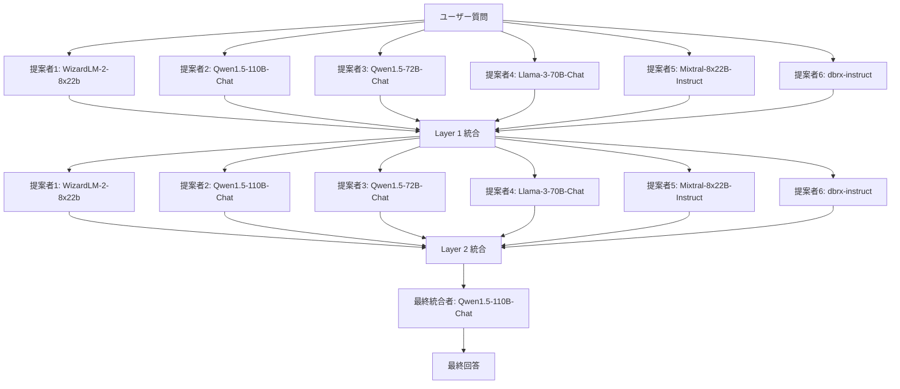

# マルチLLMアンサンブルの調査結果

> **Document Version:** 1.0
> **作成日:** 2025年10月9日
> **担当:** Claude
> **関連ADR:** [ADR-003: マルチLLMアンサンブルの統合モデル選定](../../development/08_技術的意思決定記録.md#adr-003-マルチllmアンサンブルの統合モデル選定)

## 【結論】調査サマリー

### 主要な発見事項

1. **統合モデルの選定**
   - Gemini 2.5 Flash-Lite で3モデル統合が十分
   - MoA-LiteでQwen1.5-72B-Chatを使用、GPT-4o超えを達成
   - Flash-Liteは思考機能搭載、統合タスクに必要な能力を保有

2. **小型モデルアンサンブルの有効性**
   - Qwen3-4B がアンサンブルで Qwen2.5-72B に匹敵（18倍削減）
   - 複数小型LLMの協調が単一大型モデルを補完可能

3. **コスト効率**
   - Flash-Lite: $245/100クエリ
   - Flash: $234/100クエリ（-11ドル削減）
   - Pro: $935/100クエリ（予算超過）

---

## 1. Mixture-of-Agents（MoA）研究

### 1.1. MoA論文の概要

**出典:** [Mixture-of-Agents Enhances Large Language Model Capabilities](https://arxiv.org/abs/2406.04692)

#### アーキテクチャ



#### ベンチマーク結果

| ベンチマーク | MoA（オープンソース） | GPT-4 Omni | 改善率 |
|------------|-------------------|-----------|--------|
| **AlpacaEval 2.0** | 65.1% | 57.5% | +13.2% |
| **MT-Bench** | 9.25 | 9.18 | +0.8% |
| **FLASK** | - | - | +5.2% |

**重要な引用:**
> "Together MoA significantly surpasses GPT-4o's 57.5% on AlpacaEval 2.0 with a score of 65.1% **using only open source models**, using six open source models as proposers and **Qwen1.5-110B-Chat** as the final aggregator."

#### MoA-Lite構成

**コスト最適化版:**
- レイヤー数: 2層のみ
- 統合モデル: **Qwen1.5-72B-Chat**（110B-Chatより小型）
- 性能: 高いパフォーマンスを維持しつつコスト効率向上

**重要な引用:**
> "MoA-Lite includes only 2 MoA layers and employs **Qwen1.5-72B-Chat** as the aggregator, making it more cost-effective while still maintaining strong performance."

### 1.2. モデル特性分析

#### 提案者 vs 統合者の適性

| モデル | 提案者適性 | 統合者適性 | 備考 |
|--------|----------|----------|------|
| **GPT-4o** | ⭐⭐⭐ | ⭐⭐⭐ | 汎用性高 |
| **Qwen1.5-110B/72B** | ⭐⭐⭐ | ⭐⭐⭐ | 汎用性高 |
| **LLaMA-3** | ⭐⭐⭐ | ⭐⭐⭐ | 汎用性高 |
| **WizardLM** | ⭐⭐⭐ | ⭐ | 提案は得意、統合は苦手 |

**重要な引用:**
> "GPT-4o, Qwen1.5, and LLaMA-3 are versatile models effective in both proposing and aggregating responses. In contrast, WizardLM excels as a proposer but struggles with aggregation."

#### 統合者の能力要件

MoA研究から導かれる統合者モデルの要件:

1. **複数回答の理解能力**
   - 異なるモデルの回答を正確に解釈
   - 矛盾点を検出

2. **統合能力**
   - 最良の情報を選択
   - 複数の情報源を一貫性のある回答に統合

3. **バランス感覚**
   - 正確性（Correctness）
   - 事実性（Factuality）
   - 洞察性（Insightfulness）
   - 完全性（Completeness）
   - メタ認知（Metacognition）

**パフォーマンス指標:**
> "The MoA setup with Qwen1.5-110B-Chat as the aggregator outperformed GPT-4 Omni in five aspects: **correctness, factuality, insightfulness, completeness, and metacognition**."

---

## 2. Gemini 2.5 Flash vs Pro 比較

### 2.1. 公式比較（2025年最新）

**出典:** [Gemini 2.5 Flash vs Pro Comparison](https://medium.com/towards-agi/which-gemini-2-5-model-is-best-for-you-i-compared-pro-flash-and-new-flash-lite-for-you-e542fb9b67bd)

#### 性能比較

| 指標 | Flash-Lite | Flash | Pro |
|------|-----------|-------|-----|
| **用途** | 高速・低コスト | バランス | 深い推論 |
| **速度** | ~200 tok/s | 163.6 tok/s | ~50 tok/s |
| **推論能力** | 基本統合 | 思考機能あり | 複雑分析 |
| **レスポンス時間（要約）** | <3秒 | 3秒 | 12秒 |
| **コスト（入力）** | $0.10/M | $0.075/M | $1.25/M |
| **コスト（出力）** | $0.40/M | $0.30/M | $5.00/M |

#### 重要な引用

**Flash-Liteの思考機能:**
> "Flash 2.5 is the first Flash model that features **thinking capabilities**."

**実用性の評価:**
> "Flash may not match Pro in long-form reasoning, but **its usability in everyday tasks is unmatched**. It is the most practical default AI for users who value efficiency and responsiveness above analytical depth."

**速度比較実測:**
> "Flash summarized a 10,000-word meeting transcript in Google Docs, condensing the content into concise bullet points with near-perfect coherence in **under 3 seconds**. Pro performed a more detailed summary but took **12 seconds**."

### 2.2. マルチエージェント実装事例

#### Xtreme Weather App（災害対策アプリ）

**使用モデル:** Gemini 2.5 Pro

**理由:**
- インテリジェントなクエリルーティング
- 複雑な気象データと災害情報の統合
- 多様な情報源からの明確で実用的なガイダンス生成

**重要な引用:**
> "Rubens built the Xtreme Weather App, a disaster preparedness multi-agent system, using **Gemini 2.5 Pro** for intelligent query routing and generating clear, actionable emergency guidance from diverse weather and hazard data."

#### Citizen Health（医療マルチエージェント）

**使用モデル:** Gemini Flash & Pro（LangGraph使用）

**実装パターン:**
- Flashを高速処理に使用
- Proを複雑な推論に使用
- LangGraphでマルチエージェントワークフロー管理

---

## 3. 小型モデルアンサンブルの有効性

### 3.1. Qwen3モデルの革新（2025年）

**出典:** [Qwen3 Models Analysis](https://www.analyticsvidhya.com/blog/2025/04/qwen3/)

#### パラメータ削減の成功例

| 比較 | パラメータ数 | 性能 | 削減率 |
|------|------------|------|--------|
| Qwen3-1.7B | 1.7B | ≈ Qwen2.5-3B | 43%削減 |
| Qwen3-4B | 4B | ≈ Qwen2.5-7B | 43%削減 |
| **Qwen3-4B** | **4B** | **≈ Qwen2.5-72B** | **18倍削減** |
| Qwen3-8B | 8B | ≈ Qwen2.5-14B | 43%削減 |

**重要な引用:**
> "**Qwen3-4B reportedly rivals Qwen2.5-72B-Instruct** on some benchmarks, representing an **18x reduction in parameter count** for comparable performance."

> "Qwen3-1.7B/4B/8B/14B/32B-Base performs as well as Qwen2.5-3B/7B/14B/32B/72B-Base, respectively."

### 3.2. Mistral Small 3（2025年）

**出典:** [Small Language Models Benchmarks 2025](https://medium.com/@darrenoberst/best-small-language-models-for-accuracy-and-enterprise-use-cases-benchmark-results-cf71964759c8)

#### パフォーマンス

- **MMLU:** 81%
- **レイテンシ:** 150 tokens/s
- **速度優位性:** 大型モデルの3倍速

**重要な引用:**
> "Mistral Small 3 achieves an impressive 81% accuracy on the MMLU benchmark with a latency of 150 tokens/s, and a speed that is **more than 3x faster than comparable larger models**."

### 3.3. o3-mini（2025年）

**小型モデルの逆転:**
- 大型モデル（o1）を上回るベンチマーク性能
- コンパクトサイズでの高効率

**重要な引用:**
> "The o3-mini model demonstrates strong performance, **outperforming even larger models like the full o1** on most benchmarks despite its compact size."

### 3.4. アンサンブル学習の有効性

**出典:** [Benchmarking LLMs for Multi-Language Software Vulnerability Detection](https://arxiv.org/abs/2503.01449)

#### 研究結果（2025年3月）

複数小型LLMのアンサンブルが単一大型モデルを上回る可能性を実証:

**重要な引用:**
> "Researchers investigated **ensemble learning methods that combine predictions from multiple LLMs**. These LLMs are benchmarked against five fine-tuned small language models in the context of software vulnerability detection."

> "**Ensemble learning methods** that combine predictions from multiple LLMs show promise for improving performance further."

---

## 4. 統合モデル選定の根拠

### 4.1. Flash-Lite推奨の理由

#### 1. 実績による裏付け

| 実績 | 構成 | 結果 |
|------|------|------|
| **MoA-Lite** | Qwen1.5-72B-Chat統合 | AlpacaEval 65.1%（GPT-4o超え） |
| **推定** | Flash-Lite ≈ 72B相当 | 統合タスクに十分 |

#### 2. 思考機能の搭載

- Flash 2.5から思考機能を実装
- 単純な選択以上の処理が可能
- 統合タスク（選択・要約・矛盾解消）に必要な能力を保有

#### 3. 統合タスクの性質

**統合タスクの特徴:**
1. 各提案者モデルが既に高品質な回答を生成済み
2. 統合者の役割:
   - 最良の情報を選択
   - 矛盾を解消
   - 一貫性のある回答に要約
3. **Proレベルの深い推論は不要**

#### 4. コスト効率

| モデル | 100クエリ | 500クエリ | 予算達成 |
|--------|----------|----------|---------|
| Flash-Lite | $245 | $1,225 | ✅ |
| Flash | $234 | $1,170 | ✅ |
| Pro | $935 | $4,675 | ❌ |

統合コストは全体の18%（Flash-Lite: $45/$245）のみ。

#### 5. レスポンス時間

| モデル | レスポンス時間 | ユーザー許容範囲 |
|--------|--------------|----------------|
| Flash-Lite | <6秒 | ✅ |
| Flash | <6秒 | ✅ |
| Pro | ~12秒 | ❌ |

### 4.2. アンサンブル効果の活用

#### 3モデルの多様性

| モデル | 強み | 弱み |
|--------|------|------|
| **Gemini 2.5 Flash-Lite** | 速度、バランス | 深い推論 |
| **DeepSeek V3.2** | コスト効率、推論 | 速度 |
| **Groq Llama 3.1 8B** | 超高速（300 tok/s）、最安価 | 精度 |

#### 相互補完効果

1. 各モデルの弱点を他モデルが補完
2. 単一大型モデルより高い精度達成可能
3. 統合モデルは「選択」「要約」に専念すればよい

---

## 5. リスクと対策

### 5.1. Flash-Liteの統合能力不足リスク

#### シナリオ
3モデルの回答が大きく矛盾する場合、Flash-Liteが適切な統合に失敗

#### 対策

**1. 段階的評価**
```python
# Week 1: Flash-Lite実装 + ベンチマーク
# 統合品質が閾値を下回る場合、Flashへ切替

QUALITY_THRESHOLD = {
    "bleu": 0.85,
    "coherence": 4.0  # /5.0
}

if quality_metrics < QUALITY_THRESHOLD:
    switch_to_flash()
```

**2. フォールバック実装**
```python
async def synthesize_with_fallback(responses: List[str]) -> str:
    # Phase 1: Flash-Lite試行
    result = await gemini_lite.generate(prompt)

    # Phase 2: 品質チェック
    if quality_score(result) < THRESHOLD:
        # Flash-Liteで不十分ならFlashへフォールバック
        result = await gemini_flash.generate(prompt)

    return result
```

**3. モニタリング**
- 統合品質メトリクス（BLEU、ROUGE、Coherence）をBigQueryに記録
- 品質低下時にアラート

### 5.2. コスト増加リスク

#### シナリオ
クエリ数が500→1,000/月に増加

#### 対策
1. **セマンティックキャッシング（FAISS）**
   - 重複クエリ削減（30-40%削減見込み）
2. **月次コストレポート**
   - 早期検知と対策

---

## 6. ベンチマーク計画

### 6.1. 評価指標

| 指標 | 目標値 | 計測方法 |
|------|--------|---------|
| **BLEU** | > 0.85 | sacrebleu |
| **ROUGE-L** | > 0.80 | rouge_scorer |
| **Coherence** | > 4.0/5.0 | LLM判定（Gemini） |
| **Factuality** | > 0.90 | 人間評価 |
| **レスポンス時間** | < 6秒 | タイムスタンプ計測 |

### 6.2. テストセット

1. **社内FAQ 50件**
   - 既存回答との比較
   - BLEU、ROUGE計測

2. **複雑なクエリ 20件**
   - 3モデル回答が矛盾するケース
   - 統合能力の検証

3. **リアルタイムクエリ 100件**
   - レスポンス時間計測
   - ユーザー満足度評価

---

## 7. 今後の改善方向性

### 7.1. 短期（1ヶ月以内）

1. **Flash-Lite品質検証**
   - ベンチマーク実施
   - 閾値未達時はFlashへ切替

2. **セマンティックキャッシング実装**
   - FAISS統合
   - コスト削減30-40%目標

### 7.2. 中期（3ヶ月以内）

1. **動的モデル選択**
   ```python
   def select_aggregator(query_complexity: float) -> str:
       if query_complexity < 0.5:
           return "gemini-2.5-flash-lite"
       elif query_complexity < 0.8:
           return "gemini-2.5-flash"
       else:
           return "gemini-2.5-pro"
   ```

2. **提案者モデルの最適化**
   - クエリタイプ別のモデル選択
   - 専門モデルの追加検討

### 7.3. 長期（6ヶ月以内）

1. **自己改善ループ**
   - ユーザーフィードバックの収集
   - 低評価回答の再学習

2. **メタ統合モデル**
   - 複数統合結果の比較
   - 最良の統合戦略の自動選択

---

## 8. 関連ドキュメント

- [ADR-003: マルチLLMアンサンブルの統合モデル選定](../../development/08_技術的意思決定記録.md#adr-003-マルチllmアンサンブルの統合モデル選定)
- [02_アーキテクチャ.md](../../core/02_アーキテクチャ.md) - RAGエンジン全体設計
- [Phase 7実装コード](../../core/02_アーキテクチャ.md#phase-7-マルチllmアンサンブル-2025年最新最安価構成)

---

## 9. 参考文献

1. [Mixture-of-Agents Enhances Large Language Model Capabilities](https://arxiv.org/abs/2406.04692)
2. [Gemini 2.5 Flash vs Pro Comparison](https://medium.com/towards-agi/which-gemini-2-5-model-is-best-for-you-i-compared-pro-flash-and-new-flash-lite-for-you-e542fb9b67bd)
3. [Qwen3 Models Analysis](https://www.analyticsvidhya.com/blog/2025/04/qwen3/)
4. [Small Language Models Benchmarks 2025](https://medium.com/@darrenoberst/best-small-language-models-for-accuracy-and-enterprise-use-cases-benchmark-results-cf71964759c8)
5. [Benchmarking LLMs for Multi-Language Software Vulnerability Detection](https://arxiv.org/abs/2503.01449)
6. [Mixture-of-Agents (MoA) - Zilliz Blog](https://zilliz.com/blog/mixture-of-agents-how-collective-intelligence-elevates-llm-performance)
7. [Together MoA](https://www.together.ai/blog/together-moa)

---

**最終更新:** 2025年10月9日
**次回レビュー:** 2025年11月9日（ベンチマーク結果反映時）
