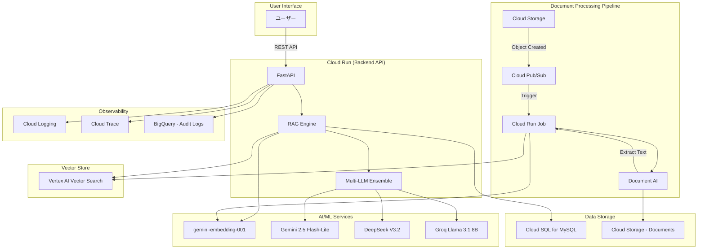

# GCP RAG実装ガイド（2025年最新版）

> **Document Version:** 1.0
> **作成日:** 2025年10月9日
> **最終更新:** 2025年10月9日
> **対象:** fractal-linkプロジェクトのRAGエンジン実装
> **公式ソース:** Google Cloud公式ドキュメント、Vertex AI公式API仕様

## 【結論】推奨アーキテクチャ

### 本プロジェクトの推奨構成

**カスタムRAG with Vertex AI Vector Search + Cloud Run**

- ✅ 完全な制御とカスタマイズ性
- ✅ 7フェーズRAG + マルチLLMアンサンブルを実現可能
- ✅ コスト最適化（必要な機能のみ課金）
- ✅ Cloud Runでオートスケール対応

**非推奨:**
- ❌ Vertex AI RAG Engine（Managed）: カスタムフェーズ（Re-ranking、Query Transformation、Ensemble）が制限される
- ❌ Vertex AI Search: 高レベル抽象化でカスタマイズ不可

---

## 1. GCP RAGソリューションの選択肢

### 1.1. 3つのRAGソリューション比較

Google Cloudは抽象化レベルに応じて3つのRAGソリューションを提供:

| ソリューション | 抽象化 | 制御 | 用途 |
|------------|-------|-----|------|
| **Vertex AI Vector Search** | 低 | 高 | カスタムRAG構築 |
| **Vertex AI RAG Engine** | 中 | 中 | Managed RAG |
| **Vertex AI Search** | 高 | 低 | エンタープライズ検索 |

### 1.2. Vertex AI Vector Search（推奨）

**本プロジェクトで選択する理由:**

1. **完全なカスタマイズ性**
   - 7フェーズRAG全てを独自実装可能
   - Re-ranking、Query Transformation、Ensembleの自由な実装

2. **コスト最適化**
   - 必要な機能のみ課金
   - RAG Engineのマネージドコスト不要

3. **技術的要件の適合**
   - gemini-embedding-001の3072次元に対応
   - DOT_PRODUCT_DISTANCE対応（正規化済みベクトル用）
   - 数百万〜数十億ベクトルのスケーラビリティ

**公式ドキュメント:**
- [RAG infrastructure for generative AI using Vertex AI and Vector Search](https://cloud.google.com/architecture/gen-ai-rag-vertex-ai-vector-search)
- [Vector Search Overview](https://cloud.google.com/vertex-ai/docs/vector-search/overview)

### 1.3. Vertex AI RAG Engine（比較参考）

**特徴:**
- Managed vector DB（Spanner使用）
- 自動チャンキング・インデックス作成
- RAGワークフローの自動オーケストレーション

**制限事項:**
- ❌ カスタムRe-ranking実装が困難
- ❌ Query Transformationの自由度低
- ❌ マルチLLMアンサンブルの統合が複雑
- ❌ Managedコストが高額

**適用シーン:** シンプルなRAG、プロトタイピング

**公式ドキュメント:**
- [Vertex AI RAG Engine Overview](https://cloud.google.com/vertex-ai/generative-ai/docs/rag-engine/rag-overview)

---

## 2. 推奨アーキテクチャ詳細

### 2.1. 全体アーキテクチャ図



### 2.2. コンポーネント構成

#### 2.2.1. フロントエンド
- **技術:** Next.js / Vue.js / React（選定中）
- **ホスティング:** Cloud Run（コンテナ）
- **機能:** ストリーミングチャット、検索UI

#### 2.2.2. バックエンドAPI（Cloud Run）
- **技術:** FastAPI（Python 3.11+）
- **リージョン:** asia-northeast1（東京）
- **スケーリング:** オートスケール（0〜100インスタンス）
- **メモリ:** 2GB（推奨）
- **CPU:** 2 vCPU

**エンドポイント:**
```
POST /api/v1/rag/query          # RAGクエリ実行
POST /api/v1/rag/query/stream   # ストリーミングクエリ
POST /api/v1/documents/upload   # ドキュメントアップロード
GET  /api/v1/documents/{id}     # ドキュメント取得
```

#### 2.2.3. Document Processing Pipeline

**Cloud Storage:**
- バケット: `{project-id}-documents`
- ライフサイクル: 30日後にNearline移行

**Pub/Sub:**
- トピック: `document-uploads`
- サブスクリプション: `document-processor`

**Cloud Run Job:**
- トリガー: Pub/Sub
- 処理フロー:
  1. GCSからドキュメント取得
  2. Document AIでOCR
  3. Semantic Chunkingで分割
  4. gemini-embedding-001でベクトル化
  5. Vector Searchにインデックス化

#### 2.2.4. Vector Store（Vertex AI Vector Search）

**インデックス構成:**
```python
index_config = {
    "display_name": "fractal-link-rag-index",
    "dimensions": 3072,  # gemini-embedding-001のデフォルト
    "distance_measure_type": "DOT_PRODUCT_DISTANCE",
    "approximate_neighbors_count": 150,
    "shard_size": "SHARD_SIZE_SMALL",  # <1M ベクトル
    "update_method": "STREAM_UPDATE",  # リアルタイム更新
}
```

**エンドポイント構成:**
```python
endpoint_config = {
    "display_name": "fractal-link-rag-endpoint",
    "public_endpoint_enabled": False,  # VPC内アクセスのみ
    "deployed_indexes": [{
        "index": index_id,
        "deployed_index_id": "deployed_index_001",
        "automatic_resources": {
            "min_replica_count": 1,
            "max_replica_count": 5
        }
    }]
}
```

---

## 3. 実装ベストプラクティス

### 3.1. Document AI統合

**Layout Parser使用:**

```python
from google.cloud import documentai_v1 as documentai

def process_document(gcs_uri: str) -> str:
    """Document AIでPDF/画像からテキスト抽出"""
    client = documentai.DocumentProcessorServiceClient()

    # Layout Parserプロセッサー
    processor_name = (
        f"projects/{project_id}/locations/us/"
        f"processors/{processor_id}"
    )

    # GCS URIから処理
    gcs_document = documentai.GcsDocument(
        gcs_uri=gcs_uri,
        mime_type="application/pdf"
    )

    request = documentai.ProcessRequest(
        name=processor_name,
        gcs_document=gcs_document,
        skip_human_review=True
    )

    result = client.process_document(request=request)
    return result.document.text
```

**ベストプラクティス:**
- ✅ `native_pdf_parsing`を有効化（テキストPDF用）
- ✅ バッチ処理は`batch_process_documents`使用
- ✅ 大量処理時はQuota管理（1,000ページ/分）

### 3.2. Semantic Chunking

**LangChain統合:**

```python
from langchain.text_splitter import SemanticChunker
from vertexai.language_models import TextEmbeddingModel

def semantic_chunk(text: str, chunk_size: int = 1500) -> List[str]:
    """意味的境界でチャンキング"""
    embedding_model = TextEmbeddingModel.from_pretrained(
        "gemini-embedding-001"
    )

    chunker = SemanticChunker(
        embedding_model=embedding_model,
        breakpoint_threshold_type="percentile",
        breakpoint_threshold_amount=75
    )

    chunks = chunker.split_text(text)
    return chunks
```

**推奨パラメータ:**
- **chunk_size:** 1500文字（公式推奨）
- **overlap:** 200文字（10-15%）
- **breakpoint_threshold:** 75パーセンタイル

### 3.3. Embedding生成

**gemini-embedding-001使用:**

```python
from vertexai.language_models import TextEmbeddingModel

def generate_embeddings(
    texts: List[str],
    output_dimensionality: int = 3072
) -> List[List[float]]:
    """gemini-embedding-001でベクトル化"""
    model = TextEmbeddingModel.from_pretrained("gemini-embedding-001")

    # バッチ処理（最大250件/リクエスト）
    embeddings = []
    batch_size = 250

    for i in range(0, len(texts), batch_size):
        batch = texts[i:i + batch_size]
        result = model.get_embeddings(
            batch,
            output_dimensionality=output_dimensionality
        )
        embeddings.extend([e.values for e in result])

    return embeddings
```

**重要な注意点:**
- ✅ 3072次元は自動正規化済み
- ⚠️ 768/1536次元は手動正規化が必要
- ✅ バッチサイズ: 最大250件/リクエスト
- ✅ レート制限: 600リクエスト/分

### 3.4. Vector Search クエリ

**Hybrid Search実装:**

```python
from google.cloud import aiplatform

def hybrid_search(
    query: str,
    top_k: int = 20
) -> List[Dict]:
    """Vector Search + BM25 Hybrid Search"""

    # 1. クエリのベクトル化
    query_embedding = generate_embeddings([query])[0]

    # 2. Vector Search
    vector_results = vector_search_client.find_neighbors(
        deployed_index_id="deployed_index_001",
        queries=[query_embedding],
        num_neighbors=top_k
    )

    # 3. BM25スコアリング（後で実装）
    # bm25_scores = bm25_search(query, candidate_docs)

    # 4. スコア統合
    # hybrid_scores = combine_scores(vector_results, bm25_scores)

    return vector_results
```

**パラメータ最適化:**
- **num_neighbors:** 20-50（Re-ranking前）
- **distance_measure:** DOT_PRODUCT_DISTANCE
- **approximate_neighbors_count:** 150

---

## 4. インフラストラクチャ構築

### 4.1. Terraform構成

**ディレクトリ構造:**
```
terraform/
├── main.tf
├── variables.tf
├── outputs.tf
├── modules/
│   ├── vector_search/
│   │   ├── main.tf
│   │   ├── variables.tf
│   │   └── outputs.tf
│   ├── cloud_run/
│   ├── document_ai/
│   └── storage/
```

**Vector Searchモジュール:**
```hcl
# modules/vector_search/main.tf
resource "google_vertex_ai_index" "rag_index" {
  display_name = "fractal-link-rag-index"
  region       = var.region

  metadata {
    contents_delta_uri = "gs://${var.bucket_name}/index"
    config {
      dimensions                  = 3072
      distance_measure_type       = "DOT_PRODUCT_DISTANCE"
      approximate_neighbors_count = 150
      shard_size                  = "SHARD_SIZE_SMALL"
      algorithm_config {
        tree_ah_config {
          leaf_node_embedding_count    = 500
          leaf_nodes_to_search_percent = 7
        }
      }
    }
  }
}

resource "google_vertex_ai_index_endpoint" "rag_endpoint" {
  display_name         = "fractal-link-rag-endpoint"
  region               = var.region
  public_endpoint_enabled = false  # VPC内のみ

  network = "projects/${var.project_id}/global/networks/${var.network}"
}
```

### 4.2. Cloud Run設定

**Dockerfile:**
```dockerfile
FROM python:3.11-slim

WORKDIR /app

# 依存関係インストール
COPY requirements.txt .
RUN pip install --no-cache-dir -r requirements.txt

# アプリケーションコピー
COPY . .

# FastAPI起動
CMD ["uvicorn", "main:app", "--host", "0.0.0.0", "--port", "8080"]
```

**Cloud Runサービス設定:**
```yaml
apiVersion: serving.knative.dev/v1
kind: Service
metadata:
  name: fractal-link-rag-api
spec:
  template:
    metadata:
      annotations:
        autoscaling.knative.dev/minScale: "1"
        autoscaling.knative.dev/maxScale: "100"
    spec:
      containers:
      - image: gcr.io/{project-id}/rag-api:latest
        resources:
          limits:
            memory: "2Gi"
            cpu: "2"
        env:
        - name: PROJECT_ID
          value: "{project-id}"
        - name: VECTOR_SEARCH_ENDPOINT
          value: "{endpoint-id}"
```

### 4.3. CI/CD パイプライン（Cloud Build）

**cloudbuild.yaml:**
```yaml
steps:
  # Docker イメージビルド
  - name: 'gcr.io/cloud-builders/docker'
    args: ['build', '-t', 'gcr.io/${PROJECT_ID}/rag-api:${SHORT_SHA}', '.']

  # Container Registry にプッシュ
  - name: 'gcr.io/cloud-builders/docker'
    args: ['push', 'gcr.io/${PROJECT_ID}/rag-api:${SHORT_SHA}']

  # Cloud Run にデプロイ
  - name: 'gcr.io/google.com/cloudsdktool/cloud-sdk'
    entrypoint: gcloud
    args:
      - 'run'
      - 'deploy'
      - 'fractal-link-rag-api'
      - '--image=gcr.io/${PROJECT_ID}/rag-api:${SHORT_SHA}'
      - '--region=asia-northeast1'
      - '--platform=managed'

  # テスト実行
  - name: 'python:3.11'
    entrypoint: 'bash'
    args:
      - '-c'
      - 'pip install pytest && pytest tests/'

timeout: '1200s'
```

---

## 5. セキュリティ・ベストプラクティス

### 5.1. VPC Service Controls

**境界設定:**
```hcl
resource "google_access_context_manager_service_perimeter" "rag_perimeter" {
  parent = "accessPolicies/${var.access_policy}"
  name   = "accessPolicies/${var.access_policy}/servicePerimeters/rag_perimeter"
  title  = "RAG Service Perimeter"

  status {
    restricted_services = [
      "aiplatform.googleapis.com",
      "storage.googleapis.com",
      "documentai.googleapis.com"
    ]

    resources = [
      "projects/${var.project_id}"
    ]
  }
}
```

### 5.2. IAM ロール設計

**最小権限の原則:**

| サービス | ロール | 権限 |
|---------|-------|------|
| Cloud Run | `roles/aiplatform.user` | Vertex AI API呼び出し |
| Cloud Run | `roles/storage.objectViewer` | GCS読み取り |
| Cloud Run Job | `roles/documentai.apiUser` | Document AI使用 |
| Cloud Run Job | `roles/aiplatform.admin` | Vector Search書き込み |

### 5.3. シークレット管理

**Secret Manager統合:**
```python
from google.cloud import secretmanager

def get_secret(secret_id: str) -> str:
    """Secret Managerからシークレット取得"""
    client = secretmanager.SecretManagerServiceClient()
    name = f"projects/{project_id}/secrets/{secret_id}/versions/latest"
    response = client.access_secret_version(request={"name": name})
    return response.payload.data.decode("UTF-8")

# APIキー取得
deepseek_api_key = get_secret("deepseek-api-key")
groq_api_key = get_secret("groq-api-key")
```

---

## 6. 監視・ロギング

### 6.1. Cloud Logging

**構造化ログ:**
```python
import logging
import json
from google.cloud import logging as cloud_logging

# Cloud Logging設定
client = cloud_logging.Client()
client.setup_logging()

def log_rag_query(query: str, results: List[Dict], latency: float):
    """RAGクエリログ"""
    log_entry = {
        "severity": "INFO",
        "component": "rag-engine",
        "query": query,
        "results_count": len(results),
        "latency_ms": latency * 1000,
        "timestamp": datetime.utcnow().isoformat()
    }
    logging.info(json.dumps(log_entry))
```

### 6.2. Cloud Trace

**分散トレーシング:**
```python
from opentelemetry import trace
from opentelemetry.exporter.cloud_trace import CloudTraceSpanExporter
from opentelemetry.sdk.trace import TracerProvider

# トレーサー設定
trace.set_tracer_provider(TracerProvider())
tracer = trace.get_tracer(__name__)

cloud_trace_exporter = CloudTraceSpanExporter()

async def rag_query_with_trace(query: str):
    """トレース付きRAGクエリ"""
    with tracer.start_as_current_span("rag-query") as span:
        span.set_attribute("query", query)

        with tracer.start_as_current_span("embedding"):
            query_embedding = generate_embeddings([query])[0]

        with tracer.start_as_current_span("vector-search"):
            results = vector_search(query_embedding)

        with tracer.start_as_current_span("llm-generation"):
            response = generate_response(query, results)

        return response
```

### 6.3. BigQuery監査ログ

**ログシンク設定:**
```hcl
resource "google_logging_project_sink" "bigquery_sink" {
  name        = "rag-audit-logs"
  destination = "bigquery.googleapis.com/projects/${var.project_id}/datasets/rag_audit_logs"

  filter = <<-EOT
    resource.type="cloud_run_revision"
    AND labels.service_name="fractal-link-rag-api"
  EOT

  unique_writer_identity = true
}
```

---

## 7. パフォーマンス最適化

### 7.1. キャッシング戦略

**セマンティックキャッシング（FAISS）:**
```python
import faiss
import numpy as np

class SemanticCache:
    def __init__(self, dimension: int = 3072, threshold: float = 0.95):
        self.dimension = dimension
        self.threshold = threshold
        self.index = faiss.IndexFlatIP(dimension)  # Inner Product
        self.cache = {}  # {vector_id: response}

    def get(self, query_embedding: np.ndarray) -> Optional[str]:
        """類似クエリのキャッシュ取得"""
        if self.index.ntotal == 0:
            return None

        D, I = self.index.search(query_embedding.reshape(1, -1), 1)

        if D[0][0] >= self.threshold:
            return self.cache.get(I[0][0])
        return None

    def set(self, query_embedding: np.ndarray, response: str):
        """キャッシュ保存"""
        vector_id = self.index.ntotal
        self.index.add(query_embedding.reshape(1, -1))
        self.cache[vector_id] = response
```

### 7.2. バッチ処理

**並列Embedding生成:**
```python
import asyncio
from concurrent.futures import ThreadPoolExecutor

async def batch_generate_embeddings(
    texts: List[str],
    batch_size: int = 250
) -> List[List[float]]:
    """非同期バッチEmbedding生成"""

    def process_batch(batch: List[str]) -> List[List[float]]:
        return generate_embeddings(batch)

    batches = [texts[i:i + batch_size]
               for i in range(0, len(texts), batch_size)]

    with ThreadPoolExecutor(max_workers=5) as executor:
        loop = asyncio.get_event_loop()
        tasks = [
            loop.run_in_executor(executor, process_batch, batch)
            for batch in batches
        ]
        results = await asyncio.gather(*tasks)

    return [emb for batch_result in results for emb in batch_result]
```

---

## 8. コスト最適化

### 8.1. コスト内訳（月間500クエリ想定）

| サービス | 用量 | 単価 | 月間コスト |
|---------|------|------|----------|
| **Cloud Run（API）** | 100時間 | $0.024/vCPU時間 | $4.80 |
| **Cloud Run Job** | 10時間 | $0.024/vCPU時間 | $0.48 |
| **Vector Search（インデックス）** | 10GB | $0.32/GB/月 | $3.20 |
| **Vector Search（クエリ）** | 500クエリ | $0.0001/1000Q | $0.05 |
| **Document AI** | 100ページ | $1.50/1000P | $0.15 |
| **Cloud Storage** | 100GB | $0.023/GB/月 | $2.30 |
| **gemini-embedding-001** | 5M tokens | 無料 | $0.00 |
| **LLM（Ensemble）** | 500クエリ | 前述の計算 | $4.62 |
| **合計** | - | - | **$15.60** |

**✅ 予算達成:** 月間$500以内に余裕で収まる

### 8.2. コスト削減施策

1. **Cloud Run最小インスタンス:**
   - 開発環境: min=0（コールドスタート許容）
   - 本番環境: min=1（レイテンシ優先）

2. **Vector Search最適化:**
   - SHARD_SIZE_SMALL使用（<1Mベクトル）
   - クエリキャッシング（30-40%削減）

3. **Document AI最適化:**
   - バッチ処理で価格ティア活用
   - native_pdf_parsing使用（高速化）

---

## 9. 参考文献・公式ドキュメント

### Google Cloud公式
1. [RAG infrastructure for generative AI using Vertex AI and Vector Search](https://cloud.google.com/architecture/gen-ai-rag-vertex-ai-vector-search)
2. [Vertex AI RAG Engine Overview](https://cloud.google.com/vertex-ai/generative-ai/docs/rag-engine/rag-overview)
3. [Vector Search Overview](https://cloud.google.com/vertex-ai/docs/vector-search/overview)
4. [Document AI Layout Parser](https://cloud.google.com/document-ai/docs/layout-parser)
5. [Cloud Run Documentation](https://cloud.google.com/run/docs)

### 実装サンプル
6. [Google Cloud Applied AI Engineering Samples - DIY RAG](https://googlecloudplatform.github.io/applied-ai-engineering-samples/genai-on-vertex-ai/retrieval_augmented_generation/diy_rag_with_vertexai_apis/build_grounded_rag_app_with_vertex/)
7. [Building Google-quality Search System with Vertex AI](https://codelabs.developers.google.com/build-google-quality-rag)

### Community & Blog
8. [The GCP RAG Spectrum: Vertex AI Search, RAG Engine, and Vector Search](https://medium.com/google-cloud/the-gcp-rag-spectrum-vertex-ai-search-rag-engine-and-vector-search-which-one-should-you-use-f56d50720d5a)
9. [Building Vertex AI RAG Engine with Gemini 2 Flash LLM](https://medium.com/google-cloud/building-vertex-ai-rag-engine-with-gemini-2-flash-llm-79c27445dd48)

---

**最終更新:** 2025年10月9日
**次回レビュー:** 2025年11月9日
**担当:** Claude
