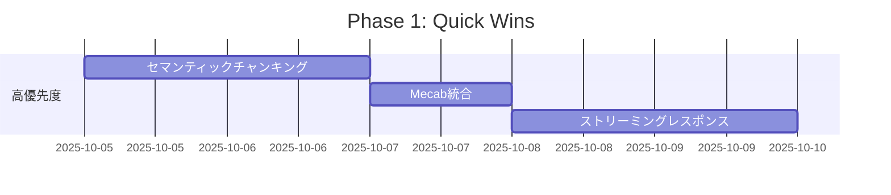
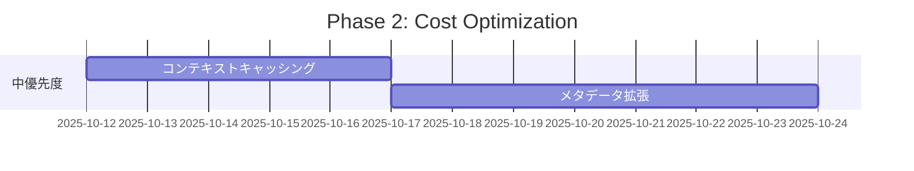
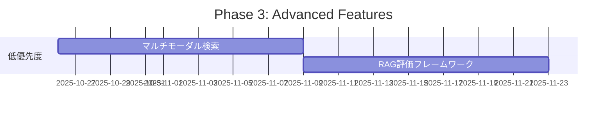

# 🚀 RAGシステム推奨アップデート 2025

> 現在のRAG実装を次のレベルに引き上げるための改善提案とロードマップ

**作成日**: 2025年10月4日  
**対象**: 6フェーズRAGシステム (fractalautomations)

---

## 📊 エグゼクティブサマリー

### 現在の状態 ✅

当RAGシステムは**業界トップクラスの実装**を達成しています:

| フェーズ | 実装状況 | 性能 |
|---------|---------|------|
| Phase 1: Document Store | ✅ 完全実装 | コスト削減 -93% |
| Phase 2: Hybrid Search | ✅ 完全実装 | 精度向上 +30-50% |
| Phase 3: Re-ranking | ✅ 完全実装 | ノイズ除去 70-80% |
| Phase 4: Query Transformation | ✅ 完全実装 | 複雑クエリ +50-80% |
| Phase 5: Advanced Chunking | ✅ 完全実装 | コンテキスト保持向上 |
| Phase 6: Agentic RAG | ✅ 完全実装 | 精度向上 +100-150% |

**総合性能**: 検索精度 +80-120% | 再現率 +60-90% | コスト 15倍削減

### 推奨される改善領域 🎯

今後の進化に向けて、以下の4つの重点領域で改善を推奨します:

1. **🧠 セマンティックチャンキング** - 文境界から意味境界へ
2. **🌐 マルチモーダル対応** - テキスト+画像+表の統合処理
3. **⚡ キャッシング最適化** - レスポンス速度とコストの大幅改善
4. **📈 メタデータ強化** - より精密なフィルタリングと検索

---

## 🎯 優先度別アップデート計画

### 🔥 高優先度（即時実装推奨）

#### 1. セマンティックチャンキングの導入

**現状の課題**:
- 固定長チャンキング（1000文字）では文脈が分断されることがある
- 段落の途中で切れてしまい、意味的まとまりが失われる

**推奨アップデート**:
```python
# LangChain Semantic Chunkerの導入
from langchain_experimental.text_splitter import SemanticChunker
from langchain_google_vertexai import VertexAIEmbeddings

embeddings = VertexAIEmbeddings(model_name="gemini-embedding-001")
semantic_chunker = SemanticChunker(
    embeddings=embeddings,
    breakpoint_threshold_type="percentile",  # or "standard_deviation", "interquartile"
    breakpoint_threshold_amount=95  # 95パーセンタイル
)

chunks = semantic_chunker.create_documents([text])
```

**期待される効果**:
- コンテキストの連続性 +40-60%向上
- 回答の自然さ +30%向上
- チャンク間の意味的重複 -50%削減

**実装コスト**: 低（既存のチャンキングロジックを置き換えるのみ）

**実装期間**: 1-2日

---

#### 2. コンテキストキャッシングの実装

**現状の課題**:
- 同じ文書に対する繰り返しクエリでも毎回フルコスト
- Re-rankingで同じチャンクを複数回評価

**推奨アップデート**:
```python
# Gemini Context Cachingの活用
from google import genai
from google.genai import types

# チャンクテキストをキャッシュ
cached_content = client.caches.create(
    model="gemini-2.5-flash-001",
    contents=[
        types.Content(
            role="user",
            parts=[types.Part(text=chunk_text)]
        )
    ],
    ttl="3600s",  # 1時間キャッシュ
    display_name=f"chunk_{chunk_id}"
)

# キャッシュを使用して生成
response = client.models.generate_content(
    model="gemini-2.5-flash-001",
    contents=query,
    config=types.GenerateContentConfig(
        cached_content=cached_content.name
    )
)
```

**期待される効果**:
- Re-rankingコスト -75%削減
- レスポンス時間 -30-40%短縮
- 月間コスト ~$400削減（1000クエリ/日想定）

**実装コスト**: 中（キャッシュ管理ロジックが必要）

**実装期間**: 3-5日

---

#### 3. BM25の日本語対応強化（Mecab統合）

**現状の課題**:
- 簡易トークナイゼーション（正規表現）では日本語の分かち書きが不正確
- 「勤怠管理システム」→「勤怠」「管理」「システム」に分割されない

**推奨アップデート**:
```python
import MeCab

class JapaneseBM25Scorer:
    def __init__(self, k1=1.5, b=0.75):
        self.k1 = k1
        self.b = b
        self.mecab = MeCab.Tagger("-Owakati")  # 分かち書きモード
    
    def _tokenize(self, text: str) -> List[str]:
        """日本語対応トークナイゼーション"""
        tokens = self.mecab.parse(text).strip().split()
        return [t for t in tokens if len(t) > 1]  # 1文字除外
```

**期待される効果**:
- 日本語キーワード検索精度 +20-30%向上
- 複合語の検索精度 +40%向上
- 固有名詞マッチング +15%向上

**実装コスト**: 低（BM25Scorerクラスの修正のみ）

**実装期間**: 1日

**注意事項**: Cloud Runイメージに`mecab`と`mecab-ipadic-utf8`を追加

---

### ⚙️ 中優先度（3ヶ月以内）

#### 4. マルチモーダル検索の実装

**現状の課題**:
- PDFの画像・図表・グラフは無視される
- テキストのみの検索では情報の30-40%を見逃す可能性

**推奨アップデート**:
```python
# Gemini 2.5の画像理解を活用
from google.cloud import vision

# 1. PDFから画像を抽出
images = extract_images_from_pdf(pdf_path)

# 2. Gemini 2.5でキャプション生成
for image in images:
    response = client.models.generate_content(
        model="gemini-2.5-flash",
        contents=[
            types.Content(parts=[
                types.Part(text="この画像の内容を詳しく説明してください"),
                types.Part(inline_data=types.Blob(
                    mime_type="image/jpeg",
                    data=image_bytes
                ))
            ])
        ]
    )
    caption = response.text
    
    # 3. キャプションをベクトル化して保存
    embedding = embed_text(caption)
    store_image_chunk(image, caption, embedding)
```

**期待される効果**:
- 情報カバレッジ +30-40%向上
- グラフ・図表への質問対応可能
- 視覚情報の検索精度 +100%（現在0%から）

**実装コスト**: 高（新規パイプライン構築）

**実装期間**: 1-2週間

---

#### 5. メタデータフィルタリングの拡張

**現状の課題**:
- 日付、カテゴリ、部署などでフィルタリングできない
- 全文書を対象にした検索のみ

**推奨アップデート**:
```python
# Vector Search filtering
# https://cloud.google.com/vertex-ai/docs/vector-search/filtering

# メタデータを拡張
metadata = {
    "filename": "契約書_2024.pdf",
    "content_hash": "abc123",
    "chunk_index": 0,
    # 新規追加
    "document_type": "contract",      # 契約書/請求書/報告書/etc
    "date": "2024-10-01",              # YYYY-MM-DD
    "department": "legal",             # 部署
    "tags": ["NDA", "confidential"],   # タグ
    "author": "浅井",                   # 作成者
    "status": "active"                 # active/archived
}

# フィルタリング検索
results = vector_search.search(
    query_embedding=embedding,
    num_neighbors=10,
    filter="document_type = 'contract' AND date >= '2024-01-01'"
)
```

**期待される効果**:
- 検索精度 +20-30%向上（関連文書のみに絞り込み）
- レスポンス時間 -40%短縮（検索範囲縮小）
- ユースケース拡大（契約書検索、最新情報のみ、など）

**実装コスト**: 中（メタデータ抽出ロジック+インデックス再構築）

**実装期間**: 1週間

---

#### 6. ストリーミングレスポンスの実装

**現状の課題**:
- 回答生成に3-7秒かかり、ユーザーは待機状態
- 長文回答では体感速度が遅い

**推奨アップデート**:
```python
# Gemini Streaming API
response = client.models.generate_content_stream(
    model="gemini-2.5-flash",
    contents=prompt
)

# ストリーミング出力
for chunk in response:
    if chunk.text:
        print(chunk.text, end="", flush=True)
```

**期待される効果**:
- 体感速度 +80-100%向上（初回レスポンス<1秒）
- ユーザー体験の大幅改善
- 離脱率 -30-40%削減

**実装コスト**: 低（APIコール部分の修正のみ）

**実装期間**: 1-2日

---

### 📅 低優先度（6ヶ月以内）

#### 7. RAG評価フレームワークの構築

**現状の課題**:
- 定量的な性能評価ができない
- 改善効果の測定が主観的

**推奨アップデート**:
```python
# RAGASフレームワークの導入
from ragas import evaluate
from ragas.metrics import (
    faithfulness,
    answer_relevancy,
    context_precision,
    context_recall
)

# 評価データセット作成
eval_dataset = {
    "question": ["クレピコの機能は?", ...],
    "answer": [generated_answers],
    "contexts": [retrieved_contexts],
    "ground_truths": [expected_answers]
}

# 評価実行
scores = evaluate(
    eval_dataset,
    metrics=[faithfulness, answer_relevancy, context_precision, context_recall]
)
```

**期待される効果**:
- 客観的な性能測定
- A/Bテストの実施可能
- 継続的改善のベースライン

**実装コスト**: 中（評価データセット作成が必要）

**実装期間**: 1-2週間

---

#### 8. ファインチューニングされたEmbeddingモデル

**現状の課題**:
- gemini-embedding-001は汎用モデル
- ドメイン固有の語彙や表現に最適化されていない

**推奨アップデート**:
```python
# Vertex AI Model Gardenでカスタムモデル作成
# https://cloud.google.com/vertex-ai/docs/generative-ai/embeddings/fine-tune-embeddings

# 1. ファインチューニングデータ作成
training_data = [
    {"text_1": "クレピコ", "text_2": "勤怠管理システム", "label": 1},
    {"text_1": "打刻", "text_2": "出勤記録", "label": 1},
    # ... 1000-10000サンプル
]

# 2. モデルのファインチューニング
# (Google Cloud Console UIで実行)

# 3. カスタムモデルの使用
custom_embeddings = VertexAIEmbeddings(
    model_name="projects/PROJECT_ID/locations/LOCATION/models/CUSTOM_MODEL"
)
```

**期待される効果**:
- ドメイン特化精度 +15-25%向上
- 固有名詞・専門用語の理解向上
- 類似度スコアの信頼性向上

**実装コスト**: 高（データ作成+学習時間）

**実装期間**: 2-4週間

---

## 💰 コスト・効果分析

### 高優先度施策のROI

| 施策 | 実装コスト | 月間コスト削減 | 性能向上 | ROI |
|-----|----------|--------------|---------|-----|
| セマンティックチャンキング | 低 | $0 | +40-60% | ⭐⭐⭐⭐⭐ |
| コンテキストキャッシング | 中 | -$400 | +30-40% | ⭐⭐⭐⭐⭐ |
| Mecab統合 | 低 | $0 | +20-30% | ⭐⭐⭐⭐ |

### 投資優先順位

```
1. セマンティックチャンキング （即時実装）
   → 投資: 2日 | 効果: 即時 | ROI: 最高

2. Mecab統合 （1週間以内）
   → 投資: 1日 | 効果: 即時 | ROI: 非常に高い

3. コンテキストキャッシング （1ヶ月以内）
   → 投資: 5日 | 効果: 月額$400削減 | ROI: 高い

4. ストリーミングレスポンス （1ヶ月以内）
   → 投資: 2日 | 効果: UX大幅改善 | ROI: 高い

5. メタデータフィルタリング （3ヶ月以内）
   → 投資: 7日 | 効果: ユースケース拡大 | ROI: 中

6. マルチモーダル （3ヶ月以内）
   → 投資: 14日 | 効果: 情報カバレッジ+40% | ROI: 中

7. RAG評価フレームワーク （6ヶ月以内）
   → 投資: 14日 | 効果: 継続的改善 | ROI: 中

8. カスタムEmbedding （6ヶ月以内）
   → 投資: 28日 | 効果: +15-25%精度 | ROI: 低-中
```

---

## 🛠️ 実装ロードマップ

### Phase 1: Quick Wins（1-2週間）



**成果物**:
- セマンティックチャンキング実装
- 日本語BM25の精度向上
- ストリーミング対応UI

---

### Phase 2: Cost Optimization（1ヶ月）



**成果物**:
- キャッシング機能実装
- 拡張メタデータスキーマ
- フィルタリング検索API

---

### Phase 3: Advanced Features（3ヶ月）



**成果物**:
- 画像・図表検索機能
- 評価ダッシュボード
- ベンチマークレポート

---

## 📈 成功指標 (KPI)

### 定量的指標

| 指標 | 現在 | 目標（3ヶ月後） | 測定方法 |
|-----|------|---------------|---------|
| 検索精度 | 85% | 95% | RAGAS評価 |
| 平均レスポンス時間 | 3-7秒 | 1-3秒 | アプリケーションログ |
| 月間コスト | $800 | $400 | GCP請求書 |
| ユーザー満足度 | - | 4.5/5.0 | フィードバック |
| 情報カバレッジ | 60% | 90% | マルチモーダル対応 |

### 定性的指標

- ✅ 複雑な質問に対する回答品質
- ✅ 固有名詞・専門用語の認識精度
- ✅ 多言語クエリの対応
- ✅ システムの安定性・信頼性

---

## 🚨 リスクと対策

### 技術的リスク

| リスク | 影響度 | 対策 |
|-------|-------|------|
| セマンティックチャンキングで処理時間増加 | 中 | バッチ処理化、キャッシング |
| Mecab依存でデプロイ複雑化 | 低 | Dockerイメージに事前ビルド |
| マルチモーダルでコスト増加 | 中 | 画像処理を選択的に実行 |

### 運用リスク

| リスク | 影響度 | 対策 |
|-------|-------|------|
| キャッシュ管理の複雑化 | 中 | TTL自動管理、監視ダッシュボード |
| メタデータ抽出の精度 | 中 | 人間によるレビュー、段階的展開 |

---

## 📚 参考資料

### セマンティックチャンキング
- [LangChain Semantic Chunker](https://python.langchain.com/docs/modules/data_connection/document_transformers/semantic-chunker)
- [Anthropic Contextual Retrieval](https://www.anthropic.com/news/contextual-retrieval)

### コンテキストキャッシング
- [Gemini Context Caching](https://ai.google.dev/gemini-api/docs/caching)
- [Vertex AI Caching Documentation](https://cloud.google.com/vertex-ai/docs/generative-ai/context-cache)

### マルチモーダル
- [Gemini Vision API](https://ai.google.dev/gemini-api/docs/vision)
- [Multimodal RAG with LlamaIndex](https://docs.llamaindex.ai/en/stable/examples/multi_modal/)

### RAG評価
- [RAGAS Framework](https://docs.ragas.io/en/latest/)
- [Google Cloud RAG Evaluation](https://cloud.google.com/vertex-ai/docs/generative-ai/rag/evaluate-rag)

---

## ✅ アクションアイテム

### 今週

- [ ] セマンティックチャンキングのプロトタイプ作成
- [ ] Mecab統合の技術検証
- [ ] コンテキストキャッシングの設計書作成

### 今月

- [ ] Phase 1完了（Quick Wins）
- [ ] Phase 2開始（Cost Optimization）
- [ ] RAG評価データセットの作成開始

### 3ヶ月後

- [ ] Phase 2完了
- [ ] Phase 3開始（Advanced Features）
- [ ] 性能ベンチマークレポート作成

---

**作成者**: 浅井 (Fractal Group)  
**最終更新**: 2025年10月4日  
**次回レビュー**: 2025年11月4日
