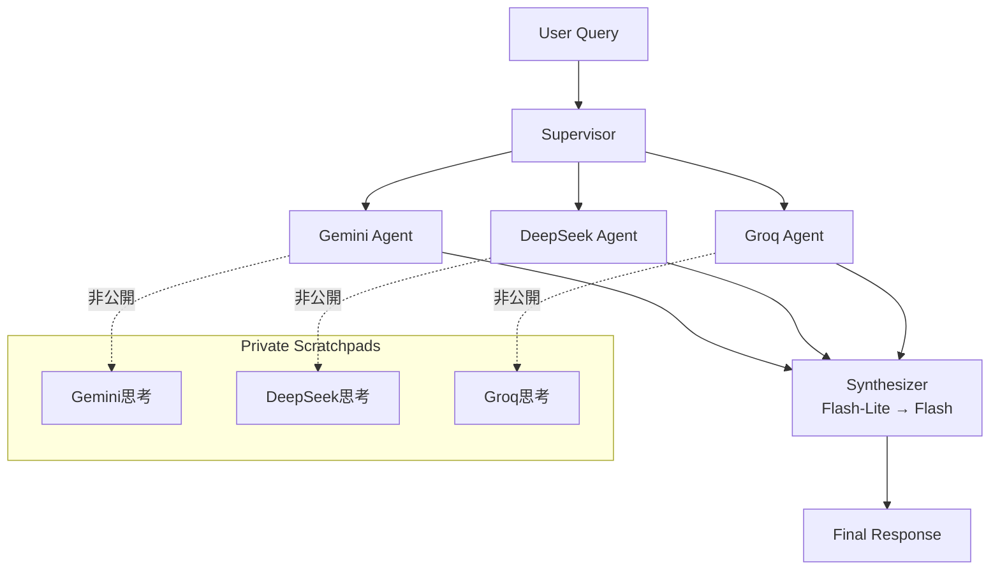

# マルチエージェント開発ガイド（2025年最新版）

> **Document Version:** 1.0
> **作成日:** 2025年10月9日
> **最終更新:** 2025年10月9日
> **対象:** fractal-linkプロジェクトのマルチLLMアンサンブル実装
> **公式ソース:** LangChain公式ドキュメント、Google Agent Development Kit公式、研究論文

## 【結論】推奨アーキテクチャ

### 本プロジェクトの推奨構成

**LangGraph + Shared Memory + Private Scratchpad**

- ✅ 最新フレームワーク（2025年生産性220%向上実績）
- ✅ 状態管理の完全制御
- ✅ コンテキスト共有問題の回避
- ✅ Vertex AI完全統合

**非推奨:**
- ❌ Google Agent Development Kit (ADK): まだ初期段階（2025年NEXT発表）
- ❌ AutoGen: 開発停滞気味
- ❌ CrewAI: エンタープライズ機能不足

---

## 1. マルチエージェントフレームワーク比較

### 1.1. 2025年の主要フレームワーク

| フレームワーク | 成熟度 | 本番適用 | Vertex AI統合 | 推奨度 |
|--------------|-------|---------|--------------|--------|
| **LangGraph** | ⭐⭐⭐ | ✅ | ✅ | ⭐⭐⭐ |
| **Google ADK** | ⭐⭐ | ⚠️ Early | ✅ Native | ⭐⭐ |
| **AutoGen** | ⭐⭐⭐ | ✅ | ⚠️ | ⭐⭐ |
| **CrewAI** | ⭐⭐ | ⚠️ | ⚠️ | ⭐ |
| **LangChain** | ⭐⭐⭐ | ✅ | ✅ | ⭐⭐ |

### 1.2. LangGraph選定理由

**統計データ（2024Q1 → 2025Q1）:**
- GitHub Stars: +220%
- npm/PyPI Downloads: +300%
- エンタープライズ採用: 顧客サポートで35-45%改善

**技術的優位性:**
1. **Graph-based Architecture**
   - ノード = エージェント
   - エッジ = 制御フロー
   - 状態 = 共有メモリ

2. **Production-Ready Features**
   - Durable Execution（障害耐性）
   - Human-in-the-Loop
   - Long-term Memory
   - Observability（トレーシング・ロギング）

3. **Vertex AI Native統合**
   - Gemini API直接呼び出し
   - gemini-embedding-001対応
   - Cloud Run完全互換

**公式ドキュメント:**
- [LangGraph Multi-Agent Systems](https://langchain-ai.github.io/langgraph/concepts/multi_agent/)
- [LangGraph: Multi-Agent Workflows](https://blog.langchain.com/langgraph-multi-agent-workflows/)

---

## 2. コンテキスト共有・メモリ管理

### 2.1. 問題点: ナイーブな共有メモリ

**問題シナリオ:**
```python
# ❌ 悪い例: 全エージェントが全メッセージを見る
shared_state = {
    "messages": [
        {"role": "user", "content": "質問"},
        {"role": "agent1", "content": "中間思考1"},
        {"role": "agent1", "content": "中間思考2"},
        {"role": "agent2", "content": "中間思考3"},
        {"role": "agent3", "content": "最終回答"}
    ]
}
# → Agent2が"中間思考1"を見て混乱
# → Agent3が不要な中間思考を統合
```

### 2.2. 推奨パターン: Shared Memory + Private Scratchpad

**アーキテクチャ:**
```python
from typing import TypedDict, List, Annotated
from langgraph.graph import StateGraph
import operator

# 共有状態（全エージェント可視）
class SharedState(TypedDict):
    messages: Annotated[List[Dict], operator.add]  # 最終回答のみ
    user_query: str
    final_response: str

# エージェント専用状態（プライベート）
class AgentState(TypedDict):
    agent_name: str
    scratchpad: List[Dict]  # 中間思考（非共有）
    final_output: str       # 共有する最終結果のみ
```

**実装例:**
```python
class MultiAgentRAG:
    def __init__(self):
        self.shared_memory = SharedState(
            messages=[],
            user_query="",
            final_response=""
        )

    def agent_node(
        self,
        agent_name: str,
        state: SharedState
    ) -> SharedState:
        """エージェントノード（プライベートスクラッチパッド使用）"""

        # プライベートスクラッチパッド
        scratchpad = []

        # 1. 中間思考（プライベート）
        for step in range(3):
            thought = self._think(state["user_query"], scratchpad)
            scratchpad.append({
                "step": step,
                "thought": thought,
                "is_private": True
            })

        # 2. 最終回答のみ共有
        final_output = self._generate_final(scratchpad)

        # 3. 共有状態に最終回答のみ追加
        state["messages"].append({
            "role": agent_name,
            "content": final_output,
            "is_final": True
        })

        return state
```

### 2.3. メモリ管理戦略

**2層メモリアーキテクチャ:**

| メモリタイプ | 可視性 | 用途 | 保存期間 |
|------------|-------|------|---------|
| **Shared Memory** | 全エージェント | 最終回答、ユーザー質問 | 会話全体 |
| **Private Scratchpad** | エージェント専用 | 中間思考、デバッグ情報 | タスク実行中のみ |

**長期メモリ（オプション）:**
```python
from langchain.memory import ConversationSummaryMemory

class LongTermMemory:
    def __init__(self):
        self.summary_memory = ConversationSummaryMemory(
            llm=ChatVertexAI(model="gemini-2.5-flash-lite")
        )

    def compress_if_needed(self, messages: List[Dict]) -> List[Dict]:
        """20ターン超時は要約"""
        if len(messages) > 20:
            summary = self.summary_memory.predict_new_summary(
                messages[-20:], ""
            )
            return [
                {"role": "system", "content": f"過去の要約: {summary}"},
                *messages[-5:]  # 直近5ターンのみ保持
            ]
        return messages
```

---

## 3. LangGraphアーキテクチャパターン

### 3.1. Supervisor Pattern（推奨）

**本プロジェクトでの実装:**

```python
from langgraph.graph import StateGraph, END

class MultiLLMEnsemble:
    def __init__(self):
        # グラフ定義
        workflow = StateGraph(SharedState)

        # ノード追加
        workflow.add_node("supervisor", self.supervisor_node)
        workflow.add_node("gemini_agent", self.gemini_agent_node)
        workflow.add_node("deepseek_agent", self.deepseek_agent_node)
        workflow.add_node("groq_agent", self.groq_agent_node)
        workflow.add_node("synthesizer", self.synthesizer_node)

        # エッジ定義
        workflow.set_entry_point("supervisor")
        workflow.add_edge("supervisor", "gemini_agent")
        workflow.add_edge("supervisor", "deepseek_agent")
        workflow.add_edge("supervisor", "groq_agent")

        # 並列実行後に統合
        workflow.add_edge("gemini_agent", "synthesizer")
        workflow.add_edge("deepseek_agent", "synthesizer")
        workflow.add_edge("groq_agent", "synthesizer")
        workflow.add_edge("synthesizer", END)

        self.app = workflow.compile()

    def supervisor_node(self, state: SharedState) -> SharedState:
        """Supervisor: タスク分配"""
        state["messages"].append({
            "role": "supervisor",
            "content": "3つのモデルに並列実行を指示"
        })
        return state

    async def gemini_agent_node(self, state: SharedState) -> SharedState:
        """Gemini 2.5 Flash-Lite エージェント"""
        scratchpad = []  # プライベート

        # RAG検索結果を使用
        context = state.get("rag_context", "")
        query = state["user_query"]

        # 中間思考（プライベート）
        scratchpad.append(f"クエリ分析: {query}")
        scratchpad.append(f"コンテキスト: {context[:100]}...")

        # Gemini API呼び出し
        response = await self.gemini_client.generate_content_async(
            contents=[f"質問: {query}\n\nコンテキスト: {context}"]
        )

        # 最終回答のみ共有
        state["messages"].append({
            "role": "gemini_agent",
            "content": response.text,
            "is_final": True
        })

        return state

    async def synthesizer_node(self, state: SharedState) -> SharedState:
        """統合エージェント（Flash-Lite → Flashフォールバック）"""

        # 3つの回答を取得
        agent_responses = [
            msg["content"] for msg in state["messages"]
            if msg.get("is_final") and msg["role"].endswith("_agent")
        ]

        # 統合プロンプト
        synthesis_prompt = f"""
以下の3つのAIモデルが同じ質問に回答しました。
これらを統合して、最良の回答を生成してください。

質問: {state["user_query"]}

回答1（Gemini）:
{agent_responses[0]}

回答2（DeepSeek）:
{agent_responses[1]}

回答3（Groq Llama）:
{agent_responses[2]}

統合回答:
"""

        # Flash-Lite試行
        response = await self.gemini_flash_lite.generate_content_async(
            contents=[synthesis_prompt]
        )

        # 品質チェック（BLEU > 0.85）
        quality = self._check_quality(response.text, agent_responses)

        if quality < 0.85:
            # Flashへフォールバック
            response = await self.gemini_flash.generate_content_async(
                contents=[synthesis_prompt]
            )

        state["final_response"] = response.text
        return state
```

**Mermaid図:**


### 3.2. Dynamic Control Flow

**Supervisor Tool-Calling:**
```python
from langchain.tools import Tool

class DynamicSupervisor:
    def __init__(self):
        # エージェントをツールとして登録
        self.tools = [
            Tool(
                name="gemini_agent",
                func=self.gemini_agent_node,
                description="Gemini 2.5 Flash-Liteで回答生成"
            ),
            Tool(
                name="deepseek_agent",
                func=self.deepseek_agent_node,
                description="DeepSeek V3.2で回答生成"
            ),
            Tool(
                name="groq_agent",
                func=self.groq_agent_node,
                description="Groq Llama 3.1 8Bで回答生成"
            )
        ]

    async def dynamic_orchestrate(self, state: SharedState):
        """LLMが動的に実行順序を決定"""
        supervisor_llm = ChatVertexAI(model="gemini-2.5-flash")

        # Supervisorが次のアクションを決定
        response = await supervisor_llm.agenerate([
            f"質問: {state['user_query']}\n"
            f"どのエージェントを呼び出すべきか？"
        ])

        # ツール選択
        selected_tool = self._parse_tool_selection(response.text)
        result = await selected_tool(state)

        return result
```

---

## 4. Google Agent Development Kit (ADK)

### 4.1. 概要（2025年Google Cloud NEXT発表）

**特徴:**
- オープンソースフレームワーク
- <100行のPythonコードでマルチエージェント構築
- Agent2Agent (A2A) プロトコル対応
- Agent Engine（Managed Runtime）統合

**現状の課題:**
- ⚠️ Early Stage（本番実績少ない）
- ⚠️ ドキュメント不足
- ⚠️ コミュニティ小規模

**公式ドキュメント:**
- [Agent Development Kit Announcement](https://developers.googleblog.com/en/agent-development-kit-easy-to-build-multi-agent-applications/)
- [Vertex AI Agent Builder Overview](https://cloud.google.com/vertex-ai/generative-ai/docs/agent-builder/overview)

### 4.2. 将来的な移行検討

**現在（Horizon 1-2）:**
- LangGraph使用（安定性・実績優先）

**将来（Horizon 3以降）:**
- ADKの成熟度を評価
- Agent2Agent (A2A) プロトコルの標準化状況を確認
- 必要に応じてLangGraph → ADK移行

---

## 5. コンテキスト共有のベストプラクティス

### 5.1. 研究ベース（2025年最新）

**Collaborative Memory Framework（2025年5月）:**
- **Private Memory:** ユーザー専用、他ユーザーに非公開
- **Shared Memory:** 選択的に共有、時間的アクセス制御

**Memory-as-a-Service (MaaS)（2025年6月）:**
- コンテキストメモリをサービスとして分離
- 独立呼び出し可能
- 動的組み合わせ
- 細粒度のガバナンス

**公式論文:**
- [Collaborative Memory (arxiv)](https://arxiv.org/abs/2505.18279)
- [Memory-as-a-Service (arxiv)](https://arxiv.org/html/2506.22815v1)

### 5.2. 実装パターン: Letta Memory Blocks

**Letta統合:**
```python
from letta import MemoryBlock, Agent

class SharedMemoryBlock:
    def __init__(self):
        # 共有メモリブロック
        self.shared_block = MemoryBlock(
            name="ensemble_shared",
            value="",
            limit=10000  # 10K tokens
        )

    def share_across_agents(self, agents: List[Agent]):
        """複数エージェント間でメモリブロック共有"""
        for agent in agents:
            agent.attach_memory_block(self.shared_block)

# 使用例
gemini_agent = Agent(name="gemini")
deepseek_agent = Agent(name="deepseek")
groq_agent = Agent(name="groq")

memory_manager = SharedMemoryBlock()
memory_manager.share_across_agents([
    gemini_agent,
    deepseek_agent,
    groq_agent
])
```

### 5.3. フィルタリング戦略

**メッセージフィルタリング:**
```python
def filter_messages_for_agent(
    all_messages: List[Dict],
    agent_name: str
) -> List[Dict]:
    """エージェント用にメッセージをフィルタリング"""

    filtered = []
    for msg in all_messages:
        # ユーザーメッセージは全て含む
        if msg["role"] == "user":
            filtered.append(msg)

        # 自分の最終回答は含む
        elif msg["role"] == agent_name and msg.get("is_final"):
            filtered.append(msg)

        # 他エージェントの中間思考は除外
        elif msg.get("is_final") and msg["role"].endswith("_agent"):
            filtered.append(msg)

    return filtered
```

---

## 6. Production Deployment

### 6.1. Cloud Run デプロイ

**Dockerfile（LangGraph）:**
```dockerfile
FROM python:3.11-slim

WORKDIR /app

# LangGraph + 依存関係
COPY requirements.txt .
RUN pip install --no-cache-dir \
    langgraph==0.2.0 \
    langchain==0.3.0 \
    google-cloud-aiplatform==1.70.0 \
    fastapi==0.115.0 \
    uvicorn==0.32.0

COPY . .

# FastAPI + LangGraph
CMD ["uvicorn", "main:app", "--host", "0.0.0.0", "--port", "8080"]
```

**FastAPI統合:**
```python
from fastapi import FastAPI
from langgraph.pregel import Pregel

app = FastAPI()

# LangGraphアプリケーション
multi_agent_app: Pregel = MultiLLMEnsemble().app

@app.post("/api/v1/rag/query")
async def rag_query(query: str):
    """マルチエージェントRAGクエリ"""

    initial_state = SharedState(
        messages=[],
        user_query=query,
        rag_context="",  # RAG検索結果をここに
        final_response=""
    )

    # LangGraphアプリケーション実行
    result = await multi_agent_app.ainvoke(initial_state)

    return {
        "query": query,
        "response": result["final_response"],
        "agents_used": ["gemini", "deepseek", "groq"]
    }
```

### 6.2. Observability

**LangSmith統合（トレーシング）:**
```python
import os
os.environ["LANGCHAIN_TRACING_V2"] = "true"
os.environ["LANGCHAIN_API_KEY"] = get_secret("langsmith-api-key")
os.environ["LANGCHAIN_PROJECT"] = "fractal-link-rag"

# LangGraphアプリは自動的にトレース
```

**Cloud Trace統合:**
```python
from opentelemetry.instrumentation.langchain import LangChainInstrumentor

LangChainInstrumentor().instrument()
```

### 6.3. Error Handling

**Durable Execution:**
```python
from langgraph.checkpoint.memory import MemorySaver

class ResilientMultiAgent:
    def __init__(self):
        # チェックポイント（障害回復用）
        self.checkpointer = MemorySaver()

        workflow = StateGraph(SharedState)
        # ... ノード追加 ...

        # チェックポイント有効化
        self.app = workflow.compile(checkpointer=self.checkpointer)

    async def execute_with_recovery(
        self,
        state: SharedState,
        thread_id: str
    ):
        """障害回復機能付き実行"""
        try:
            config = {"configurable": {"thread_id": thread_id}}
            result = await self.app.ainvoke(state, config)
            return result
        except Exception as e:
            # チェックポイントから再開
            last_checkpoint = self.checkpointer.get(thread_id)
            if last_checkpoint:
                result = await self.app.ainvoke(
                    last_checkpoint,
                    config
                )
                return result
            raise e
```

---

## 7. テスト戦略

### 7.1. ユニットテスト

**LangGraphノードテスト:**
```python
import pytest
from unittest.mock import Mock, AsyncMock

@pytest.mark.asyncio
async def test_gemini_agent_node():
    """Geminiエージェントノードのテスト"""
    ensemble = MultiLLMEnsemble()

    # モック状態
    state = SharedState(
        messages=[],
        user_query="テスト質問",
        rag_context="テストコンテキスト",
        final_response=""
    )

    # Gemini APIモック
    ensemble.gemini_client.generate_content_async = AsyncMock(
        return_value=Mock(text="テスト回答")
    )

    # ノード実行
    result = await ensemble.gemini_agent_node(state)

    # 検証
    assert len(result["messages"]) == 1
    assert result["messages"][0]["role"] == "gemini_agent"
    assert result["messages"][0]["content"] == "テスト回答"
```

### 7.2. 統合テスト

**フルパイプラインテスト:**
```python
@pytest.mark.asyncio
async def test_full_multi_agent_pipeline():
    """マルチエージェント全体のテスト"""
    ensemble = MultiLLMEnsemble()

    state = SharedState(
        messages=[],
        user_query="訪問看護の手順は？",
        rag_context="訪問看護手順: 1. 予約確認...",
        final_response=""
    )

    # 全体実行
    result = await ensemble.app.ainvoke(state)

    # 検証
    assert result["final_response"] != ""
    assert "訪問看護" in result["final_response"]

    # 3つのエージェントが全て実行されたか確認
    agent_messages = [
        msg for msg in result["messages"]
        if msg["role"].endswith("_agent")
    ]
    assert len(agent_messages) == 3
```

---

## 8. 参考文献・公式ドキュメント

### LangChain / LangGraph
1. [LangGraph Multi-Agent Systems](https://langchain-ai.github.io/langgraph/concepts/multi_agent/)
2. [LangGraph: Multi-Agent Workflows](https://blog.langchain.com/langgraph-multi-agent-workflows/)
3. [How and when to build multi-agent systems](https://blog.langchain.com/how-and-when-to-build-multi-agent-systems/)
4. [LangGraph GitHub Repository](https://github.com/langchain-ai/langgraph)

### Google Cloud
5. [Agent Development Kit Announcement](https://developers.googleblog.com/en/agent-development-kit-easy-to-build-multi-agent-applications/)
6. [Vertex AI Agent Builder Overview](https://cloud.google.com/vertex-ai/generative-ai/docs/agent-builder/overview)
7. [Build and manage multi-system agents with Vertex AI](https://cloud.google.com/blog/products/ai-machine-learning/build-and-manage-multi-system-agents-with-vertex-ai)

### 研究論文
8. [Collaborative Memory (2025年5月)](https://arxiv.org/abs/2505.18279)
9. [Memory-as-a-Service (2025年6月)](https://arxiv.org/abs/2506.22815)

### Community & Analysis
10. [Best AI Agent Frameworks in 2025](https://langwatch.ai/blog/best-ai-agent-frameworks-in-2025-comparing-langgraph-dspy-crewai-agno-and-more)
11. [LangChain & Multi-Agent AI in 2025](https://blogs.infoservices.com/artificial-intelligence/langchain-multi-agent-ai-framework-2025/)

---

**最終更新:** 2025年10月9日
**次回レビュー:** 2025年11月9日（LangGraph新機能・ADK成熟度確認）
**担当:** Claude
