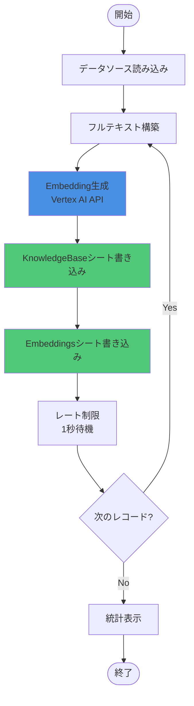

# 既存データベクトル化スクリプト

## 概要

15のGASプロジェクト/AppSheetアプリから既存データを読み込み、Vertex AI Embeddingsでベクトル化し、Vector DB Spreadsheetに書き込むバッチ処理スクリプト。

## 前提条件

### 必須

- Python 3.11以上
- GCPサービスアカウント認証設定済み
- Vector DB Spreadsheet作成済み（SpreadsheetID: `1roSp4WKubXVzZ6iWd6OY5lMU5OpvFsVNQHy11_Ym-wA`）
- 各AppSheetアプリのSpreadsheet IDを把握

### 依存ライブラリ

```bash
pip install google-auth google-auth-oauthlib google-auth-httplib2
pip install google-api-python-client google-cloud-aiplatform tqdm python-dotenv
```

## セットアップ

### 1. データソース設定

```bash
# テンプレートをコピー
cp scripts/data_sources.example.json scripts/data_sources.json

# 各AppSheetアプリのSpreadsheet IDを設定
vi scripts/data_sources.json
```

**設定例**:

```json
{
  "nursing_regular": {
    "name": "訪問看護_通常記録",
    "spreadsheet_id": "1ABC...XYZ",  # ← ここに実際のIDを入力
    "sheet_name": "Care_Records",
    "domain": "nursing",
    "source_type": "care_record"
  }
}
```

### 2. 環境変数確認

```bash
# backend/.env ファイルを確認
cd ../backend
cat .env | grep VECTOR_DB_SPREADSHEET_ID

# 設定されていない場合
echo "VECTOR_DB_SPREADSHEET_ID=1roSp4WKubXVzZ6iWd6OY5lMU5OpvFsVNQHy11_Ym-wA" >> .env
```

### 3. GCP認証設定

```bash
# サービスアカウントキーを設定
export GOOGLE_APPLICATION_CREDENTIALS="/path/to/service-account-key.json"

# または、gcloud認証
gcloud auth application-default login
```

## 使用方法

### データソース一覧表示

```bash
python scripts/vectorize_existing_data.py --list-sources
```

**出力例**:

```
利用可能なデータソース:
  nursing_regular      - 訪問看護_通常記録           ✅ 設定済み
  nursing_mental       - 訪問看護_精神科記録         ⚠️ 未設定
  clients_basic        - 利用者_基本情報             ✅ 設定済み
  ...
```

### Dry Run（テスト実行）

```bash
# 全データソースをテスト（Vector DBには書き込まない）
python scripts/vectorize_existing_data.py --all --dry-run

# 特定データソースのみテスト
python scripts/vectorize_existing_data.py --source nursing_regular --dry-run
```

### 本番実行

#### 1データソースずつ実行（推奨）

```bash
# 訪問看護_通常記録のみ
python scripts/vectorize_existing_data.py --source nursing_regular

# 利用者_基本情報のみ
python scripts/vectorize_existing_data.py --source clients_basic

# 複数指定（カンマ区切り）
python scripts/vectorize_existing_data.py --source nursing_regular,clients_basic
```

#### 全データソース一括実行

```bash
# 全15プロジェクトを処理
python scripts/vectorize_existing_data.py --all --batch-size 100
```

### バッチサイズ調整

```bash
# デフォルト: 50件/バッチ
python scripts/vectorize_existing_data.py --source nursing_regular

# 大量データの場合: 100件/バッチ
python scripts/vectorize_existing_data.py --source nursing_regular --batch-size 100

# 小規模データの場合: 10件/バッチ
python scripts/vectorize_existing_data.py --source nursing_regular --batch-size 10
```

## 実行例

### 1. データソース確認

```bash
$ python scripts/vectorize_existing_data.py --list-sources

利用可能なデータソース:
  nursing_regular      - 訪問看護_通常記録           ✅ 設定済み
  nursing_mental       - 訪問看護_精神科記録         ⚠️ 未設定
  clients_basic        - 利用者_基本情報             ✅ 設定済み
  calls_summary        - 通話_要約生成              ✅ 設定済み
  ...
```

### 2. Dry Run

```bash
$ python scripts/vectorize_existing_data.py --source nursing_regular --dry-run

============================================================
既存データベクトル化バッチ処理
============================================================
Vector DB: 1roSp4WKubXVzZ6iWd6OY5lMU5OpvFsVNQHy11_Ym-wA
Embedding Model: gemini-embedding-001 (3072次元)
Batch Size: 50
Dry Run: True
============================================================

============================================================
処理開始: 訪問看護_通常記録
============================================================
✅ 1,234件のデータを読み込みました: Care_Records

訪問看護_通常記録: 100%|██████████| 1234/1234 [05:23<00:00, 3.82it/s]

✅ 完了: 1234/1234件処理

============================================================
処理結果サマリー
============================================================
総件数: 1234
成功: 1234 (100.0%)
スキップ: 0
エラー: 0
実行時間: 323.4秒
処理速度: 3.82件/秒
============================================================
```

### 3. 本番実行

```bash
$ python scripts/vectorize_existing_data.py --source nursing_regular

# 同様の出力、ただし実際にVector DBに書き込まれる
```

## 処理フロー



## パフォーマンス

### 処理速度

| データ量 | 処理時間（目安） | API呼び出し数 |
|---------|---------------|-------------|
| 100件 | ~30秒 | 100回 |
| 1,000件 | ~5分 | 1,000回 |
| 10,000件 | ~50分 | 10,000回 |
| 13,500件 | ~70分 | 13,500回 |

**制約**:
- Vertex AI Embeddings API: 60 RPM（1秒間隔で実行）
- 1レコード = 1 API呼び出し

### コスト試算

| データ量 | Embedding API コスト |
|---------|-------------------|
| 1,000件 | $0.00（無料枠内） |
| 10,000件 | $0.00（無料枠内） |
| 13,500件 | $0.00（無料枠内） |

**注**: Vertex AI Embeddings APIは月間5M tokensまで無料（2025年10月現在）

## トラブルシューティング

### 1. 認証エラー

```bash
# エラー: DefaultCredentialsError
export GOOGLE_APPLICATION_CREDENTIALS="/path/to/service-account-key.json"

# または
gcloud auth application-default login
```

### 2. Spreadsheet ID未設定

```bash
# エラー: VECTOR_DB_SPREADSHEET_IDが設定されていません
echo "VECTOR_DB_SPREADSHEET_ID=1roSp4WKubXVzZ6iWd6OY5lMU5OpvFsVNQHy11_Ym-wA" >> backend/.env
```

### 3. データソースSpreadsheet ID未設定

```bash
# エラー: ⚠️ スキップ: Spreadsheet ID未設定
vi scripts/data_sources.json

# 各データソースのspreadsheet_idを設定
```

### 4. API レート制限エラー

```bash
# エラー: 429 Too Many Requests
# → 自動的に1秒間隔で実行するため、通常は発生しない

# 手動で間隔を調整する場合
# vectorize_existing_data.py の time.sleep(1) を変更
```

### 5. メモリエラー

```bash
# エラー: MemoryError
# → バッチサイズを小さくする
python scripts/vectorize_existing_data.py --source nursing_regular --batch-size 10
```

## 注意事項

### API呼び出し

- **1レコード = 1 API呼び出し**
- リトライループなし（失敗時は即座にエラー）
- レート制限: 60 RPM（1秒間隔）

### データ重複

- 同じレコードを複数回実行すると重複します
- 初回実行前に確認: `--dry-run`
- 既存データ確認: Vector DB Spreadsheetを開く

### 中断と再開

```bash
# Ctrl+C で中断可能
# 統計が表示される

# 再開方法:
# 1. Vector DB Spreadsheetで最後に書き込まれたレコードを確認
# 2. データソースから未処理のレコードのみ抽出
# 3. 再実行
```

## 今後の改善

- [ ] 重複チェック機能追加
- [ ] 差分更新機能（増分ベクトル化）
- [ ] 並列処理対応（複数データソース同時実行）
- [ ] 進捗保存・再開機能
- [ ] エラーリトライ機能（指数バックオフ）

---

**最終更新**: 2025-10-27
